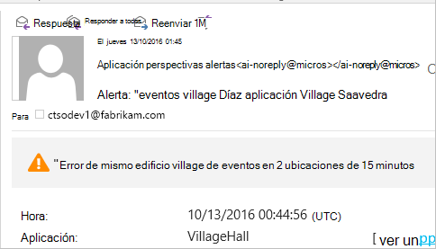
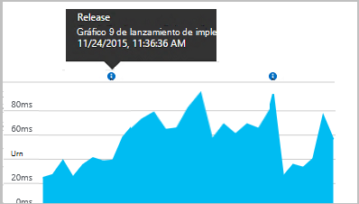
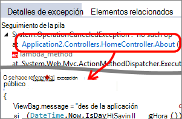

<properties 
    pageTitle="Configurar el análisis de aplicación web de ASP.NET con recomendaciones de aplicación | Microsoft Azure" 
    description="Configurar rendimiento, disponibilidad y análisis de uso de su sitio Web ASP.NET, hospedado en local o en Azure." 
    services="application-insights" 
    documentationCenter=".net"
    authors="NumberByColors" 
    manager="douge"/>

<tags 
    ms.service="application-insights" 
    ms.workload="tbd" 
    ms.tgt_pltfrm="ibiza" 
    ms.devlang="na" 
    ms.topic="get-started-article" 
    ms.date="10/13/2016" 
    ms.author="awills"/>


# <a name="set-up-application-insights-for-aspnet"></a>Configure las perspectivas de aplicación de ASP.NET

[Perspectivas de aplicación de Visual Studio](app-insights-overview.md) supervisa su aplicación directo para ayudarle a [detectar y diagnosticar problemas de rendimiento y excepciones](app-insights-detect-triage-diagnose.md)y [Descubra cómo se usa la aplicación](app-insights-overview-usage.md).  Funciona para las aplicaciones que se hospedan en sus propios servidores IIS local o en la nube máquinas virtuales, así como aplicaciones web de Azure.


## <a name="before-you-start"></a>Antes de empezar

Te hace falta:

* Visual Studio 2013 actualización 3 o posterior. Más adelante, es mejor.
* Una suscripción a [Microsoft Azure](http://azure.com). Si su equipo o la organización tiene una suscripción de Azure, el propietario puede agregar, con su [cuenta de Microsoft](http://live.com). 

Hay artículos alternativos para ver si está interesado en:

* [Instrumentación de una aplicación web en tiempo de ejecución](app-insights-monitor-performance-live-website-now.md)
* [Servicios de nube de Azure](app-insights-cloudservices.md)

## <a name="ide"></a>1. Agregar aplicación perspectivas SDK


### <a name="if-its-a-new-project"></a>Si es un nuevo proyecto...

Asegúrese de que está seleccionado perspectivas de aplicación al crear un nuevo proyecto de Visual Studio 


### <a name="-or-if-its-an-existing-project"></a>... o si es un proyecto existente

Haga clic en el proyecto en el Explorador de soluciones y elija **Agregar aplicación perspectivas telemetría** o **Configurar perspectivas de aplicación**.


* ¿Proyecto de ASP.NET Core? - [Siga estas instrucciones para solucionar algunas líneas de código](https://github.com/Microsoft/ApplicationInsights-aspnetcore/wiki/Getting-Started#add-application-insights-instrumentation-code-to-startupcs). 


## <a name="run"></a>2. ejecute la aplicación

Ejecute la aplicación con F5 y pruébelo: abrir páginas diferentes para generar algunos telemetría.

En Visual Studio, verá un recuento de los eventos que se han registrado. 


## <a name="3-see-your-telemetry"></a>3. consulte la telemetría...

### <a name="-in-visual-studio"></a>… en Visual Studio

Abra la ventana de aplicación perspectivas en Visual Studio: haga clic en el botón de información de la aplicación, o haga clic en el proyecto en el Explorador de soluciones:


Esta vista muestra telemetría generado en el servidor de la aplicación. Experimentar con los filtros y haga clic en cualquier evento para ver más detalles.

[Obtenga más información sobre herramientas de la aplicación perspectivas en Visual Studio](app-insights-visual-studio.md).

<a name="monitor"></a> 
### <a name="-in-the-portal"></a>… en el portal

A menos que elija *Instalar SDK,* también puede ver la telemetría en el portal de información de la aplicación web. 

El portal tiene más gráficos, herramientas de análisis y paneles que Visual Studio. 


Abra el recurso de información de la aplicación en el [portal de Azure](https://portal.azure.com/).


En una vista de la telemetría desde la aplicación, se abrirá el portal:

* La primera telemetría aparece en [secuencia métricas directo](app-insights-metrics-explorer.md#live-metrics-stream).
* Eventos individuales aparecen en la **búsqueda** (1). Datos pueden tardar unos minutos en aparecer. Haga clic en cualquier evento para ver sus propiedades. 
* Métricas agregados aparecen en los gráficos (2). Puede tardar un minuto o dos para los datos aparecerán aquí. Haga clic en cualquier gráfico para abrir un módulo con más detalle.

[Más información sobre el uso de la información de la aplicación en el portal de Azure](app-insights-dashboards.md).

## <a name="4-publish-your-app"></a>4. publicar su aplicación

Publicar la aplicación en el servidor IIS o en Azure. Ver [secuencia de métricas directo](app-insights-metrics-explorer.md#live-metrics-stream) para asegurarse de que todo funciona correctamente.

Verá su telemetría la creación en el portal de información de la aplicación, donde puede supervisar métricas, busque la telemetría y configurar [paneles](app-insights-dashboards.md). También puede usar las eficaces [análisis de lenguaje de consulta](app-insights-analytics.md) para analizar el rendimiento y uso o buscar eventos específicos. 

También puede seguir analizar la telemetría en [Visual Studio](app-insights-visual-studio.md) con herramientas como la búsqueda de diagnóstico y [tendencias](app-insights-visual-studio-trends.md).

> [AZURE.NOTE] Si su aplicación envía suficiente telemetría enfocar los [límites](app-insights-pricing.md#limits-summary), automático [muestreo](app-insights-sampling.md) cambia. Muestreo reduce la cantidad de telemetría enviado desde la aplicación, sin perder los datos relacionadas con fines de diagnóstico.


##<a name="land"></a>¿Qué hacer 'Agregar perspectivas de aplicación'?

Aplicación perspectivas envía telemetría desde la aplicación en el portal de información de la aplicación (que está alojado en Microsoft Azure):


Para que el comando ha tres acciones:

1. Agregue el paquete de aplicación perspectivas Web SDK NuGet a su proyecto. Ver en Visual Studio, haga clic en su proyecto y elija Administrar paquetes de NuGet.
2. Cree un recurso de información de la aplicación en [el portal de Azure](https://portal.azure.com/). Esto es donde verá los datos. Recupera la *clave de instrumentación,* que identifica el recurso.
3. Inserta la clave de instrumentación en `ApplicationInsights.config`, de modo que el SDK puede enviar telemetría en el portal.

Si lo desea, puede realizar estos pasos manualmente para [ASP.NET 4](app-insights-windows-services.md) o [Principales de ASP.NET](https://github.com/Microsoft/ApplicationInsights-aspnetcore/wiki/Getting-Started).

### <a name="to-upgrade-to-future-sdk-versions"></a>Actualizar a futuras versiones SDK

Para actualizar a una [nueva versión del SDK](https://github.com/Microsoft/ApplicationInsights-dotnet-server/releases), vuelva a abrir el Administrador de paquetes de NuGet y filtrar paquetes instalados. Seleccione Microsoft.ApplicationInsights.Web y elija actualizar.

Si ha realizado personalizaciones en ApplicationInsights.config, guardar una copia antes de actualizar y después combinar los cambios en la nueva versión.

## <a name="add-more-telemetry"></a>Agregar más telemetría

### <a name="web-pages-and-single-page-apps"></a>Páginas Web y aplicaciones de una sola página

1. [Agregar el fragmento de código JavaScript](app-insights-javascript.md) a las páginas web para mejorar los módulos de explorador y el uso con datos sobre las vistas de la página, tiempos de carga, excepciones de explorador, rendimiento de llamada de AJAX, cuenta de usuario y sesión.
2. [Eventos personalizados de código](app-insights-api-custom-events-metrics.md) para contar, hora o acciones de usuario de medida.

### <a name="dependencies-exceptions-and-performance-counters"></a>Las dependencias, excepciones y contadores de rendimiento

[Instalar el Monitor de estado](app-insights-monitor-performance-live-website-now.md) en cada uno de los equipos de servidor para obtener telemetría adicional sobre la aplicación. Esto es lo que se obtiene:

* [Contadores](app-insights-performance-counters.md) - 
CPU, memoria, disco y otros contadores de rendimiento relacionados con la aplicación. 
* [Excepciones](app-insights-asp-net-exceptions.md) - telemetría más detallada de algunas excepciones.
* [Dependencias](app-insights-asp-net-dependencies.md) - llamadas a la API de REST o SQL servicios. Averigüe si las respuestas lentas componentes externos están causando problemas de rendimiento en su aplicación. (Si la aplicación se ejecuta en .NET 4.6, no es necesario Monitor de estado para obtener este telemetría.)

### <a name="diagnostic-code"></a>Código de diagnóstico

¿Tiene un problema? Si desea insertar código en la aplicación para ayudar a diagnosticarlo, tiene varias opciones:

* [Captura de seguimientos de registro](app-insights-asp-net-trace-logs.md): si ya está usando Log4N, NLog o System.Diagnostics.Trace para registrar eventos de seguimiento, el resultado se puede enviar de impresiones de aplicación para que se puede relacionar con solicitudes, buscar en él y analizar. 
* [Métricas y eventos personalizados](app-insights-api-custom-events-metrics.md): usar TrackEvent() y TrackMetric() en servidor o código de la página web.
* [Etiqueta de telemetría con propiedades adicionales](app-insights-api-filtering-sampling.md#add-properties)

Use [la búsqueda](app-insights-diagnostic-search.md) para encontrar y relacionar [análisis](app-insights-analytics.md) para realizar consultas más eficaces y determinados eventos.

## <a name="alerts"></a>Alertas

Sea el primero en saber si su aplicación tiene problemas. (No esperar hasta que los usuarios indican!) 

* [Crear las pruebas web](app-insights-monitor-web-app-availability.md) para asegurarse de que su sitio está visible en la web.
* [Diagnósticos proactivas](app-insights-proactive-diagnostics.md) ejecute automáticamente (si la aplicación tiene una determinada cantidad mínima de tráfico). No tiene que hacer nada para configurarlos. Saber si su aplicación tiene una tasa inusual de solicitudes de errores.
* [Establecer alertas métricas](app-insights-alerts.md) para advertir si una métrica cruza un umbral. Puede establecer ellos métrica personalizado código en la aplicación.

De forma predeterminada, las notificaciones de alerta se envían al propietario de la suscripción de Azure. 



## <a name="version-and-release-tracking"></a>Versión y seguimiento

### <a name="track-application-version"></a>Versión de la aplicación de control

Asegúrese de que `buildinfo.config` generados por el proceso de MSBuild. En el archivo, agregue:  

```XML

    <PropertyGroup>
      <GenerateBuildInfoConfigFile>true</GenerateBuildInfoConfigFile>    <IncludeServerNameInBuildInfo>true</IncludeServerNameInBuildInfo>
    </PropertyGroup> 
```

Cuando tiene la información de compilación, el módulo de información de la aplicación web agrega **versión de la aplicación** como una propiedad para cada elemento de telemetría. Que le permite filtrar por versión al realizar [búsquedas de diagnósticos](app-insights-diagnostic-search.md) o al [Explorar métricas](app-insights-metrics-explorer.md). 

Sin embargo, observe que el número de versión de compilación genera solo MS Build, no por la compilación de developer en Visual Studio.

### <a name="release-annotations"></a>Anotaciones de lanzamiento

Si usa Visual Studio Team Services, puede [obtener un marcador de anotación](app-insights-annotations.md) agregado a los gráficos siempre que una nueva versión de lanzamiento.




## <a name="next-steps"></a>Pasos siguientes

| | 
|---|---
|**[Trabajar con perspectivas de aplicación en Visual Studio](app-insights-visual-studio.md)**<br/>Depuración de telemetría, diagnóstico de búsqueda, aumentar el nivel de código.|
|**[Trabajar con el portal de información de la aplicación](app-insights-dashboards.md)**<br/>Paneles, potentes herramientas de diagnósticos y analíticas, alertas, un mapa de dependencia directo de la aplicación y exportación de telemetría. |
|**[Agregar más datos](app-insights-asp-net-more.md)**<br/>Supervisar el uso, disponibilidad, dependencias, excepciones. Integrar seguimientos de marcos de registro. Escribir telemetría personalizado. | 


