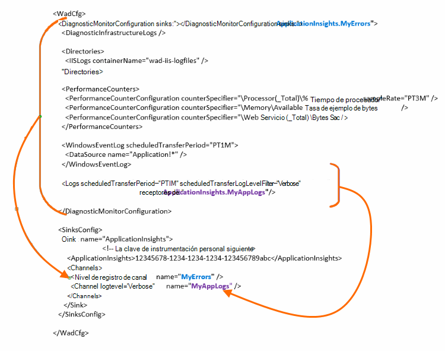

<properties
    pageTitle="Enviar registros de diagnóstico de Azure a perspectivas de aplicación"
    description="Configurar los detalles de los registros de diagnóstico de Azure servicios en la nube que se envían al portal de información de la aplicación."
    services="application-insights"
    documentationCenter=".net"
    authors="sbtron"
    manager="douge"/>

<tags
    ms.service="application-insights"
    ms.workload="tbd"
    ms.tgt_pltfrm="ibiza"
    ms.devlang="na"
    ms.topic="article"
    ms.date="11/17/2015"
    ms.author="awills"/>

# <a name="configure-azure-diagnostic-logging-to-application-insights"></a>Configurar el registro de diagnóstico de Azure en perspectivas de aplicación

Al configurar un proyecto de servicios de nube o una máquina Virtual de Microsoft Azure, [Azure puede generar un registro de diagnóstico](../vs-azure-tools-diagnostics-for-cloud-services-and-virtual-machines.md). Puede hacer esto se envían a perspectivas de aplicación de modo que puede analizar junto con el uso y diagnóstico telemetría enviado desde dentro de la aplicación por el SDK de perspectivas de aplicación. El registro de Azure incluye eventos en la administración de la aplicación como iniciar, detener, se bloquea, así como contadores de rendimiento. El registro también incluye llamadas en la aplicación para System.Diagnostics.Trace.

Este artículo describe la configuración de la captura de diagnóstico en detalle.

Debe Azure SDK 2,8 instalado en Visual Studio.

## <a name="get-an-application-insights-resource"></a>Obtener un recurso de aplicación perspectivas

Para la mejor experiencia, [Agregue el SDK de perspectivas de aplicación a cada función de la aplicación de servicios de nube](app-insights-cloudservices.md)o [a cualquier aplicación se ejecuta en la máquina virtual](app-insights-overview.md). A continuación, puede enviar los datos de diagnóstico para analizar y muestra el mismo recurso de información de la aplicación.

Como alternativa, si no desea usar el SDK - por ejemplo, si la aplicación ya está activa - puede simplemente [crear un nuevo recurso de información de la aplicación](app-insights-create-new-resource.md) en el portal de Azure. Elija **Diagnósticos de Azure** como el tipo de aplicación.


## <a name="send-azure-diagnostics-to-application-insights"></a>Enviar diagnóstico de Azure a perspectivas de aplicación

Si no puede actualizar el proyecto de la aplicación, a continuación, en Visual Studio Seleccione cada rol, elija sus propiedades y en la pestaña Configuración, seleccione **Enviar diagnósticos de impresiones de aplicación**.

Si su aplicación ya está activa, use el Explorador de servidores o explorador de servicios de nube de Visual Studio para abrir las propiedades de la aplicación. Seleccione **Enviar diagnósticos de impresiones de aplicación**.

En cada caso, se le pedirá para los detalles del recurso perspectivas de aplicación que creó.

[Más información sobre cómo configurar perspectivas de aplicación para una aplicación de servicios en la nube](app-insights-cloudservices.md).

## <a name="configuring-the-azure-diagnostics-adapter"></a>Configurar el adaptador de diagnóstico de Azure

En sólo lectura si desea seleccionar las partes del registro que se envía a la información de la aplicación. De forma predeterminada, todo lo que se ha enviado, incluidos: eventos de Microsoft Azure; contadores de rendimiento; trazar llamadas desde la aplicación a System.Diagnostics.Trace.

Diagnóstico de Azure almacena los datos en tablas de almacenamiento de Azure. Sin embargo, también puede canalización todos o un subconjunto de los datos de aplicación impresiones configurando "receptores" y "canales" en la configuración cuando se usa la extensión de diagnósticos de Azure 1.5 o posterior.

### <a name="configure-application-insights-as-a-sink"></a>Configurar perspectivas de aplicación como un receptor

Al utilizar las propiedades de la función para establecer "Enviar datos a la aplicación perspectivas", el SDK de Azure (2,8 o posterior) agrega un `<SinksConfig>` elemento al [archivo de configuración de diagnósticos de Azure](https://msdn.microsoft.com/library/azure/dn782207.aspx) público de la función.

`<SinksConfig>`define el receptor adicional donde se pueden enviar los datos de diagnóstico de Azure.  Un ejemplo `SinksConfig` tiene este aspecto:

```xml

    <SinksConfig>
     <Sink name="ApplicationInsights">
      <ApplicationInsights>{Insert InstrumentationKey}</ApplicationInsights>
      <Channels>
        <Channel logLevel="Error" name="MyTopDiagData"  />
        <Channel logLevel="Verbose" name="MyLogData"  />
      </Channels>
     </Sink>
    </SinksConfig>

```

La `ApplicationInsights` elemento especifica la clave de instrumentación que identifica el recurso de información de la aplicación a la que se enviarán los datos de diagnóstico de Azure. Cuando seleccione el recurso, se rellena automáticamente en función de la `APPINSIGHTS_INSTRUMENTATIONKEY` configuración del servicio. (Si desea configurar de forma manual, obtenga la clave de la lista desplegable Essentials del recurso.)

`Channels`definir los datos que se envían al receptor. El canal actúa como un filtro. La `loglevel` atributo permite especificar el nivel de registro que va a enviar el canal. Los valores disponibles son: `{Verbose, Information, Warning, Error, Critical}`.

### <a name="send-data-to-the-sink"></a>Enviar datos al receptor

Enviar datos a la información de la aplicación receptor agregando el atributo receptores bajo el nodo DiagnosticMonitorConfiguration. Agregar el elemento de receptores a cada nodo especifica que desea que los datos recopilados desde ese nodo y cualquier nodo en el que se envíen al receptor especificado.

Por ejemplo, el valor predeterminado creado por el SDK de Azure es enviar todos los datos de diagnósticos Azure:

```xml

    <DiagnosticMonitorConfiguration overallQuotaInMB="4096" sinks="ApplicationInsights">
```

Pero si desea enviar sólo los registros de error, habilite el nombre de receptor con un nombre de canal:

```xml

    <DiagnosticMonitorConfiguration overallQuotaInMB="4096" sinks="ApplicationInsights.MyTopDiagdata">
```

Observe que estamos utilizando el nombre del receptor que se ha definido, junto con el nombre de un canal definido anteriormente.

Si desea enviar los registros de aplicación detallado de aplicación impresiones, a continuación, puede agregar el atributo receptores a la `Logs` nodo.

```xml

    <Logs scheduledTransferPeriod="PT1M" scheduledTransferLogLevelFilter="Verbose" sinks="ApplicationInsights.MyLogData"/>
```

También puede incluir varios receptores en la configuración en distintos niveles en la jerarquía. En ese caso, el receptor especificado en el nivel superior de la jerarquía actúa como una configuración global y especificadas en el actúa de elemento del elemento individual como un reemplazo en la configuración global.

Este es un ejemplo completo del archivo de configuración público que envía todos los errores de aplicación impresiones (especificado en el `DiagnosticMonitorConfiguration` nodo) nivel de detalle además de registros para los registros de aplicaciones y (especificado en el `Logs` nodo).

```xml

    <WadCfg>
     <DiagnosticMonitorConfiguration overallQuotaInMB="4096"
       sinks="ApplicationInsights.MyTopDiagData"> <!-- All info below sent to this channel -->
      <DiagnosticInfrastructureLogs />
      <PerformanceCounters>
        <PerformanceCounterConfiguration counterSpecifier="\Processor(_Total)\% Processor Time" sampleRate="PT3M" sinks="ApplicationInsights.MyLogData/>
        <PerformanceCounterConfiguration counterSpecifier="\Memory\Available MBytes" sampleRate="PT3M" />
        <PerformanceCounterConfiguration counterSpecifier="\Web Service(_Total)\Bytes Total/Sec" sampleRate="PT3M" />
      </PerformanceCounters>
      <WindowsEventLog scheduledTransferPeriod="PT1M">
        <DataSource name="Application!*" />
      </WindowsEventLog>
      <Logs scheduledTransferPeriod="PT1M" scheduledTransferLogLevelFilter="Verbose"
            sinks="ApplicationInsights.MyLogData"/>
       <!-- This specific info sent to this channel -->
     </DiagnosticMonitorConfiguration>

     <SinksConfig>
      <Sink name="ApplicationInsights">
        <ApplicationInsights>{Insert InstrumentationKey}</ApplicationInsights>
        <Channels>
          <Channel logLevel="Error" name="MyTopDiagData"  />
          <Channel logLevel="Verbose" name="MyLogData"  />
        </Channels>
      </Sink>
     </SinksConfig>
    </WadCfg>
```



Existen algunas limitaciones a tener en cuenta con esta funcionalidad:

* Los canales sólo están diseñados para trabajar con el tipo de registro y no los contadores de rendimiento. Si especifica un canal con un elemento de contador de rendimiento se omitirá.
* El nivel de registro de un canal no puede superar el nivel de registro para lo que va a recopilar diagnóstico de Azure. Por ejemplo: no puede recopilar errores de registro de la aplicación en el elemento de registros y vuelva a intentar enviar detallado registros de la sincronización de una perspectiva de la aplicación. El atributo scheduledTransferLogLevelFilter siempre debe recopilar igual o más registros que los registros que intenta enviar a un receptor.
* No puede enviar los datos de blob recopilados por extensión de diagnóstico de Azure de impresiones de aplicación. Por ejemplo, nada especificado en el nodo de directorios. Para bloqueo la descarga de bloqueo real se enviará a almacenamiento de blobs y solo una notificación que se ha generado la descarga de bloqueo se enviarán a la información de la aplicación.

## <a name="related-topics"></a>Temas relacionados

* [Supervisar los servicios de nube de Azure con recomendaciones de aplicación](app-insights-cloudservices.md)
* [Usar PowerShell para enviar diagnóstico de Azure a perspectivas de aplicación](app-insights-powershell-azure-diagnostics.md)
* [Archivo de configuración de diagnósticos de Azure](https://msdn.microsoft.com/library/azure/dn782207.aspx)
