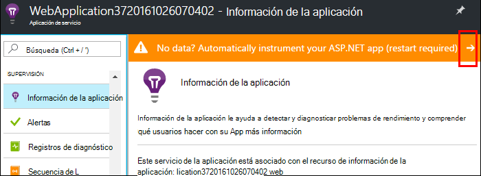
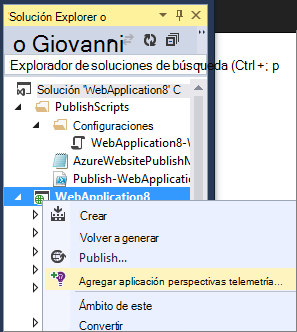
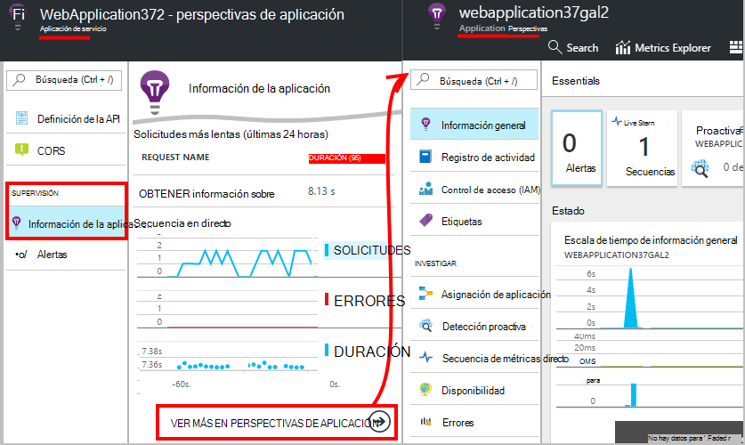
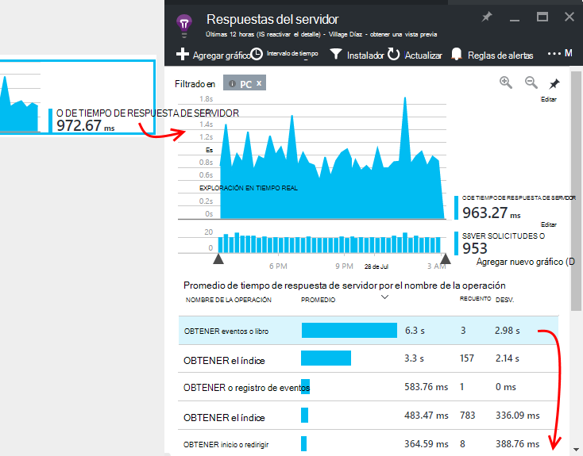
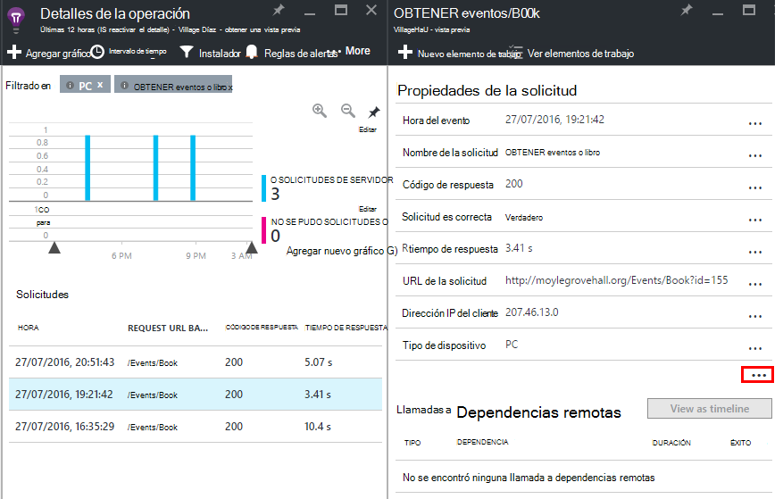

<properties
    pageTitle="Supervisar el rendimiento de la aplicación de Azure web | Microsoft Azure"
    description="Rendimiento de la aplicación de supervisión de aplicaciones web de Azure. Gráfico de carga y tiempo de respuesta, información de dependencia y establecer alertas en el rendimiento."
    services="application-insights"
    documentationCenter=".net"
    authors="alancameronwills"
    manager="douge"/>

<tags
    ms.service="azure-portal"
    ms.workload="na"
    ms.tgt_pltfrm="na"
    ms.devlang="na"
    ms.topic="article"
    ms.date="10/24/2016"
    ms.author="awills"/>

# Supervisar el rendimiento de aplicación web de Azure

En el [Portal de Azure](https://portal.azure.com) puede configurar supervisión de rendimiento de aplicación para las [aplicaciones web de Azure](../app-service-web/app-service-web-overview.md). [Perspectivas de aplicación de Visual Studio](app-insights-overview.md) instrumentos su aplicación para enviar telemetría sobre sus actividades al servicio de información de la aplicación, donde se almacenan y analizar. Allí, pueden utilizarse para diagnosticar problemas y mejorar el rendimiento y evaluar uso métricos gráficos y herramientas de búsqueda.

## Tiempo de ejecución o la hora de creación

Puede configurar la supervisión mediante la instrumentación de la aplicación de dos maneras:

* **Tiempo de ejecución** : puede seleccionar un rendimiento supervisión extensión cuando la aplicación web ya está activa. No es necesario volver a generar o volver a instalar la aplicación. Obtener un conjunto estándar de paquetes de supervisar los tiempos de respuesta, tasas de éxito, excepciones, dependencias y así sucesivamente. 
 
* **Hora de creación** - puede instalar un paquete de la aplicación en desarrollo. Esta opción es más flexible. Además de los mismos paquetes estándares, puede escribir código para personalizar la telemetría o para enviar su propio telemetría. Puede iniciar actividades específicas o eventos de registro según la semántica de su dominio de aplicación. 

## Ejecutar instrumentación de tiempo con las perspectivas de aplicación

Si ya está ejecutando una aplicación web en Azure, obtendrá ya algunas supervisión: solicitud y tasas de error. Agregar información de la aplicación para obtener más, como los tiempos de respuesta, supervisar las llamadas a las dependencias, detección inteligente y el análisis eficaz lenguaje de consulta. 

1. **Seleccione perspectivas de aplicación** en el panel de control de Azure para la aplicación web.

    

 * Elija para crear un nuevo recurso, a menos que ya ha configurado un recurso de aplicación perspectivas para esta aplicación por otra ruta.

2. **La aplicación web de instrumento** después de haber instalado la aplicación perspectivas. 

    

3. **Monitor de la aplicación**.  [Expore los datos](#explore-the-data).

Más adelante, puede crear y volver a instalar la aplicación con información de la aplicación si lo desea.

*¿Cómo quitar la información de la aplicación, o cambiar a enviar a otro recurso?*

* En Azure, abra el módulo de control de aplicación web y, en herramientas de desarrollo, abra **extensiones**. Elimine la extensión de aplicación perspectivas. A continuación, debajo de supervisión, elija información de la aplicación y crear o seleccionar el recurso que desee.

## Crear la aplicación con información de la aplicación

Perspectivas de aplicación pueden proporcionar más detallada telemetría instalando un SDK en la aplicación. En particular, puede recopilar registros de seguimiento, [escribir telemetría personalizada](../application-insights/app-insights-api-custom-events-metrics.md)y obtener informes más detallados de excepción.

1. **En Visual Studio** (actualización de 2013 2 o posterior), agregue el SDK de perspectivas de aplicación a su proyecto.

    

    Si se le solicita que inicie sesión en, use las credenciales de su cuenta de Azure.

    La operación tiene dos efectos:

 1. Crea un recurso de aplicación perspectivas en Azure, donde telemetría se almacena, analiza y muestra.
 2. Agrega el paquete de aplicación perspectivas NuGet al código y se configura para enviar telemetría para el recurso de Azure.

2. **Prueba la telemetría** , ejecute la aplicación en el equipo de desarrollo (F5).

3. **Publicar la aplicación** en Azure en la forma habitual. 

*¿Cómo cambiar a enviar a un recurso de aplicación perspectivas diferentes?*

* En Visual Studio, haga clic en el proyecto, elija **perspectivas de aplicación > Configurar** y elija el recurso que desee. Obtener la opción de crear un nuevo recurso. Volver a crear y volver a implementar.

## Explorar los datos

1. En el módulo de aplicación perspectivas de su panel de control de aplicación web, vea métricas Live, que muestra las convocatorias y errores en un segundo o dos de ellas se produzca. Es muy útil mostrar cuando está volver a publicar la aplicación, puede ver los problemas inmediatamente.

2. Haga clic en a todo el recurso de información de la aplicación.

    
    

    También puede ir allí directamente desde la navegación de Azure recursos.

2. Haga clic en cualquier gráfico para obtener más detalles:

    

    Puede [Personalizar aspas métricas](../application-insights/app-insights-metrics-explorer.md).

3. Haga clic en más para ver los eventos individuales y sus propiedades:

    

    Observe la "…" vincular para abrir todas las propiedades.

    Puede [Personalizar las búsquedas](../application-insights/app-insights-diagnostic-search.md).

Para realizar búsquedas más eficaces sobre la telemetría, utilice el [análisis de lenguaje de consulta](../application-insights/app-insights-analytics-tour.md).

## Pasos siguientes

* [Diagnósticos de Azure habilitar](app-insights-azure-diagnostics.md) que se envíen a la información de la aplicación.
* [Medidas de estado del servicio de monitor](../monitoring-and-diagnostics/insights-how-to-customize-monitoring.md) para asegurarse de que el servicio está disponible y capacidad de respuesta.
* [Recibir notificaciones de alerta](../monitoring-and-diagnostics/insights-receive-alert-notifications.md) cuando se producen eventos operativos o métricas entre un umbral.
* Use [Perspectivas de aplicación para aplicaciones de JavaScript y páginas web](app-insights-web-track-usage.md) para obtener telemetría de cliente de los exploradores que visite una página web.
* [Configurar pruebas de disponibilidad web](app-insights-monitor-web-app-availability.md) que se le avise si su sitio no está disponible.
