<properties
   pageTitle="Información de la aplicación para los servicios de nube de Azure"
   description="Supervisar las funciones web y trabajador eficazmente con recomendaciones de aplicación"
   services="application-insights"
   documentationCenter=""
   authors="soubhagyadash"
   manager="douge"
   editor="alancameronwills"/>

<tags
   ms.service="application-insights"
   ms.devlang="na"
   ms.tgt_pltfrm="ibiza"
   ms.topic="article"
   ms.workload="tbd"
   ms.date="03/02/2016"
   ms.author="sdash"/>

# <a name="application-insights-for-azure-cloud-services"></a>Información de la aplicación para los servicios de nube de Azure


*Información de la aplicación está en vista previa*

Puede supervisar [aplicaciones de servicio de nube de Microsoft Azure](https://azure.microsoft.com/services/cloud-services/) [Perspectivas de aplicación de Visual Studio] [ start] de disponibilidad, rendimiento, errores y uso. Con comentarios que obtener información sobre el rendimiento y la eficacia de la aplicación en la naturaleza, puede elegir opciones informadas acerca de la dirección del diseño de cada ciclo de vida del desarrollo de.

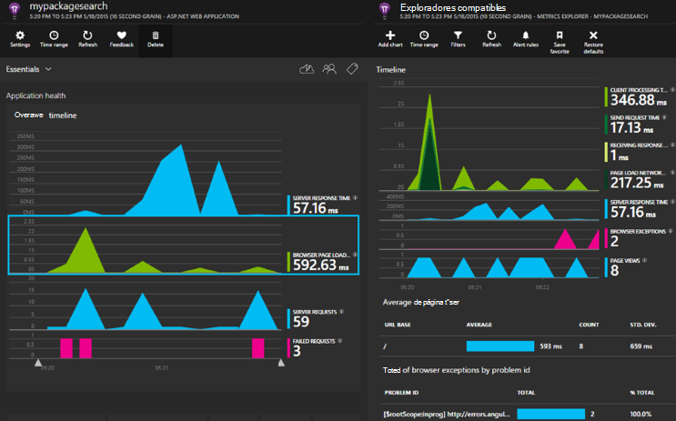

Necesitará una suscripción con [Microsoft Azure](http://azure.com). Inicie sesión con una cuenta de Microsoft, es posible que tenga para Windows, XBox Live u otros servicios de nube de Microsoft. 


#### <a name="sample-application-instrumented-with-application-insights"></a>Aplicación de ejemplo instrumentado con perspectivas de aplicación

Eche un vistazo a esta [aplicación de ejemplo](https://github.com/Microsoft/ApplicationInsights-Home/tree/master/Samples/AzureEmailService) en la aplicación perspectivas se agrega a un servicio de nube con dos funciones de trabajo hospedadas en Azure. 

A continuación indica cómo adaptar su propio proyecto de servicio de nube de la misma manera.

## <a name="create-an-application-insights-resource-for-each-role"></a>Crear un recurso de aplicación perspectivas para cada rol

Un recurso de información de la aplicación es donde se analizan y muestra los datos de telemetría.  

1.  En el [portal de Azure][portal], cree un nuevo recurso de información de la aplicación. Tipo de aplicación, elija la aplicación ASP.NET. 

    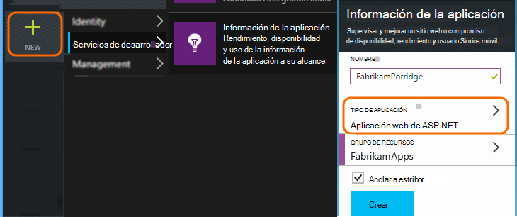

2.  Realizar una copia de la clave de instrumentación. Necesitará esta breve para configurar el SDK.

    


Suele ser [mejor crear un recurso independiente para los datos de cada rol de web y trabajador](app-insights-separate-resources.md). 

Como alternativa, puede enviar datos de todas las funciones a recursos de una sola, pero para establecer una [propiedad predeterminada] [ apidefaults] para que puedan filtrar o agrupar los resultados de cada rol.

## <a name="sdk"></a>Instalar el SDK de cada proyecto


1. En Visual Studio, edite los paquetes de NuGet de su proyecto de aplicación de la nube.

    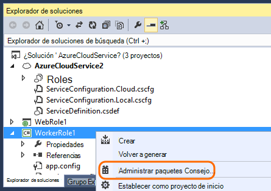


2. Para las funciones de web, agregue el paquete de NuGet [Perspectivas de aplicación Web](http://www.nuget.org/packages/Microsoft.ApplicationInsights.Web) . Esta versión del SDK incluye módulos que agregar el contexto de servidor, como la información de la función. Para las funciones de trabajo, use la [Aplicación perspectivas para servidores de Windows](https://www.nuget.org/packages/Microsoft.ApplicationInsights.WindowsServer/).

    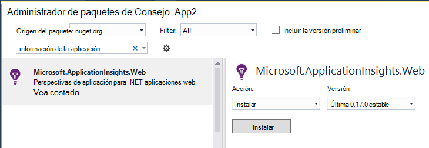


3. Configurar el SDK para enviar datos al recurso de información de la aplicación.

    Establecer la clave de instrumentación como una opción de configuración en el archivo `ServiceConfiguration.Cloud.cscfg`. (El[código de ejemplo](https://github.com/Microsoft/ApplicationInsights-Home/blob/master/Samples/AzureEmailService/AzureEmailService/ServiceConfiguration.Cloud.cscfg)).
 
    ```XML
     <Role name="WorkerRoleA"> 
      <Setting name="APPINSIGHTS_INSTRUMENTATIONKEY" value="YOUR IKEY" /> 
     </Role>
    ```
 
    En una función de inicio adecuado, establezca la clave de instrumentación desde la configuración:

    ```C#
     TelemetryConfiguration.Active.InstrumentationKey = RoleEnvironment.GetConfigurationSettingValue("APPINSIGHTS_INSTRUMENTATIONKEY");
    ```

    Nota, el mismo nombre `APPINSIGHTS_INSTRUMENTATIONKEY` de la configuración de diagnósticos de Azure reporting se usa configuración. 


    Hacer esto para cada rol de la aplicación. Vea los ejemplos:
 
 * [Función Web](https://github.com/Microsoft/ApplicationInsights-Home/blob/master/Samples/AzureEmailService/MvcWebRole/Global.asax.cs#L27)
 * [Función de trabajo](https://github.com/Microsoft/ApplicationInsights-Home/blob/master/Samples/AzureEmailService/WorkerRoleA/WorkerRoleA.cs#L232)
 * [Para las páginas web](https://github.com/Microsoft/ApplicationInsights-Home/blob/master/Samples/AzureEmailService/MvcWebRole/Views/Shared/_Layout.cshtml#L13)   

4. Establezca el archivo ApplicationInsights.config se copien siempre en el directorio de resultados. 

    (En el archivo config, verá mensajes que se le pregunta a colocar la clave de instrumentación allí. Sin embargo, para las aplicaciones de nube es mejor establecer desde el archivo .cscfg. Así se garantiza que la función se identifica correctamente en el portal.)


#### <a name="run-and-publish-the-app"></a>Ejecutar y publicar la aplicación

Ejecute la aplicación e inicie sesión en Azure. Abra los recursos de información de la aplicación que creó y verá que aparecen en la [búsqueda](app-insights-diagnostic-search.md)de puntos de datos individuales y agregado los datos en el [Explorador de métrica](app-insights-metrics-explorer.md). 

Agregar telemetría más: vea las secciones siguientes: y, a continuación, publicar su aplicación para obtener comentarios directo de diagnóstico y el uso. 


#### <a name="no-data"></a>¿Sin datos?

* Abra la [búsqueda] [ diagnostic] mosaico para ver los eventos individuales.
* Usar la aplicación, abrir páginas diferentes para que genera algunos telemetría.
* Espere unos segundos y haga clic en actualizar.
* Vea [solucionar problemas de][qna].


## <a name="more-telemetry"></a>Más telemetría

Las secciones siguientes muestran cómo obtener telemetría adicional de diferentes aspectos de la aplicación.


## <a name="track-requests-from-worker-roles"></a>Solicitudes de control de las funciones de trabajo

Funciones de web, el módulo de solicitudes automáticamente recopila datos acerca de las solicitudes HTTP. Vea el [ejemplo MVCWebRole](https://github.com/Microsoft/ApplicationInsights-Home/tree/master/Samples/AzureEmailService/MvcWebRole) para obtener ejemplos de cómo puede reemplazar el comportamiento predeterminado de la colección. 

Puede capturar el rendimiento de las llamadas a las funciones de trabajo mediante el seguimiento de ellos en la misma manera que las solicitudes HTTP. En información de la aplicación, el tipo de telemetría de solicitud de medidas de una unidad de trabajo del lado servidor con nombre que se puede programar y puede correcta o un error por separado. Mientras las solicitudes HTTP se capturan automáticamente el SDK, puede insertar su propio código para realizar un seguimiento de las solicitudes de funciones de trabajo.

Vea las dos funciones de trabajo de ejemplo instrumentadas a solicitudes de informe: [WorkerRoleA](https://github.com/Microsoft/ApplicationInsights-Home/tree/master/Samples/AzureEmailService/WorkerRoleA) y [WorkerRoleB](https://github.com/Microsoft/ApplicationInsights-Home/tree/master/Samples/AzureEmailService/WorkerRoleB)

## <a name="azure-diagnostics"></a>Diagnóstico de Azure

Datos de [Diagnósticos de Azure](../vs-azure-tools-diagnostics-for-cloud-services-and-virtual-machines.md) incluyen eventos de administración de roles, contadores de rendimiento y registros de la aplicación. Puede tener estos enviados a perspectivas de aplicación para que se puedan ver junto con el resto de la telemetría facilitará el diagnóstico de problemas.

Diagnóstico de Azure es particularmente útil si una función se produce un error inesperado o no se puede iniciar.

1. Haga clic en la función (no en el proyecto) para abrir sus propiedades y seleccione **Habilitar diagnósticos**, **Enviar diagnósticos de impresiones de aplicación**.

    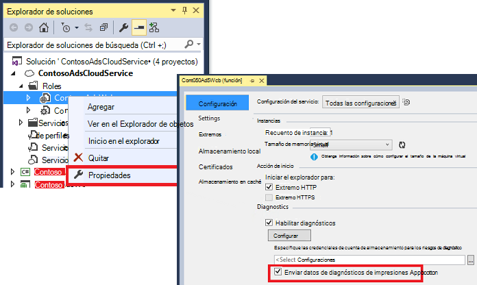

    **O si la aplicación está ya publicada y se ejecuta**, abra Explorador de servidores o Explorer nube, haga clic en la aplicación y seleccionar la misma opción.

3.  Seleccione el mismo recurso perspectivas de aplicación como su otro telemetría.

    Si lo desea, puede establecer un recurso diferente en las configuraciones de servicio diferente (nube, Local) para ayudar a mantener los datos de desarrollo independientes de datos activos.

3. De manera opcional, [excluir algunos de los diagnósticos de Azure](app-insights-azure-diagnostics.md) que desea que se enviarán a la información de la aplicación. El valor predeterminado es todo.

### <a name="view-azure-diagnostic-events"></a>Ver los eventos de diagnósticos de Azure

Dónde encontrar los diagnósticos:

* Contadores de rendimiento se muestran como métricas personalizados. 
* Registros de eventos de Windows se muestran como seguimientos y eventos personalizados.
* Registros de aplicación, los registros ETW y los registros de diagnósticos de infraestructura aparecen como sigue.

Para ver contadores de rendimiento y recuentos de eventos, abra [El Explorador de métricas](app-insights-metrics-explorer.md) y agregar un nuevo gráfico:


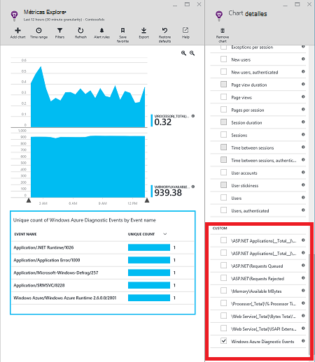

Use [la búsqueda](app-insights-diagnostic-search.md) para buscar en los distintos registros de seguimiento enviados por diagnósticos de Azure. Por ejemplo, si tiene una excepción unhanded en una función que provocó el rol de bloqueo y reciclaje, dicha información se muestra en el canal de Windows registro de eventos. Puede usar la funcionalidad de búsqueda para ver el error de registro de eventos de Windows y obtener el seguimiento de pila completo para la excepción de lo que le permite buscar la causa del problema.


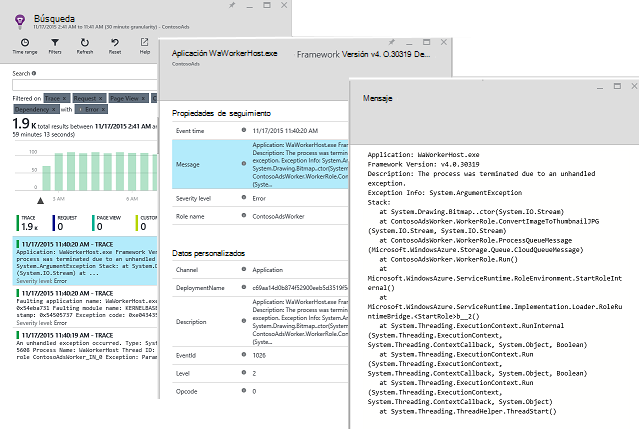

## <a name="app-diagnostics"></a>Diagnósticos de aplicación

Diagnóstico de Azure incluye automáticamente las entradas de registro que la aplicación genera usando System.Diagnostics.Trace. 

Pero si ya usa los marcos Log4N o NLog, también puede [capturar sus seguimientos de registro][netlogs].

[Realizar un seguimiento de eventos personalizados y mediciones] [ api] en el cliente de servidor o ambos, para obtener más información sobre el rendimiento y el uso de la aplicación.

## <a name="dependencies"></a>Dependencias

Aplicación perspectivas SDK puede informar llamadas que su aplicación para dependencias externas, como las API de REST y SQL Server. Esto le permite ver si una dependencia en particular está causando respuestas lentas y erróneas.

Si la aplicación utiliza .NET framework 4.6 o posterior, no es necesario hacer nada más. 

En caso contrario, configure el rol web o trabajador con el [Agente de perspectivas de aplicación](app-insights-monitor-performance-live-website-now.md) también conocido como "Monitor de estado".

Para utilizar al agente de perspectivas de aplicación con las funciones web/trabajo:

* Agregar la carpeta [AppInsightsAgent](https://github.com/Microsoft/ApplicationInsights-Home/tree/master/Samples/AzureEmailService/WorkerRoleA/AppInsightsAgent) y los dos archivos en él para sus proyectos de rol web o trabajo. Asegúrese de configurar sus propiedades de compilación para que siempre se copiarán en el directorio de resultados. Estos archivos instalan al agente.
* Agregar la tarea de inicio en el archivo CSDEF como se muestra [aquí](https://github.com/Microsoft/ApplicationInsights-Home/tree/master/Samples/AzureEmailService/AzureEmailService/ServiceDefinition.csdef#L18).
* Nota: *Los roles de trabajo* requieren tres variables de entorno como se muestra [aquí](https://github.com/Microsoft/ApplicationInsights-Home/tree/master/Samples/AzureEmailService/AzureEmailService/ServiceDefinition.csdef#L44). Esto no es necesario para las funciones web.

### <a name="dependency-reports"></a>Informes de dependencia

Aquí tiene un ejemplo de lo que ve en el portal de información de la aplicación:

* Diagnósticos enriquecidos con automáticamente las convocatorias y las dependencias:

    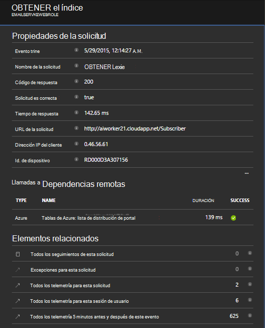

* Rendimiento de la función de web, con la información de dependencia:

    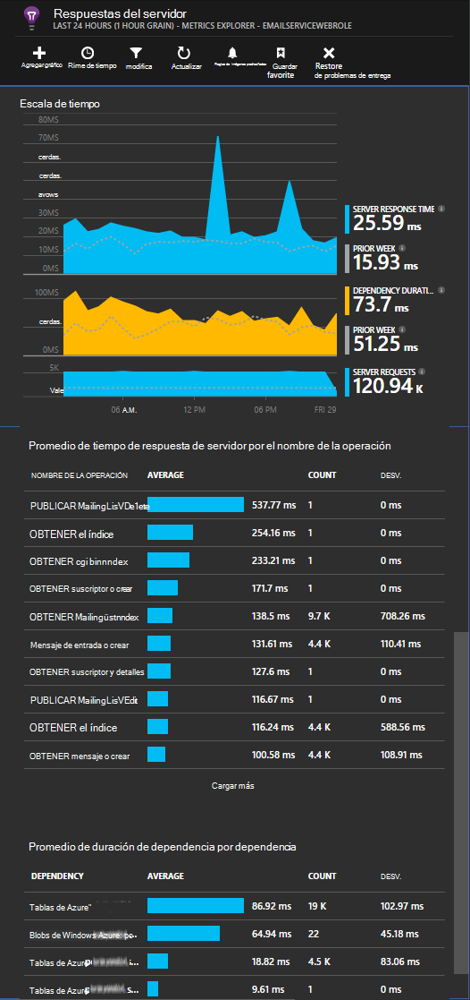

* Esta es una captura de pantalla en las solicitudes y la información de dependencia de una función de trabajo:

    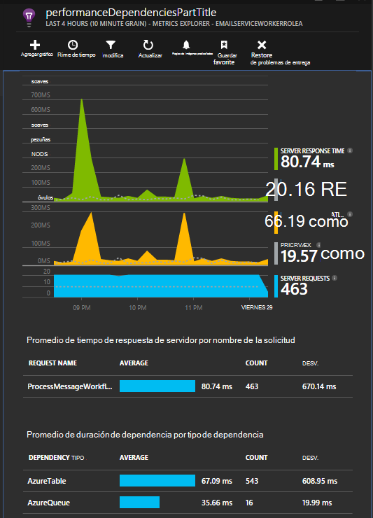

## <a name="exceptions"></a>Excepciones

Vea [Supervisión excepciones en información de la aplicación](app-insights-asp-net-exceptions.md) para obtener información sobre cómo puede recopilar no controladas excepciones de tipos de aplicación web diferentes.

El rol de web muestra tiene controladores MVC5 y Web API 2. Las excepciones no controladas de 2 se capturan con lo siguiente:

* [AiHandleErrorAttribute](https://github.com/Microsoft/ApplicationInsights-Home/blob/master/Samples/AzureEmailService/MvcWebRole/Telemetry/AiHandleErrorAttribute.cs) configurar [aquí](https://github.com/Microsoft/ApplicationInsights-Home/blob/master/Samples/AzureEmailService/MvcWebRole/App_Start/FilterConfig.cs#L12) para MVC5 controladores
* [AiWebApiExceptionLogger](https://github.com/Microsoft/ApplicationInsights-Home/blob/master/Samples/AzureEmailService/MvcWebRole/Telemetry/AiWebApiExceptionLogger.cs) configurar [aquí](https://github.com/Microsoft/ApplicationInsights-Home/blob/master/Samples/AzureEmailService/MvcWebRole/App_Start/WebApiConfig.cs#L25) para los controladores de Web API 2

Para las funciones de trabajo, hay dos formas para realizar un seguimiento de las excepciones.

* TrackException(ex)
* Si ha agregado el paquete de aplicación perspectivas seguimiento escucha NuGet, puede usar System.Diagnostics.Trace para registrar excepciones. [Ejemplo de código.](https://github.com/Microsoft/ApplicationInsights-Home/blob/master/Samples/AzureEmailService/WorkerRoleA/WorkerRoleA.cs#L107)

## <a name="performance-counters"></a>Contadores de rendimiento

Los siguientes contadores se recopilan de forma predeterminada:

    * \Process(??APP_WIN32_PROC??)\% tiempo de procesador
    * \Memory\Available bytes
    * \.NETO CLR Exceptions(??APP_CLR_PROC??)\# de excepciones iniciadas por segundo
    * \Process (??. APP_WIN32_PROC??) \Private bytes
    * \Process (??. APP_WIN32_PROC??) Datos \IO Bytes por segundo
    * \Processor(_Total)\% tiempo de procesador

Además, la siguiente también se recopila para funciones web:

    * Aplicaciones de \ASP.NET (??. APP_W3SVC_PROC??) \Requests/SEC    
    * Aplicaciones de \ASP.NET (??. APP_W3SVC_PROC??) Tiempo de ejecución de \Request
    * Aplicaciones de \ASP.NET (??. APP_W3SVC_PROC??) \Requests en cola de la aplicación

Puede especificar otros contadores de rendimiento de windows o personalizados adicionales como se muestra [aquí](https://github.com/Microsoft/ApplicationInsights-Home/blob/master/Samples/AzureEmailService/WorkerRoleA/ApplicationInsights.config#L14)

  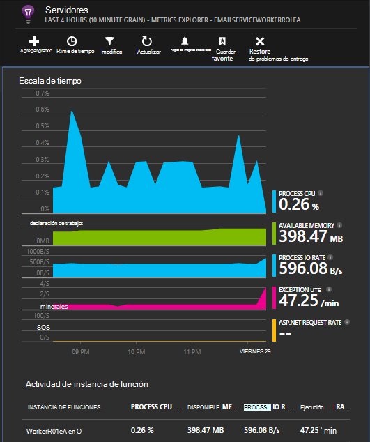

## <a name="correlated-telemetry-for-worker-roles"></a>Telemetría relacionada para funciones de trabajo

Es una experiencia diagnóstico cuando puede ver qué dirigidas a una solicitud de latencia alta o error. Con las funciones de web, el SDK configurará automáticamente correlación entre telemetría relacionado. Para las funciones de trabajo, puede usar a un inicializador de telemetría personalizado para establecer un atributo de contexto de Operation.Id comunes para la de telemetría para ello. Esto le permitirá ver si se produjo el problema de latencia/error debido a una dependencia o el código de un vistazo. 

Le mostramos cómo:

* Establecer el identificador de correlación en una CallContext como se muestra [aquí](https://github.com/Microsoft/ApplicationInsights-Home/blob/master/Samples/AzureEmailService/WorkerRoleA/WorkerRoleA.cs#L36). En este caso, estamos usando el identificador de solicitud como el identificador de correlación
* Agregar una implementación de TelemetryInitializer personalizada, que establezca el Operation.Id en el correlationId indicado. Se muestra aquí: [ItemCorrelationTelemetryInitializer](https://github.com/Microsoft/ApplicationInsights-Home/blob/master/Samples/AzureEmailService/WorkerRoleA/Telemetry/ItemCorrelationTelemetryInitializer.cs#L13)
* Agregar al inicializador de telemetría personalizado. Puede hacerlo en el archivo ApplicationInsights.config o en el código como se muestra [aquí](https://github.com/Microsoft/ApplicationInsights-Home/blob/master/Samples/AzureEmailService/WorkerRoleA/WorkerRoleA.cs#L233)

¡Eso es todo! La experiencia del portal ya está dispuesta para ayudarle a ver todos los asociados telemetría de un vistazo:

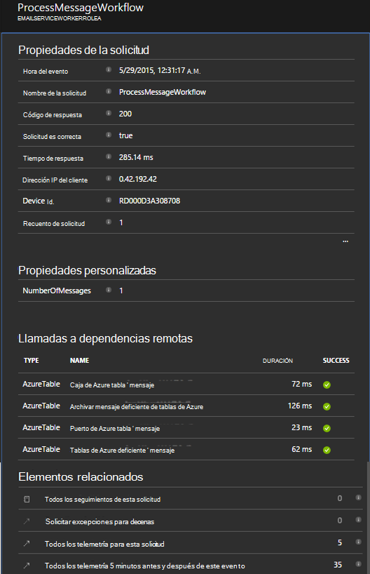


## <a name="client-telemetry"></a>Telemetría de cliente

[Agregue el SDK de JavaScript a las páginas web] [ client] para obtener telemetría basadas en navegador, como recuentos de vista de página, tiempos de carga, excepciones de secuencia de comandos y le permiten escribir telemetría personalizado en las secuencias de comandos de la página.

## <a name="availability-tests"></a>Pruebas de disponibilidad

[Configurar pruebas web] [ availability] para asegurarse de que la aplicación sea directo y capacidad de respuesta.


## <a name="example"></a>Ejemplo

[El ejemplo](https://github.com/Microsoft/ApplicationInsights-Home/tree/master/Samples/AzureEmailService) supervisa un servicio que tiene un rol de web y de dos funciones de trabajo.

## <a name="exception-method-not-found-on-running-in-azure-cloud-services"></a>Excepción "método no encontrado" en que se ejecuta en servicios de nube de Azure

¿Se genera para .NET 4.6? 4.6 no es compatible automáticamente en las funciones de servicios de nube de Azure. [Instalar 4.6 en cada rol](../cloud-services/cloud-services-dotnet-install-dotnet.md) antes de ejecutar la aplicación.

## <a name="related-topics"></a>Temas relacionados

* [Configurar envío Azure diagnósticos de impresiones de aplicación](app-insights-azure-diagnostics.md)
* [Usar PowerShell para enviar diagnóstico de Azure a perspectivas de aplicación](app-insights-powershell-azure-diagnostics.md)


[api]: app-insights-api-custom-events-metrics.md
[apidefaults]: app-insights-api-custom-events-metrics.md#default-properties
[apidynamicikey]: app-insights-separate-resources.md#dynamic-ikey
[availability]: app-insights-monitor-web-app-availability.md
[azure]: app-insights-azure.md
[client]: app-insights-javascript.md
[diagnostic]: app-insights-diagnostic-search.md
[netlogs]: app-insights-asp-net-trace-logs.md
[portal]: http://portal.azure.com/
[qna]: app-insights-troubleshoot-faq.md
[redfield]: app-insights-monitor-performance-live-website-now.md
[start]: app-insights-overview.md 
