<properties 
    pageTitle="Tutorial: exportar telemetría a la base de datos SQL de perspectivas de aplicación" 
    description="Continuamente exportar datos de aplicación perspectivas a SQL mediante el análisis de secuencia." 
    services="application-insights" 
    documentationCenter=""
    authors="noamben" 
    manager="douge"/>

<tags 
    ms.service="application-insights" 
    ms.workload="tbd" 
    ms.tgt_pltfrm="ibiza" 
    ms.devlang="na" 
    ms.topic="article" 
    ms.date="03/06/2015" 
    ms.author="awills"/>
 
# <a name="walkthrough-export-to-sql-from-application-insights-using-stream-analytics"></a>Tutorial: Exportar a SQL desde perspectivas de aplicación utilizando el análisis de secuencia

Este artículo le muestra cómo mover los datos de telemetría de [Perspectivas de aplicación de Visual Studio] [ start] en una base de datos de SQL Azure usando [Exportar continuo] [ export] y [Análisis de secuencia de Azure](https://azure.microsoft.com/services/stream-analytics/). 

Exportar continuo mueve los datos de telemetría en el almacenamiento de Azure en formato JSON. Se podrá analizar los objetos JSON mediante el análisis de secuencia de Azure y crear filas en una tabla de base de datos.

(Por lo general, exportar continuo es la manera de realizar su propio análisis de la telemetría enviar sus aplicaciones de impresiones de aplicación. Puede adaptar este código de ejemplo para realizar otras acciones con la telemetría exportada, como la agregación de datos.)

Comenzaremos con la suposición de que ya dispone de la aplicación que desea supervisar.


En este ejemplo, vamos a usar los datos de la vista de página, pero el mismo modelo se puede ampliar fácilmente a otros tipos de datos como eventos personalizados y excepciones. 


## <a name="add-application-insights-to-your-application"></a>Agregar información de la aplicación a la aplicación


Introducción:

1. [Configurar perspectivas de aplicación para las páginas web](app-insights-javascript.md). 

    (En este ejemplo, nos centraremos en el procesamiento de datos de la vista de página de los exploradores de cliente, pero también puede configurar perspectivas de aplicación para el lado del servidor de la aplicación de [Java](app-insights-java-get-started.md) o [ASP.NET](app-insights-asp-net.md) y solicitud de proceso, dependencia y otro telemetría servidor.)


5. Publicar la aplicación y ver los datos de telemetría que aparecen en el recurso de información de la aplicación.


## <a name="create-storage-in-azure"></a>Crear el almacenamiento de Azure

Exportar continuo siempre envía los datos a una cuenta de almacenamiento de Azure, por lo que necesitará crear el almacenamiento en primer lugar.

1. Crear una cuenta de almacenamiento en su suscripción en el [portal de Azure][portal].

    

2. Crear un contenedor

    

3. Copie la clave de acceso de almacenamiento

    Tendrá que pronto para configurar la entrada del servicio de análisis de secuencia.

    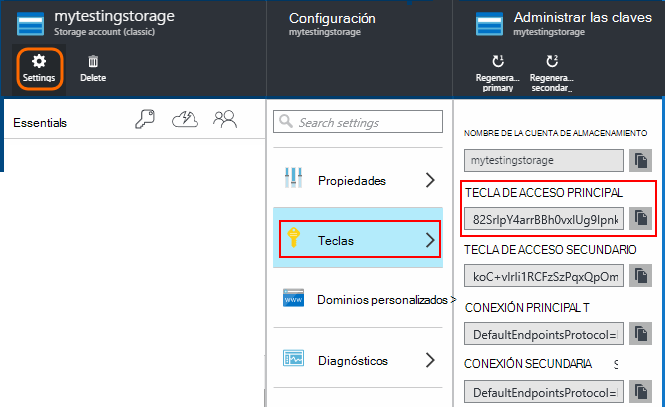

## <a name="start-continuous-export-to-azure-storage"></a>Iniciar exportación continua al almacenamiento de Azure

1. En el portal de Azure, busque el recurso de información de la aplicación que de la aplicación que ha creado.

    

2. Crear una exportación continua.

    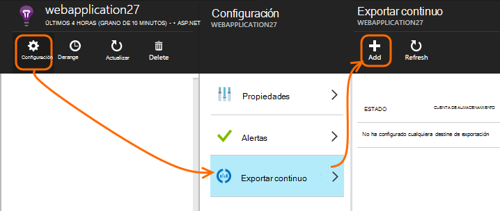


    Seleccione la cuenta de almacenamiento que creó anteriormente:

    
    
    Establecer los tipos de evento que desea ver:

    


3. Permitir que algunos datos se acumulan. Sentarse y permitir a los usuarios usar la aplicación durante un tiempo. Vaya telemetría y verá gráficos estadísticos en el [Explorador de métrica](app-insights-metrics-explorer.md) y eventos individuales en [búsqueda de diagnóstico](app-insights-diagnostic-search.md). 

    Y, además, va a exportar los datos a su almacenamiento. 

4. Inspeccionar la exportado datos, ya sea en el portal - elija **Examinar**, seleccione su cuenta de almacenamiento y **contenedores** - o en Visual Studio. En Visual Studio, elija **Ver / nube Explorer**y abra Azure o almacenamiento. (Si no tiene esta opción de menú, debe instalar el SDK de Azure: abra el cuadro de diálogo nuevo proyecto y Visual C#, en la nube y obtener Microsoft Azure SDK para .NET.)

    

    Tome nota de la parte del nombre de ruta de acceso, que se deriva de la tecla de aplicación nombre e instrumentación común. 

Los eventos se escriben en blob archivos en formato JSON. Cada archivo puede contener uno o más eventos. Así que nos gustaría leer los datos del evento y filtrar los campos que desee. Todos los tipos de cosas que podemos hacer con los datos, pero nuestro plan hoy es usar el análisis de secuencia para mover los datos a una base de datos SQL. Que le facilitan la ejecutar una gran cantidad de consultas interesantes.

## <a name="create-an-azure-sql-database"></a>Crear una base de datos SQL Azure

Nuevo a partir de la suscripción en [el portal de Azure][portal], crear la base de datos (y un servidor nuevo, a menos que ya tiene uno) que deberá escribir los datos.


Asegúrese de que el servidor de base de datos permite el acceso a los servicios de Azure:


## <a name="create-a-table-in-azure-sql-db"></a>Crear una tabla en la base de datos de SQL Azure

Conectarse a la base de datos creado en la sección anterior con la herramienta de administración preferido. En este tutorial, vamos a usar [Las herramientas de administración de SQL Server](https://msdn.microsoft.com/ms174173.aspx) (SSMS).


Crear una nueva consulta y ejecutar la siguiente T-SQL:

```SQL

CREATE TABLE [dbo].[PageViewsTable](
    [pageName] [nvarchar](max) NOT NULL,
    [viewCount] [int] NOT NULL,
    [url] [nvarchar](max) NULL,
    [urlDataPort] [int] NULL,
    [urlDataprotocol] [nvarchar](50) NULL,
    [urlDataHost] [nvarchar](50) NULL,
    [urlDataBase] [nvarchar](50) NULL,
    [urlDataHashTag] [nvarchar](max) NULL,
    [eventTime] [datetime] NOT NULL,
    [isSynthetic] [nvarchar](50) NULL,
    [deviceId] [nvarchar](50) NULL,
    [deviceType] [nvarchar](50) NULL,
    [os] [nvarchar](50) NULL,
    [osVersion] [nvarchar](50) NULL,
    [locale] [nvarchar](50) NULL,
    [userAgent] [nvarchar](max) NULL,
    [browser] [nvarchar](50) NULL,
    [browserVersion] [nvarchar](50) NULL,
    [screenResolution] [nvarchar](50) NULL,
    [sessionId] [nvarchar](max) NULL,
    [sessionIsFirst] [nvarchar](50) NULL,
    [clientIp] [nvarchar](50) NULL,
    [continent] [nvarchar](50) NULL,
    [country] [nvarchar](50) NULL,
    [province] [nvarchar](50) NULL,
    [city] [nvarchar](50) NULL
)

CREATE CLUSTERED INDEX [pvTblIdx] ON [dbo].[PageViewsTable]
(
    [eventTime] ASC
)WITH (PAD_INDEX = OFF, STATISTICS_NORECOMPUTE = OFF, SORT_IN_TEMPDB = OFF, DROP_EXISTING = OFF, ONLINE = OFF, ALLOW_ROW_LOCKS = ON, ALLOW_PAGE_LOCKS = ON)

```

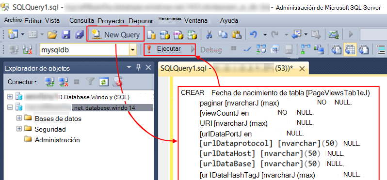

En este ejemplo, estamos usando datos de las vistas de la página. Para ver los datos disponibles, inspeccionar el resultado JSON y vea la [exportación de modelos de datos](app-insights-export-data-model.md).

## <a name="create-an-azure-stream-analytics-instance"></a>Crear una instancia de análisis de secuencia de Azure

Desde el [Portal de Azure clásico](https://manage.windowsazure.com/), seleccione el servicio de análisis de secuencia de Azure y crear un nuevo análisis de flujo de trabajo:


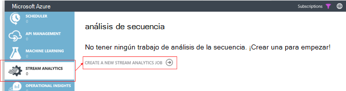


Cuando se crea la nueva tarea, expanda los detalles:


#### <a name="set-blob-location"></a>Establecer ubicación de blobs

Establecer para obtener una entrada de su blob continuo exportar:

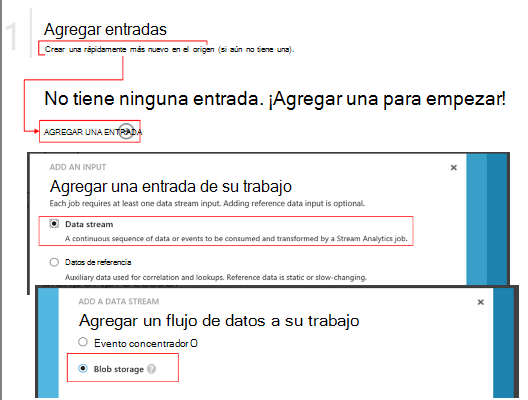

Ahora tendrá la clave principal de acceso desde su cuenta de almacenamiento, que se indicó anteriormente. Utilizar esta configuración como la clave de cuenta de almacenamiento.

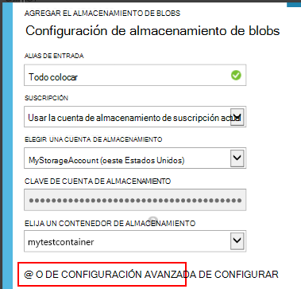

#### <a name="set-path-prefix-pattern"></a>Establecer modelo de prefijo de ruta de acceso 

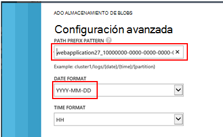

Asegúrese de configurar el formato de fecha a **Dd-MM-AAAA** (con **guiones**).

El modelo de prefijo de ruta de acceso especifica cómo secuencia análisis busca los archivos de entrada en el almacenamiento. Debe configurarlo para que corresponden a cómo exportar continuo almacena los datos. Configurarlo similar a esta:

    webapplication27_12345678123412341234123456789abcdef0/PageViews/{date}/{time}

En este ejemplo:

* `webapplication27`es el nombre del recurso de aplicación perspectivas, **todo en minúsculas**. 
* `1234...`es la clave de instrumentación de la aplicación perspectivas recursos **con guiones eliminados**. 
* `PageViews`es el tipo de datos que desea analizar. Los tipos disponibles dependen del filtro que defina en Exportar continuo. Examinar los datos exportados para ver los tipos de disponibles y vea la [exportación de modelos de datos](app-insights-export-data-model.md).
* `/{date}/{time}`se escribe literalmente un patrón.

Para obtener el nombre y iKey del recurso perspectivas de aplicación, abra Essentials en su página de información general o abre configuración.

#### <a name="finish-initial-setup"></a>Finalizar la configuración inicial

Confirme el formato de serialización:


Cerrar al asistente y espere a que el programa de instalación.

>[AZURE.TIP] Use la función de ejemplo para comprobar que ha establecido la ruta de acceso de entrada correctamente. Si se produce un error: Compruebe que hay datos en el almacenamiento de información para el intervalo de tiempo de ejemplo elegido. Editar la definición de entrada y compruebe que configurar la cuenta de almacenamiento, el prefijo de ruta de acceso y correctamente el formato de fecha.

## <a name="set-query"></a>Conjunto de consulta

Abra la sección consulta:


Reemplazar la consulta predeterminada con:

```SQL

    SELECT flat.ArrayValue.name as pageName
    , flat.ArrayValue.count as viewCount
    , flat.ArrayValue.url as url
    , flat.ArrayValue.urlData.port as urlDataPort
    , flat.ArrayValue.urlData.protocol as urlDataprotocol
    , flat.ArrayValue.urlData.host as urlDataHost
    , flat.ArrayValue.urlData.base as urlDataBase
    , flat.ArrayValue.urlData.hashTag as urlDataHashTag
      ,A.context.data.eventTime as eventTime
      ,A.context.data.isSynthetic as isSynthetic
      ,A.context.device.id as deviceId
      ,A.context.device.type as deviceType
      ,A.context.device.os as os
      ,A.context.device.osVersion as osVersion
      ,A.context.device.locale as locale
      ,A.context.device.userAgent as userAgent
      ,A.context.device.browser as browser
      ,A.context.device.browserVersion as browserVersion
      ,A.context.device.screenResolution.value as screenResolution
      ,A.context.session.id as sessionId
      ,A.context.session.isFirst as sessionIsFirst
      ,A.context.location.clientip as clientIp
      ,A.context.location.continent as continent
      ,A.context.location.country as country
      ,A.context.location.province as province
      ,A.context.location.city as city
    INTO
      AIOutput
    FROM AIinput A
    CROSS APPLY GetElements(A.[view]) as flat


```

Observe que la primera algunas de las propiedades específicas de datos de la vista de página. Exportaciones de otros tipos de telemetría tendrá propiedades diferentes. Consulte la [detallada de referencia del modelo de datos para los tipos de propiedades y los valores.](app-insights-export-data-model.md)

## <a name="set-up-output-to-database"></a>Configurar el resultado de la base de datos

Seleccione SQL como resultado.

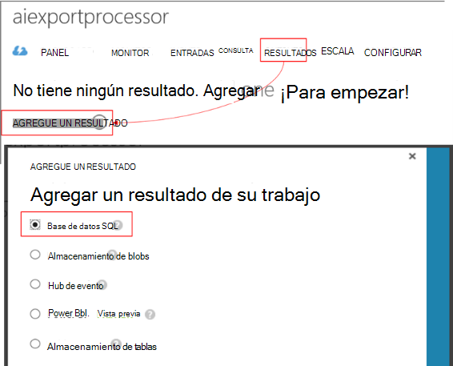

Especifique la base de datos SQL.


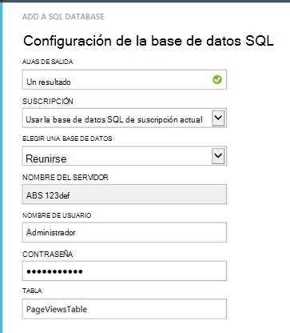

Cerrar al asistente y espere una notificación que se ha configurado el resultado.

## <a name="start-processing"></a>Iniciar el procesamiento

Iniciar el trabajo desde la barra de acciones:

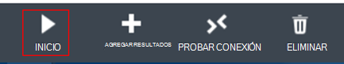

Puede elegir si desea iniciar el procesamiento de los datos a partir de ahora o datos inicialmente anteriores. El último es útil si ha tenido exportar continuo ya en ejecución durante un tiempo.


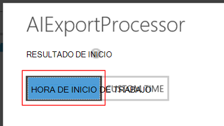

Después de unos minutos, vuelva a las herramientas de administración de SQL Server y ver los datos que fluye en. Por ejemplo, utilice una consulta como esta:

    SELECT TOP 100 *
    FROM [dbo].[PageViewsTable]


## <a name="related-articles"></a>Artículos relacionados

* [Exportar a SQL con una función de trabajo](app-insights-code-sample-export-telemetry-sql-database.md)
* [Exportar a PowerBI mediante el análisis de secuencia](app-insights-export-power-bi.md)
* [Referencia de los tipos de propiedades y los valores del modelo de datos detallados.](app-insights-export-data-model.md)
* [Exportar continua en perspectivas de aplicación](app-insights-export-telemetry.md)
* [Información de la aplicación](https://azure.microsoft.com/services/application-insights/)

<!--Link references-->

[diagnostic]: app-insights-diagnostic-search.md
[export]: app-insights-export-telemetry.md
[metrics]: app-insights-metrics-explorer.md
[portal]: http://portal.azure.com/
[start]: app-insights-overview.md

 