<properties 
    pageTitle="Ejemplo de código: analizar los datos exportados desde perspectivas de aplicación" 
    description="El código de su propio análisis de telemetría en perspectivas de aplicación mediante la característica de exportación continuo. Guardar datos en SQL." 
    services="application-insights" 
    documentationCenter=""
    authors="mazharmicrosoft" 
    manager="douge"/>

<tags 
    ms.service="application-insights" 
    ms.workload="tbd" 
    ms.tgt_pltfrm="ibiza" 
    ms.devlang="na" 
    ms.topic="article" 
    ms.date="01/05/2016" 
    ms.author="awills"/>
 
# Ejemplo de código: analizar los datos exportados desde perspectivas de aplicación

Este artículo le muestra cómo procesar datos JSON exportados desde perspectivas de aplicación. Por ejemplo, se deberá escribir código para mover los datos de telemetría de [Perspectivas de aplicación de Visual Studio] [ start] en una base de datos de SQL Azure usando [Exportar continuo][export]. (También puede lograr este [usando el análisis de secuencia](app-insights-code-sample-export-sql-stream-analytics.md), pero aquí nuestro objetivo es mostrar código). 

Exportar continuo mueve la telemetría Azure almacenamiento en formato JSON, por lo que deberá escribir código para analizar los objetos JSON y crear filas en una tabla de base de datos.

Por lo general, exportar continuo es la manera de realizar su propio análisis de la telemetría enviar sus aplicaciones de impresiones de aplicación. Puede adaptar este código de ejemplo para realizar otras acciones con la telemetría exportada.

Comenzaremos con la suposición de que ya dispone de la aplicación que desea supervisar.

## Agregar aplicación perspectivas SDK

Para supervisar la aplicación, [Agregue un SDK perspectivas de aplicación] [ start] a la aplicación. Existen diferentes SDK y herramientas de ayuda para distintas plataformas, IDE e idiomas. Puede supervisar páginas web, Java o ASP.NET servidores web y dispositivos móviles de varios tipos. Todos los SDK enviar telemetría en el [portal de aplicación perspectivas][portal], donde puede usar nuestro análisis eficaces y herramientas de diagnóstico y exporte los datos al almacenamiento.

Introducción:

1. Obtener una [cuenta de Microsoft Azure](https://azure.microsoft.com/pricing/).
2. En el [portal de Azure][portal], agregar un nuevo recurso de información de la aplicación de la aplicación:

    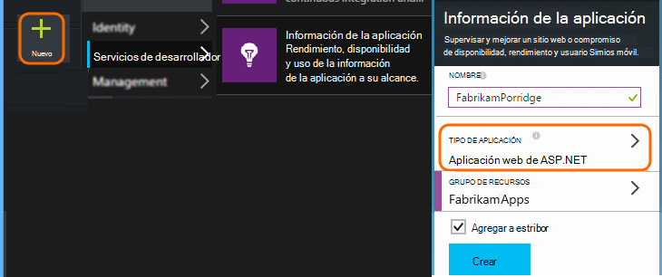

    (El tipo de aplicación y la suscripción pueden ser diferentes.)
3. Abra el inicio rápido para descubrir cómo configurar el SDK para el tipo de aplicación.

    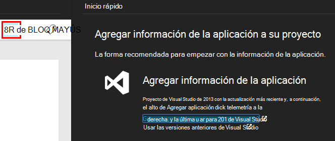

    Si no aparece el tipo de aplicación, eche un vistazo a la [Introducción] [ start] página.

4. En este ejemplo, hemos estamos supervisión una aplicación web, por lo que podemos usar las herramientas de Azure en Visual Studio para instalar el SDK. Le indicamos al nombre del recurso de nuestra aplicación perspectivas:

    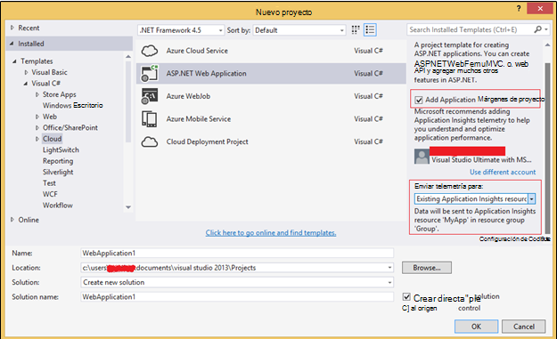

## Crear el almacenamiento de Azure

Siempre se exportan los datos desde perspectivas de aplicación a una cuenta de almacenamiento de Azure en formato JSON. Este almacenamiento es que el código lee los datos.

1. Crear una cuenta de almacenamiento "clásico" en la suscripción en el [portal de Azure][portal].

    

2. Crear un contenedor

    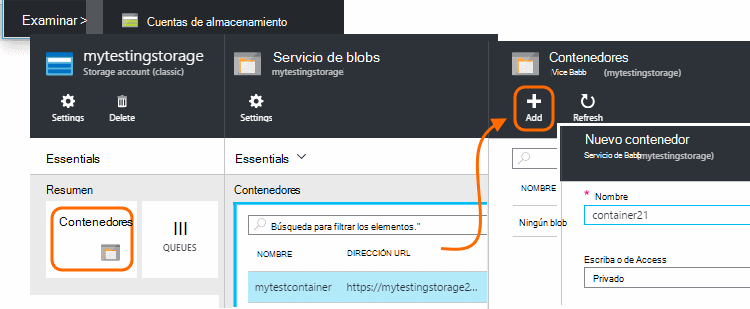

## Iniciar exportación continua al almacenamiento de Azure

1. En el portal de Azure, busque el recurso de información de la aplicación que de la aplicación que ha creado.

    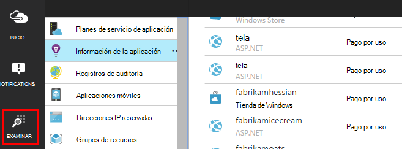

2. Crear una exportación continua.

    

    Seleccione la cuenta de almacenamiento que creó anteriormente:

    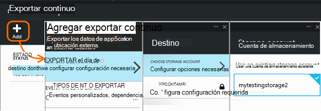
    
    Establecer los tipos de evento que desea ver:

    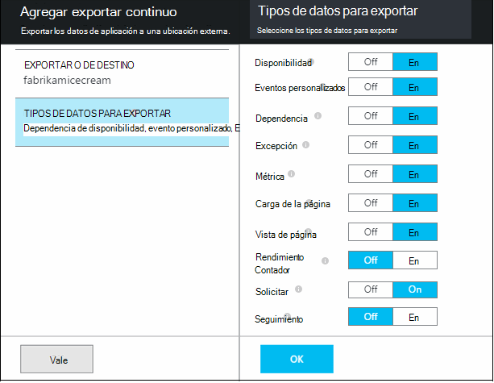

3. Permitir que algunos datos se acumulan. Sentarse y permitir a los usuarios usar la aplicación durante un tiempo. Vaya telemetría y verá gráficos estadísticos en el [Explorador de métrica](app-insights-metrics-explorer.md) y eventos individuales en [búsqueda de diagnóstico](app-insights-diagnostic-search.md). 

    Y, además, va a exportar los datos a su almacenamiento. 

4. Inspeccionar los datos exportados. En Visual Studio, elija **Ver / nube Explorer**y abra Azure o almacenamiento. (Si no tiene esta opción de menú, debe instalar el SDK de Azure: abra el cuadro de diálogo nuevo proyecto y Visual C#, en la nube y obtener Microsoft Azure SDK para .NET.)

    

    Tome nota de la parte del nombre de ruta de acceso, que se deriva de la tecla de aplicación nombre e instrumentación común. 

Los eventos se escriben en blob archivos en formato JSON. Cada archivo puede contener uno o más eventos. Así que nos gustaría leer los datos del evento y filtrar los campos que desee. Todos los tipos de cosas que podemos hacer con los datos, pero hoy es nuestro plan escribir código para mover los datos a una base de datos SQL. Que le facilitan la ejecutar una gran cantidad de consultas interesantes.

## Crear una base de datos SQL Azure

En este ejemplo, se deberá escribir código para insertar los datos en una base de datos.

Nuevo a partir de la suscripción en [el portal de Azure][portal], crear la base de datos (y un servidor nuevo, a menos que ya tiene uno) que deberá escribir los datos.

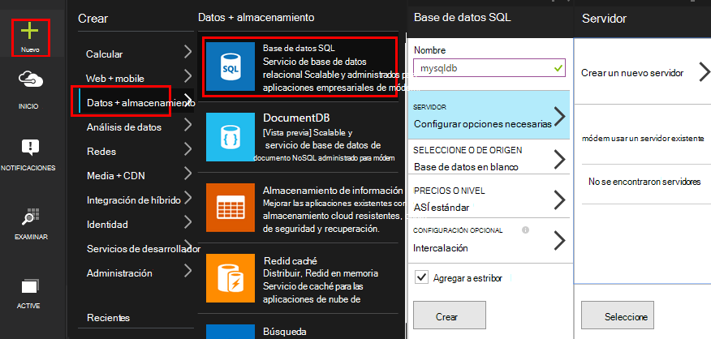

Asegúrese de que el servidor de base de datos permite el acceso a los servicios de Azure:

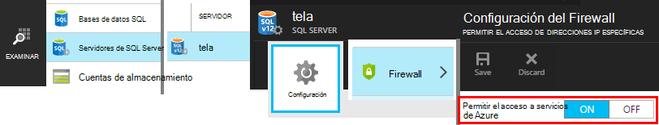

## Crear una función de trabajo 

Ahora en la última podemos escribir el [código](https://sesitai.codeplex.com/) para analizar el JSON en el BLOB exportados y crear registros en la base de datos. Dado que el almacén de exportación y la base de datos están en Azure, se deberá ejecutar el código de una función de trabajador de Azure.

Este código extrae automáticamente las propiedades están presentes en el JSON. Para obtener una descripción de las propiedades, consulte [Exportar modelo de datos](app-insights-export-data-model.md).

#### Crear proyecto de la función de trabajo

En Visual Studio, cree un nuevo proyecto de la función de trabajo:

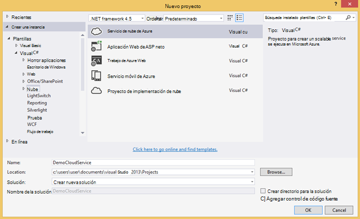

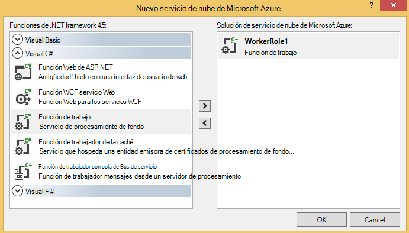

#### Conectarse a la cuenta de almacenamiento

En Azure, obtener la cadena de conexión de la cuenta de almacenamiento:

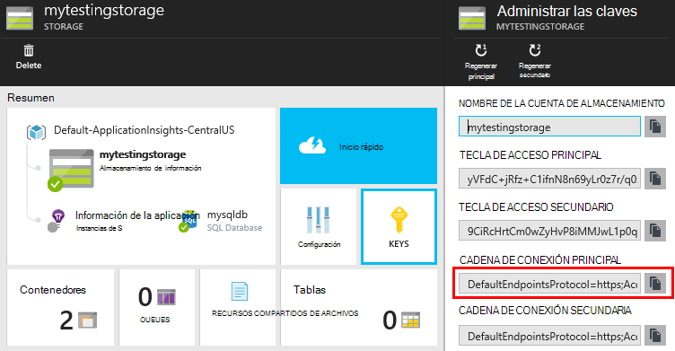

En Visual Studio, establezca la configuración de la función de trabajo con la cadena de conexión de la cuenta de almacenamiento:

#### Paquetes

En el Explorador de soluciones, haga clic en el proyecto de rol de trabajo y elija Administrar paquetes de NuGet.
Busque e instale estos paquetes: 

 * EntityFramework 6.1.2 o posterior - deberá usar para generar el esquema de la tabla de base de datos sobre la marcha, según el contenido de la JSON en el blob.
 * JsonFx - usaremos este para acoplar el JSON a las propiedades de clase de C#.

Use esta herramienta para generar la clase de C# alejar nuestro documento JSON único. Requiere cambios menores como acoplar matrices JSON en sola C# propiedad Activar sola columna de tabla de base de datos (ex. urlData_port) 

 * [Generador de clases JSON C#](http://jsonclassgenerator.codeplex.com/)

## Código 

Puede colocar este código en `WorkerRole.cs`.

#### Importaciones

    using Microsoft.WindowsAzure.Storage;

    using Microsoft.WindowsAzure.Storage.Blob;

#### Recuperar la cadena de conexión de almacenamiento

    private static string GetConnectionString()
    {
      return Microsoft.WindowsAzure.CloudConfigurationManager.GetSetting("StorageConnectionString");
    }

#### Ejecutar el trabajo a intervalos periódicos

Reemplazar el método de ejecución existente y elija el intervalo que prefiera. Debe ser al menos una hora, porque la característica de exportación completa un objeto JSON en una hora.

    public override void Run()
    {
      Trace.TraceInformation("WorkerRole1 is running");

      while (true)
      {
        Trace.WriteLine("Sleeping", "Information");

        Thread.Sleep(86400000); //86400000=24 hours //1 hour=3600000
                
        Trace.WriteLine("Awake", "Information");

        ImportBlobtoDB();
      }
    }

#### Insertar cada objeto JSON como una fila de tabla

    public void ImportBlobtoDB()
    {
      try
      {
        CloudStorageAccount account = CloudStorageAccount.Parse(GetConnectionString());

        var blobClient = account.CreateCloudBlobClient();
        var container = blobClient.GetContainerReference(FilterContainer);

        foreach (CloudBlobDirectory directory in container.ListBlobs())//Parent directory
        {
          foreach (CloudBlobDirectory subDirectory in directory.ListBlobs())//PageViewPerformance
          {
            foreach (CloudBlobDirectory dir in subDirectory.ListBlobs())//2015-01-31
            {
              foreach (CloudBlobDirectory subdir in dir.ListBlobs())//22
              {
                foreach (IListBlobItem item in subdir.ListBlobs())//3IAwm6u3-0.blob
                {
                  itemname = item.Uri.ToString();
                  ParseEachBlob(container, item);
                  AuditBlob(container, directory, subDirectory, dir, subdir, item);
                } //item loop
              } //subdir loop
            } //dir loop
          } //subDirectory loop
        } //directory loop
      }
      catch (Exception ex)
      {
        //handle exception
      }
    }

#### Analizar cada blob

    private void ParseEachBlob(CloudBlobContainer container, IListBlobItem item)
    {
      try
      {
        var blob = container.GetBlockBlobReference(item.Parent.Prefix + item.Uri.Segments.Last());
    
        string json;
    
        using (var memoryStream = new MemoryStream())
        {
          blob.DownloadToStream(memoryStream);
          json = System.Text.Encoding.UTF8.GetString(memoryStream.ToArray());
    
          IEnumerable<string> entities = json.Split('\n').Where(s => !string.IsNullOrWhiteSpace(s));
    
          recCount = entities.Count();
          failureCount = 0; //resetting failure count
    
          foreach (var entity in entities)
          {
            var reader = new JsonFx.Json.JsonReader();
            dynamic output = reader.Read(entity);
    
            Dictionary<string, object> dict = new Dictionary<string, object>();
    
            GenerateDictionary((System.Dynamic.ExpandoObject)output, dict, "");
    
            switch (FilterType)
            {
              case "PageViewPerformance":
    
              if (dict.ContainsKey("clientPerformance"))
                {
                  GenerateDictionary(((System.Dynamic.ExpandoObject[])dict["clientPerformance"])[0], dict, "");
                }
    
              if (dict.ContainsKey("context_custom_dimensions"))
              {
                if (dict["context_custom_dimensions"].GetType() == typeof(System.Dynamic.ExpandoObject[]))
                {
                  GenerateDictionary(((System.Dynamic.ExpandoObject[])dict["context_custom_dimensions"])[0], dict, "");
                }
              }
    
            PageViewPerformance objPageViewPerformance = (PageViewPerformance)GetObject(dict);
    
            try
            {
              using (var db = new TelemetryContext())
              {
                db.PageViewPerformanceContext.Add(objPageViewPerformance);
                db.SaveChanges();
              }
            }
            catch (Exception ex)
            {
              failureCount++;
            }
            break;
    
            default:
            break;
          }
        }
      }
    }
    catch (Exception ex)
    {
      //handle exception 
    }
    }

#### Preparar un diccionario para cada documento JSON

    private void GenerateDictionary(System.Dynamic.ExpandoObject output, Dictionary<string, object> dict, string parent)
        {
            try
            {
                foreach (var v in output)
                {
                    string key = parent + v.Key;
                    object o = v.Value;

                    if (o.GetType() == typeof(System.Dynamic.ExpandoObject))
                    {
                        GenerateDictionary((System.Dynamic.ExpandoObject)o, dict, key + "_");
                    }
                    else
                    {
                        if (!dict.ContainsKey(key))
                        {
                            dict.Add(key, o);
                        }
                    }
                }
            }
            catch (Exception ex)
            {
            //handle exception 
            }
        }

#### Convertir el documento JSON en Propiedades de objeto de telemetría de C# clase

     public object GetObject(IDictionary<string, object> d)
        {
            PropertyInfo[] props = null;
            object res = null;

            try
            {
                switch (FilterType)
                {
                    case "PageViewPerformance":

                        props = typeof(PageViewPerformance).GetProperties();
                        res = Activator.CreateInstance<PageViewPerformance>();
                        break;

                    default:
                        break;
                }

                for (int i = 0; i < props.Length; i++)
                {
                    if (props[i].CanWrite && d.ContainsKey(props[i].Name))
                    {
                        props[i].SetValue(res, d[props[i].Name], null);
                    }
                }
            }
            catch (Exception ex)
            {
            //handle exception 
            }

            return res;
        }

#### Archivo de clase PageViewPerformance generado fuera del documento JSON

    public class PageViewPerformance
    {
        [DatabaseGenerated(DatabaseGeneratedOption.Identity)]
        public Guid Id { get; set; }

        public string url { get; set; }

        public int urlData_port { get; set; }

        public string urlData_protocol { get; set; }

        public string urlData_host { get; set; }

        public string urlData_base { get; set; }

        public string urlData_hashTag { get; set; }

        public double total_value { get; set; }

        public double networkConnection_value { get; set; }

        public double sendRequest_value { get; set; }

        public double receiveRequest_value { get; set; }

        public double clientProcess_value { get; set; }

        public string name { get; set; }

        public string internal_data_id { get; set; }

        public string internal_data_documentVersion { get; set; }

        public DateTime? context_data_eventTime { get; set; }

        public string context_device_id { get; set; }

        public string context_device_type { get; set; }

        public string context_device_os { get; set; }

        public string context_device_osVersion { get; set; }

        public string context_device_locale { get; set; }

        public string context_device_userAgent { get; set; }

        public string context_device_browser { get; set; }

        public string context_device_browserVersion { get; set; }

        public string context_device_screenResolution_value { get; set; }

        public string context_user_anonId { get; set; }

        public string context_user_anonAcquisitionDate { get; set; }

        public string context_user_authAcquisitionDate { get; set; }

        public string context_user_accountAcquisitionDate { get; set; }

        public string context_session_id { get; set; }

        public bool context_session_isFirst { get; set; }

        public string context_operation_id { get; set; }

        public double context_location_point_lat { get; set; }

        public double context_location_point_lon { get; set; }

        public string context_location_clientip { get; set; }

        public string context_location_continent { get; set; }

        public string context_location_country { get; set; }

        public string context_location_province { get; set; }

        public string context_location_city { get; set; }
    }

#### DBcontext para la interacción con SQL entidad Framework

    public class TelemetryContext : DbContext
    {
        public DbSet<PageViewPerformance> PageViewPerformanceContext { get; set; }
        public TelemetryContext()
            : base("name=TelemetryContext")
        {
        }
    }

Agregar la cadena de conexión de base de datos con nombre `TelemetryContext` en `app.config`.

## Esquema (solo información)

Este es el esquema de la tabla que se generará para la vista de página.

> [AZURE.NOTE] No debe ejecutar esta secuencia de comandos. Los atributos de la JSON determinan las columnas de la tabla.

    CREATE TABLE [dbo].[PageViewPerformances](
    [Id] [uniqueidentifier] NOT NULL,
    [url] [nvarchar](max) NULL,
    [urlData_port] [int] NOT NULL,
    [urlData_protocol] [nvarchar](max) NULL,
    [urlData_host] [nvarchar](max) NULL,
    [urlData_base] [nvarchar](max) NULL,
    [urlData_hashTag] [nvarchar](max) NULL,
    [total_value] [float] NOT NULL,
    [networkConnection_value] [float] NOT NULL,
    [sendRequest_value] [float] NOT NULL,
    [receiveRequest_value] [float] NOT NULL,
    [clientProcess_value] [float] NOT NULL,
    [name] [nvarchar](max) NULL,
    [User] [nvarchar](max) NULL,
    [internal_data_id] [nvarchar](max) NULL,
    [internal_data_documentVersion] [nvarchar](max) NULL,
    [context_data_eventTime] [datetime] NULL,
    [context_device_id] [nvarchar](max) NULL,
    [context_device_type] [nvarchar](max) NULL,
    [context_device_os] [nvarchar](max) NULL,
    [context_device_osVersion] [nvarchar](max) NULL,
    [context_device_locale] [nvarchar](max) NULL,
    [context_device_userAgent] [nvarchar](max) NULL,
    [context_device_browser] [nvarchar](max) NULL,
    [context_device_browserVersion] [nvarchar](max) NULL,
    [context_device_screenResolution_value] [nvarchar](max) NULL,
    [context_user_anonId] [nvarchar](max) NULL,
    [context_user_anonAcquisitionDate] [nvarchar](max) NULL,
    [context_user_authAcquisitionDate] [nvarchar](max) NULL,
    [context_user_accountAcquisitionDate] [nvarchar](max) NULL,
    [context_session_id] [nvarchar](max) NULL,
    [context_session_isFirst] [bit] NOT NULL,
    [context_operation_id] [nvarchar](max) NULL,
    [context_location_point_lat] [float] NOT NULL,
    [context_location_point_lon] [float] NOT NULL,
    [context_location_clientip] [nvarchar](max) NULL,
    [context_location_continent] [nvarchar](max) NULL,
    [context_location_country] [nvarchar](max) NULL,
    [context_location_province] [nvarchar](max) NULL,
    [context_location_city] [nvarchar](max) NULL,
    CONSTRAINT [PK_dbo.PageViewPerformances] PRIMARY KEY CLUSTERED 
    (
     [Id] ASC
    )WITH (PAD_INDEX = OFF, STATISTICS_NORECOMPUTE = OFF, IGNORE_DUP_KEY = OFF, ALLOW_ROW_LOCKS = ON, ALLOW_PAGE_LOCKS = ON) ON [PRIMARY]
    ) ON [PRIMARY] TEXTIMAGE_ON [PRIMARY]

    GO

    ALTER TABLE [dbo].[PageViewPerformances] ADD  DEFAULT (newsequentialid()) FOR [Id]
    GO

Para ver este ejemplo en acción, [Descargue](https://sesitai.codeplex.com/) el código de trabajo completado, cambiar la `app.config` configuración y publicar el rol de trabajo en Azure.

## Artículos relacionados

* [Exportar a SQL con una función de trabajo](app-insights-code-sample-export-telemetry-sql-database.md)
* [Exportar continua en perspectivas de aplicación](app-insights-export-telemetry.md)
* [Información de la aplicación](https://azure.microsoft.com/services/application-insights/)
* [Exportar modelo de datos](app-insights-export-data-model.md)
* [Más ejemplos y tutoriales](app-insights-code-samples.md)

<!--Link references-->

[diagnostic]: app-insights-diagnostic-search.md
[export]: app-insights-export-telemetry.md
[metrics]: app-insights-metrics-explorer.md
[portal]: http://portal.azure.com/
[start]: app-insights-overview.md

 
