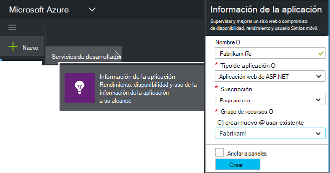
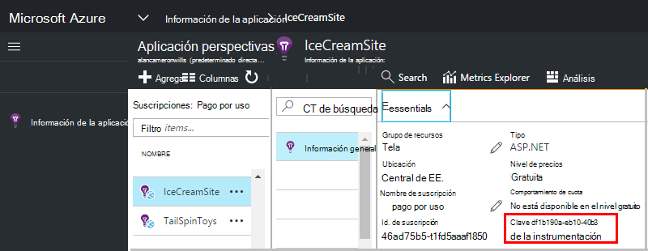

<properties 
    pageTitle="Crear un nuevo recurso de aplicación perspectivas | Microsoft Azure" 
    description="Configurar la supervisión de perspectivas de aplicación para una nueva aplicación directo. Enfoque basado en Web." 
    services="application-insights" 
    documentationCenter=""
    authors="alancameronwills" 
    manager="douge"/>

<tags 
    ms.service="application-insights" 
    ms.workload="tbd" 
    ms.tgt_pltfrm="ibiza" 
    ms.devlang="na" 
    ms.topic="article" 
    ms.date="08/26/2016" 
    ms.author="awills"/>

# Crear un recurso de aplicación perspectivas

Perspectivas de aplicación de Visual Studio muestra datos sobre la aplicación en un *recurso*de Microsoft Azure. Crear un nuevo recurso, por tanto, es parte de [la configuración de aplicación perspectivas para supervisar una nueva aplicación][start]. En muchos casos, esto puede hacerse automáticamente el IDE y que es la manera recomendada donde está disponible. Pero en algunos casos, se crea un recurso de forma manual.

Después de haber creado el recurso, que obtener su clave de instrumentación y usarlo para configurar el SDK en la aplicación. Envía la telemetría al recurso.

## Suscribirse a Microsoft Azure

Si todavía no lo ha recibido un [Microsoft de su cuenta, obtener una ahora](http://live.com). (Si usa servicios como Outlook.com, OneDrive, Windows Phone o XBox Live, ya tiene una cuenta de Microsoft.)

También necesitará una suscripción a [Microsoft Azure](http://azure.com). Si su equipo o la organización tiene una suscripción de Azure, el propietario puede agregar, con su Windows Live ID.

O bien, puede crear una nueva suscripción. La cuenta gratuita le permite probar todo el contenido de Azure. Después de que expire el período de prueba, que puede encontrar la suscripción de pago correspondiente, mientras que no se cargan gratuitamente servicios. 

Cuando se tiene acceso a una suscripción, el inicio de sesión de aplicación impresiones en [http://portal.azure.com](https://portal.azure.com)y usar su Live ID para iniciar sesión.

## Crear un recurso de aplicación perspectivas
  

En la [portal.azure.com](https://portal.azure.com), agregue un recurso de información de la aplicación:

* **Tipo de aplicación** afecta a lo que ve en el módulo de introducción y las propiedades disponibles en el [Explorador de métrica][metrics]. Si no ve el tipo de aplicación, seleccione ASP.NET.
* **Grupo de recursos** es una comodidad para administrar las propiedades de control de acceso, como. Si ya ha creado otros recursos de Azure, puede poner este nuevo recurso en el mismo grupo.
* **Suscripción** es su cuenta de pago de Azure.
* **Ubicación** es donde se mantenga sus datos. Actualmente no se puede cambiar.
* **Agregar a startboard** coloca un mosaico de acceso rápido para el recurso en la página principal de Azure. Se recomienda.

Cuando se ha creado la aplicación, se abrirá un nuevo módulo. Esto es donde verá rendimiento y datos de uso sobre la aplicación. 

Para obtener back a él la próxima vez que inicie sesión en Azure, mire para mosaico de inicio rápido de la aplicación en el panel de inicio (pantalla de inicio). O bien, haga clic en Examinar para encontrarlo.

## Copie la clave de instrumentación

La clave de instrumentación identifica el recurso que ha creado. Tendrá que dar en el SDK.

## Instalar el SDK de la aplicación

Instale el SDK de perspectivas de aplicación en la aplicación. Este paso depende del tipo de la aplicación. 

Utilice la tecla de instrumentación para configurar [el SDK que se instala en su aplicación][start].

El SDK incluye módulos estándar que envíe telemetría sin tener que escribir código. Para realizar un seguimiento de acciones de usuario o diagnosticar problemas con más detalle, [use la API] [ api] para enviar su propio telemetría.

## Ver los datos de telemetría

Cierre el módulo de inicio rápido para volver a su módulo de aplicación en el portal de Azure.

Haga clic en el icono de búsqueda para ver [Búsqueda diagnóstico][diagnostic], donde aparecen los primeros eventos. 

Si espera más datos, haga clic en actualizar después de unos pocos segundos.

## Creación automática de un recurso

Puede escribir un [script de PowerShell](app-insights-powershell-script-create-resource.md) para crear un recurso automáticamente.

## Pasos siguientes

* [Crear un panel](app-insights-dashboards.md)
* [Búsqueda de diagnóstico](app-insights-diagnostic-search.md)
* [Explorar métricas](app-insights-metrics-explorer.md)
* [Escribir consultas de análisis](app-insights-analytics.md)

<!--Link references-->

[api]: app-insights-api-custom-events-metrics.md
[diagnostic]: app-insights-diagnostic-search.md
[metrics]: app-insights-metrics-explorer.md
[start]: app-insights-overview.md

 