<properties
    pageTitle="Navegación en el portal de información de la aplicación y paneles | Microsoft Azure"
    description="Crear vistas de los gráficos APM claves y las consultas."
    services="application-insights"
    documentationCenter=""
    authors="alancameronwills"
    manager="douge"/>

<tags
    ms.service="application-insights"
    ms.workload="tbd"
    ms.tgt_pltfrm="ibiza"
    ms.devlang="multiple"
    ms.topic="article" 
    ms.date="10/18/2016"
    ms.author="awills"/>

# Navegación y paneles en el portal de información de la aplicación

Después de que ha [configurado perspectivas de aplicación en su proyecto](app-insights-overview.md), los datos de telemetría sobre el rendimiento y el uso de la aplicación aparecerán en el recurso del proyecto perspectivas de aplicación en el [portal de Azure](https://portal.azure.com).

## Buscar la telemetría

Inicie sesión en el [portal de Azure](https://portal.azure.com) y desplácese hasta el recurso de información de la aplicación que ha creado para la aplicación.

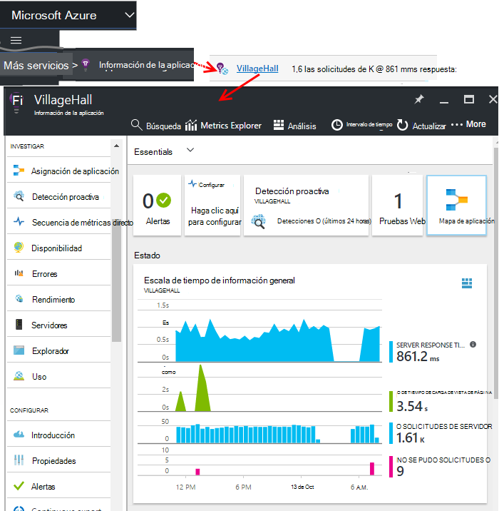

El módulo de introducción (página) de la aplicación muestra un resumen de las mediciones de diagnósticos claves de la aplicación y es una puerta de enlace a las otras características del portal.

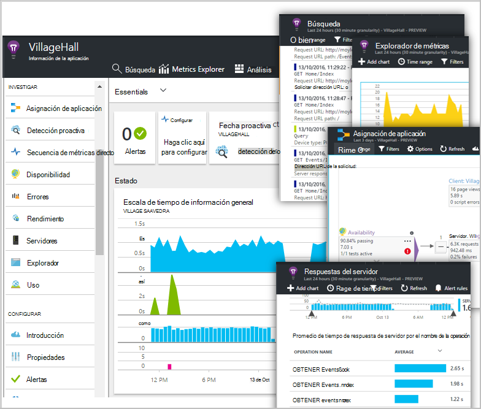

Puede personalizar cualquiera de los otros gráficos y anclar en un panel. De este modo, puede juntar los gráficos de clave de diferentes aplicaciones.

## Paneles

Lo primero que verá cuando inicie sesión en el [portal de Microsoft Azure](https://portal.azure.com) es un panel. Aquí puede juntar los gráficos que son más importantes para usted a través de todos los recursos de Azure, incluidos telemetría desde [Perspectivas de aplicación de Visual Studio](app-insights-overview.md).
 

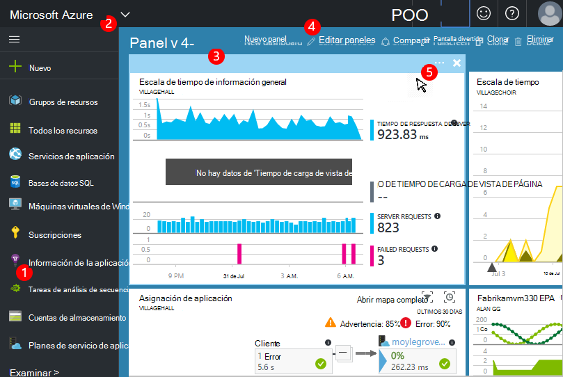

1. **Vaya a recursos específicos** , como la aplicación de la aplicación perspectivas: usar la barra izquierda.
2. **Vuelva al panel actual**o cambiar a otras vistas recientes: Use el menú desplegable en la esquina superior izquierda.
3. **Paneles de conmutador**: usar el menú desplegable en el título del panel
4. **Crear, editar y compartir paneles** en la barra de herramientas de paneles.
5. **Editar el panel**: desplace el puntero sobre un mosaico y, a continuación, use la barra superior para mover, personalizar o eliminarlo.

## Agregar a un panel

Cuando esté mirando un módulo o un conjunto de gráficos que es especialmente interesante, puede anclar una copia de la misma al escritorio. Verá que próxima vez que vuelva allí.

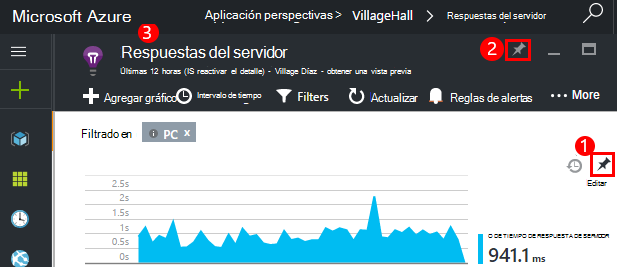

1. Gráfico de PIN para paneles. Una copia del gráfico aparece en el panel.
2. Anclar el módulo completo a panel: aparece en el panel como un mosaico que puede hacer clic en.
3. Haga clic en la esquina superior izquierda para volver al panel actual. A continuación, puede usar el menú desplegable para volver a la vista actual.

Observe que los gráficos se agrupan en mosaicos: un mosaico puede contener más de un gráfico. Anclar el mosaico todo al escritorio.

### Anclar cualquier consulta en el análisis

También puede [anclar el análisis de](app-insights-analytics-using.md#pin-to-dashboard) gráficos a un escritorio [compartido](#share-dashboards-with-your-team) . Esto le permite agregar gráficos de cualquier consulta arbitrario junto con las medidas estándares. (Hay un cargo para esta característica).

## Ajustar un mosaico en el panel

Una vez en el panel de un mosaico, se puede ajustar.

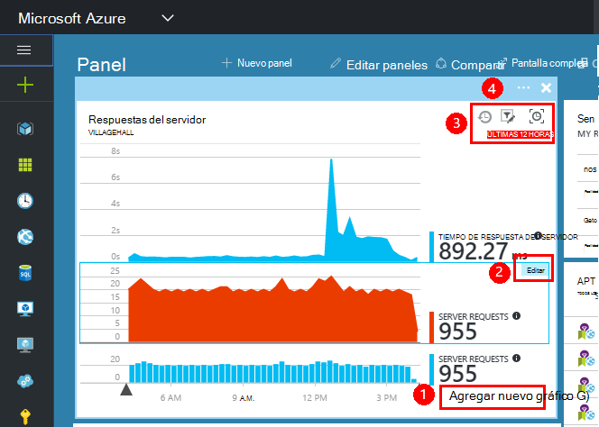

1. Agregar un gráfico a la ventana. 
2. Establecer la métrica, agrupar por dimensión y estilo (tabla, gráfico) de un gráfico.
3. Arrastre el puntero sobre el diagrama para acercar; Haga clic en el botón Deshacer para restablecer el intervalo de tiempo; establecer las propiedades de filtro de los gráficos en el mosaico.
4. Establecer el título de mosaico.

Mosaicos anclados desde aspas explorer métrica tienen más opciones de edición que mosaicos anclados desde un módulo de información general.

El mosaico original que se anclado no se ve afectado por los cambios que desee.

## Cambiar entre paneles

Puede guardar más de un panel y cambiar entre ellos. Si ancla un gráfico o un módulo, se agreguen al panel actual.

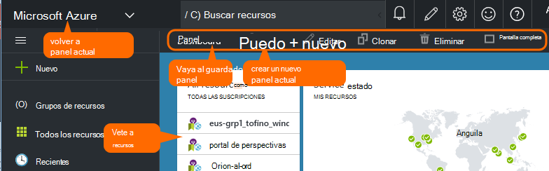

Por ejemplo, es posible que tenga un panel para mostrar pantalla completa en la sala de reuniones y otro para el desarrollo general.

En el panel, un módulo aparece como un mosaico: haga clic en él para ir a la hoja. Un gráfico aplica el gráfico en su ubicación original.

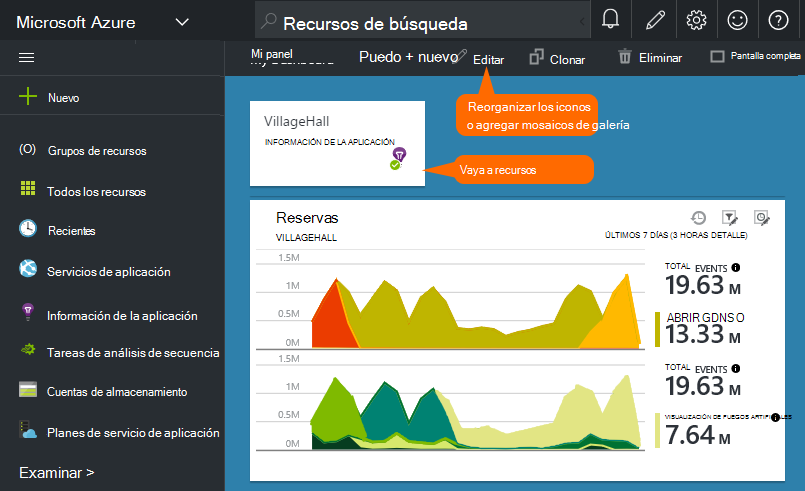

## Compartir paneles

Después de crear un panel, puede compartirlo con otros usuarios.

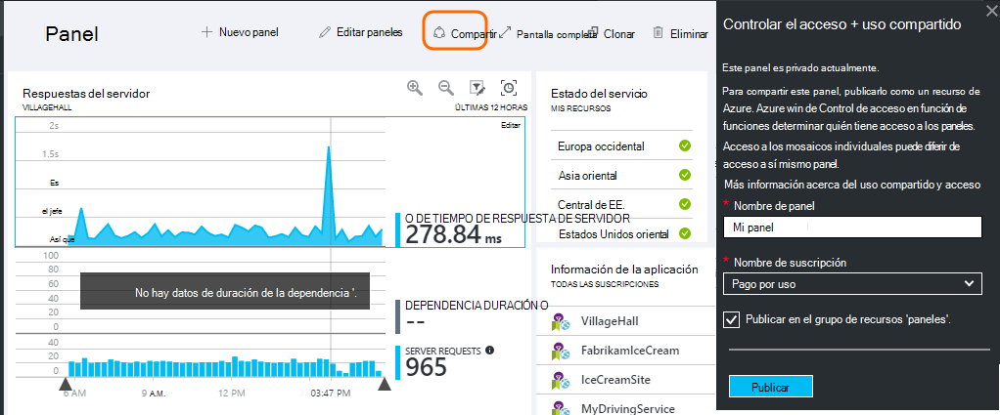

Obtenga información sobre [Roles y control de acceso](app-insights-resources-roles-access-control.md).

## Navegación de la aplicación

El módulo de información general es la puerta de enlace para obtener más información sobre la aplicación.

* **Cualquier gráfico o mosaico** - haga clic en cualquier gráfico para ver más detalles sobre lo que muestra o en mosaico.

### Botones de módulo de información general

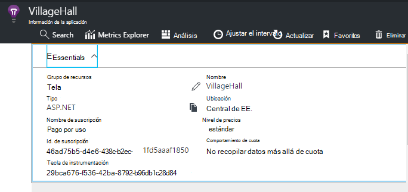

* [**Explorador de métricas**](app-insights-metrics-explorer.md) : crear gráficos de rendimiento y uso.
* [**Búsqueda**](app-insights-diagnostic-search.md) - investigar instancias específicas de eventos, como las solicitudes de excepciones, o seguimientos de registro.
* [**Análisis**](app-insights-analytics.md) - eficaces consultas sobre la telemetría.
* **Intervalo de tiempo** : ajustar el intervalo de muestra todos los gráficos en el módulo.
* **Eliminar** : eliminar el recurso de información de la aplicación para esta aplicación. Debe también quitar los paquetes de información de la aplicación desde el código de la aplicación, o modificar la [clave de instrumentación](app-insights-create-new-resource.md#copy-the-instrumentation-key) en la aplicación para dirigir telemetría a un recurso de aplicación perspectivas diferentes.

### Ficha Essentials

* [Tecla de instrumentación](app-insights-create-new-resource.md#copy-the-instrumentation-key) - identifica este recurso de aplicación. 
* Precios - que características BLOQ MAYÚS disponibles y ajustar el volumen.

### Barra de navegación de la aplicación

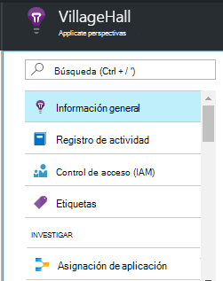

* **Información general** : volver a la hoja de información general de aplicación.
* **Registro de actividad** : alertas y eventos administrativos Azure.
* [**Control de acceso**](app-insights-resources-roles-access-control.md) - proporcionar acceso a los miembros del equipo y otros usuarios.
* [**Etiquetas**](../resource-group-using-tags.md) : usar etiquetas para la aplicación con otras personas del grupo.

INVESTIGAR

* [**Mapa de aplicación**](app-insights-app-map.md) : Active mapa que muestra los componentes de la aplicación, que se deriva de la información de dependencia.
* [**Diagnósticos proactivas**](app-insights-proactive-diagnostics.md) - alertas recientes de revisión de rendimiento.
* [**Secuencia en directo**](app-insights-metrics-explorer.md#live-stream) - A un conjunto fijo de métricas casi instantánea, resulta útiles al implementar una nueva compilación o depuración.
* [**Disponibilidad / Web pruebas**](app-insights-monitor-web-app-availability.md) -enviar solicitudes de normales a la aplicación web de alrededor de la world.* 
* [**Errores, rendimiento**](app-insights-web-monitor-performance.md) - excepciones, tasas de error y tiempos de respuesta para las solicitudes de la aplicación y para las solicitudes de [las dependencias](app-insights-asp-net-dependencies.md)de la aplicación.
* [**Rendimiento**](app-insights-web-monitor-performance.md) - tiempo de respuesta, tiempos de respuesta de dependencia. 
* [Servidores](app-insights-web-monitor-performance.md) : contadores de rendimiento. Disponible si [instalar el Monitor de estado](app-insights-monitor-performance-live-website-now.md).

* **Explorador** - vista de página y el rendimiento de AJAX. Disponible si [instrumentación sus páginas web](app-insights-javascript.md).
* Cuenta de **uso** - sesión, el usuario y la vista de página. Disponible si [instrumentación sus páginas web](app-insights-javascript.md).

CONFIGURAR

* **Introducción** : tutorial en línea.
* **Propiedades** : clave de instrumentación, suscripción e Id. de recurso.
* [Alertas](app-insights-alerts.md) - configuración de alerta métrica.
* [Exportar continuo](app-insights-export-telemetry.md) : configurar la exportación de telemetría para el almacenamiento de Azure.
* [Pruebas de rendimiento](app-insights-monitor-web-app-availability.md#performance-tests) - configurar una carga síntesis en su sitio Web.
* [Cuota de precios](app-insights-pricing.md) y [muestreo de recopilación](app-insights-sampling.md).
* **Acceso a API** - crear [suelte anotaciones](app-insights-annotations.md) y para la API de datos de Access.
* [**Elementos de trabajo**](app-insights-diagnostic-search.md#create-work-item) : conectar con un sistema de seguimiento para que pueda crear errores durante la inspección de telemetría de trabajo.

Configuración

* [**Bloquea**](..\resource-group-lock-resources.md) - bloquear los recursos de Azure
* [**Secuencia de comandos de automatización**](app-insights-powershell.md) : exportar una definición del recurso Azure de modo que puede usar como una plantilla para crear nuevos recursos.

SOPORTE TÉCNICO

* **Solicitud de soporte técnico** : se requiere una suscripción de pago. Vea también: [obtener ayuda](app-insights-get-dev-support.md).

## ¿Qué es el siguiente?

||
|---|---
|[Explorador de métricas](app-insights-metrics-explorer.md) Métrica de filtro y segmento|
|[Búsqueda de diagnóstico](app-insights-diagnostic-search.md) Buscar y examinar eventos, eventos relacionados y crear errores |
|[Análisis](app-insights-analytics.md) Lenguaje de consulta eficaces| 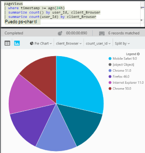

