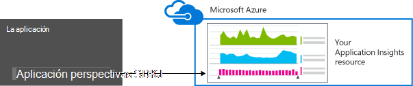
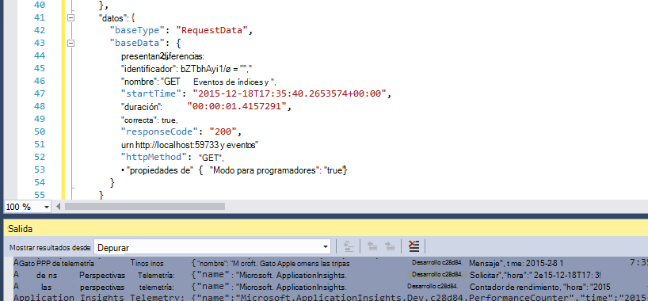
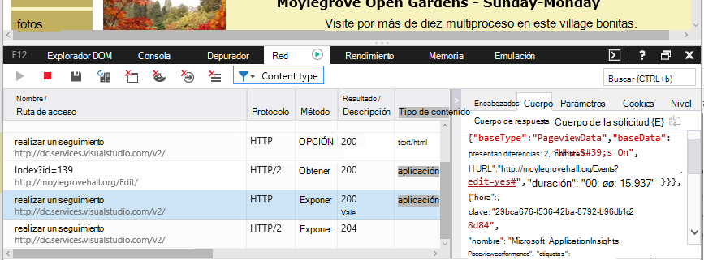

<properties 
    pageTitle="Retención de datos y el almacenamiento de información de la aplicación" 
    description="Declaración de directiva de retención y privacidad" 
    services="application-insights" 
    documentationCenter=""
    authors="alancameronwills" 
    manager="douge"/>

<tags 
    ms.service="application-insights" 
    ms.workload="tbd" 
    ms.tgt_pltfrm="ibiza" 
    ms.devlang="na" 
    ms.topic="article" 
    ms.date="05/17/2016" 
    ms.author="awills"/>

# Recopilación de datos, retención y almacenamiento de información de la aplicación 

*Información de la aplicación está en vista previa.*

Al instalar [Perspectivas de aplicación de Visual Studio] [ start] SDK en la aplicación, envía telemetría sobre la aplicación en la nube. Naturalmente, los desarrolladores responsables desean saber exactamente qué datos se envían, ¿qué ocurre con los datos y cómo puede mantenerse control del mismo. En particular, podrían se envíen datos confidenciales, ¿dónde se encuentra almacenado y cómo segura es? 

En primer lugar, la respuesta breve:

* Los módulos de telemetría estándar que se ejecutan "fuera de la casilla" están probable que envíe datos confidenciales al servicio. La telemetría se ocupa de carga, métricas de rendimiento y el uso, informes de excepción y otros datos de diagnóstico. Los datos de usuario principal visibles en los informes de diagnósticos son direcciones URL; pero la aplicación en cualquier caso no debe colocar los datos confidenciales en texto sin formato en una dirección URL.
* Puede escribir código que envía adicional telemetría personalizado para ayudarle con el uso de la supervisión y el diagnóstico. (Esta característica es una gran característica de aplicación perspectivas). Sería posible, por error, escribir este código para que incluya personales y otros datos confidenciales. Si la aplicación trabaja con estos datos, debe aplicar procesos de revisión fuerte a todo el código que escriba.
* Al desarrollar y probar la aplicación, es fácil inspeccionar qué se está enviando el SDK. Los datos aparecen en las ventanas de salida de depuración del IDE y explorador. 
* Los datos están guardados en servidores de [Microsoft Azure](http://azure.com) en Estados Unidos. (Pero puede ejecutar la aplicación en cualquier lugar). Azure tiene [seguridad sólida se procesa y cumpla una amplia gama de estándares de cumplimiento](https://azure.microsoft.com/support/trust-center/). Solo usted y su equipo designado tienen acceso a los datos. Personal de Microsoft puede tienen acceso restringido a él solo en determinadas circunstancias limitadas con sus conocimientos. Está cifrado en tránsito, aunque no en los servidores.

El resto de este artículo se describen más detalladamente en estas respuestas. Ha diseñado para ser independiente, para que se puede mostrar a los compañeros que no forman parte de su equipo de inmediato.

## ¿Qué es la información de la aplicación?

[Perspectivas de aplicación de Visual Studio] [ start] es un servicio de Microsoft que le ayuda a mejorar el rendimiento y el uso de la aplicación activa. Supervisa la aplicación todo el tiempo que se está ejecutando, durante las pruebas y después de que haya publicado o implementado. Aplicación perspectivas crea gráficos y tablas que muestran, por ejemplo, qué horas del día que recibe la mayoría de los usuarios, es la capacidad de respuesta de la aplicación y cómo sirve por los servicios externos que depende. Si hay bloqueos, errores o problemas de rendimiento, puede buscar por los datos de telemetría de detalle para diagnosticar la causa. Y el servicio le enviará correos electrónicos si hay cambios en la disponibilidad y el rendimiento de la aplicación.

Para obtener esta funcionalidad, instalar un SDK perspectivas de aplicación en la aplicación, que se convierte en parte de su código. Cuando se ejecuta la aplicación, el SDK supervisa su funcionamiento y envía telemetría para el servicio de información de la aplicación. Se trata de un servicio de nube hospedado por [Microsoft Azure](http://azure.com). (Pero perspectivas de aplicación funciona para todas las aplicaciones, no solo aquellos que se hospedan en Azure).

El servicio de aplicación perspectivas almacena y analiza la telemetría. Para ver el análisis o buscar a través de la telemetría almacenada, inicie sesión con su cuenta de Azure y abrir el recurso de información de la aplicación para la aplicación. También puede compartir el acceso a los datos con otros miembros del equipo o con los suscriptores de Azure especificados.

Puede hacer que los datos exportados desde el servicio de información de la aplicación, por ejemplo, a una base de datos o a herramientas externas. Proporcionar cada herramienta con una clave especial que se obtiene del servicio. Puede revocar la clave si es necesario. 

Aplicación perspectivas SDK están disponible para un intervalo de tipos de aplicación: hospedados en sus propios servidores J2EE o ASP.NET o en Azure; de servicios web clientes Web - es decir, el código se ejecuta en una página web. aplicaciones de escritorio y servicios. aplicaciones de dispositivo, como Windows Phone, iOS y Android. Todos ellos envían telemetría al mismo servicio.

## ¿Qué datos recopila?

### ¿Cómo son los datos se recopila?

Hay tres orígenes de datos:

* El SDK, que se integra con la aplicación [en desarrollo](app-insights-asp-net.md) o [en tiempo de ejecución](app-insights-monitor-performance-live-website-now.md). Existen diferentes SDK para diferentes tipos de aplicaciones. También hay un [SDK para páginas web](app-insights-javascript.md), que se carga en el explorador del usuario final junto con la página.

 * Cada SDK tiene un número de [módulos](app-insights-configuration-with-applicationinsights-config.md), que utilizar distintas técnicas para recopilar los diferentes tipos de telemetría.
 * Si instala el SDK de desarrollo, puede usar su API para enviar su propio telemetría, además de los módulos estándar. Este telemetría personalizado puede incluir los datos que desea enviar.
* En algunos servidores web, también hay agentes que se ejecutan junto con la aplicación y enviar telemetría acerca de CPU, memoria y pertenencia de red. Por ejemplo, [servidores de J2EE](app-insights-java-agent.md) , hosts Docker y máquinas virtuales de Azure pueden tener dichos agentes.
* [Pruebas de disponibilidad](app-insights-monitor-web-app-availability.md) son los procesos que ejecutan Microsoft que envíe solicitudes a su aplicación web a intervalos regulares. Los resultados se envían al servicio de información de la aplicación.

### ¿Qué tipo de datos se recopila?

Las categorías principales son:

* [Telemetría de servidor web](app-insights-asp-net.md) - solicitudes HTTP.  URI, el tiempo necesario para procesar la solicitud, el código de respuesta, la dirección IP del cliente. Identificador de la sesión.
* [Páginas Web](app-insights-javascript.md) - página, la cuenta de usuario y sesión. Tiempos de carga. Excepciones. Llamadas de AJAX.
* Rendimiento contadores - memoria, CPU, IO, pertenencia de red.
* Cliente y servidor contexto - OS, configuración regional, tipo de dispositivo, explorador, resolución de pantalla.
* [Excepciones](app-insights-asp-net-exceptions.md) y bloqueos - **pila vuelca**, crean id, tipo de CPU. 
* [Dependencias](app-insights-asp-net-dependencies.md) - llamadas a servicios externos como resto, SQL, AJAX. Cadena de conexión o URI, duración, éxito, comando.
* [Pruebas de disponibilidad](app-insights-monitor-web-app-availability.md) - duración de prueba y pasos, las respuestas.
* [Registros de seguimiento](app-insights-search-diagnostic-logs.md) y [telemetría personalizado](app-insights-api-custom-events-metrics.md) - **nada código en registros o telemetría**.

[Más detalles](#data-sent-by-application-insights).

## ¿Cómo puedo comprobar lo que se están recopilando?

Si desarrolla la aplicación con Visual Studio, ejecute la aplicación en modo de depuración (F5). La telemetría aparece en la ventana de resultados. Desde allí, puede copiarla y dele el formato JSON para inspección fácil. 

También hay una vista de lectura en la ventana de diagnóstico.

Para las páginas web, abra la ventana del explorador depuración.

### ¿Puedo escribir código para filtrar la telemetría antes de enviarla?

Esto sería posible escribiendo un [complemento de procesador de telemetría](app-insights-api-filtering-sampling.md).

## ¿Cuánto tiempo conserva los datos? 

Puntos de datos sin formato (es decir, los elementos que puede inspeccionar en búsqueda de diagnóstico) se conservan durante 7 días. Si necesita mantener más de los datos, puede usar [Exportar continua](app-insights-export-telemetry.md) para copiar a una cuenta de almacenamiento.

Datos agregados (es decir, recuentos, promedios y otros datos estadísticos que ve en el Explorador de métrica) se conservan al grano de 1 minuto durante 30 días, y 1 hora o 1 día (función tipo) al menos 90 días.

## ¿Quién puede tener acceso a los datos?

Los datos son visibles para usted y, si tiene una cuenta de la organización, los miembros del equipo. 

Puede exportarse por usted y los miembros del equipo y podría ser copiado a otras ubicaciones y pasan a otras personas.

#### ¿Qué hace Microsoft con la información de que mi aplicación se envía a la información de la aplicación?

Microsoft usa los datos solo para proporcionar el servicio a usted.

## ¿Donde se conservan los datos? 

* En Estados Unidos. 

#### ¿Puede que almacenarse en algún lugar en caso contrario, por ejemplo en Europa? 

* No en este momento. 

#### ¿Significa que mi aplicación tiene que estar hospedadas en Estados Unidos?

* No. Puede ejecutar la aplicación en cualquier lugar, en sus propio hosts local o en la nube.

## ¿Están seguros Mis datos?  

Información de la aplicación es un servicio de Azure en la vista previa. Mientras está en la vista previa que estamos trabajando para proteger los datos por las directivas que se describe en las [notas del producto Azure seguridad, privacidad y cumplimiento](http://go.microsoft.com/fwlink/?linkid=392408).

Los datos se almacenan en servidores de Microsoft Azure. Para las cuentas en el Portal de Azure, se describen las restricciones de cuenta en el [documento de Azure seguridad, privacidad y cumplimiento](http://go.microsoft.com/fwlink/?linkid=392408). Para las cuentas en el Portal de servicios de equipo de Visual Studio, se aplica el documento de [Visual Studio Team servicios de protección de los datos](http://download.microsoft.com/download/8/E/E/8EE6A61C-44C2-4F81-B870-A267F1DF978C/MicrosoftVisualStudioOnlineDataProtection.pdf) . 

Acceso a los datos por el personal de Microsoft está restringido. Tenemos acceso a los datos solo con los permisos y, si es necesario para admitir el uso de la información de la aplicación. 

Datos de agregado entre las aplicaciones de todos los clientes (como tipos de datos y el tamaño medio de trazas) se usan para mejorar la información de la aplicación.

#### ¿Podría telemetría de otra persona interferir con mis datos de la información de la aplicación?

Puede enviar telemetría adicional a su cuenta mediante la tecla instrumentación, que se encuentra en el código de las páginas web. Con suficiente datos adicionales, las métricas no correctamente representa rendimiento y el uso de la aplicación.

Si comparte código con otros proyectos, no olvide quitar la clave de instrumentación.

## ¿Se cifran los datos? 

No dentro de los servidores en este momento.

Todos los datos se cifran mientras se desplaza entre los centros de datos.

#### ¿Se cifran los datos en tránsito desde mi aplicación a los servidores de información de la aplicación?

Sí, usamos https para enviar los datos en el portal de casi todos los SDK, incluidos servidores web, dispositivos y páginas web HTTPS. La única excepción es que los datos enviados desde las páginas de web HTTP sin formato. 

## Información de identificación personal

#### ¿Información de identificación personal (PII) se pudo enviar información de la aplicación? 

Sí, es posible. 

Como las directrices generales:

* Telemetría más estándar (es decir, enviado sin que escribir código de telemetría) no incluye PII explícito. Sin embargo, es posible identificar a individuos por inferencia de una colección de eventos.
* Excepción y seguimiento de mensajes podrían contener PII
* Telemetría personalizado: es decir, llamadas como TrackEvent que escribir código utilizando la API o registro trazas - puede contener datos que elija.

La tabla al final de este documento contiene una descripción más detallada de los datos recopilados.

#### ¿Soy responsable de cumplir con las leyes y normativas respecto a PII?

Sí. Es su responsabilidad asegurarse de que la recopilación y uso de los datos cumple con las leyes y normativas y con los términos de Microsoft Online Services.

Debe informar a los clientes adecuadamente acerca de los datos de que la aplicación se recopila y cómo se usan los datos.

#### ¿Pueden desactivar Mis usuarios de perspectivas de aplicación?

No directamente. No se proporciona un modificador que los usuarios pueden funcionar para desactivar la información de la aplicación.

Sin embargo, puede implementar una de estas características en la aplicación. Todos los SDK incluyen un valor de la API que desactiva la colección de telemetría. 

#### Mi aplicación involuntariamente recopila información confidencial. ¿Puede anular aplicación perspectivas estos datos para que no se conserva?

Perspectivas de aplicación no filtrar ni eliminar los datos. Debe administrar los datos correctamente y evitar enviar dichos datos a información de la aplicación.

## Datos enviados por aplicación perspectivas

Los SDK varían entre plataformas y hay varios componentes que puede instalar. (Consulte [Introducción perspectivas de aplicación -][start].) Cada componente envía datos diferentes.

#### Clases de los datos enviados en escenarios diferentes

La acción  | Clases de datos recopilan (consulte la tabla siguiente)
---|---
[Agregar aplicación perspectivas SDK a un proyecto de web.][greenbrown] | Contexto de servidor Deduce Contadores de rendimiento Solicitudes **Excepciones** Sesión usuarios
[Instalar el Monitor de estado en IIS][redfield]|Dependencias Contexto de servidor Deduce Contadores de rendimiento
[Agregar aplicación perspectivas SDK a una aplicación web de Java][java]|Contexto de servidor Deduce Solicitar Sesión usuarios
[Agregar JavaScript SDK a página web][client]|ClientContext  Deduce Página ClientPerf AJAX
[Definir propiedades predeterminadas][apiproperties]|**Propiedades** de todos los eventos estándar y personalizados
[Llamada TrackMetric][api]|Valores numéricos **Propiedades**
[Control de llamada *][api]|Nombre del evento **Propiedades**
[Llamada TrackException][api]|**Excepciones** Muestra de pilas **Propiedades**
SDK no puede recopilar datos. Por ejemplo:   -no puede tener acceso a contadores de rendimiento  -excepción en inicializador de telemetría | Diagnósticos SDK
 

Para [SDK para otras plataformas][platforms], ver sus documentos.

#### Las clases de los datos recopilados

Clase de los datos recopilados | Incluye (no una lista completa) 
---|---
**Propiedades**|**Datos - determinados por su código**
DeviceContext |Id., IP, configuración regional, modelo del dispositivo, red, tipo de red, nombre de OEM, resolución de pantalla, instancia de rol, nombre de función, tipo de dispositivo
ClientContext |Sistema operativo, la configuración regional, idioma, red, resolución de la ventana
Sesión | Id. de sesión
Contexto de servidor |Nombre del equipo, la configuración regional, OS, dispositivo, sesión de usuario, contexto de usuario, operación 
Deduce |ubicación geográfica desde dirección IP, marca de tiempo, sistema operativo, explorador
Métricas | Valor y nombre métrica
Eventos | Valor y nombre de evento
Vistas de página para | Nombre de la página y la dirección URL o pantalla
Rendimiento del cliente | Nombre de URL de página, el tiempo de carga del explorador
AJAX | Llamadas HTTP desde una página web al servidor
Solicitudes |Dirección URL, duración, código de respuesta
Dependencias|Tipo (SQL, HTTP,...), la cadena de conexión o URI sincronización/asincrónico, duración, éxito, instrucción SQL (con el Monitor de estado)
**Excepciones** | Tipo, **mensaje**, pilas de llamadas, número de línea y los archivos de origen, el identificador de subproceso
Se bloquea | Id de proceso, id de proceso primario, identificador de subproceso de bloqueo; revisión de aplicación, id, generar;  tipo de excepción, dirección, motivo; símbolos confusas registros, las direcciones de inicio y finalización binarias, binaria nombre y ruta de acceso, tipo de cpu
Seguimiento | Nivel de **mensaje** y gravedad
Contadores de rendimiento | Tiempo de procesador, memoria disponible, tasa de solicitud, tasa de excepciones, bytes privados de proceso, tasa IO, duración de solicitud solicitar longitud de cola
Disponibilidad | Código de respuesta de prueba de Web, la duración de cada paso de prueba, nombre de la prueba, marca de tiempo, éxito, tiempo de respuesta, ubicación de prueba
Diagnósticos SDK | Mensaje de seguimiento o excepción 

Puede [desactivar algunos de los datos por ApplicationInsights.config edición][config]

## Créditos

Este producto incluye datos GeoLite2 creados por MaxMind, disponible en [http://www.maxmind.com](http://www.maxmind.com).

## Vídeos

#### Introducción

> [AZURE.VIDEO application-insights-introduction]

#### Empezar a trabajar

> [AZURE.VIDEO getting-started-with-application-insights]

<!--Link references-->

[api]: app-insights-api-custom-events-metrics.md
[apiproperties]: app-insights-api-custom-events-metrics.md#properties
[client]: app-insights-javascript.md
[config]: app-insights-configuration-with-applicationinsights-config.md
[greenbrown]: app-insights-asp-net.md
[java]: app-insights-java-get-started.md
[platforms]: app-insights-platforms.md
[pricing]: http://azure.microsoft.com/pricing/details/application-insights/
[redfield]: app-insights-monitor-performance-live-website-now.md
[start]: app-insights-overview.md

 