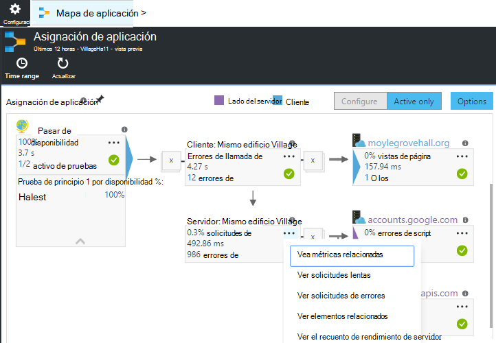
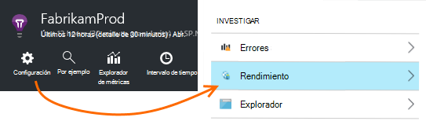
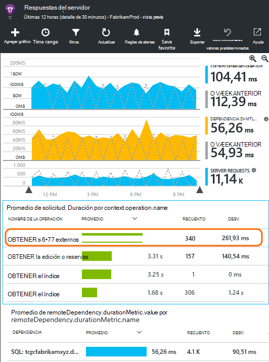
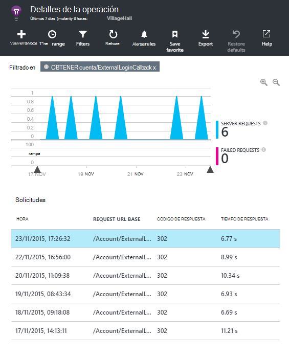
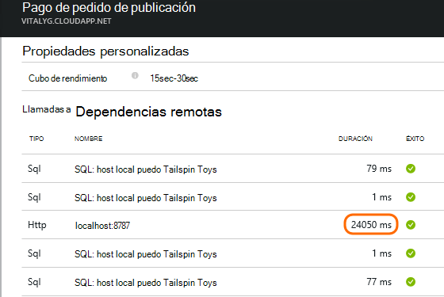
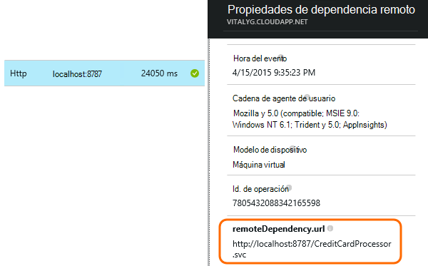
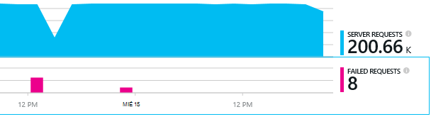
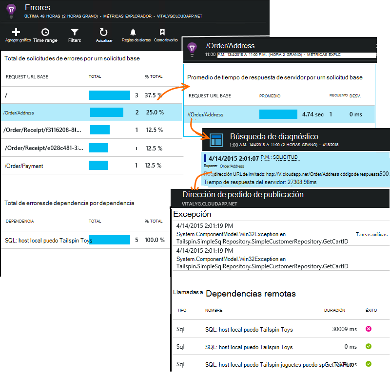

<properties 
    pageTitle="Diagnosticar problemas con las dependencias en perspectivas de aplicación" 
    description="Buscar errores y rendimiento lento causados por las dependencias" 
    services="application-insights" 
    documentationCenter=""
    authors="alancameronwills" 
    manager="douge"/>

<tags 
    ms.service="application-insights" 
    ms.workload="tbd" 
    ms.tgt_pltfrm="ibiza" 
    ms.devlang="na" 
    ms.topic="article" 
    ms.date="05/12/2016" 
    ms.author="awills"/>
 
# <a name="diagnosing-issues-with-dependencies-in-application-insights"></a>Diagnosticar problemas con las dependencias en perspectivas de aplicación


Una *dependencia* es un componente externo que llama a la aplicación. Normalmente es un servicio denominado utilizando HTTP, o una base de datos o un sistema de archivos. O bien, en la secuencia de comandos de la página web, puede ser una llamada de AJAX al servidor. En perspectivas de aplicación de Visual Studio, puede ver fácilmente espera su aplicación dependencias y con qué frecuencia se produce un error en una llamada de dependencia.

## <a name="where-you-can-use-it"></a>¿Dónde se puede utilizar

Cerrar el cuadro de la supervisión de dependencia está disponible actualmente para:

* Aplicaciones web ASP.NET y los servicios que se ejecutan en un servidor IIS o en Azure
* [Aplicaciones web de Java](app-insights-java-agent.md)
* [Páginas Web](https://azure.microsoft.com/blog/ajax-collection-in-application-insights/)

Para otros tipos, como aplicaciones de dispositivo, puede escribir a su propio monitor con la [API de TrackDependency](app-insights-api-custom-events-metrics.md#track-dependency).

Actualmente, el monitor de dependencia del cuadro informes llamadas a estos tipos de dependencias:

* ASP.NET
 * Bases de datos SQL
 * Web ASP.NET y los servicios WCF que usan enlaces de HTTP
 * Llamadas HTTP locales o remotas
 * Azure DocumentDb, tabla, almacenamiento de blobs y cola
* Java
 * Llamadas a una base de datos a través de un controlador [JDBC](http://docs.oracle.com/javase/7/docs/technotes/guides/jdbc/) , como MySQL, SQL Server, PostgreSQL o SQLite.
* Páginas Web
 * [Llamadas de AJAX](app-insights-javascript.md)

De nuevo, puede escribir sus propias llamadas SDK para supervisar otras dependencias.

## <a name="to-set-up-dependency-monitoring"></a>Para configurar la supervisión de dependencia

Instale al agente adecuado para el servidor de host.

Plataforma | Instalar
---|---
Servidor IIS | [Instalar el Monitor de estado en el servidor](app-insights-monitor-performance-live-website-now.md) o [actualizar una aplicación de .NET framework 4.6 o posterior](http://go.microsoft.com/fwlink/?LinkId=528259) e instalar el [SDK de perspectivas de aplicación](app-insights-asp-net.md) en la aplicación.
Aplicación Web de Azure | [Extensión de perspectivas de aplicación](app-insights-azure-web-apps.md)
Servidor web de Java | [Aplicaciones web de Java](app-insights-java-agent.md)
Páginas Web | [Monitor de JavaScript](app-insights-javascript.md) (Ninguna configuración adicional supervisión de página web)
Servicio de nube de Azure |  [Tarea de inicio de uso](app-insights-cloudservices.md#dependencies) o [instalar .NET framework 4.6 +](../cloud-services/cloud-services-dotnet-install-dotnet.md)  

El Monitor de estado para los servidores IIS no tendrá que volver a crear el proyecto de origen con el SDK de perspectivas de aplicación. 

## <a name="application-map"></a>Asignación de aplicación

Mapa de aplicación actúa como ayuda visual para descubrir dependencias entre los componentes de la aplicación. 



En los cuadros, puede ir a dependencia pertinente y otros gráficos.

Haga clic en la pequeña [x] para contraer un subárbol.

Anclar el mapa a [paneles](app-insights-dashboards.md), donde será totalmente funcional.

[Más información](app-insights-app-map.md).

## <a name="diagnosis"></a>Diagnosticar problemas de rendimiento de dependencia en el servidor web

Para evaluar el rendimiento de las solicitudes de su servidor:



Desplácese hacia abajo para buscar en la cuadrícula de solicitudes:



El elemento superior se tarda mucho tiempo. Vamos a ver si nos podemos averiguar el tiempo empleado.

Haga clic en esa fila para ver los eventos de solicitud individual:




Haga clic en cualquier instancia de ejecución larga para asegurarse de que aún más.

> [AZURE.NOTE] Desplácese hacia abajo un poco para elegir una instancia. Latencia de la canalización podría significar que los datos de las instancias superiores están incompletos.

Desplácese hacia abajo para las llamadas de dependencia remoto relacionada con esta petición:



Parece que la mayoría del tiempo para atender que esta solicitud se ha invertido en una llamada a un servicio local. 

Seleccione esa fila para obtener más información:




El detalle incluye suficiente información para diagnosticar el problema.


## <a name="failures"></a>Errores

Si hay errores en las peticiones, haga clic en el gráfico.



Haga clic en un tipo de solicitud y la instancia de solicitud para buscar un error de la llamada a una dependencia remota.





## <a name="custom-dependency-tracking"></a>Seguimiento de dependencia personalizada

El módulo de seguimiento de dependencia estándar descubre automáticamente las dependencias externas, como bases de datos y las API de REST. Pero que podría querer algunos componentes adicionales para tratar de la misma manera. 

Puede escribir código que envía información de dependencia, con la misma [API TrackDependency](app-insights-api-custom-events-metrics.md#track-dependency) usado por los módulos estándar.

Por ejemplo, si genera el código con un ensamblado que no haya escrito usted mismo, podría tiempo todas las llamadas a ella, para averiguar qué contribución los tiempos de respuesta. Para que estos datos que se muestra en los gráficos de dependencia en perspectivas de aplicación, envíelo con `TrackDependency`.

```C#

            var success = false;
            var startTime = DateTime.UtcNow;
            var timer = System.Diagnostics.Stopwatch.StartNew();
            try
            {
                success = dependency.Call();
            }
            finally
            {
                timer.Stop();
                telemetry.TrackDependency("myDependency", "myCall", startTime, timer.Elapsed, success);
            }
```

Si desea desactivar el módulo de seguimiento de dependencia estándar, quite la referencia a DependencyTrackingTelemetryModule en [ApplicationInsights.config](app-insights-configuration-with-applicationinsights-config.md).


## <a name="ajax"></a>AJAX

Ver [páginas Web](app-insights-javascript.md).


 