<properties
    pageTitle="Detectar, clasificar, diagnosticar"
    description="Analizar bloqueos y diagnosticar problemas de rendimiento en las aplicaciones"
    authors="alancameronwills"
    services="application-insights"
    documentationCenter=""
    manager="douge"/>

<tags
    ms.service="application-insights"
    ms.workload="tbd"
    ms.tgt_pltfrm="ibiza"
    ms.devlang="na"
    ms.topic="article" 
    ms.date="11/06/2015"
    ms.author="awills"/>

# Detectar, clasifique y diagnosticar con recomendaciones de aplicación

*Información de la aplicación está en vista previa.*

Aplicación de Ayuda de perspectivas Descubra cómo está realizando la aplicación y que se usa cuando está activa. Y si hay un problema, le permite conocer, ayuda a evaluar el impacto y le ayudan a determinar la causa.

Esto es una cuenta desde un equipo que desarrolla aplicaciones web:

* *"Un par de días, hemos implementado una revisión 'secundaria'. No ejecutar un paso de prueba amplia, pero desafortunadamente obtuvieron combinar algunos cambios inesperados en la carga, causando incompatibilidad entre la parte frontal y back-end. Inmediatamente, excepciones de servidor aumentaron, nuestro alerta activa y, a continuación, se nos conscientes de la situación. Unos pocos clics ausente en el portal de aplicación perspectivas, tenemos suficiente información de excepción pilas de llamadas para restringir el problema. Se deshace inmediatamente y había limitada el daño. Aplicación perspectivas realizó esta parte de la devops ciclo muy fácil y útiles."*

Vamos a ver cómo un equipo de desarrollo de web típica utiliza información de la aplicación para supervisar el rendimiento. Seguiremos el equipo de banco de Fabrikam que desarrolla sistema bancario online (OBS).

El equipo funciona en un ciclo similar a esta:

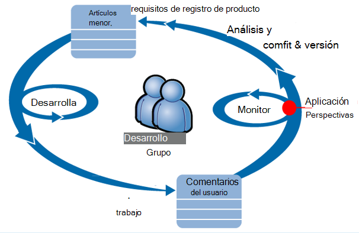

Requisitos de fuente a su trabajo pendiente de desarrollo (lista de tareas). En resumen funcionan sprints, que a menudo ofrecen software de trabajo: normalmente en el formulario de mejoras y extensiones de la aplicación existente. La aplicación directo se actualiza con frecuencia con las nuevas características. Mientras está activa, en el equipo se supervisa para rendimiento y el uso con la Ayuda de la información de la aplicación. Este análisis fuentes en su trabajo pendiente de desarrollo.

El equipo usa perspectivas de aplicación para supervisar la aplicación web live estrechamente para:
* Rendimiento. Desean comprender cómo tiempos de respuesta varían en función de la cuenta de la solicitud; ¿cuánto se utilizan CPU, red, disco y otros recursos; y donde la botella.
* Errores. Si hay excepciones o no las convocatorias, o si un contador de rendimiento queda fuera de su intervalo cómodo, el equipo debe saber rápidamente para que puede realizar la acción.
* Uso. Siempre que se publique una nueva característica, el equipo desee saber en qué medida se utiliza y si los usuarios tienen dificultades con él.

Nos centraremos en la parte de comentarios del ciclo:

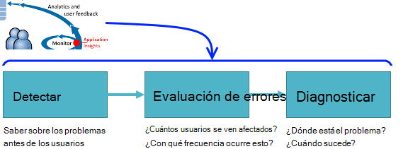

## Detectar disponibilidad deficiente

Marcela Markova es un desarrollador senior en el equipo de OBS y toma el responsable de supervisar el rendimiento en línea. Configura varias [pruebas web][availability]:

* Una prueba de dirección URL de un solo para la página de inicio principal de la aplicación, http://fabrikambank.com/onlinebanking/. Establece criterios de código HTTP 200 y texto 'Bienvenido'. Si se produce un error en esta prueba, hay algo no funciona bien con la red o los servidores o tal vez un problema de implementación. (O alguien ha cambiado la bienvenida! mensaje de la página sin dejar que su sabe).

* Una prueba de varios pasos más profunda, que inicia sesión en y obtiene una cuenta actual listado, proteger algunos detalles claves en cada página. Esta prueba comprueba que el vínculo a la base de datos de cuentas está funcionando. Utiliza un id de cliente ficticio: algunas de ellas se mantienen fines de prueba.

Con estas pruebas configurar, Marcela está seguro de que el equipo se conoce rápidamente cualquier interrupción.  

Errores se muestran como puntos rojos en el gráfico de prueba de web:

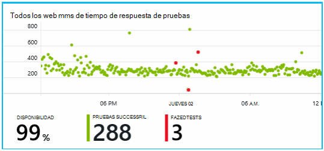

Pero lo más importante, le enviará una alerta acerca de cualquier error al equipo de desarrollo. De esa manera, conoce antes de casi todos los clientes.

## Indicadores de rendimiento del Monitor

En la página Descripción general en información de la aplicación, hay un gráfico que muestra una gran variedad de [métricas][perf].

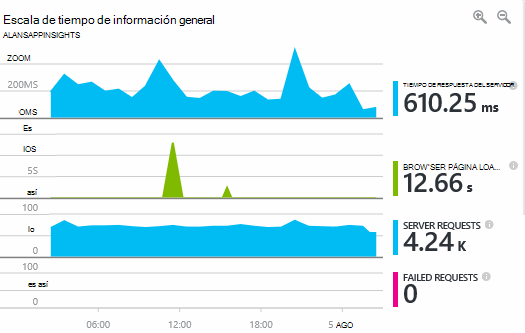

Tiempo de carga de página de explorador se deriva de telemetría enviado directamente desde las páginas web. Tiempo de respuesta del servidor, el número de solicitud de servidor y el recuento de solicitudes con error son todos medidas en el servidor web y se envían a perspectivas de la aplicación desde allí.

Marcela está ligeramente relacionado con en el gráfico de respuesta del servidor, que muestra el tiempo medio entre cuando el servidor recibe una solicitud HTTP desde el Explorador de un usuario y devuelve la respuesta. No es inusual ver una variación en este gráfico, como varía de carga en el sistema. Pero, en este caso, parece haber que una correlación entre pequeña aumenta en el recuento de las solicitudes y grande aumenta el tiempo de respuesta. Que podría indicar que el sistema funciona a sus límites. 

Abre los gráficos de servidores:

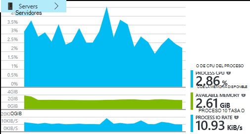

Parece que ningún signo de limitación de recursos, quizá que la resaltes en los gráficos de respuesta del servidor son solo una coincidencia.

## Alertas

No obstante, le gustaría vigile los tiempos de respuesta. Si se desplazan demasiado altos, desea conocer inmediatamente.

Por lo que se establece un [alertas][metrics], para mayor que un umbral típico los tiempos de respuesta. Esto le da su confianza que saber acerca de él si los tiempos de respuesta están lentos.

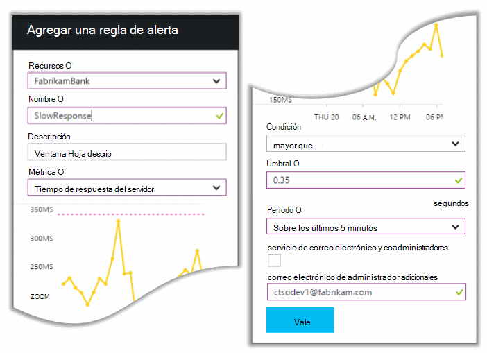

Las alertas se pueden configurar en una amplia variedad de otras métricas. Por ejemplo, puede recibir mensajes de correo electrónico si el recuento de excepción se convierte en alto, o si la memoria disponible se baja, o si hay un máximo de solicitudes de cliente.

## Alertas de diagnósticos proactivas

Día siguiente, llegan a un correo electrónico de alerta de información de la aplicación. Pero cuando se abre, busca no la alerta de tiempo de respuesta que ha configurado. En su lugar, le ha habido un aumento en error solicitudes - es decir, que han devuelto los códigos de error de 500 o más rápido.

Las solicitudes erróneas son donde los usuarios han visto un error - normalmente siguiendo una excepción en el código. Es posible vean un mensaje que indica "Lo sentimos nos hemos podido actualizar sus datos ahora mismo" o, en absoluto embarazosos peor, una muestra de pilas en la pantalla del usuario, cortesía el servidor web.

Esta alerta es una sorpresa, debido a la última vez que miró, el recuento de errores de solicitud encouragingly bajo. Un pequeño número de fracasos es normal en un servidor ocupado. 

También era un poco una sorpresa para ella debido a no tiene que configurar esta alerta. De hecho, diagnósticos proactiva incluye automáticamente información de la aplicación. Automáticamente se ajusta a su aplicación trama de error habitual y "se usa para" errores en una página determinada, o carga es alta o vinculado a otras métricas. Provoca la alarma sólo si hay un aumento sobre lo que se trata de espera.

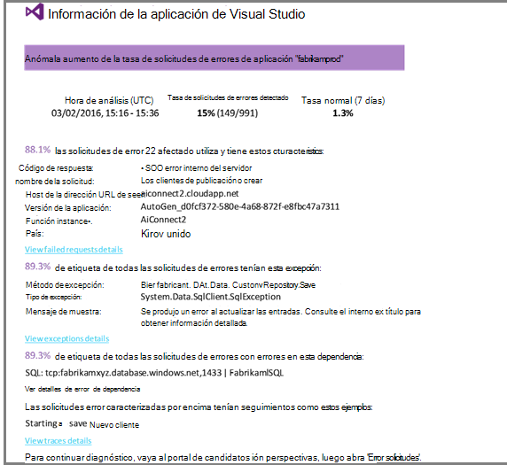

Se trata de un correo electrónico muy útil. Solo no generar una alarma; realiza una gran cantidad de la evaluación de errores y el trabajo de diagnóstico, demasiado.

Muestra cuántos clientes se ven afectados y qué páginas web o las operaciones. Marcela puede decidir si necesita obtener trabajando en ello como un ejercicio de fire todo el equipo, o si puede omitirlo hasta la próxima semana.

El correo electrónico también muestra que una excepción determinada se produjo y - aún más interesante - que el error está asociado con el error llamadas a una base de datos determinado. Esto explica por qué el error aparecía repente aunque el equipo de Marcela ha implementado recientemente los todas las actualizaciones. 

Hace ping en el coordinador del equipo de base de datos. Sí, publicó una revisión en la última hora medio; y vaya, es posible que se haya producido un cambio de esquema secundarias...

Así que el problema está en el camino fijo, incluso antes de investigación de registros y 15 minutos de lo que surgen. Sin embargo, Marcela hace clic en el vínculo para abrir la aplicación perspectivas. Se abre directamente en una solicitud de error y podrá ver la base de datos error de llamadas en la lista de llamadas de dependencia asociada. 

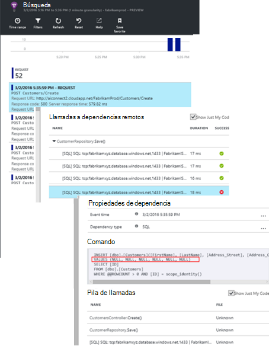

## Detectar excepciones

Con un poco de la instalación, [excepciones](app-insights-asp-net-exceptions.md) se informa de aplicación impresiones automáticamente. También se pueden capturar explícitamente insertando llamadas a [TrackException()](app-insights-api-custom-events-metrics.md#track-exception) en el código:  

    var telemetry = new TelemetryClient();
    ...
    try
    { ...
    }
    catch (Exception ex)
    {
       // Set up some properties:
       var properties = new Dictionary <string, string>
         {{"Game", currentGame.Name}};

       var measurements = new Dictionary <string, double>
         {{"Users", currentGame.Users.Count}};

       // Send the exception telemetry:
       telemetry.TrackException(ex, properties, measurements);
    }

El equipo de Fabrikam banco ha desarrollado a partir de la práctica de enviar siempre telemetría en una excepción a menos que haya una recuperación obvia.  

De hecho, es aún más amplia que su estrategia: envían telemetría en todos los casos donde está frustrado en lo deseaban hacer, si corresponde a una excepción en el código o no el cliente. Por ejemplo, si el sistema de transferencia de banco entre externa devuelve un mensaje "no se puede completar esta operación" por algún motivo operativa (sin errores de cliente) seguimiento ese evento.

    var successCode = AttemptTransfer(transferAmount, ...);
    if (successCode < 0)
    {
       var properties = new Dictionary <string, string>
            {{ "Code", returnCode, ... }};
       var measurements = new Dictionary <string, double>
         {{"Value", transferAmount}};
       telemetry.TrackEvent("transfer failed", properties, measurements);
    }

TrackException se usa para informar excepciones porque envía una copia de la pila. TrackEvent se usa para informar de otros eventos. Puede vincular las propiedades que podrían ser útiles de diagnóstico.

Excepciones y eventos se muestran en la [Búsqueda de diagnóstico] [ diagnostic] módulo. Puede profundizar en ellos para ver las propiedades adicionales y seguimiento de la pila.

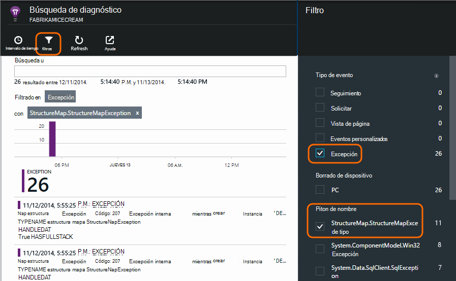

## Supervisar la actividad de usuario

Cuando el tiempo de respuesta es buena y existen algunas excepciones, el equipo de desarrollo puede pensar cómo mejorar la experiencia de los usuarios y cómo aliente a los usuarios más para lograr los objetivos que desee.

Por ejemplo, un viaje de usuario típico a través del sitio web tiene un embudo' Borrar': muchos clientes mirar las tasas de distintos tipos de préstamo; algunos de ellos rellenan el formulario de presupuesto; y de las personas que obtener un presupuesto, algunos continuar y saque el préstamo.

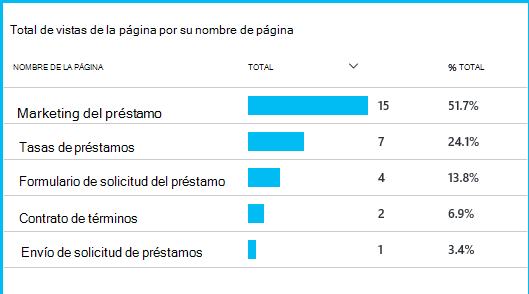

Considerando donde abandona los números mayores de clientes, la empresa puede trabajar sobre cómo obtener más usuarios a través de a la parte inferior del embudo. En algunos casos puede ser un error de (UX) de la experiencia del usuario: por ejemplo, es difícil de encontrar el botón "siguiente" o las instrucciones no son obvias. Más probable es que existen más significativa empresarial motivos para incompletas: ¿los tipos de préstamo son demasiado altos.

Independientemente de los motivos, los datos ayudan al equipo averiguar qué hacen los usuarios. Pueden insertar más de seguimiento de llamadas para trabajar más detalles. TrackEvent() se puede utilizar para contar las acciones de usuario, desde con detalle de clics individuales a significativas logros como saldar un préstamo.

El equipo de introducción se usa para disponer de información sobre la actividad de usuario. En la actualidad, cada vez que una nueva característica de diseño, trabajan fuera cómo van a obtener comentarios sobre su uso. Diseñar las llamadas de seguimiento en la característica desde el principio. Utilizan los comentarios para mejorar la característica en cada ciclo de desarrollo.

## Supervisión proactiva  

Marcela simplemente no sentarse esperando alertas. Justo después de cada redistribución toma un vistazo a [los tiempos de respuesta] [ perf] -la ilustración general y la tabla de solicitudes de más lentas, así como recuentos de excepción.  

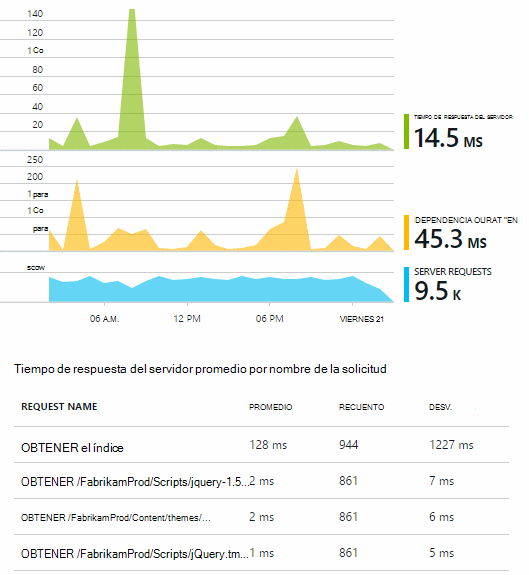

Puede evaluar el efecto de rendimiento de cada implementación, normalmente comparar cada semana con el último. Si hay un aumento rápida, genera con los desarrolladores relevantes.

## Evaluación de errores

Evaluación: evaluar la gravedad y el alcance de un problema: es el primer paso después de la detección. ¿Debemos llamamos fuera del equipo a medianoche? ¿O bien, puede dejarse hasta la siguiente separación adecuada en el trabajo pendiente? Existen algunas preguntas clave en la clasificación.

¿Cuánto está sucediendo? Los gráficos en el módulo de introducción a dan algunos perspectiva a un problema. Por ejemplo, la aplicación de Fabrikam genera cuatro alertas de prueba de web una noche. En el gráfico por la mañana, el equipo podría ver que había hecho algunos puntos rojos, aunque todavía la mayoría de las pruebas estaban verde. Explorar en profundidad una el gráfico de disponibilidad, era evidente que todos estos problemas intermitentes eran desde la ubicación de una prueba. Esto evidentes era un problema de red que afectan a solo una ruta y más probable es que desactive propiamente dicho.  

Por el contrario, un aumento espectacular y estable en el gráfico de los tiempos de respuesta o recuentos de excepción evidentes es algo que se preocupe acerca de.

Un procedimiento de clasificación útil consiste intente, usted mismo. Si se ejecuta en el mismo problema, sabrá es real.

¿Qué parte de los usuarios se ven afectados? Para obtener una respuesta aproximada, divida la tasa de errores por el recuento de sesión.

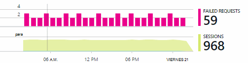

En el caso de respuesta lenta, compare la tabla de más lento responder solicitudes con la frecuencia de uso de cada página.

¿Cómo importante es el escenario bloqueado? ¿Si se trata de un problema funcional bloqueo de un caso de usuario particular, importa mucho? Si los clientes no pueden pagar sus facturas, es grave; Si no pueden modificar sus preferencias de color de la pantalla, ¿puede esperar. Los detalles del evento o excepción o la identidad de la página lenta, le indica que tiene problemas para los clientes.

## Diagnóstico

Diagnóstico no es exactamente lo mismo que depuración. Antes de comenzar el seguimiento a través del código, debería tener una idea general sobre por qué, cuándo y dónde se produce el problema.

**¿Cuándo sucede?** La vista del historial proporcionada por los gráficos de evento y métrica facilita la correlación efectos con posibles causas. Si hay picos intermitentes en tasas de tiempo o una excepción de respuesta, mire el recuento de solicitud: si picos al mismo tiempo, se parece a un problema de recursos. ¿Necesita asignar más memoria o la CPU? ¿O es una dependencia que no puede administrar la carga?

**¿Es nosotros?**  Si tiene una colocación rápida en el rendimiento de un determinado tipo de solicitud: por ejemplo el cliente quiere un extracto de cuenta - hay una posibilidad puede ser un subsistema externo en lugar de la aplicación web. En el Explorador de métricas, seleccione la frecuencia de errores de dependencia y tasas de duración de dependencia y comparar sus historiales sobre el pasado algunas horas o días con el problema que detectado. Si se correlación de cambios, podría ser un subsistema externo culpable.  

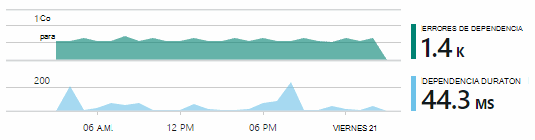

Algunos problemas de dependencia lenta son problemas de ubicación geográfica. Banco de Fabrikam usa máquinas virtuales de Windows Azure y descubre que tenían accidentalmente encuentra su servidor web y el servidor de la cuenta en países diferentes. Se dio lugar a una mejora espectacular migración de uno de ellos.

**¿Qué hacer?** Si el problema no aparece en una dependencia y si siempre es, probablemente causado por un cambio reciente. La perspectiva histórica proporcionada por los gráficos métrica y eventos facilita la correlación los cambios imprevistos con implementaciones. Que limita la búsqueda para el problema.

**¿Qué pasa?** Algunos problemas no sólo suelen producen y pueden ser difíciles rastrear probando sin conexión. Todo lo que podemos hacer es que puede probar capturar el error cuando se produce live. Puede inspeccionar volcados de pila en los informes de excepción. Además, puede escribir llamadas de seguimiento, con el marco de registro favorito o con TrackTrace() o TrackEvent().  

Fabrikam tenía un problema intermitente con transferencias entre cuentas, pero solo con determinados tipos de cuenta. Para entender mejor lo que estaba ocurriendo, insertan llamadas TrackTrace() en los puntos clave en el código, asociar el tipo de cuenta como una propiedad para cada llamada. Que facilitó filtrar los seguimientos en búsqueda de diagnóstico. También adjuntan valores de parámetro como propiedades y las medidas para las llamadas de seguimiento.

## Qué hacer con ella

Una vez haya diagnosticar el problema, puede hacer que un plan para repararlo. Es posible que necesite deshacer un cambio reciente, o tal vez simplemente, puede continuar y repararlo. Una vez realizada la revisión, información de la aplicación le indicará si realizó correctamente.  

Equipo de desarrollo del banco Fabrikam llevar un enfoque más estructurado para medir el rendimiento de los anteriores antes de que se ha usado perspectivas de aplicación.

* Establecer objetivos de rendimiento en términos de medidas específicas en la página de información general de la información de la aplicación.

* Diseñar las medidas de rendimiento en la aplicación desde el principio, como las medidas que miden el progreso de usuario a través de 'Embudos'.  

## Uso

Información de la aplicación también puede utilizarse para obtener información sobre qué hacer los usuarios con una aplicación. Una vez que se ejecuta sin problemas, el equipo le gustaría saber qué características son las más populares, qué gusta usuarios y tienen problemas con y con qué frecuencia que vuelva. Que le ayudará a ellos priorizar su trabajo próxima. Y puede planear medir el éxito de cada característica como parte del ciclo de desarrollo. [Leer más][usage].

## Las aplicaciones

Así es cómo una utilice perspectivas de aplicación no solo para corregir problemas individuales, pero para mejorar su ciclo de vida del desarrollo en equipo. Espero que le ha proporcionado algunas ideas sobre cómo puede ayudarle a mejorar el rendimiento de sus propias aplicaciones la información de la aplicación.

## Vídeo

[AZURE.VIDEO performance-monitoring-application-insights]

<!--Link references-->

[api]: app-insights-api-custom-events-metrics.md
[availability]: app-insights-monitor-web-app-availability.md
[diagnostic]: app-insights-diagnostic-search.md
[metrics]: app-insights-metrics-explorer.md
[perf]: app-insights-web-monitor-performance.md
[usage]: app-insights-web-track-usage.md
 
