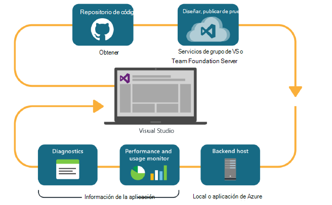
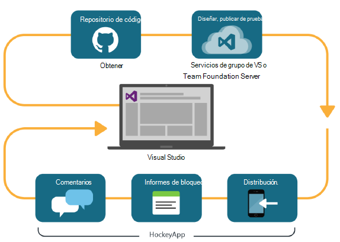

<properties
    pageTitle="Análisis de desarrollador"
    description="DevOps con Visual Studio, información de la aplicación y HockeyApp"
    authors="alancameronwills"
    services="application-insights"
    documentationCenter=""
    manager="douge"/>

<tags
    ms.service="application-insights"
    ms.workload="tbd"
    ms.tgt_pltfrm="ibiza"
    ms.devlang="na"
    ms.topic="article" 
    ms.date="05/18/2016"
    ms.author="awills"/>

# Análisis de desarrollador con información de la aplicación y HockeyApp

*Información de la aplicación está en vista previa.*

Cuántos proyectos trabajar con un ciclo de [DevOps](https://en.wikipedia.org/wiki/DevOps) rápido. Crear distribución sus aplicaciones obtener comentarios sobre el rendimiento y qué hacer con él los usuarios y, a continuación, usar ese conocimiento para planear más ciclos de desarrollo. 

Para supervisar el uso y el rendimiento, es importante tener telemetría desde la aplicación activa, así como comentarios de los usuarios. 

Muchos sistemas se han rediseñado desde varios componentes: un servicio web, procesadores de back-end o almacena datos y software de cliente que se ejecuta en el explorador del usuario o como una aplicación en un teléfono u otro dispositivo. La telemetría desde estos componentes tiene que ser juntas.

Algunas de las versiones han restringido la distribución de pruebas designados; tenemos también organizada flighting (pruebas de nuevas características con audiencias restringidas) y A | B pruebas (paralelo pruebas de interfaz de usuario alternativo).

Administrar las distribuciones e integrar supervisión sobre varios componentes de cliente y el servidor no es una tarea sencilla. Este proceso es una parte esencial de la arquitectura de la aplicación: no es posible crear un sistema de este tipo sin un ciclo de desarrollo iterativo y buenas herramientas de supervisión.

En este artículo, veremos cómo encajan los aspectos supervisión de ciclo de devOps con las otras partes del proceso. 

Si desea ver un ejemplo específico, hay [un caso práctico interesante](http://aka.ms/mydrivingdocs) que tiene varios componentes de cliente y servidor.

## Un ciclo de DevOps

Herramientas de Visual Studio y el análisis de desarrollador ofrecen una experiencia de devOps bien integrado. Por ejemplo, aquí es un ciclo típico para una aplicación web (que podría ser Java, Node.js o ASP.NET):

* Un desarrollador protege en el repositorio de código o combina en la bifurcación principal. El repositorio es Git en esta ilustración, pero también podría ser [Control de versiones de Team Foundation](https://www.visualstudio.com/docs/tfvc/overview).
* Los cambios desencadenan una prueba de generación y la unidad. El servicio de compilación puede estar en [Visual Studio Team Services o su equivalente en local, Team Foundation Server](https://www.visualstudio.com/docs/vsts-tfs-overview). 
* Una compilación correcta y la prueba de unidad pueden [desencadenar una implementación automática](https://www.visualstudio.com/docs/release/author-release-definition/more-release-definition). El host de la aplicación web puede ser su propio servidor web o Microsoft Azure. 
* Telemetría desde la aplicación directo se envía a la [Aplicación perspectivas](app-insights-overview.md), tanto desde el servidor y [de los exploradores de cliente](app-insights-javascript.md). Allí, puede analizar el rendimiento de la aplicación y patrones de uso. Diagnosticar problemas de la Ayuda de potentes [Herramientas de búsqueda](app-insights-analytics.md) . [Alertas](app-insights-alerts.md) Asegúrese de saber acerca de un problema tan pronto como se produce. 
* Se le informará de su ciclo de desarrollo siguiente por el análisis de la telemetría directo.

### Dispositivo y aplicaciones de escritorio

Para dispositivos y aplicaciones de escritorio, la parte de la distribución del ciclo es ligeramente diferente, porque se simplemente no cargar a uno o dos servidores. En su lugar, una compilación correcta y la prueba de unidad pueden [cargar un desencadenador en HockeyApp](https://support.hockeyapp.net/kb/third-party-bug-trackers-services-and-webhooks/how-to-use-hockeyapp-with-visual-studio-team-services-vsts-or-team-foundation-server-tfs). HockeyApp supervisa distribución al equipo de usuarios de prueba (o al público en general, si lo prefiere). 

HockeyApp también recopila datos de rendimiento y uso, en los formularios de:

* Comentarios del usuario textual con capturas de pantalla
* Informes de bloqueo
* Telemetría personalizado codificado por el usuario.

Una vez más, el ciclo de devOps se ha completado a medida que el plan de desarrollo futuro teniendo en cuenta los comentarios adquirida.

## Configurar el análisis de desarrollador

Para cada componente de la aplicación - móvil o la web o el escritorio: los pasos son básicamente las mismas. Para muchos tipos de aplicación, Visual Studio realiza automáticamente algunos de estos pasos.

1. Agregue el SDK correspondiente a la aplicación. Para las aplicaciones de dispositivo, es HockeyApp y para los servicios web es perspectivas de aplicación. Cada una tiene varias variantes de distintas plataformas. (También es posible usar cualquier SDK para aplicaciones de escritorio, aunque se recomienda HockeyApp.)
2. Registrar la aplicación con el portal de perspectivas de aplicación o HockeyApp, según el SDK ha usado. Esto es donde verá el análisis de la aplicación activa. Obtener una clave de instrumentación o el identificador que configurar en su aplicación para que el SDK sepa dónde enviar su telemetría.
3. Agregar código personalizado (si lo desea) para registrar eventos o métricas para ayudarle con los diagnósticos o para analizar el rendimiento o uso. Hay una gran cantidad de supervisión integrada, por lo que no necesita en el primer ciclo.
3. Para las aplicaciones del dispositivo:
 * Cargar una versión de depuración en HockeyApp. Desde allí puede distribuir a un grupo de usuarios de prueba. Cada vez que cargue versiones posteriores, recibirán una notificación al equipo.
 * Al configurar su continuo crear servicio, crear una definición de la versión que usa el complemento paso cargar en HockeyApp.

### Análisis y exportación de telemetría HockeyApp

Puede investigar HockeyApp personalizados e inicie sesión con las características de análisis y exportar continuo de perspectivas de aplicación mediante la [configuración de un puente](app-insights-hockeyapp-bridge-app.md)de telemetría.

## Pasos siguientes
 
Estas son las instrucciones detalladas para distintos tipos de aplicación:

* [Aplicación web ASP.NET](app-insights-asp-net.md) 
* [Aplicación web de Java](app-insights-java-get-started.md)
* [Aplicación web de Node.js](https://github.com/Microsoft/ApplicationInsights-node.js)
* [aplicación iOS](https://support.hockeyapp.net/kb/client-integration-ios-mac-os-x-tvos/hockeyapp-for-ios)
* [Aplicación de Mac OS X](https://support.hockeyapp.net/kb/client-integration-ios-mac-os-x-tvos/hockeyapp-for-mac-os-x)
* [Aplicación Android](https://support.hockeyapp.net/kb/client-integration-android/hockeyapp-for-android-sdk)
* [Aplicación de Windows universal](https://support.hockeyapp.net/kb/client-integration-windows-and-windows-phone/how-to-create-an-app-for-uwp)
* [Aplicación de Windows Phone 8 y 8.1](https://support.hockeyapp.net/kb/client-integration-windows-and-windows-phone/hockeyapp-for-windows-phone-silverlight-apps-80-and-81)
* [Windows Presentation Foundation aplicación](https://support.hockeyapp.net/kb/client-integration-windows-and-windows-phone/hockeyapp-for-windows-wpf-apps)

