<properties 
    pageTitle="Con la búsqueda de diagnóstico | Microsoft Azure" 
    description="Buscar y filtrar eventos individuales, las solicitudes y trazas de registro." 
    services="application-insights" 
    documentationCenter=""
    authors="alancameronwills" 
    manager="douge"/>

<tags 
    ms.service="application-insights" 
    ms.workload="tbd" 
    ms.tgt_pltfrm="ibiza" 
    ms.devlang="na" 
    ms.topic="article" 
    ms.date="06/09/2016" 
    ms.author="awills"/>
 
# Con la búsqueda de diagnóstico en perspectivas de aplicación

Búsqueda de diagnóstico es una característica de [Aplicación perspectivas] [ start] que usar para buscar y explorar los elementos de telemetría individuales, como las vistas de página, excepciones o las solicitudes de web. Y puede ver seguimientos de registro y eventos especificado en el código.

## ¿Donde verá diagnóstico búsqueda?

### En el portal de Azure

Puede abrir búsqueda diagnóstico explícitamente:

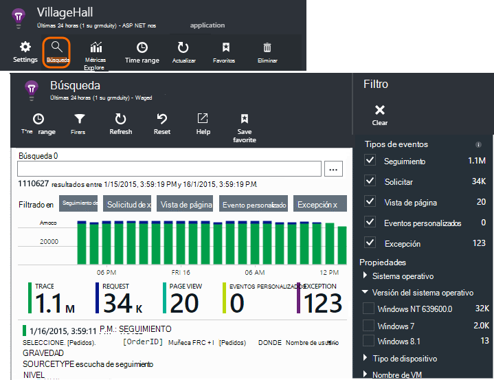

También se abre al hacer clic en a algunos gráficos y elementos de la cuadrícula. En este caso, los filtros se establecen previamente para centrarse en el tipo de elemento seleccionado. 

Por ejemplo, si la aplicación es un servicio web, el módulo de información general muestra un gráfico de volumen de solicitudes. Haga clic en ella y llegar a un gráfico más detallado, con una lista que muestra cuántas peticiones se han realizado para cada dirección URL. Haga clic en cualquier fila y obtener una lista de las solicitudes individuales para dicha dirección URL:

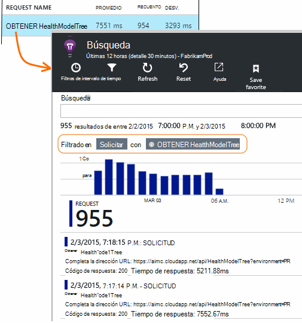

El cuerpo principal de búsqueda de diagnóstico es una lista de elementos de telemetría - solicitudes de servidor, página de vistas y eventos personalizados especificado en el código. En la parte superior de la lista es un resumen gráfico que muestra los recuentos de eventos a lo largo del tiempo.

Eventos normalmente se muestran en la búsqueda de diagnóstico antes de que aparezcan en el Explorador de métrica. Aunque el módulo se actualiza en intervalos, puede hacer clic en actualizar si está esperando un evento determinado.

### En Visual Studio

Abra la ventana de búsqueda en Visual Studio:

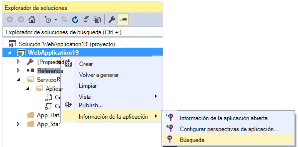

La ventana de búsqueda tiene las mismas características que el portal web:

## Muestreo

Si su aplicación genera una gran cantidad de telemetría (y el uso de la 2.0.0-beta3 de la versión de ASP.NET SDK o posterior), el módulo de muestreo adaptación reducirá automáticamente el volumen que se envía al portal enviando sólo una fracción representante de eventos. Sin embargo, los eventos relacionados con la misma solicitud se activarse o desactivarse como un grupo, para que pueda desplazarse entre los eventos relacionados. 

[Obtenga información sobre muestreo](app-insights-sampling.md).

## Inspeccionar elementos individuales

Seleccione cualquier elemento de telemetría para ver los campos de clave y los elementos relacionados. Si desea ver el conjunto completo de campos, haga clic en "...". 

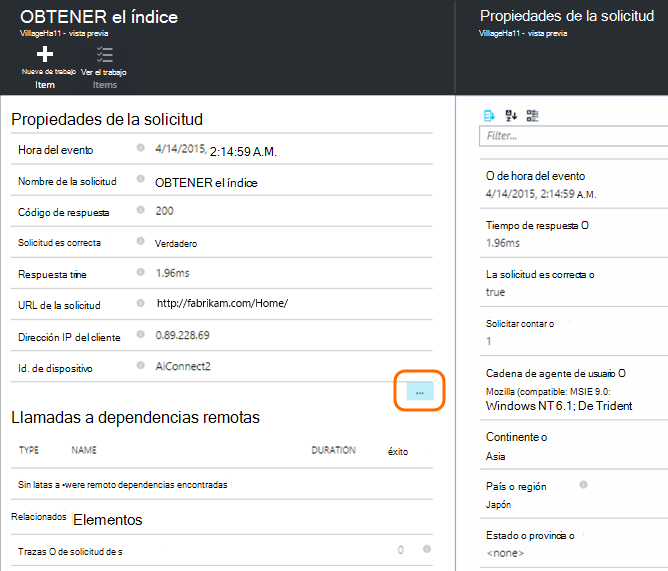

Para buscar el conjunto completo de campos, use cadenas sin formato (sin caracteres comodín). Los campos disponibles dependen del tipo de telemetría.

## Crear elemento de trabajo

Puede crear un error en Visual Studio Team Services con los detalles de cualquier elemento de telemetría. 

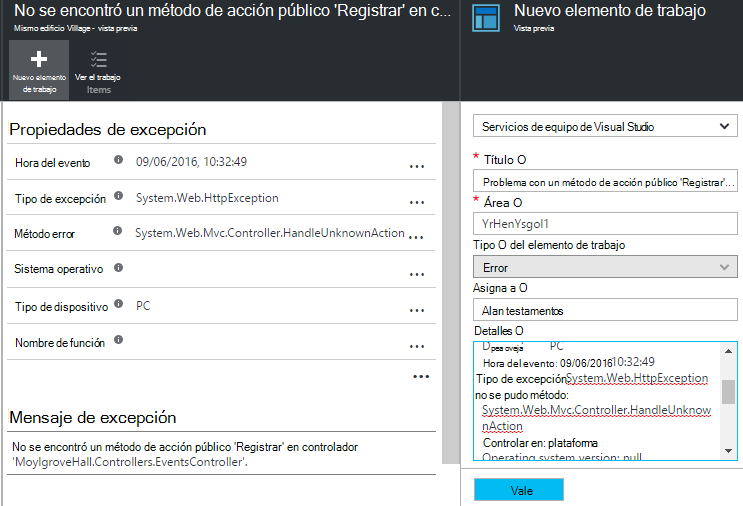

La primera vez que se hace esto, se le pedirá para configurar un vínculo a su cuenta de servicios de equipo y el proyecto.

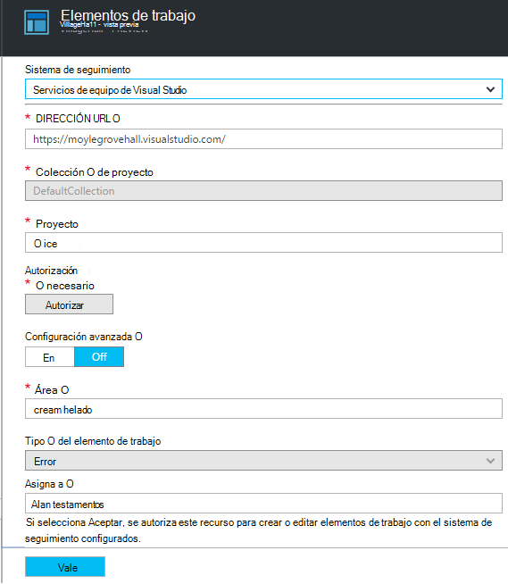

(También puede ir a la hoja de configuración en Configuración > elementos de trabajo.)

## Tipos de eventos de filtro

Abra el módulo de filtro y elija los tipos de evento que desea ver. (Si, posteriormente, desea restaurar los filtros con la que ha abierto el módulo, haga clic en Restablecer).

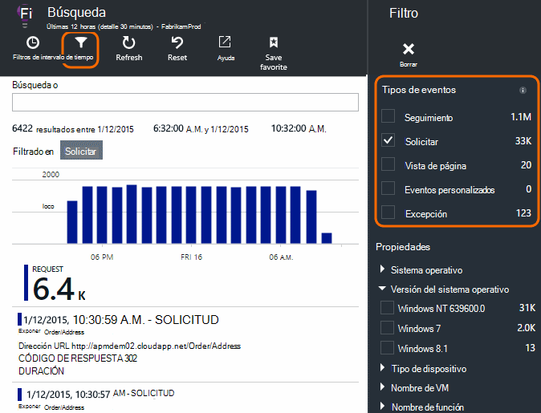

Los tipos de evento son:

* **Seguimiento** - registros de diagnóstico incluidas las llamadas TrackTrace, log4Net, NLog y System.Diagnostic.Trace.
* **Solicitar** - solicitudes HTTP recibidas por la aplicación de servidor, como páginas, las secuencias de comandos, imágenes, archivos de estilo y datos. Estos eventos se usan para crear la solicitud y la respuesta gráficos de información general.
* **Vista página** - telemetría enviado por el cliente de web, se usa para crear informes de la vista de página. 
* **Evento personalizado** : si ha insertado llamadas a TrackEvent() en orden para [supervisar el uso][track], puede buscar aquí.
* **Excepción** : las excepciones en el servidor y aquellos que inicia sesión utilizando TrackException().

## Filtrar por valores de propiedad

Puede filtrar eventos en los valores de sus propiedades. Las propiedades disponibles dependen de los tipos de eventos seleccionados. 

Por ejemplo, seleccione todas las solicitudes con un código de respuesta específico.

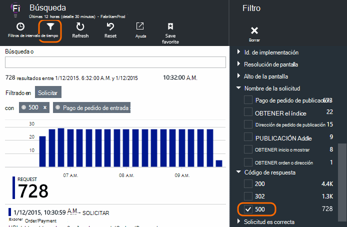

No elegir valores de una propiedad determinada tiene el mismo efecto que elegir todos los valores; desactiva el filtrado en esa propiedad.

### Limitar la búsqueda

Observe que la cuenta a la derecha de los valores de filtro muestra cuántas apariciones allí se encuentran en el conjunto filtrado actual. 

En este ejemplo, queda claro que la `Reports/Employees` solicitar resultados en la mayoría de los 500 errores:

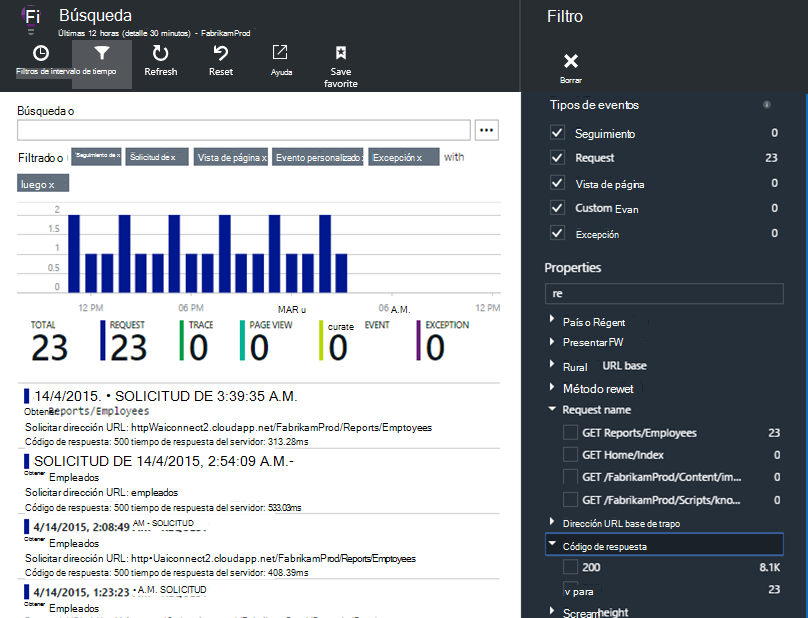

Además si desea Consulte también qué eventos se sucede durante este período, puede comprobar **incluir eventos con propiedades definidos**.

## Quitar robot y probar el tráfico web

Usar el filtro de **tráfico Real o síntesis** y Active **Real**.

También puede filtrar por **origen del tráfico síntesis**.

## Inspeccionar las repeticiones individuales

Agregar ese nombre de solicitud para el conjunto de filtros y, a continuación, puede revisar individuales repeticiones del evento.

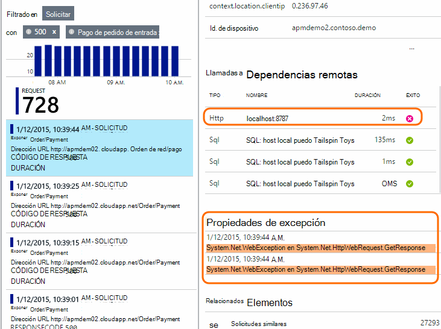

Para los eventos de la solicitud, los detalles de mostrar las excepciones que se ha producido mientras se está procesando la solicitud.

Haga clic en una excepción para ver sus detalles, incluido el seguimiento de la pila.

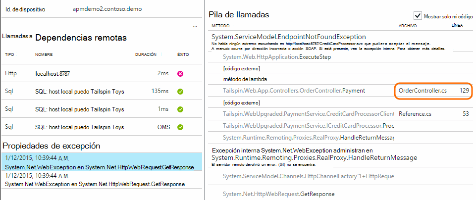

## Buscar eventos con la misma propiedad

Buscar todos los elementos con el mismo valor de propiedad:

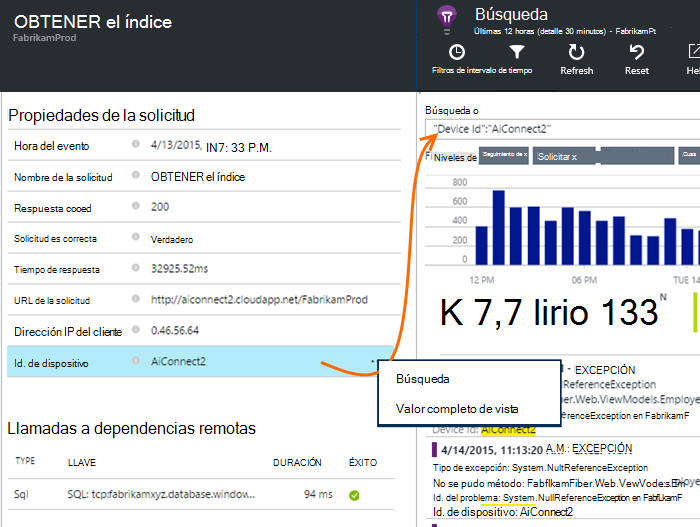

## Buscar por valor de métrica

Obtener todo el tiempo de respuesta > 5s de solicitudes.  Veces que se representan en marcas: 10 000 marcas = 1 ms.

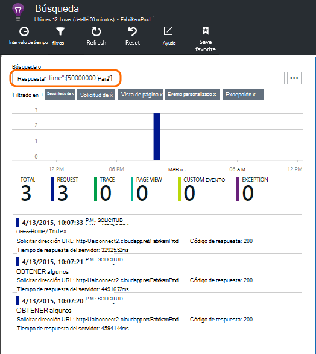

## Buscar los datos

Puede buscar términos en cualquiera de los valores de propiedad. Esto es especialmente útil si se ha escrito [eventos personalizados] [ track] con valores de propiedad. 

Desea establecer un tiempo de rango, como búsquedas un intervalo más corto es más rápido. 

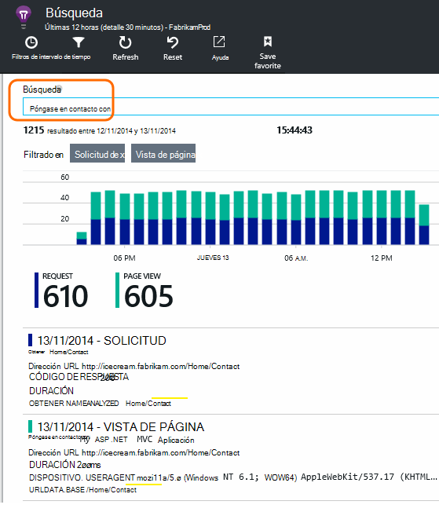

Búsqueda de términos, no subcadenas. Términos son cadenas alfanuméricas incluidos algunos signos de puntuación como '.' y '_'. Por ejemplo:

términos|*no* coincide con|pero que coincidan con estos
---|---|---
HomeController.About|acerca de Inicio|h\*acerca de Inicio\*
IsLocal|local es \*local|ISL\* IsLocal i\*l\*
Retraso nuevo|d. w|Nuevo retraso n\* y d.\*

Estas son las expresiones de búsqueda que puede usar:

Consulta de ejemplo | Efecto 
---|---
lentas|Buscar todos los eventos en el intervalo de fechas cuyos campos incluyen el término "lento"
¿base de datos?|Coincide con database01, databaseAB... ? no se permite al comienzo de un término de búsqueda.
base de datos * |Coincide con la base de datos, database01, databaseNNNN  * no permitido al comienzo de un término de búsqueda
Apple y plátanos|Buscar eventos que contengan ambos términos. Usar capital "y" no "y".
Apple plátanos OR plátanos de Apple|Buscar eventos que contienen cualquiera de los términos. Uso "O" no "o". < /br/ > breve formulario.
Apple no plátano Apple-plátano|Buscar eventos que contienen un término, pero no el otro. Formato corto.
aplicación * y plátanos-(grape pear)|Operadores lógicos y corchetes.
"Métrica": 0 a 500 "Métrica": hasta 500 * | Buscar eventos que contienen la medida con nombre en el intervalo de valores.

## Guardar la búsqueda

Cuando haya establecido todos los filtros que desea, puede guardar la búsqueda como favorito. Si trabaja en una cuenta de la organización, puede elegir si desea compartir con otros miembros del equipo.

Para ver la búsqueda de nuevo, **vaya a la hoja de información general** y abrir favoritos:

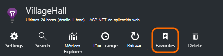

Si guardó con el intervalo de tiempo relativa, el módulo de volver a abrir tiene los datos más recientes. Si guardó con el intervalo de tiempo absoluto, verá los mismos datos cada vez.

## Enviar más de telemetría de impresiones de aplicación

Además de telemetría del cuadro enviada por aplicación perspectivas SDK, puede:

* Capturar trazas de registro de la estructura de registro favoritas en [.NET] [ netlogs] o [Java][javalogs]. Esto significa que puede buscar en los seguimientos de registro y correlación de con vistas de página, excepciones y otros eventos. 
* [Escribir código] [ track] para enviar eventos personalizados, vistas de página y excepciones. 

[Obtenga información sobre cómo enviar registros y telemetría personalizado a información de la aplicación][trace].

## Preguntas y respuestas

### ¿Se conserva la cantidad de datos?

Hasta 500 eventos por segundo de cada aplicación. Eventos se conservan siete días.

### ¿Cómo puedo ver los datos de entrada en Mis solicitudes de servidor?

Nos no iniciar automáticamente los datos de entrada, pero puede usar [llamadas TrackTrace o registro][trace]. Poner los datos de entrada en el parámetro de mensaje. No puede filtrar en el mensaje de la manera en que puede propiedades, pero el límite de tamaño es más largo.

## Pasos siguientes

* [Enviar registros y telemetría personalizado a información de la aplicación][trace]
* [Configurar disponibilidad y pruebas de capacidad de respuesta][availability]
* [Solución de problemas][qna]

<!--Link references-->

[availability]: app-insights-monitor-web-app-availability.md
[javalogs]: app-insights-java-trace-logs.md
[netlogs]: app-insights-asp-net-trace-logs.md
[qna]: app-insights-troubleshoot-faq.md
[start]: app-insights-overview.md
[trace]: app-insights-search-diagnostic-logs.md
[track]: app-insights-api-custom-events-metrics.md

 