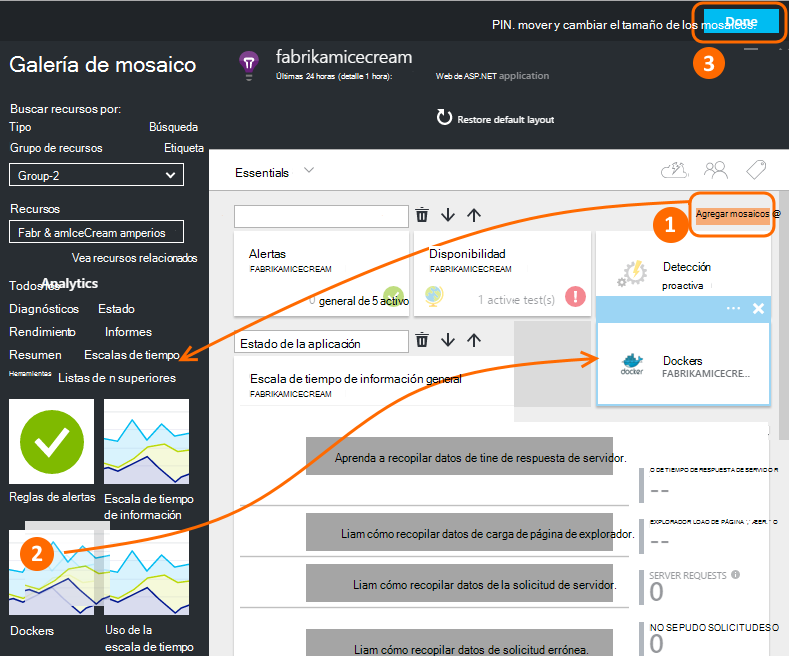
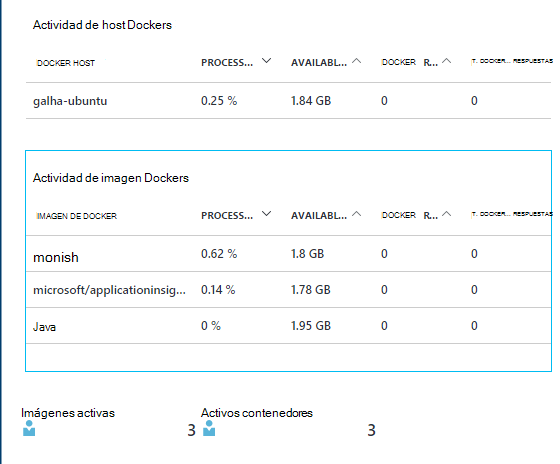
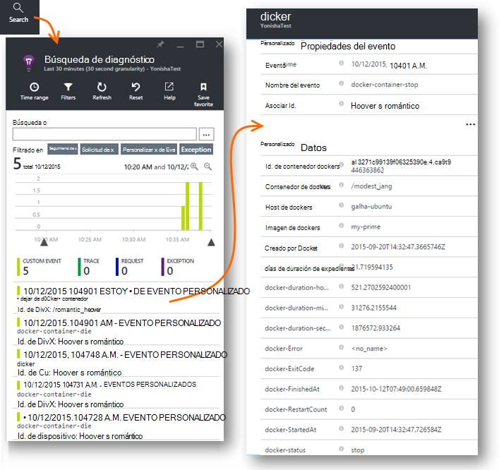
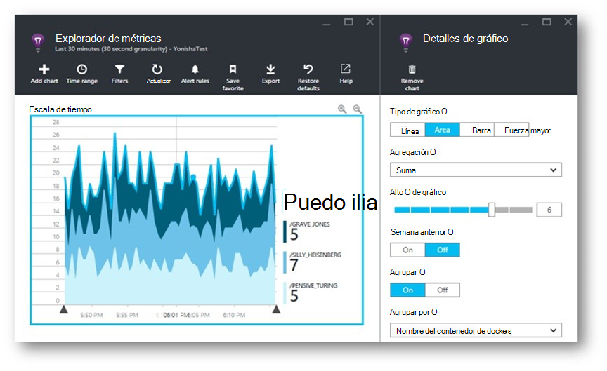
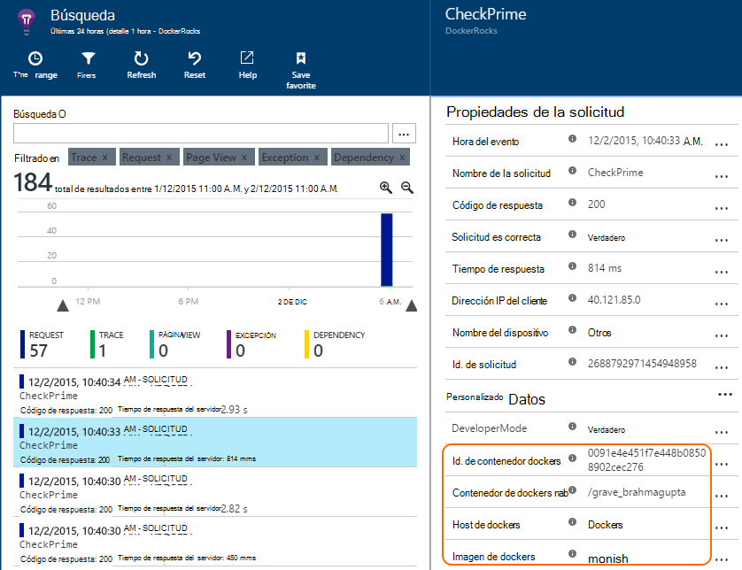
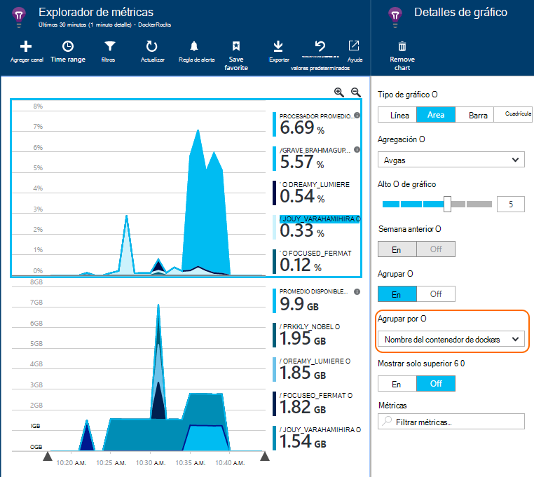

<properties 
    pageTitle="Supervisar las aplicaciones Docker perspectivas de aplicación" 
    description="Excepciones, eventos y contadores de rendimiento de docker se pueden mostrar en información de la aplicación, junto con la telemetría desde las aplicaciones de contenido." 
    services="application-insights" 
    documentationCenter=""
    authors="alancameronwills" 
    manager="douge"/>

<tags 
    ms.service="application-insights" 
    ms.workload="tbd" 
    ms.tgt_pltfrm="ibiza" 
    ms.devlang="na" 
    ms.topic="article" 
    ms.date="12/01/2015" 
    ms.author="awills"/>
 
# <a name="monitor-docker-applications-in-application-insights"></a>Supervisar las aplicaciones Docker perspectivas de aplicación

Eventos de ciclo de vida y contadores de rendimiento de los contenedores [Docker](https://www.docker.com/) se pueden representar en perspectivas de aplicación. Instalar la imagen de la [Información de la aplicación](app-insights-overview.md) en un contenedor en su host y mostrará contadores de rendimiento para el host, así como para las demás imágenes.

Con Docker distribuir sus aplicaciones en contenedores ligeros completado con todas las dependencias. Deberá ejecutar en cualquier equipo host que ejecuta un motor Docker.

Cuando se inicia la [imagen de la información de la aplicación](https://hub.docker.com/r/microsoft/applicationinsights/) en el host de Docker, obtendrá estos beneficios:

* Ciclo de vida telemetría sobre todos los contenedores que se ejecuta en el host - iniciar, detener y así sucesivamente.
* Contadores de rendimiento para todos los contenedores. CPU, memoria, uso de la red y más.
* Si [instalado SDK perspectivas de aplicación](app-insights-java-live.md) en las aplicaciones que se ejecutan en los contenedores, todo el telemetría de esas aplicaciones tendrán propiedades adicionales que identifica el equipo de contenedor y host. Por ejemplo, si tiene instancias de una aplicación que se ejecuta en más de un host, fácilmente podrá filtrar su telemetría aplicación host.


## <a name="set-up-your-application-insights-resource"></a>Configurar el recurso de información de la aplicación

1. Inicie sesión en el [Portal de Microsoft Azure](https://azure.com) y abra el recurso de información de la aplicación de la aplicación; o [cree uno nuevo](app-insights-create-new-resource.md). 

    *¿Qué recursos debo usar?* Si las aplicaciones que se ejecutan en el host desarrolladas por otra persona, necesitará [crear un nuevo recurso de información de la aplicación](app-insights-create-new-resource.md). Esto es donde ver y analizar la telemetría. (Seleccione 'Otros' para el tipo de aplicación).

    Pero, si es el desarrollador de las aplicaciones, a continuación, esperamos [Agregar aplicación perspectivas SDK](app-insights-java-live.md) para cada uno de ellos. Si están todos los componentes realmente de una aplicación empresarial único, a continuación, puede configurar todos ellos enviar telemetría a un recurso y deberá usar ese mismo recurso para mostrar los datos de rendimiento y ciclo de vida de Docker. 

    Un tercer escenario es que ha desarrollado la mayoría de las aplicaciones, pero utiliza recursos independientes para mostrar su telemetría. En ese caso, probablemente tendrá también desee crear un recurso independiente para los datos de Docker. 

2.  Agregar el mosaico Docker: elija **Agregar en mosaico**, arrastre el mosaico Docker desde la galería y, a continuación, haga clic en **Listo**. 

    


3. Haga clic en la lista desplegable **Essentials** y copie la clave de instrumentación. Que usará para indicar el SDK dónde puede enviar su telemetría.


    

Mantener la ventana del explorador útiles, como deberá volver a él pronto para ver su telemetría.


## <a name="run-the-application-insights-monitor-on-your-host"></a>Ejecutar al monitor de perspectivas de aplicación en el host
 
Ahora que tiene en otro para mostrar la telemetría, puede configurar la aplicación de contenido que se recopilan y envíelo.

1.  Conectarse a su proveedor de hospedaje Docker. 
2.  Editar la clave de instrumentación en este comando y ejecútelo:
 
    ```

    docker run -v /var/run/docker.sock:/docker.sock -d microsoft/applicationinsights ikey=000000-1111-2222-3333-444444444
    ```

Sólo una imagen de la información de la aplicación se necesita por host Docker. Si la aplicación se implementa en varios hosts Docker, a continuación, repita el comando en cada host.

## <a name="update-your-app"></a>Actualizar la aplicación

Si la aplicación cuenta con la [Aplicación perspectivas SDK para Java](app-insights-java-get-started.md), agregue la línea siguiente en el archivo ApplicationInsights.xml en su proyecto, en la `<TelemetryInitializers>` elemento:

```xml

    <Add type="com.microsoft.applicationinsights.extensibility.initializer.docker.DockerContextInitializer"/> 
```

Información de Docker como contenedor e id de host se agrega a cada elemento de telemetría enviado desde la aplicación.

## <a name="view-your-telemetry"></a>Ver la telemetría

Vuelva a su recurso de información de la aplicación en el portal de Azure.

Haga clic en el mosaico de Docker.

Pronto verá datos procedentes de la aplicación Docker, especialmente si tiene otros contenedores ejecutando el motor de Docker.


Estas son algunas de las vistas que se puede obtener.

### <a name="perf-counters-by-host-activity-by-image"></a>Contadores de rendimiento de host de la actividad de imagen





Haga clic en cualquier nombre de host o imagen para obtener más detalles.


Para personalizar la vista, haga clic en cualquier gráfico, la cuadrícula de título, o use Agregar gráfico. 

[Más información acerca del explorador de métricas](app-insights-metrics-explorer.md).

### <a name="docker-container-events"></a>Eventos de contenedor docker




Para investigar eventos individuales, haga clic en [Buscar](app-insights-diagnostic-search.md). Buscar y filtrar para encontrar los eventos que desee. Haga clic en cualquier evento para obtener más detalles.
 
### <a name="exceptions-by-container-name"></a>Excepciones por nombre del contenedor
 



### <a name="docker-context-added-to-app-telemetry"></a>Contexto de docker agregado a telemetría de aplicación

Solicitud de telemetría enviado desde la aplicación instrumentada con SDK AI, enriquecidos con contexto Docker:



Tiempo de procesador y contadores de rendimiento de la memoria disponible, enriquecen y agrupadas por el nombre del contenedor de Docker:





## <a name="q--a"></a>Preguntas y respuestas

*¿Qué aplicación perspectivas da me que puedo Docker?*

* Desglose detallado de contadores de rendimiento al contenedor e imagen.
* Integrar contenedor y aplicación de datos en un panel.
* [Exportar telemetría](app-insights-export-telemetry.md) para realizar análisis adicionales a una base de datos, Power BI u otros paneles.

*¿Cómo puedo obtener telemetría desde la aplicación?*

* Instale el SDK de perspectivas de aplicación en la aplicación. Obtenga información sobre cómo para: [Java web apps](app-insights-java-get-started.md), [aplicaciones web de Windows](app-insights-asp-net.md).
