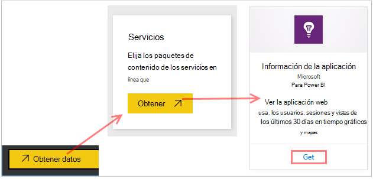
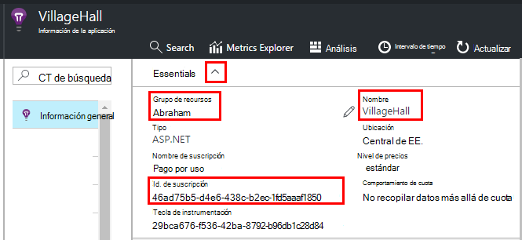
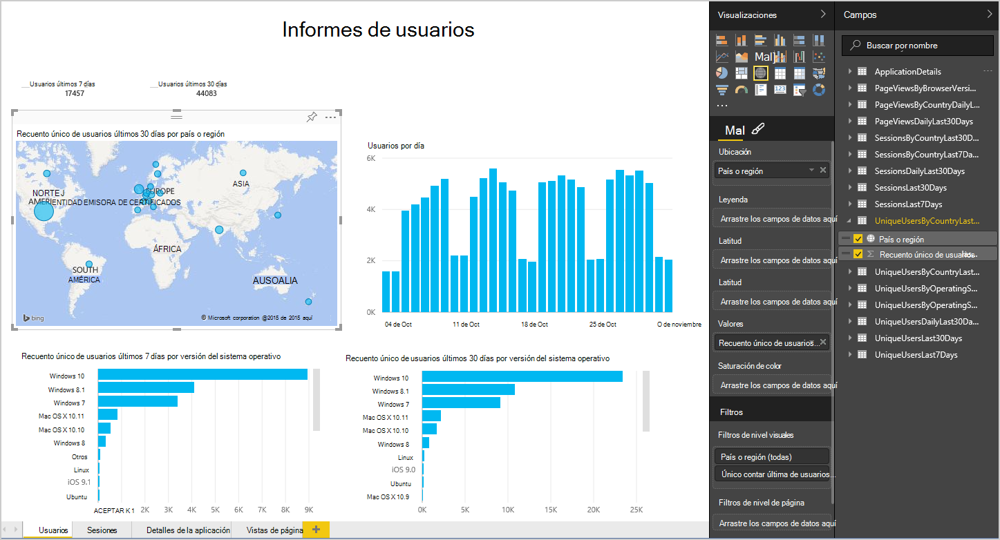
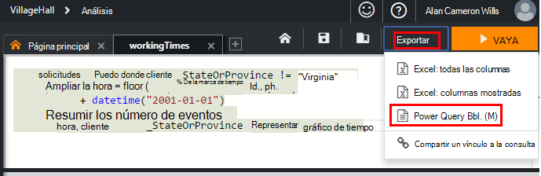
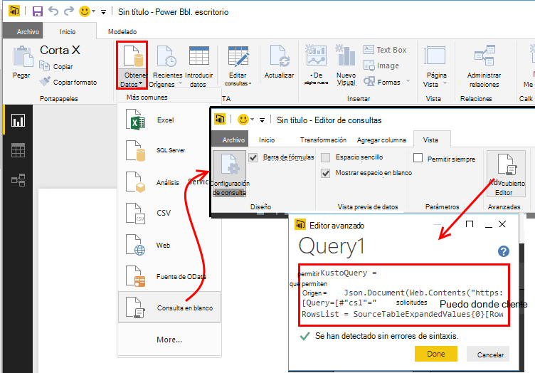
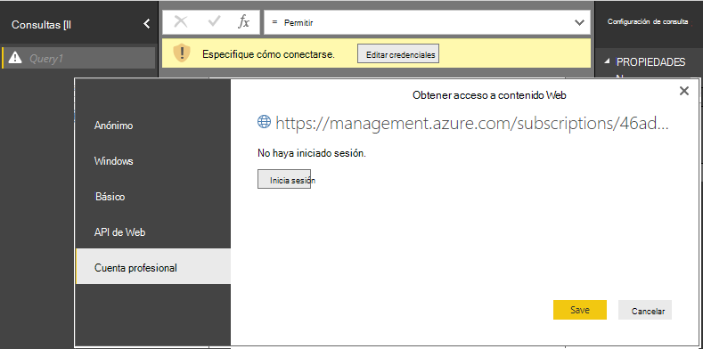
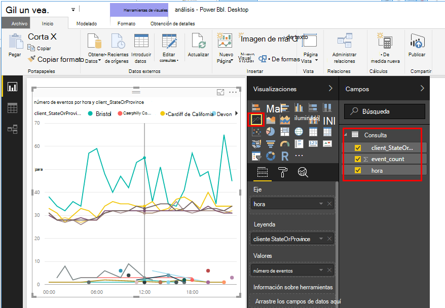
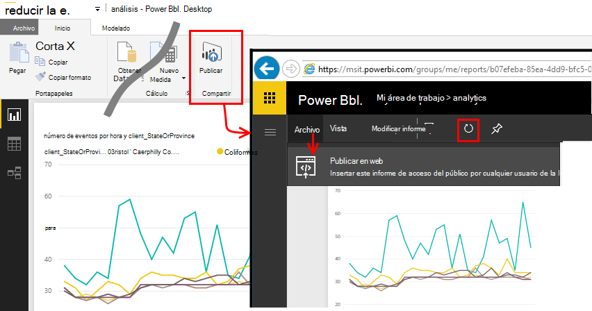

<properties 
    pageTitle="Exportar a Power BI de aplicación perspectivas | Microsoft Azure" 
    description="Análisis de consultas se pueden mostrar en Power BI." 
    services="application-insights" 
    documentationCenter=""
    authors="noamben" 
    manager="douge"/>

<tags 
    ms.service="application-insights" 
    ms.workload="tbd" 
    ms.tgt_pltfrm="ibiza" 
    ms.devlang="na" 
    ms.topic="article" 
    ms.date="10/18/2016" 
    ms.author="awills"/>

# La fuente de Power BI desde perspectivas de aplicación

[Power BI](http://www.powerbi.com/) es un conjunto de herramientas de análisis de negocio que le ayudarán a analizar datos y compartir información. Paneles de enriquecido están disponibles en todos los dispositivos. Puede combinar datos de varios orígenes, incluidos los análisis de consultas de [Perspectivas de aplicación de Visual Studio](app-insights-overview.md).

Existen tres métodos recomendados de exportación de datos de aplicación perspectivas en Power BI. Puede usarlos o por separado.

* [**Adaptador de power BI**](#power-pi-adapter) : configurar un panel de telemetría completo de la aplicación. Está predefinido en el conjunto de gráficos, pero puede agregar sus propias consultas de cualquier otros orígenes.
* [**Exportar análisis consultas**](#export-analytics-queries) - escribir ninguna consulta que desee usar análisis y exporta a Power BI. Puede colocar esta consulta en un panel junto con otros datos.
* [**Exportar continua y el análisis de secuencia**](app-insights-export-stream-analytics.md) - esto implica más trabajo para configurar. Es útil si desea conservar los datos para los períodos de tiempo. En caso contrario, se recomiendan los otros métodos.

## Adaptador de Power BI

Este método crea un panel de telemetría completo. El conjunto de datos inicial está predefinido, pero puede agregar más datos a ella.

### Obtener el adaptador

1. Inicie sesión en [Power BI](https://app.powerbi.com/).
2. Abra **obtener datos**, **Servicios**, **perspectivas de aplicación**

    

3. Proporcione los detalles de los recursos de aplicación perspectivas.

    

4. Espere un minuto o dos para los datos que desea importar.

    

Puede editar el panel de la combinación de aplicación perspectivas gráficos con los de otros orígenes y análisis de consultas. Hay una galería de visualización, donde puede obtener más gráficos y cada gráfico tiene un parámetros puede configurar.

Después de la importación inicial, los paneles y los informes seguirán actualizar diariamente. Puede controlar la programación de actualización en el conjunto de datos.

## Exportar análisis de consultas

Esta ruta le permite escribir las consultas de análisis que le guste y a continuación, exportar a un panel de Power BI. (Puede agregar al panel creado por el adaptador).

### Una vez: instalar Power BI Desktop

Para importar la consulta de la información de la aplicación, use la versión de escritorio de Power BI. Pero, a continuación, puede publicar en la web o en el área de trabajo de nube de Power BI. 

Instale [Power BI Desktop](https://powerbi.microsoft.com/en-us/desktop/).

### Exportar una consulta de análisis

1. [Análisis abrir y escribir su consulta](app-insights-analytics-tour.md).
2. Probar y refinar la consulta hasta que esté satisfecho con los resultados.
3. En el menú **Exportar** , elija **Power BI (M)**. Guarde el archivo de texto.

    
4. En Power BI Desktop seleccione **obtener datos, la consulta en blanco** y, a continuación, en el editor de consultas en **vista** seleccione **Editor de consultas avanzadas**.

    Pegue el script de lenguaje M exportado en el Editor de consultas avanzadas.

    

5. Es posible que tenga que proporcionar credenciales para permitir que Power BI tener acceso a Azure. Usar 'cuenta organizativa' iniciar sesión con su cuenta de Microsoft.

    

6. Elija una visualización de la consulta y seleccione los campos de eje x, eje y y segmentación de dimensión.

    

7. Publicar el informe en el área de trabajo de nube de Power BI. Desde allí, puede incrustar una versión sincronizada a otras páginas web.

    
 
8. Actualizar el informe manualmente a intervalos o configurar una actualización programada en la página Opciones.

## Acerca de muestreo

Si la aplicación envía una gran cantidad de datos, la característica de muestreo adaptación puede operar y enviar sólo un porcentaje de su telemetría. El mismo es true si ha establecido manualmente muestreo en el SDK o en recopilación. [Más información sobre muestreo.](app-insights-sampling.md)
 

## Pasos siguientes

* [Power BI - obtener](http://www.powerbi.com/learning/)
* [Tutorial de análisis](app-insights-analytics-tour.md)
