<properties 
    pageTitle="Usar el análisis de secuencia para procesar datos exportados desde la aplicación perspectivas | Microsoft Azure" 
    description="Análisis de secuencia continuamente puede transformar, filtrar y enrutar los datos que exporta de perspectivas de aplicación." 
    services="application-insights" 
    documentationCenter=""
    authors="noamben" 
    manager="douge"/>

<tags 
    ms.service="application-insights" 
    ms.workload="tbd" 
    ms.tgt_pltfrm="ibiza" 
    ms.devlang="na" 
    ms.topic="article" 
    ms.date="10/18/2016" 
    ms.author="awills"/>

# <a name="use-stream-analytics-to-process-exported-data-from-application-insights"></a>Usar el análisis de secuencia para procesar datos exportados desde perspectivas de aplicación

[Análisis de secuencia de Azure](https://azure.microsoft.com/services/stream-analytics/) es ideal para el procesamiento de los datos [exportados desde perspectivas de aplicación](app-insights-export-telemetry.md). Análisis de secuencia puede extraer datos de una gran variedad de orígenes. Puede transformar y filtrar los datos y, a continuación, enviarlo a una amplia variedad de receptores.

En este ejemplo, vamos a crear un adaptador que toma datos de aplicación perspectivas, cambia el nombre y procesa algunos de los campos y canalizaciones en Power BI.

> [AZURE.WARNING] Hay mucho mejor y más fácil [recomienda formas para mostrar los datos de aplicación perspectivas en Power BI](app-insights-export-power-bi.md). La ruta de acceso que se muestra aquí es simplemente un ejemplo para ilustrar cómo procesar datos exportados.

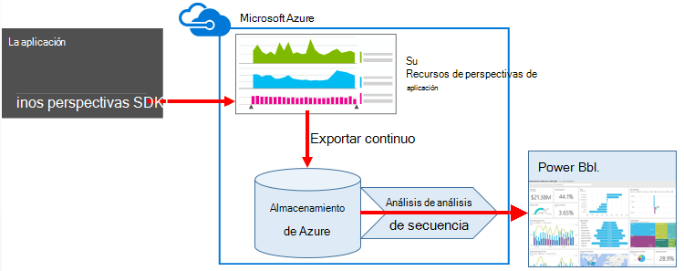


## <a name="create-storage-in-azure"></a>Crear el almacenamiento de Azure

Exportar continuo siempre envía los datos a una cuenta de almacenamiento de Azure, por lo que necesitará crear el almacenamiento en primer lugar.

1.  Crear una cuenta de almacenamiento "clásico" en la suscripción en el [portal de Azure](https://portal.azure.com).

    

2. Crear un contenedor

    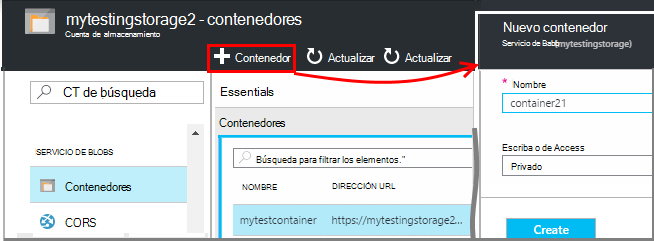

3. Copie la clave de acceso de almacenamiento

    Tendrá que pronto para configurar la entrada del servicio de análisis de secuencia.

    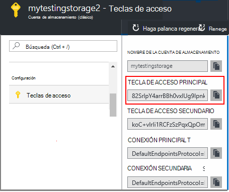

## <a name="start-continuous-export-to-azure-storage"></a>Iniciar exportación continua al almacenamiento de Azure

[Exportar continuo](app-insights-export-telemetry.md) mueve los datos desde perspectivas de aplicación de almacenamiento de Azure.

1. En el portal de Azure, busque el recurso de información de la aplicación que de la aplicación que ha creado.

    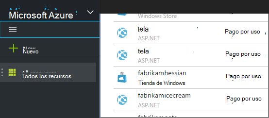

2. Crear una exportación continua.

    


    Seleccione la cuenta de almacenamiento que creó anteriormente:

    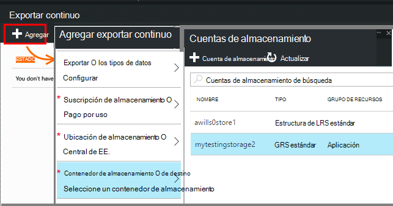
    
    Establecer los tipos de evento que desea ver:

    

3. Permitir que algunos datos se acumulan. Sentarse y permitir a los usuarios usar la aplicación durante un tiempo. Vaya telemetría y verá gráficos estadísticos en el [Explorador de métrica](app-insights-metrics-explorer.md) y eventos individuales en [búsqueda de diagnóstico](app-insights-diagnostic-search.md). 

    Y, además, va a exportar los datos a su almacenamiento. 

4. Inspeccionar los datos exportados. En Visual Studio, elija **Ver / nube Explorer**y abra Azure o almacenamiento. (Si no tiene esta opción de menú, debe instalar el SDK de Azure: abra el cuadro de diálogo nuevo proyecto y Visual C#, en la nube y obtener Microsoft Azure SDK para .NET.)

    

    Tome nota de la parte del nombre de ruta de acceso, que se deriva de la tecla de aplicación nombre e instrumentación común. 

Los eventos se escriben en blob archivos en formato JSON. Cada archivo puede contener uno o más eventos. Así que nos gustaría leer los datos del evento y filtrar los campos que desee. Todos los tipos de cosas que podemos hacer con los datos, pero nuestro plan hoy es usar el análisis de flujo en la canalización de los datos de Power BI.

## <a name="create-an-azure-stream-analytics-instance"></a>Crear una instancia de análisis de secuencia de Azure

Desde el [Portal de Azure clásico](https://manage.windowsazure.com/), seleccione el servicio de análisis de secuencia de Azure y crear un nuevo análisis de flujo de trabajo:


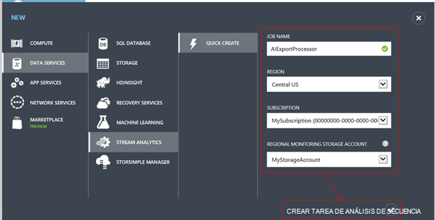

Cuando se crea la nueva tarea, expanda los detalles:


### <a name="set-blob-location"></a>Establecer ubicación de blobs

Establecer para obtener una entrada de su blob continuo exportar:


Ahora tendrá la clave principal de acceso desde su cuenta de almacenamiento, que se indicó anteriormente. Utilizar esta configuración como la clave de cuenta de almacenamiento.

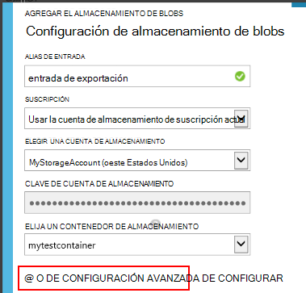

### <a name="set-path-prefix-pattern"></a>Establecer modelo de prefijo de ruta de acceso 

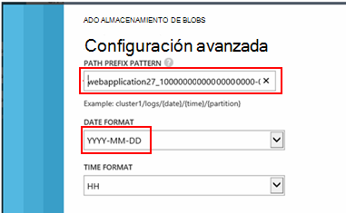


**Asegúrese de configurar el formato de fecha a DD-MM-AAAA (con guiones).**

El modelo de prefijo de ruta de acceso especifica donde secuencia análisis busca los archivos de entrada en el almacenamiento. Debe configurarlo para que corresponden a cómo exportar continuo almacena los datos. Configurarlo similar a esta:

    webapplication27_12345678123412341234123456789abcdef0/PageViews/{date}/{time}

En este ejemplo:

* `webapplication27`es el nombre de aplicación perspectivas recursos **minúsculas**.
* `1234...`es la clave de instrumentación del recurso aplicación perspectivas, **omitiendo guiones**. 
* `PageViews`es el tipo de datos que desea analizar. Los tipos disponibles dependen del filtro que defina en Exportar continuo. Examinar los datos exportados para ver los tipos de disponibles y vea la [exportación de modelos de datos](app-insights-export-data-model.md).
* `/{date}/{time}`se escribe literalmente un patrón.

> [AZURE.NOTE] Inspeccionar el almacenamiento para asegurarse de que recibe la ruta de acceso correcta.

### <a name="finish-initial-setup"></a>Finalizar la configuración inicial

Confirme el formato de serialización:

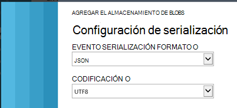

Cerrar al asistente y espere a que el programa de instalación.

> [AZURE.TIP] Utilice el comando de ejemplo para descargar algunos datos. Guardarla como una muestra de prueba para depurar la consulta.

## <a name="set-the-output"></a>Establezca el resultado

Ahora seleccione su trabajo y establezca el resultado.

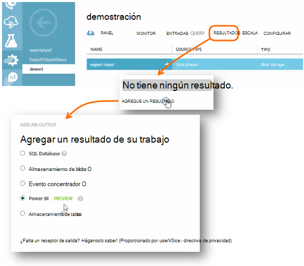

Proporcione su **trabajo o escuela cuenta** para autorizar el análisis de secuencia para tener acceso a los recursos de Power BI. A continuación, un nombre para el resultado y para el conjunto de datos de destino Power BI y la tabla de inventario.

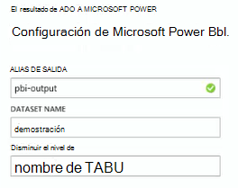

## <a name="set-the-query"></a>Configurar la consulta

La consulta controla la traducción de entrada a la salida.

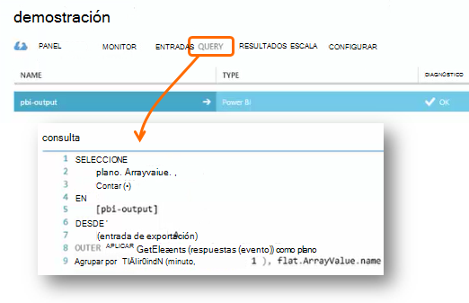


Use la función de prueba para comprobar que obtenga los resultados de la derecha. Darle los datos de ejemplo que realizó desde la página de entradas. 

### <a name="query-to-display-counts-of-events"></a>Consulta para mostrar los recuentos de eventos

Pegue esta consulta:

```SQL

    SELECT
      flat.ArrayValue.name,
      count(*)
    INTO
      [pbi-output]
    FROM
      [export-input] A
    OUTER APPLY GetElements(A.[event]) as flat
    GROUP BY TumblingWindow(minute, 1), flat.ArrayValue.name
```

* entrada de exportación es el alias que proporcionamos a la secuencia de entrada
* resultado de pbi es el alias de salida definido
* Usamos [Exterior GetElements aplicar](https://msdn.microsoft.com/library/azure/dn706229.aspx) porque es el nombre del evento en una arrray JSON anidada. A continuación, seleccione toma el nombre del evento, junto con un recuento del número de instancias con ese nombre en el período de tiempo. La cláusula [Group By](https://msdn.microsoft.com/library/azure/dn835023.aspx) agrupa los elementos en periodos de tiempo de 1 minuto.


### <a name="query-to-display-metric-values"></a>Consulta para mostrar los valores de métrica


```SQL

    SELECT
      A.context.data.eventtime,
      avg(CASE WHEN flat.arrayvalue.myMetric.value IS NULL THEN 0 ELSE  flat.arrayvalue.myMetric.value END) as myValue
    INTO
      [pbi-output]
    FROM
      [export-input] A
    OUTER APPLY GetElements(A.context.custom.metrics) as flat
    GROUP BY TumblingWindow(minute, 1), A.context.data.eventtime

``` 

* Esta consulta aumenta la telemetría métricas para obtener la hora del evento y el valor métrico. Los valores de métrica son dentro de una matriz, por lo que usamos la trama GetElements aplicar externa para extraer las filas. "myMetric" es el nombre de la métrica en este caso. 

### <a name="query-to-include-values-of-dimension-properties"></a>La consulta para incluir los valores de propiedades de dimensión

```SQL

    WITH flat AS (
    SELECT
      MySource.context.data.eventTime as eventTime,
      InstanceId = MyDimension.ArrayValue.InstanceId.value,
      BusinessUnitId = MyDimension.ArrayValue.BusinessUnitId.value
    FROM MySource
    OUTER APPLY GetArrayElements(MySource.context.custom.dimensions) MyDimension
    )
    SELECT
     eventTime,
     InstanceId,
     BusinessUnitId
    INTO AIOutput
    FROM flat

```

* Esta consulta incluye valores de las propiedades de dimensión sin según una dimensión determinada en un índice de la matriz de dimensión fijo.

## <a name="run-the-job"></a>Ejecutar el trabajo

Puede seleccionar una fecha en el pasado para iniciar el trabajo desde. 

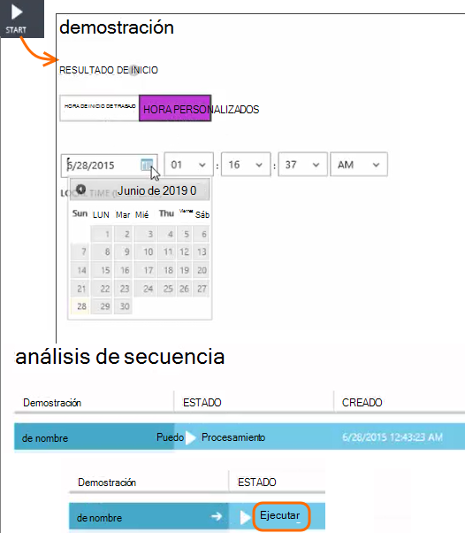

Espere a que se está ejecutando el trabajo.

## <a name="see-results-in-power-bi"></a>Ver resultados en Power BI

> [AZURE.WARNING] Hay mucho mejor y más fácil [recomienda formas para mostrar los datos de aplicación perspectivas en Power BI](app-insights-export-power-bi.md). La ruta de acceso que se muestra aquí es simplemente un ejemplo para ilustrar cómo procesar datos exportados.

Abra Power BI con su trabajo o cuenta escolar y seleccione el conjunto de datos y la tabla que haya definido como el resultado de la tarea de análisis de la secuencia.

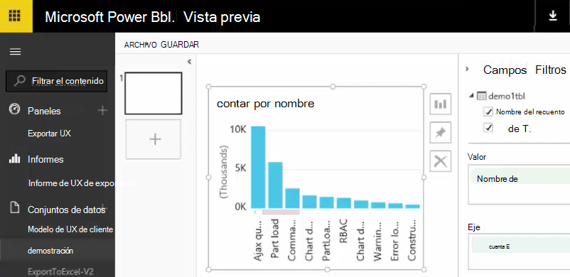

Ahora puede usar este conjunto de datos en los informes y paneles en [Power BI](https://powerbi.microsoft.com).


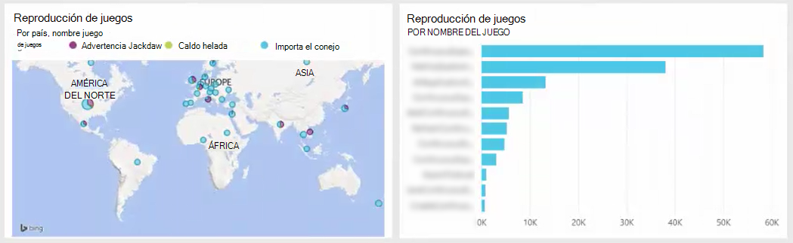


## <a name="no-data"></a>¿Sin datos?

* Compruebe que puede [establecer el formato de fecha](#set-path-prefix-pattern) correctamente en dd-MM-AAAA (con guiones).


## <a name="video"></a>Vídeo

Noam Ben Zeev muestra cómo procesar datos exportados mediante el análisis de secuencia.

> [AZURE.VIDEO export-to-power-bi-from-application-insights]

## <a name="next-steps"></a>Pasos siguientes

* [Exportar continuo](app-insights-export-telemetry.md)
* [Referencia de los tipos de propiedades y los valores del modelo de datos detallados.](app-insights-export-data-model.md)
* [Información de la aplicación](app-insights-overview.md)
* [Más ejemplos y tutoriales](app-insights-code-samples.md)
 
