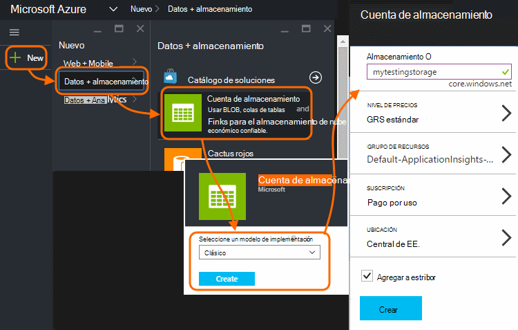
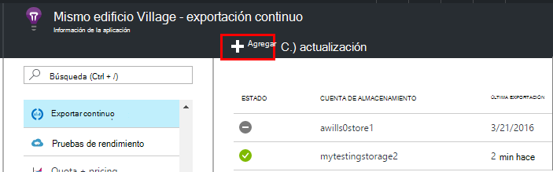
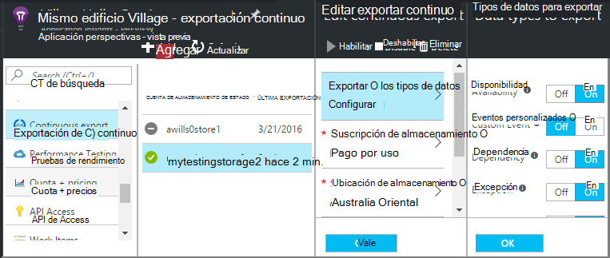
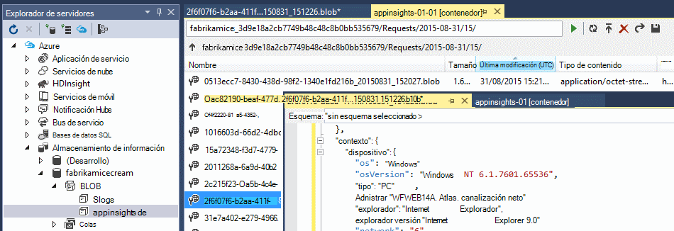
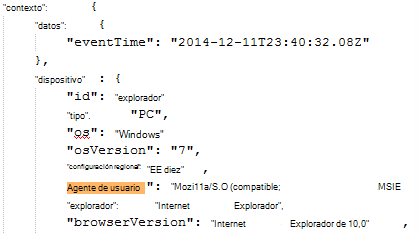
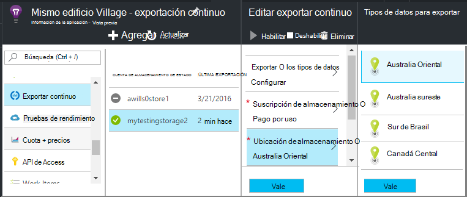

<properties 
    pageTitle="Exportar continuo de telemetría de aplicación perspectivas | Microsoft Azure" 
    description="Exportar datos de uso y diagnóstico a almacenamiento en Microsoft Azure y descargar desde allí." 
    services="application-insights" 
    documentationCenter=""
    authors="alancameronwills" 
    manager="douge"/>

<tags 
    ms.service="application-insights" 
    ms.workload="tbd" 
    ms.tgt_pltfrm="ibiza" 
    ms.devlang="na" 
    ms.topic="article" 
    ms.date="10/18/2016" 
    ms.author="awills"/>
 
# Exportar telemetría de perspectivas de aplicación

¿Desea mantener su telemetría más el período de retención estándar? ¿O procesar de algún modo especializado? Exportar continua es ideal para esto. Los eventos que se observan en el portal de aplicación perspectivas pueden exportarse a almacenamiento en Microsoft Azure en formato JSON. Desde allí puede descargar los datos y escribir cualquier código tenga que procesa.  

Exportar continua está disponible en el período de prueba gratuito y en [estándar y Premium planes de precios](https://azure.microsoft.com/pricing/details/application-insights/).

Antes de configurar exportar continuo, hay algunas alternativas es posible que desee considerar:

* [Botón Exportar de la](app-insights-metrics-explorer.md#export-to-excel) parte superior de un módulo métricas o buscar le permite transferir tablas y gráficos a una hoja de cálculo de Excel. 
* [Análisis](app-insights-analytics.md) proporciona un lenguaje de consulta eficaces para telemetría y también puede exportar los resultados.
* Si está buscando para [Explorar los datos en Power BI](http://blogs.msdn.com/b/powerbi/archive/2015/11/04/explore-your-application-insights-data-with-power-bi.aspx), puede hacerlo sin usar exportar continuo.

## Crear una cuenta de almacenamiento

Si todavía no tiene una cuenta de almacenamiento "clásico", crearla.

1. Crear una cuenta de almacenamiento en su suscripción en el [portal de Azure](https://portal.azure.com).

    

2. Crear un contenedor.

    

## Configurar exportar continuo

En el módulo de información general de la aplicación en el portal de información de la aplicación, abra continuo exportar: 

Agregar una exportación continua y elija los tipos de evento que desea exportar:

Elija o cree la [cuenta de almacenamiento de Azure](../storage/storage-introduction.md) donde desee almacenar los datos:

Una vez que ha creado la exportación, inicia va. (Solo obtiene datos que llegan después de crear la exportación.) 

Puede haber un retraso de aproximadamente una hora antes de que aparecen los datos en el objeto binario.

Si desea cambiar los tipos de eventos más tarde, edición la exportación:

Para detener la secuencia, haga clic en deshabilitar. Cuando vuelva a hacer clic en habilitar, se reinicie la secuencia con los nuevos datos. No obtener los datos recibidos en el portal mientras se ha deshabilitado la exportación.

Para detener la secuencia de forma permanente, elimine la exportación. Si lo hace, no elimina los datos de almacenamiento.

#### ¿No puede agregar o cambiar una exportación?

* Para agregar o cambiar las exportaciones, necesita derechos de acceso de propietario, Colaborador o colaborador de perspectivas de aplicación. [Obtenga más información sobre roles][roles].

## ¿Qué eventos hacer?

Los datos exportados están la telemetría bruta que recibimos de la aplicación, excepto en que se agrega los datos de ubicación que se calculan desde la dirección IP del cliente. 

Datos que se han descartado por [muestreo](app-insights-sampling.md) no se incluyen en los datos exportados.

No se incluyen otras métricas calculados. Por ejemplo, hemos no exportar utilización de CPU promedio, pero se exportar la telemetría sin formato desde el que se calcula el promedio.

Los datos también incluyen los resultados de las [pruebas de disponibilidad web](app-insights-monitor-web-app-availability.md) que se ha configurado. 

> [AZURE.NOTE] **Muestreo.** Si la aplicación envía una gran cantidad de datos y que está usando el SDK de perspectivas de aplicación para ASP.NET versión 2.0.0-beta3 o posterior, la característica de muestreo adaptación puede operar y enviar sólo un porcentaje de su telemetría. [Más información sobre muestreo.](app-insights-sampling.md)

## Inspeccionar los datos

Puede inspeccionar el almacenamiento directamente en el portal. Haga clic en **Examinar**, seleccione su cuenta de almacenamiento y, a continuación, abra **contenedores**.

Para examinar el almacenamiento de Azure en Visual Studio, abra la **vista**, **Explorer nube**. (Si no tiene este comando de menú, debe instalar el SDK de Azure: abrir el cuadro de diálogo **Nuevo proyecto** , expanda Visual C# o en la nube y elija **Obtener Microsoft Azure SDK para .NET**.)

Al abrir el almacenamiento de blobs, verá un contenedor con un conjunto de archivos de blobs de Windows. URI de cada archivo que se deriva de su nombre de recurso de información de la aplicación, su clave de instrumentación, telemetría-tipo o fecha y hora. (El nombre del recurso es todo a minúsculas y la clave de instrumentación omite guiones).

La fecha y hora son UTC y cuando la telemetría se ingresó en el almacén - no la hora que se ha generado. Así que si escribe código para descargar los datos, puede mover lineal a través de los datos.

Esto es el formulario de la ruta de acceso:

    $"{applicationName}_{instrumentationKey}/{type}/{blobDeliveryTimeUtc:yyyy-MM-dd}/{ blobDeliveryTimeUtc:HH}/{blobId}_{blobCreationTimeUtc:yyyyMMdd_HHmmss}.blob"
  
Donde 

-   `blobCreationTimeUtc`es hora de creación de blobs de Windows en el interior de ensayo almacenamiento
-   `blobDeliveryTimeUtc`es el tiempo cuando se copia blob al almacenamiento de destino de exportación

## Formato de datos

* Cada blob es un archivo de texto que contiene varias ' \n'-separated filas. Contiene la telemetría procesada durante un período de tiempo de aproximadamente la mitad de un minuto.
* Cada fila representa un punto de datos de telemetría como una vista de la solicitud o la página.
* Cada fila es un documento JSON sin formato. Si quiere sentarse y fijamente hacia él, ábralo en Visual Studio y elija Editar, avanzadas, formato de archivo:

Duraciones de tiempo que se encuentran en marcas, donde marcas 10 000 = 1 ms. Por ejemplo, estos valores mostrar un período de 1 ms para enviar una solicitud desde el explorador, 3 MS recibirlo y 1.8s para procesar la página en el explorador:

    "sendRequest": {"value": 10000.0},
    "receiveRequest": {"value": 30000.0},
    "clientProcess": {"value": 17970000.0}

[Referencia de los tipos de propiedades y los valores del modelo de datos detallados.](app-insights-export-data-model.md)

## Procesamiento de los datos

En una escala pequeña, puede escribir código para desarmar sus datos, lea en una hoja de cálculo y así sucesivamente. Por ejemplo:

    private IEnumerable<T> DeserializeMany<T>(string folderName)
    {
      var files = Directory.EnumerateFiles(folderName, "*.blob", SearchOption.AllDirectories);
      foreach (var file in files)
      {
         using (var fileReader = File.OpenText(file))
         {
            string fileContent = fileReader.ReadToEnd();
            IEnumerable<string> entities = fileContent.Split('\n').Where(s => !string.IsNullOrWhiteSpace(s));
            foreach (var entity in entities)
            {
                yield return JsonConvert.DeserializeObject<T>(entity);
            }
         }
      }
    }

Para un ejemplo más extenso de código, vea [usar una función de trabajador][exportasa].

## Eliminar los datos antiguos
Tenga en cuenta que usted es responsable de administrar la capacidad de almacenamiento y eliminar los datos antiguos si es necesario. 

## Si regenerar la clave de almacenamiento...

Si cambia la clave para el almacenamiento, exportar continuo dejarán de funcionar. Verá una notificación en su cuenta de Azure. 

Abra el módulo exportar continua y modifique la exportación. Editar el destino de exportación, pero dejar el mismo almacenamiento seleccionado. Haga clic en Aceptar para confirmar.

Se reinicie la exportación continua.

## Ejemplos de exportación

* [Exportar a SQL con una función de trabajo][exportcode]
* [Exportar a SQL mediante el análisis de secuencia][exportasa]
* [Ejemplo de análisis de secuencia 2](app-insights-export-stream-analytics.md)

En escala más grande, considere la posibilidad de [HDInsight](https://azure.microsoft.com/services/hdinsight/) - Hadoop clústeres en la nube. HDInsight proporciona una gran variedad de tecnologías para administrar y analizar datos grandes.

## Preguntas y respuestas

* *Pero todo lo que quiero es la descarga de una sola vez de un gráfico.*  
 
    Sí, puede hacerlo. En la parte superior de la hoja, haga clic en [Exportar datos](app-insights-metrics-explorer.md#export-to-excel).

* *Configuro una exportación, pero no hay ningún dato en Mi almacén.*

    ¿Aplicación perspectivas recibido cualquier telemetría de la aplicación desde que ha configurado la exportación? Sólo recibirá nuevos datos.

* *Intentado configurar una exportación, pero ha denegado el acceso*

    Si la cuenta pertenece a su organización, debe ser miembro de los grupos propietarios o colaboradores.

* *¿Puedo exportar directamente a la mía almacén local?* 

    No, lo sentimos. Nuestro motor de exportación actualmente solo funciona con almacenamiento de Azure en este momento.  

* *¿Hay algún límite en la cantidad de datos que se ponga en mi tienda?* 

    No. Se deberá mantener insertar datos hasta que se elimine la exportación. Se detendrá si se encuentra en los límites de almacenamiento de blobs, pero es bastante grande. Es controlar cuánto espacio de almacenamiento que utilice.  

* *¿Cuántos BLOB debo ver en el almacenamiento?*

 * Para cada tipo de datos que seleccionó para exportar un blob nuevo se crea cada minuto (si hay datos). 
 * Además, para las aplicaciones con mucho tráfico, se asignan unidades de partición adicional. En este caso cada unidad crea un blob cada minuto.

* *Regenerar la clave para mi almacenamiento o ha cambiado el nombre del contenedor, y ahora no funciona la exportación.*

    Editar la exportación y abra la hoja de destino de exportación. Deje el mismo almacenamiento seleccionado como antes y haga clic en Aceptar para confirmar. Exportar se reinicie. Si el cambio era dentro de los últimos días, no perderá los datos.

* *¿Haga una pausa de la exportación?*

    Sí. Haga clic en deshabilitar.

## Ejemplos de código

* [Analizar JSON exportado con una función de trabajo][exportcode]
* [Ejemplo de análisis de secuencia](app-insights-export-stream-analytics.md)
* [Exportar a SQL mediante el análisis de secuencia][exportasa]

* [Referencia de los tipos de propiedades y los valores del modelo de datos detallados.](app-insights-export-data-model.md)

<!--Link references-->

[exportcode]: app-insights-code-sample-export-telemetry-sql-database.md
[exportasa]: app-insights-code-sample-export-sql-stream-analytics.md
[roles]: app-insights-resources-roles-access-control.md

 
