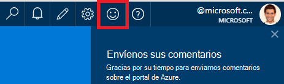
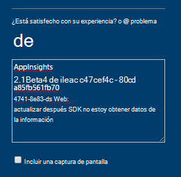
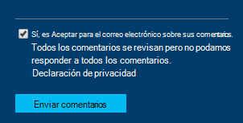

<properties 
    pageTitle="Cómo obtener soporte técnico de equipo de desarrollo de aplicaciones perspectivas | Microsoft Azure" 
    description="Cuando haya un caso de que requiere compatibilidad especial desde el equipo de desarrollo de aplicaciones perspectivas, esto es cómo puede enviar los detalles para obtener soporte técnico." 
    services="application-insights" 
    documentationCenter=""
    authors="alexbulankou" 
    manager="douge"/>
 
<tags 
    ms.service="application-insights" 
    ms.workload="tbd" 
    ms.tgt_pltfrm="ibiza" 
    ms.devlang="na" 
    ms.topic="article" 
    ms.date="06/01/2016" 
    ms.author="albulank"/>
    
# <a name="how-to-get-technical-support-from-application-insights-development-team"></a>Cómo obtener soporte técnico de equipo de desarrollo de aplicaciones perspectivas
    
Cuando tiene un problema técnico con [Recomendaciones de aplicación de Visual Studio](app-insights-overview.md), estas son las opciones para obtener ayuda:

## <a name="1-check-the-documents"></a>1. Compruebe los documentos

* ¿Datos que faltan? : [Muestreo](app-insights-sampling.md), [cuotas y límite](app-insights-pricing.md).
* Solución de problemas: [ASP.NET](app-insights-troubleshoot-faq.md) | [Java](app-insights-java-troubleshoot.md)

## <a name="2-search-the-forums"></a>2. buscar en los foros

* [Foro de MSDN](https://social.msdn.microsoft.com/Forums/vstudio/home?forum=ApplicationInsights)
* [StackOverflow](http://stackoverflow.com/questions/tagged/ms-application-insights)

## <a name="3-azure-support-plan"></a>¿3. Plan de soporte técnico azure?

Hay situaciones en las que desea que se los desarrolladores a investigar su caso concreto. 

Si tiene un [plan con Microsoft Azure de soporte técnico](https://azure.microsoft.com/support/plans/) puede [Abrir una incidencia de soporte técnico](https://portal.azure.com/?#blade/Microsoft_Azure_Support/HelpAndSupportBlade).

## <a name="4-contact-the-application-insights-team"></a>4. Póngase en contacto con el equipo de aplicación perspectivas

Si no tiene un plan de soporte técnico, nuestro equipo de desarrollo está satisfecho ofrecer mejor asistencia a los clientes de aplicación perspectivas estamos preparando para el hito de disponibilidad General. Presentamos **una nueva opción de soporte técnico**: puede describir su caso nos enviando un formulario de comentarios en el portal de Azure y tiene un desarrollador en el contacto del grupo de aplicación perspectivas realiza una copia para ayudar a resolver el problema.


1. En el [portal de información de la aplicación](https://portal.azure.com), haga clic en la cara sonriente en la esquina superior derecha:  

       

2. En el cuadro de comentario, asegúrese de especificar **AppInsights** como la primera línea y, a continuación, incluya la siguiente información:   

    ```

    AppInsights   
    ikey: <instrumentation key>   
    sdk: <SDK that you are using, including name and version>  
    issue: <please describe the problem you are having>

    ```   

       

3. Active "Sí, es Aceptar para enviar por correo electrónico". 

      

Un técnico en el equipo de aplicación perspectivas recibirá en contacto con usted pronto. Como proporcionamos este servicio en función del mejor esfuerzo, SLA no formal puede especificarse en este momento.


