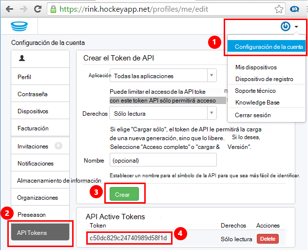
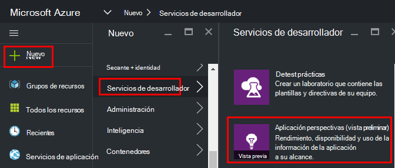
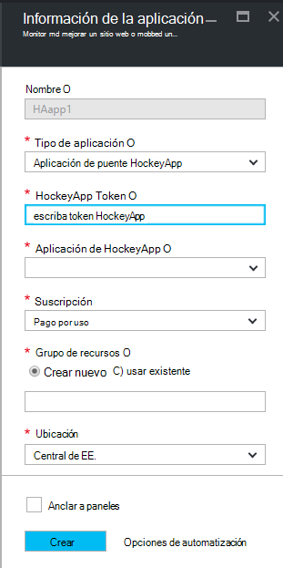
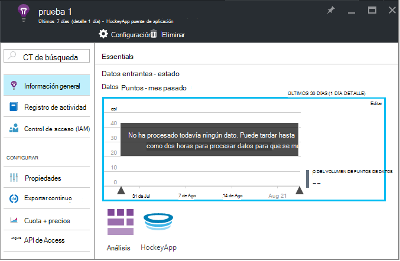
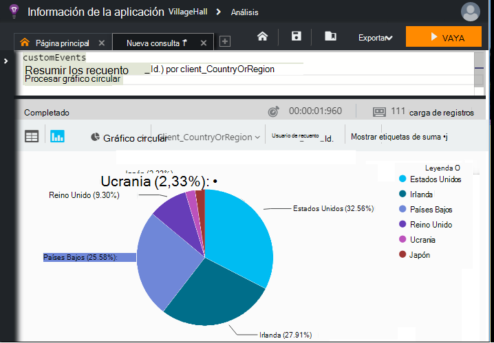

<properties 
    pageTitle="Explorar datos HockeyApp en aplicación perspectivas | Microsoft Azure" 
    description="Analizar el uso y el rendimiento de la aplicación de Azure con recomendaciones de aplicación." 
    services="application-insights" 
    documentationCenter="windows"
    authors="alancameronwills" 
    manager="douge"/>

<tags 
    ms.service="application-insights" 
    ms.workload="tbd" 
    ms.tgt_pltfrm="ibiza" 
    ms.devlang="na" 
    ms.topic="article" 
    ms.date="08/25/2016" 
    ms.author="awills"/>

#  Explorar datos HockeyApp en perspectivas de aplicación

[HockeyApp](https://azure.microsoft.com/services/hockeyapp/) es la plataforma recomendada para supervisar las aplicaciones de escritorio y portátiles directo. Desde HockeyApp, puede enviar personalizado y seguimiento de telemetría a supervisar el uso y colaborar en diagnóstico (además de obtener datos de bloqueo). Puede consultar esta secuencia de telemetría mediante la característica de [análisis](app-insights-analytics.md) potente de [Perspectivas de aplicación de Visual Studio](app-insights-overview.md). Además, puede [Exportar personalizado y seguimiento de telemetría](app-insights-export-telemetry.md). Para habilitar estas características, configure un puente que transmite los datos de HockeyApp de impresiones de aplicación.

## La aplicación de puente HockeyApp

La aplicación de puente HockeyApp es la característica principal que le permite acceder a los datos de HockeyApp en perspectivas de aplicación mediante el análisis y la características exportar continuo. Todos los datos recopilados por HockeyApp después de la creación de la aplicación de puente HockeyApp serán accesibles desde estas características. Veamos cómo configurar una de estas aplicaciones de puente.

En HockeyApp, abra la configuración de la cuenta, [API Tokens](https://rink.hockeyapp.net/manage/auth_tokens). Crear un nuevo símbolo o volver a utilizar uno existente. Los derechos mínimos necesitan son "sólo lectura". Realizar una copia de la API de token.

Abra el portal de Microsoft Azure y [crear un recurso de información de la aplicación](app-insights-create-new-resource.md). Establecer tipo de aplicación en "Aplicación del puente de HockeyApp":

No es necesario establecer un nombre: Esto se establece automáticamente en el nombre de HockeyApp.

Aparecen los campos del puente de HockeyApp. 

Escriba el símbolo de HockeyApp que se indicó anteriormente. Esta acción rellena el menú desplegable "HockeyApp aplicación" con todas las aplicaciones de HockeyApp. Seleccione la que desea usar y rellene el resto de los campos. 

Abra el nuevo recurso. 

Tenga en cuenta que tardan un tiempo para iniciar el flujo de los datos.

¡Eso es todo! Todos los datos recopilados en su aplicación instrumentada HockeyApp a partir de este punto está ahora también disponibles en las características de análisis y exportar continuo de perspectivas de aplicación.

Revisemos brevemente cada una de estas funciones disponibles para usted.

## Análisis

Análisis es una herramienta eficaz para realizar consultas ad hoc de los datos, lo que le permite diagnosticar y analizar la telemetría y descubrir rápidamente las causas raíz y patrones.

* [Obtenga más información sobre el análisis](app-insights-analytics-tour.md)
* [Vídeo de introducción](https://channel9.msdn.com/events/Build/2016/T666)
* [Vídeo de conceptos avanzados](https://channel9.msdn.com/Events/Build/2016/P591)

## Exportar continuo

Exportar continuo le permite exportar los datos en un contenedor de almacenamiento de blobs de Windows Azure. Esto es muy útil si necesita mantener los datos más el período de retención ofrece actualmente perspectivas de aplicación. Puede mantener los datos de almacenamiento de blobs, proceso en una base de datos de SQL o la solución de almacenamiento de datos preferidos.

[Obtener más información sobre cómo exportar continuo](app-insights-export-telemetry.md)

## Pasos siguientes

* [Aplicar análisis a los datos](app-insights-analytics-tour.md)

