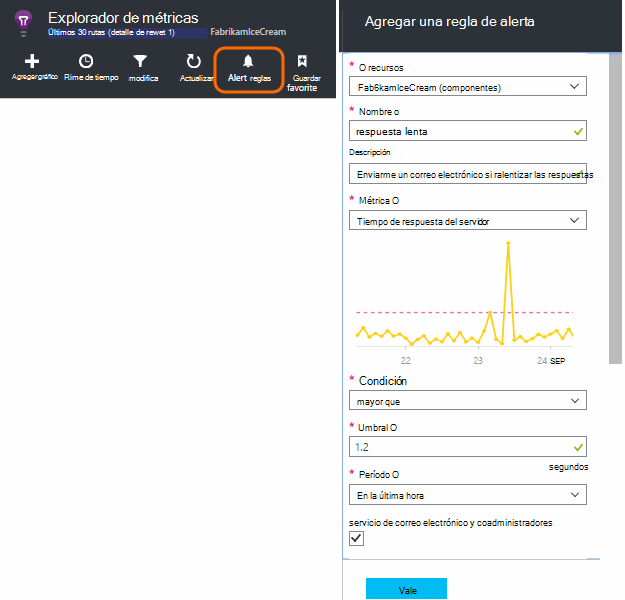
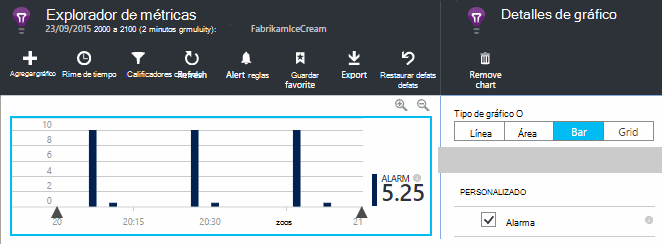
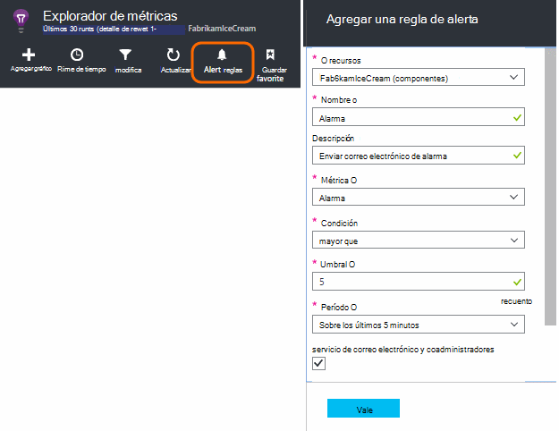
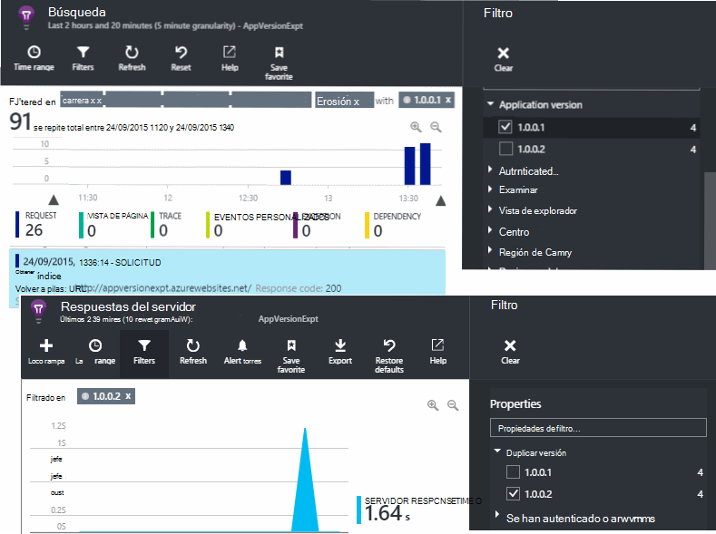
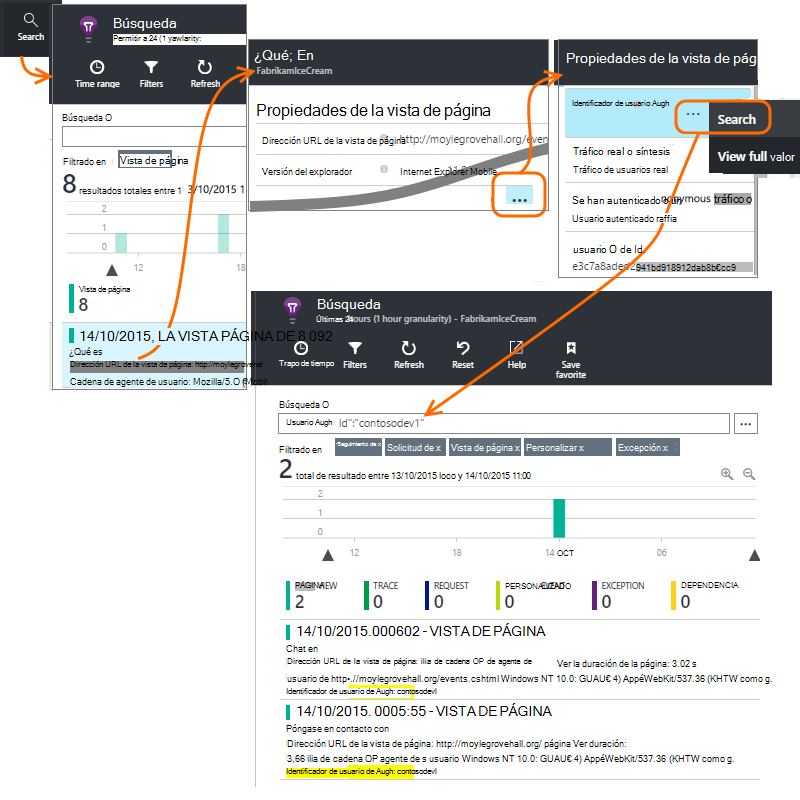
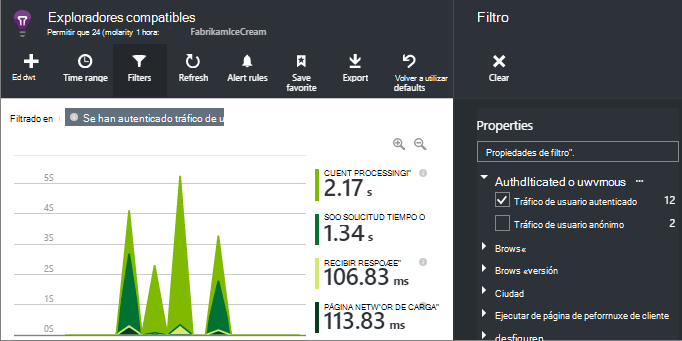
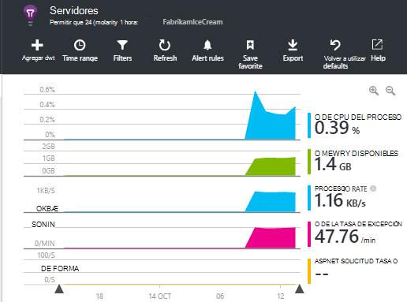

<properties 
    pageTitle="¿Cómo puedo... en aplicación perspectivas | Microsoft Azure" 
    description="Preguntas más frecuentes en perspectivas de aplicación." 
    services="application-insights" 
    documentationCenter=""
    authors="alancameronwills" 
    manager="douge"/>

<tags 
    ms.service="application-insights" 
    ms.workload="tbd" 
    ms.tgt_pltfrm="ibiza" 
    ms.devlang="na" 
    ms.topic="article" 
    ms.date="02/05/2016" 
    ms.author="awills"/>

# <a name="how-do-i--in-application-insights"></a>¿Cómo puedo... en información de la aplicación?

## <a name="get-an-email-when-"></a>Un correo electrónico cuando...

### <a name="email-if-my-site-goes-down"></a>Enviar por correo electrónico si mi sitio deja de funcionar

Configurar una [prueba web de disponibilidad](app-insights-monitor-web-app-availability.md).

### <a name="email-if-my-site-is-overloaded"></a>Enviar por correo electrónico si se sobrecarga Mi sitio

Establecer una [alerta](app-insights-alerts.md) en **tiempo de respuesta del servidor**. Debe trabajar un umbral entre 1 y 2 segundos.



La aplicación también puede mostrar signos de fatiga por devolver códigos de error. Establecer una alerta en **solicitudes de error**.

Si desea establecer una alerta en **excepciones de servidor**, es posible que tenga que hacer [alguna configuración adicional](app-insights-asp-net-exceptions.md) para poder ver los datos.

### <a name="email-on-exceptions"></a>En excepciones de correo electrónico

1. [Configurar la supervisión de excepción](app-insights-asp-net-exceptions.md)
2. [Establecer una alerta](app-insights-alerts.md) en la métrica de recuento de excepción


### <a name="email-on-an-event-in-my-app"></a>En un evento de mi aplicación de correo electrónico

Supongamos que le gustaría obtener un correo electrónico cuando se produzca un evento específico. Perspectivas de aplicación no ofrece esta función directamente, pero puede [Enviar una alerta cuando una métrica cruza un umbral](app-insights-alerts.md). 

Las alertas se pueden establecer [métricas personalizados](app-insights-api-custom-events-metrics.md#track-metric), aunque eventos no personalizados. Escribir el código para aumentar una métrica cuando se produce el evento:

    telemetry.TrackMetric("Alarm", 10);

o:

    var measurements = new Dictionary<string,double>();
    measurements ["Alarm"] = 10;
    telemetry.TrackEvent("status", null, measurements);

Dado que las alertas tienen dos Estados, tiene que enviar un valor bajo cuando considere que han finalizado la alerta:

    telemetry.TrackMetric("Alarm", 0.5);

Crear un gráfico en [el Explorador de métrica](app-insights-metrics-explorer.md) para ver la alarma:



Ahora, establezca una alerta para que se aplique cuando la métrica supera un valor extrae durante un período corto:




Establecer el período de promedio al mínimo. 

Recibirá mensajes de correo electrónico cuando la métrica pasa por encima y por debajo del umbral.

Algunos puntos para tener en cuenta:

* Una alerta tiene dos Estados ("alerta" y "correcto"). El estado se evalúa solo cuando se reciba una métrica.
* Solo cuando se cambia el estado, se envía un correo electrónico. Se trata de por qué debe enviar ambos alta y mediciones de poco valor. 
* Para evaluar la alerta, se toma el promedio de los valores recibidos durante el período anterior. Esto ocurre cada vez que se recibe una métrica, se pueden enviar mensajes de correo electrónico con más frecuencia que el período definido.
* Puesto que se envían mensajes de correo electrónico en "alerta" y "correcto", desee considerar volver a pensar en el evento único como una condición dos Estados. Por ejemplo, en lugar de un evento "trabajo completado", tiene una condición de "trabajo en progreso", donde recibe correos electrónicos al principio y al final de una tarea.

### <a name="set-up-alerts-automatically"></a>Configurar alertas de forma automática

[Usar PowerShell para crear nuevas alertas](app-insights-alerts.md#set-alerts-by-using-powershell)

## <a name="use-powershell-to-manage-application-insights"></a>Usar PowerShell para administrar la información de la aplicación

* [Crear nuevos recursos](app-insights-powershell-script-create-resource.md)
* [Crear nuevas alertas](app-insights-alerts.md#set-alerts-by-using-powershell)

## <a name="application-versions-and-stamps"></a>Marcas y versiones de aplicación

### <a name="separate-the-results-from-dev-test-and-prod"></a>Separar los resultados de desarrollo, prueba y producción

* Diferentes environmnents, configurar ikeys diferentes
* Para los distintos sellos (desarrollo, prueba, producto) la telemetría con distintos valores de propiedad de etiqueta

[Aprende más](app-insights-separate-resources.md)
 

### <a name="filter-on-build-number"></a>Filtrar por número de compilación

Cuando se publica una nueva versión de la aplicación, desea poder separar la telemetría diferentes versiones.

Puede establecer la propiedad de versión de la aplicación de modo que puede filtrar los resultados de [búsqueda](app-insights-diagnostic-search.md) y el [Explorador de métrica](app-insights-metrics-explorer.md) . 




Existen diferentes métodos para establecer la propiedad de versión de la aplicación.

* Establecer directamente:

    `telemetryClient.Context.Component.Version = typeof(MyProject.MyClass).Assembly.GetName().Version;`

* Ajustar dicha línea en un [inicializador de telemetría](app-insights-api-custom-events-metrics.md#telemetry-initializers) para asegurarse de que todas las instancias de TelemetryClient coherente.

* [ASP.NET] Establezca la versión `BuildInfo.config`. El módulo web seleccionará la versión desde el nodo BuildLabel. Incluir este archivo en el proyecto y recuerde que debe establecer la propiedad Copiar siempre en el Explorador de soluciones.

    ```XML

    <?xml version="1.0" encoding="utf-8"?>
    <DeploymentEvent xmlns:xsi="http://www.w3.org/2001/XMLSchema-instance" xmlns:xsd="http://www.w3.org/2001/XMLSchema" xmlns="http://schemas.microsoft.com/VisualStudio/DeploymentEvent/2013/06">
      <ProjectName>AppVersionExpt</ProjectName>
      <Build type="MSBuild">
        <MSBuild>
          <BuildLabel kind="label">1.0.0.2</BuildLabel>
        </MSBuild>
      </Build>
    </DeploymentEvent>

    ```
* [ASP.NET] Generar BuildInfo.config automáticamente en MSBuild. Para ello, agregar líneas a su archivo:

    ```XML

    <PropertyGroup>
      <GenerateBuildInfoConfigFile>true</GenerateBuildInfoConfigFile>    <IncludeServerNameInBuildInfo>true</IncludeServerNameInBuildInfo>
    </PropertyGroup> 
    ```

    Esto genera un archivo llamado *yourProjectName*. BuildInfo.config. El proceso de publicación cambia el nombre por BuildInfo.config.

    La etiqueta de compilación contiene un marcador de posición (AutoGen_...) al compilar con Visual Studio. Pero cuando se genera con MSBuild, se rellena con el número de versión correcto.

    Para permitir que MSBuild generar los números de versión, establezca la versión como `1.0.*` en AssemblyReference.cs

## <a name="monitor-backend-servers-and-desktop-apps"></a>Supervisar los servidores back-end y aplicaciones de escritorio

[Uso del módulo de SDK de Windows Server](app-insights-windows-desktop.md).


## <a name="visualize-data"></a>Visualizar datos

#### <a name="dashboard-with-metrics-from-multiple-apps"></a>Panel con métricas desde varias aplicaciones

* En el [Explorador de métrica](app-insights-metrics-explorer.md), personalizar el gráfico y guardar como favorito. Anclarlo al panel de Azure.


#### <a name="dashboard-with-data-from-other-sources-and-application-insights"></a>Panel con datos de otros orígenes y perspectivas de aplicación

* [Exportar telemetría Power BI](app-insights-export-power-bi.md). 

O

* Usar SharePoint como su escritorio, mostrar datos en elementos web de SharePoint. [Utilizar exportar continua y el análisis de secuencia para exportar a SQL](app-insights-code-sample-export-sql-stream-analytics.md).  Utilice PowerView para examinar la base de datos y crear un elemento web de SharePoint para PowerView.


<a name="search-specific-users"></a>
### <a name="filter-out-anonymous-or-authenticated-users"></a>Filtrar los usuarios anónimos o autenticados

Si los usuarios iniciar sesión, puede establecer la [autenticado identificador de usuario](app-insights-api-custom-events-metrics.md#authenticated-users). (No ocurrir automáticamente). 

A continuación, puede:

* Buscar en los identificadores de usuario específico



* Métrica de filtro a los usuarios anónimos o autenticados



## <a name="modify-property-names-or-values"></a>Modificar los nombres de propiedad o valores

Crear un [filtro](app-insights-api-filtering-sampling.md#filtering). Esto le permite modificar o filtrar telemetría antes de enviarlo desde la aplicación de impresiones de aplicación.

## <a name="list-specific-users-and-their-usage"></a>Lista de usuarios específicos y su uso

Si solo desea [Buscar usuarios específicos](#search-specific-users), puede establecer la [autenticado identificador de usuario](app-insights-api-custom-events-metrics.md#authenticated-users).

Si desea una lista de usuarios con los datos como las páginas vean o la frecuencia con que inicien sesión, tiene dos opciones:

* [Establecer autenticado identificador de usuario](app-insights-api-custom-events-metrics.md#authenticated-users), [Exportar a una base de datos](app-insights-code-sample-export-sql-stream-analytics.md) y usar herramientas adecuados para analizar los datos de usuario no existe.
* Si tiene sólo un pequeño número de usuarios, enviar eventos personalizados o métricas, utilizando los datos de interés como el nombre del valor o evento métrico y establecer el identificador de usuario como una propiedad. Para analizar las vistas de la página, reemplace la llamada de trackPageView de JavaScript estándar. Para analizar telemetría de servidor, use un inicializador de telemetría para agregar el identificador de usuario a todos los telemetría de servidor. Puede filtrar y segmento métricas y búsquedas en el identificador de usuario.


## <a name="reduce-traffic-from-my-app-to-application-insights"></a>Reducir el tráfico de mi aplicación de impresiones de aplicación

* En [ApplicationInsights.config](app-insights-configuration-with-applicationinsights-config.md), deshabilitar los módulos que no necesita, como el selector de contador de rendimiento.
* Use [muestras y filtrado](app-insights-api-filtering-sampling.md) en el SDK.
* En las páginas web, limitar el número de llamadas de Ajax notificado para cada vista de página. En el fragmento de secuencia de comandos después de `instrumentationKey:...` , insertar: `,maxAjaxCallsPerView:3` (o un número adecuado).
* Si usa [TrackMetric](app-insights-api-custom-events-metrics.md#track-metric), para calcular el agregado de los lotes de valores de métrica antes de enviar el resultado. Hay una sobrecarga de TrackMetric() que proporciona para que.


Más información sobre [cuotas y precios](app-insights-pricing.md).

## <a name="disable-telemetry"></a>Deshabilitar telemetría

Para **iniciar y detener dinámicamente** la colección y transmisión de telemetría desde el servidor:

```

    using  Microsoft.ApplicationInsights.Extensibility;

    TelemetryConfiguration.Active.DisableTelemetry = true;
```


Para **Deshabilitar a seleccionados selectores estándares** - por ejemplo, contadores de rendimiento, las solicitudes HTTP o dependencias - eliminan o comentar las líneas correspondientes en [ApplicationInsights.config](app-insights-api-custom-events-metrics.md). Puede hacerlo, por ejemplo, si desea enviar sus propios datos TrackRequest.


## <a name="view-system-performance-counters"></a>Ver contadores de rendimiento del sistema

Entre las medidas que se puede mostrar en el Explorador de métricas son un conjunto de sistema contadores de rendimiento. Hay un módulo predefinido titulado **servidores** que muestra algunos de ellos.



### <a name="if-you-see-no-performance-counter-data"></a>Si no ve ningún dato de contador de rendimiento

* **Servidor IIS** en su equipo o en una máquina virtual. [Instalar el Monitor de estado](app-insights-monitor-performance-live-website-now.md). 
* **Sitio web de azure** : no se admite contadores todavía. Existen varias métricas que puede obtener como parte del panel de control de Azure sitio web estándar.
* **Servidor UNIX** - [instalar collectd](app-insights-java-collectd.md)

### <a name="to-display-more-performance-counters"></a>Para mostrar más contadores de rendimiento

* En primer lugar, [Agregar un nuevo gráfico](app-insights-metrics-explorer.md) y vea si se establece el contador en basic ofrecemos.
* Si no es así, [Agregue el contador al conjunto recopilado por el módulo de contador de rendimiento](app-insights-performance-counters.md).


