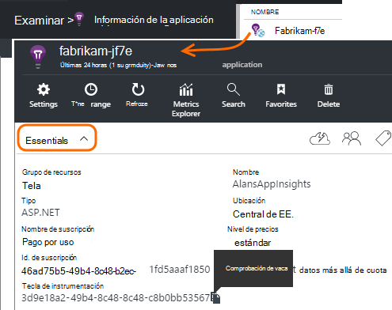
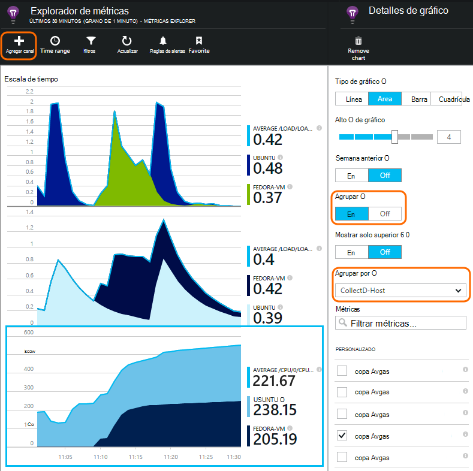

<properties 
    pageTitle="collectd: estadísticas de rendimiento de Java en Unix en perspectivas de aplicación" 
    description="Supervisión de su sitio Web de Java con el complemento CollectD para impresiones de aplicación extendida" 
    services="application-insights" 
    documentationCenter="java"
    authors="alancameronwills" 
    manager="douge"/>

<tags 
    ms.service="application-insights" 
    ms.workload="tbd" 
    ms.tgt_pltfrm="ibiza" 
    ms.devlang="na" 
    ms.topic="article" 
    ms.date="08/24/2016" 
    ms.author="awills"/>
 
# <a name="collectd-unix-performance-metrics-in-application-insights"></a>collectd: indicadores de rendimiento de Unix en perspectivas de aplicación

*Información de la aplicación está en vista previa.*

Para explorar las medidas de rendimiento del sistema Unix en [Perspectivas de aplicación](app-insights-overview.md), instale [collectd](http://collectd.org/), junto con su información de aplicación de complemento. Esta solución Abrir origen recopila diversas estadísticas de red y del sistema.

Normalmente usará collectd si ya ha [instrumentado el servicio web de Java con recomendaciones de aplicación][java]. Le ofrece más datos para ayudarle a mejorar el rendimiento de la aplicación o diagnosticar los problemas. 


## <a name="get-your-instrumentation-key"></a>Obtener la clave de instrumentación

En el [portal de Microsoft Azure](https://portal.azure.com), abra el recurso de [Información de la aplicación](app-insights-overview.md) donde desea que aparezcan los datos. (O [crear un nuevo recurso](app-insights-create-new-resource.md).)

Realizar una copia de la clave de instrumentación, que identifica el recurso.




## <a name="install-collectd-and-the-plug-in"></a>Instalar collectd y el complemento

En los equipos de servidor Unix:

1. Instalar [collectd](http://collectd.org/) versión 5.4.0 o posterior.
2. Descargar el [complemento de escritor de collectd perspectivas de aplicación](https://aka.ms/aijavasdk). Tenga en cuenta el número de versión.
3. Copiar el complemento JAR en `/usr/share/collectd/java`.
3. Editar `/etc/collectd/collectd.conf`:
 * Asegúrese de que [el complemento de Java](https://collectd.org/wiki/index.php/Plugin:Java) está habilitado.
 * Actualizar la JVMArg para el java.class.path para incluir el TARRO siguiente. Actualizar el número de versión para que coincida con la que ha descargado:
  * `/usr/share/collectd/java/applicationinsights-collectd-1.0.5.jar`
 * Agregar este fragmento de código, con la clave de instrumentación desde el recurso:

```

     LoadPlugin "com.microsoft.applicationinsights.collectd.ApplicationInsightsWriter"
     <Plugin ApplicationInsightsWriter>
        InstrumentationKey "Your key"
     </Plugin>
```

Aquí es parte de un archivo de configuración de ejemplo:

    ...
    # collectd plugins
    LoadPlugin cpu
    LoadPlugin disk
    LoadPlugin load
    ...

    # Enable Java Plugin
    LoadPlugin "java"

    # Configure Java Plugin
    <Plugin "java">
      JVMArg "-verbose:jni"
      JVMArg "-Djava.class.path=/usr/share/collectd/java/applicationinsights-collectd-1.0.5.jar:/usr/share/collectd/java/collectd-api.jar"

      # Enabling Application Insights plugin
      LoadPlugin "com.microsoft.applicationinsights.collectd.ApplicationInsightsWriter"
                
      # Configuring Application Insights plugin
      <Plugin ApplicationInsightsWriter>
        InstrumentationKey "12345678-1234-1234-1234-123456781234"
      </Plugin>

      # Other plugin configurations ...
      ...
    </Plugin>
.   ...

Configurar otros [complementos collectd](https://collectd.org/wiki/index.php/Table_of_Plugins), que puede recopilar varios datos de orígenes diferentes.

Reinicie collectd según su [manual](https://collectd.org/wiki/index.php/First_steps).

## <a name="view-the-data-in-application-insights"></a>Ver los datos de aplicación perspectivas

En el recurso de información de la aplicación, abra [Explorer métricas y agregar gráficos][metrics], seleccionar las medidas que desea ver de la categoría personalizada.



De forma predeterminada, se agregan las mediciones en todos los equipos de host desde el que se hayan recopilado las mediciones. Para ver las métricas por host, en el módulo de detalles de gráfico, activar agrupación y, a continuación, elija Agrupar por CollectD Host.


## <a name="to-exclude-upload-of-specific-statistics"></a>Para excluir la carga de las estadísticas específicas

De forma predeterminada, el complemento de la aplicación perspectivas envía todos los datos recopilados por todo el collectd habilitado 'lectura' complementos. 

Para excluir datos de orígenes de datos o complementos específicos:

* Editar el archivo de configuración. 
* En `<Plugin ApplicationInsightsWriter>`, agregar líneas de directiva similar a esta:

Directiva | Efecto
---|---
`Exclude disk` | Excluir todos los datos recopilados por el `disk` complemento
`Exclude disk:read,write` | Excluir los orígenes denominados `read` y `write` desde el `disk` complemento.

Directivas independientes con una línea nueva.


## <a name="problems"></a>¿Tiene problemas?

*No puedo ver los datos en el portal*

* Abrir [búsqueda] [ diagnostic] para ver si han llegado los eventos sin formato. A veces tarden aparecen en el Explorador de métricas.
* Es posible que deba [establecer excepciones de firewall para datos salientes](app-insights-ip-addresses.md)
* Habilitar el seguimiento en el complemento de la información de la aplicación. Agregue esta línea dentro de `<Plugin ApplicationInsightsWriter>`:
 *  `SDKLogger true`
* Abrir un terminal y comenzar a collectd en modo detallado, para ver los problemas que es los informes:
 * `sudo collectd -f`


<!--Link references-->

[api]: app-insights-api-custom-events-metrics.md
[apiexceptions]: app-insights-api-custom-events-metrics.md#track-exception
[availability]: app-insights-monitor-web-app-availability.md
[diagnostic]: app-insights-diagnostic-search.md
[eclipse]: app-insights-java-eclipse.md
[java]: app-insights-java-get-started.md
[javalogs]: app-insights-java-trace-logs.md
[metrics]: app-insights-metrics-explorer.md
[usage]: app-insights-web-track-usage.md

 
