<properties 
    pageTitle="Introducción a la información de la aplicación con Java en Eclipse" 
    description="Usar el complemento Eclipse para agregar supervisión del rendimiento y uso a su sitio Web de Java con recomendaciones de aplicación" 
    services="application-insights" 
    documentationCenter="java"
    authors="alancameronwills" 
    manager="douge"/>

<tags 
    ms.service="application-insights" 
    ms.workload="tbd" 
    ms.tgt_pltfrm="ibiza" 
    ms.devlang="na" 
    ms.topic="article" 
    ms.date="03/02/2016" 
    ms.author="awills"/>
 
# Introducción a la información de la aplicación con Java en Eclipse

El SDK de perspectivas aplicación envía telemetría desde la aplicación web de Java para que pueda analizar el rendimiento y uso. El complemento para impresiones de aplicación Eclipse instala automáticamente el SDK en su proyecto para que saque partido a la telemetría cuadro, además de una API que puede usar para escribir telemetría personalizado.   

## Requisitos previos

Actualmente el complemento funciona para experto en proyectos y dinámicos en Eclipse. ([Agregar perspectivas de aplicación a otros tipos de proyecto Java][java].)

Deberá:

* Oracle JRE 1,6 o posterior
* Una suscripción a [Microsoft Azure](https://azure.microsoft.com/). (Puede empezar con la [versión de prueba gratuita](https://azure.microsoft.com/pricing/free-trial/)).
* [IDE eclipse para desarrolladores de Java EE](http://www.eclipse.org/downloads/), Indigo o posterior.
* Windows 7 o posterior, o Windows Server 2008 o posterior

## Instalar el SDK en Eclipse (una vez)

Solo tiene que hacer esto una vez por máquina. Este paso instala un Kit de herramientas que puede agregar el SDK a cada proyecto Web dinámica.

1. Eclipse, haga clic en Ayuda, instalar Software nuevo.

    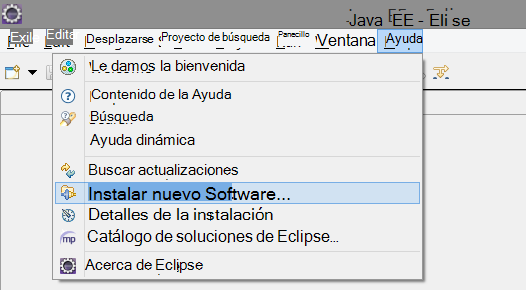

2. El SDK se encuentra en http://dl.windowsazure.com/eclipse, en el Kit de herramientas de Azure. 
3. Desactive **todos los sitios de actualización de contacto...**

    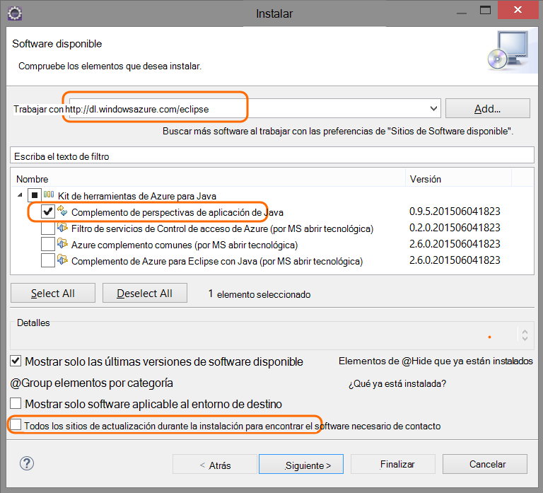

Siga los pasos restantes para cada proyecto Java.

## Crear un recurso de aplicación perspectivas en Azure

1. Inicie sesión en el [portal de Azure](https://portal.azure.com).
2. Crear un nuevo recurso de información de la aplicación.  

    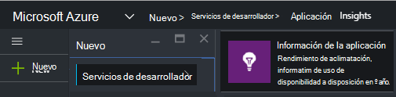  
3. Establezca el tipo de aplicación en la aplicación web de Java.  

      
4. Busque la clave de instrumentación del nuevo recurso. Debe pegar en el proyecto de código breve.  

      

## Agregar información de la aplicación a su proyecto

1. Agregar información de la aplicación en el menú contextual del proyecto web Java.

    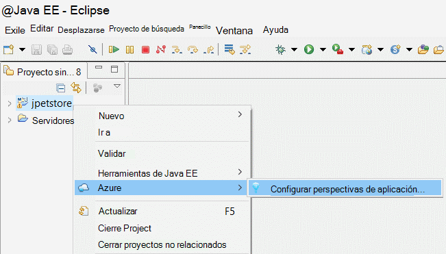

2. Pegue la clave de instrumentación que obtuvo desde el portal de Azure.

    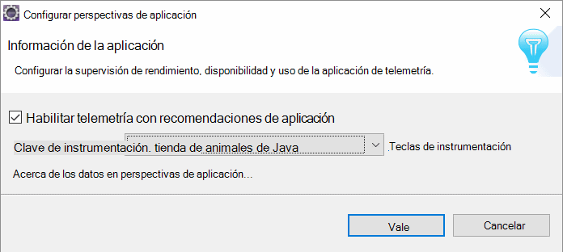

La clave se envía junto con todos los elementos de telemetría y perspectivas de aplicación para que se muestre en los recursos que le indica.

## Ejecute la aplicación y vea métricas

Ejecute la aplicación.

Volver a los recursos de aplicación perspectivas en Microsoft Azure.

Datos de las solicitudes HTTP aparecerá en el módulo de introducción. (Si no está allí, espere unos segundos y, a continuación, haga clic en Actualizar).

 

Haga clic en cualquier gráfico para ver más métricas. 

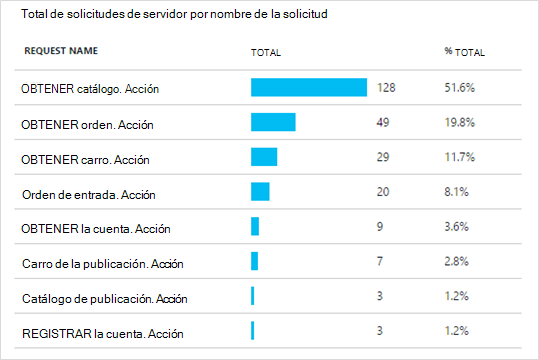

[Más información sobre cómo métricas.][metrics]

 

Y al ver las propiedades de una solicitud, puede ver los eventos de telemetría asociados como solicitudes y excepciones.
 
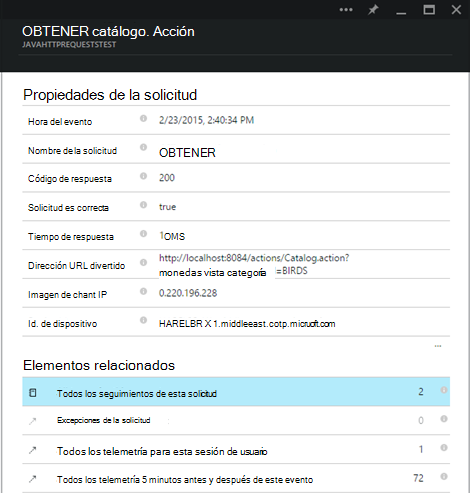

## Telemetría de cliente

Desde el módulo de tutorial rápido, haga clic en obtener código para supervisar las páginas web: 

Insertar el fragmento de código en el encabezado de los archivos HTML.

#### Ver datos de cliente

Abrir las páginas web actualizadas y usarlos. Espere un minuto o dos, a continuación, volver a la información de la aplicación y abra el módulo de uso. (Desde el módulo de introducción, desplácese hacia abajo y haga clic en uso).

Métrica de vista, el usuario y la sesión de la página aparecerá en el módulo de uso:

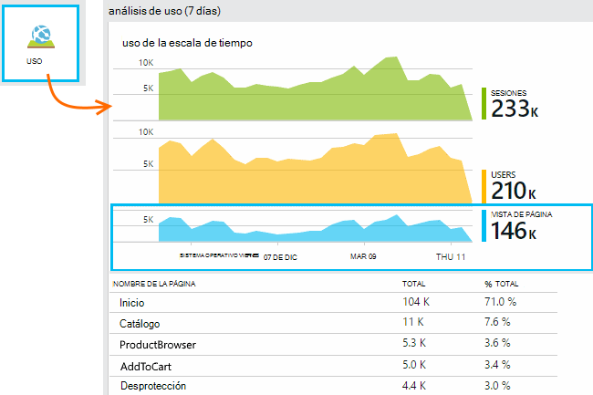

[Más información sobre la configuración de telemetría de cliente.][usage]

## Publicar su aplicación

Publicar ahora la aplicación en el servidor, utilice comunicar a las personas y ver la telemetría mostrarse en el portal.

* Asegúrese de que el firewall permite a la aplicación enviar telemetría a estos puertos:

 * DC.Services.VisualStudio.com:443
 * DC.Services.VisualStudio.com:80
 * F5.Services.VisualStudio.com:443
 * F5.Services.VisualStudio.com:80

* En servidores de Windows, instalar:

 * [Microsoft Visual C++ redistribuible](http://www.microsoft.com/download/details.aspx?id=40784)

    (Permite contadores).

## Errores de la solicitud y excepciones

Las excepciones no controladas se recopilan automáticamente:

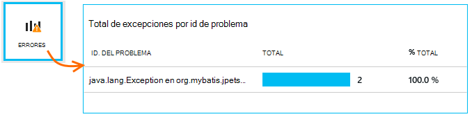

Para recopilar datos de otras excepciones, tiene dos opciones:

* [Insertar llamadas a TrackException en el código](app-insights-api-custom-events-metrics.md#track-exception). 
* [Instalar el agente de Java en su servidor](app-insights-java-agent.md). Especifique los métodos que desea ver.

## Supervisar las llamadas a métodos y dependencias externas

[Instalar el agente de Java](app-insights-java-agent.md) para iniciar sesión especificado métodos internos y llamadas realizadas por JDBC, con datos de tiempo.

## Contadores de rendimiento

En el módulo de introducción, desplácese hacia abajo y haga clic en el mosaico de **servidores** . Verá un rango de contadores de rendimiento.

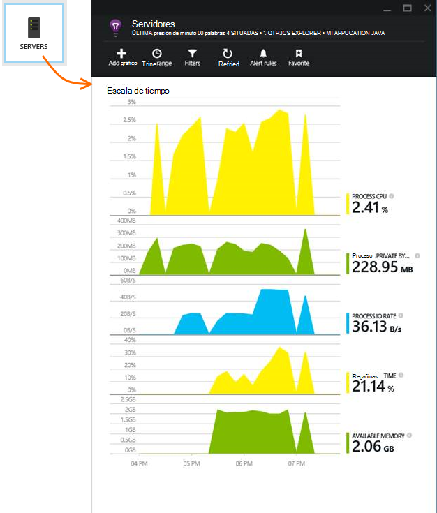

### Personalizar la recopilación de contador de rendimiento

Para deshabilitar la colección del conjunto estándar de contadores de rendimiento, agregue el código siguiente bajo el nodo raíz del archivo ApplicationInsights.xml:

    <PerformanceCounters>
       <UseBuiltIn>False</UseBuiltIn>
    </PerformanceCounters>

### Recopilar contadores de rendimiento adicionales

Puede especificar contadores de rendimiento adicionales para que se van a recopilar.

#### Contadores JMX (expuestos por la máquina Virtual de Java)

    <PerformanceCounters>
      <Jmx>
        <Add objectName="java.lang:type=ClassLoading" attribute="TotalLoadedClassCount" displayName="Loaded Class Count"/>
        <Add objectName="java.lang:type=Memory" attribute="HeapMemoryUsage.used" displayName="Heap Memory Usage-used" type="composite"/>
      </Jmx>
    </PerformanceCounters>

*   `displayName`: El nombre que se muestran en el portal de información de la aplicación.
*   `objectName`: El nombre de objeto JMX.
*   `attribute`: El atributo del nombre del objeto JMX para capturar
*   `type`(opcional): el tipo de atributo del objeto JMX:
 *  Valor predeterminado: un tipo simple como int o long.
 *  `composite`: los datos de contador de rendimiento están en el formato de 'Attribute.Data'
 *  `tabular`: los datos de contador de rendimiento están en el formato de una fila de tabla

#### Contadores de rendimiento de Windows

Cada [contador de rendimiento de Windows](https://msdn.microsoft.com/library/windows/desktop/aa373083.aspx) es un miembro de una categoría (en la misma manera que un campo es un miembro de una clase). Categorías puede ser globales, o pueden han numerado o instancias con nombre.

    <PerformanceCounters>
      <Windows>
        <Add displayName="Process User Time" categoryName="Process" counterName="%User Time" instanceName="__SELF__" />
        <Add displayName="Bytes Printed per Second" categoryName="Print Queue" counterName="Bytes Printed/sec" instanceName="Fax" />
      </Windows>
    </PerformanceCounters>

*   displayName: el nombre que aparece en el portal de información de la aplicación.
*   categoryName: la categoría de contador de rendimiento (objeto de rendimiento) que está asociado este contador de rendimiento.
*   counterName: el nombre del contador de rendimiento.
*   instanceName: el nombre de la instancia de categoría de contador de rendimiento, o una cadena vacía (""), si la categoría contiene una sola instancia. Si categoryName es el proceso y el contador de rendimiento que le gustaría recopilar es el proceso de JVM actual en que se está ejecutando la aplicación, especifique `"__SELF__"`.

Contadores de rendimiento son visibles como métricas personalizados en el [Explorador de métricas][metrics].

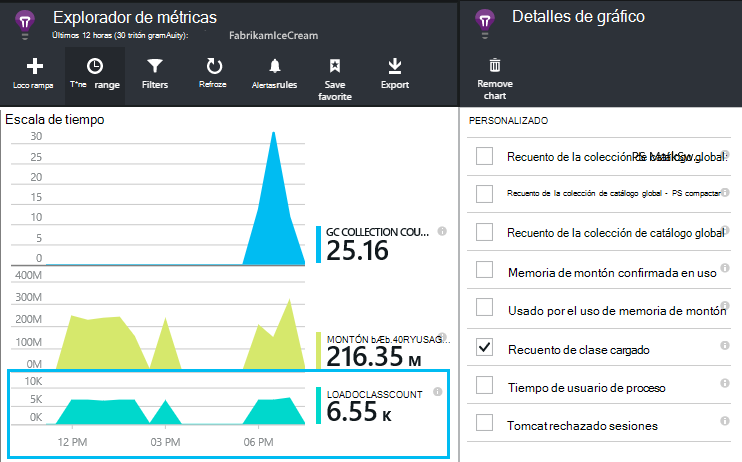

### Contadores de rendimiento de UNIX

* [Instalar collectd con el complemento de la información de la aplicación](app-insights-java-collectd.md) para obtener una amplia variedad de datos de red y del sistema.

## Pruebas de web de disponibilidad

Información de la aplicación puede probar su sitio Web a intervalos regulares para comprobar que es hacia arriba y a responder bien. [Configurar][availability], desplácese hacia abajo, haga clic en disponibilidad.

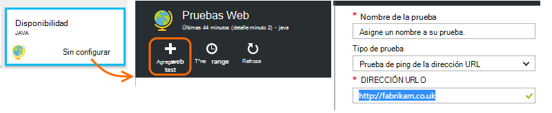

Si su sitio deja de funcionar obtendrá gráficos de tiempos de respuesta, además de notificaciones de correo electrónico.

[Más información acerca de las pruebas de disponibilidad web.][availability] 

## Registros de diagnóstico

Si está usando Logback o Log4J (v1.2 o 2.0) para realizar un seguimiento, puede hacer que los registros de seguimiento enviados automáticamente información de la aplicación donde puede explorar y buscar en ellas.

[Obtenga más información sobre los registros de diagnóstico][javalogs]

## Telemetría personalizado 

Insertar líneas de código en la aplicación web de Java para averiguar qué hacen los usuarios con él o para ayudar a diagnosticar problemas. 

Puede insertar código en la página web JavaScript y en el servidor de Java.

[Obtenga más información sobre telemetría personalizado][track]

## Pasos siguientes

#### Detectar y diagnosticar problemas

* [Agregar telemetría de cliente de web] [ usage] obtener telemetría de rendimiento desde el cliente web.
* [Configurar pruebas web] [ availability] para asegurarse de que la aplicación sea directo y capacidad de respuesta.
* [Busque registros de eventos y] [ diagnostic] para ayudar a diagnosticar problemas.
* [Capturar trazas Log4J o Logback][javalogs]

#### Realizar un seguimiento de uso

* [Agregar telemetría de cliente de web] [ usage] a las vistas de la página de monitor y métricas de usuario básica.
* [Realizar un seguimiento de eventos personalizados y mediciones] [ track] para obtener información sobre cómo se usa la aplicación, tanto en el cliente y el servidor.

<!--Link references-->

[availability]: app-insights-monitor-web-app-availability.md
[diagnostic]: app-insights-diagnostic-search.md
[java]: app-insights-java-get-started.md
[javalogs]: app-insights-java-trace-logs.md
[metrics]: app-insights-metrics-explorer.md
[track]: app-insights-api-custom-events-metrics.md
[usage]: app-insights-web-track-usage.md

 