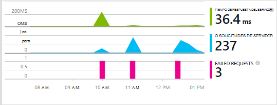
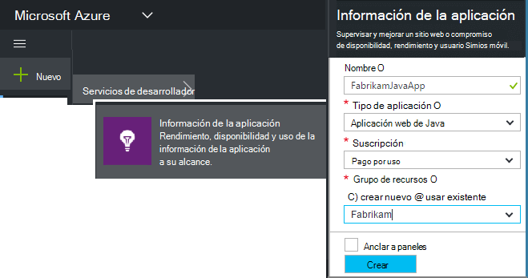
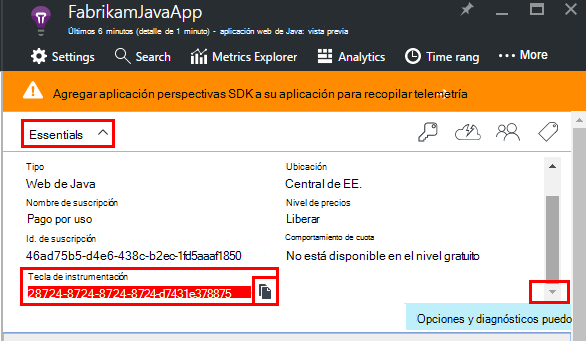
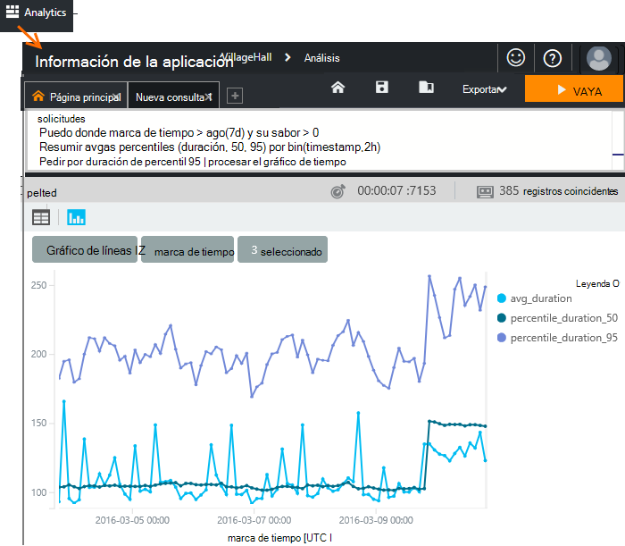
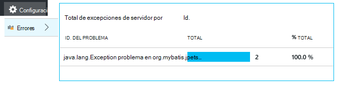
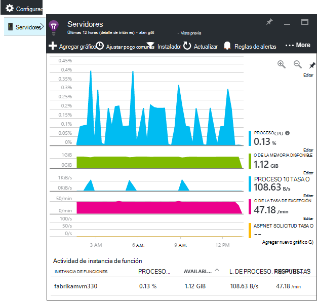
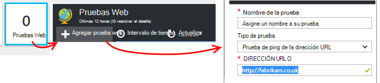
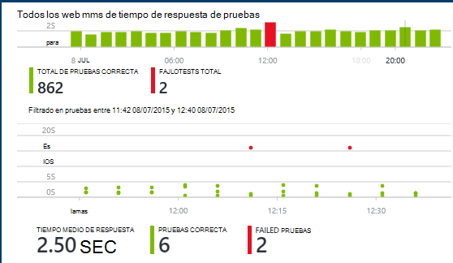

<properties
    pageTitle="Análisis de aplicación web de Java con recomendaciones de aplicación | Microsoft Azure"
    description="Supervisar el rendimiento y el uso de su sitio Web de Java con recomendaciones de aplicación. "
    services="application-insights"
    documentationCenter="java"
    authors="alancameronwills"
    manager="douge"/>

<tags
    ms.service="application-insights"
    ms.workload="tbd"
    ms.tgt_pltfrm="ibiza"
    ms.devlang="na"
    ms.topic="get-started-article"
    ms.date="08/17/2016"
    ms.author="awills"/>

# Introducción a la información de la aplicación en un proyecto de web Java

*Información de la aplicación está en vista previa.*

[AZURE.INCLUDE [app-insights-selector-get-started](../../includes/app-insights-selector-get-started.md)]

[Información de la aplicación](https://azure.microsoft.com/services/application-insights/) es un servicio de análisis extensible que le ayuda a comprender el rendimiento y el uso de la aplicación activa. Usar para [detectar y diagnosticar problemas de rendimiento y excepciones](app-insights-detect-triage-diagnose.md)y [escribir código] [ api] para realizar un seguimiento de qué hacer los usuarios con la aplicación.

Información de la aplicación es compatible con aplicaciones de Java que se ejecutan en Linux, Unix o Windows.

Te hace falta:

* Oracle JRE 1,6 o posterior, o Zulú JRE 1,6 o posterior
* Una suscripción a [Microsoft Azure](https://azure.microsoft.com/). (Puede empezar con la [versión de prueba gratuita](https://azure.microsoft.com/pricing/free-trial/)).

*Si tiene una aplicación web que ya está activa, podría siga el procedimiento alternativo para [Agregar el SDK en tiempo de ejecución en el servidor web](app-insights-java-live.md). Alternativa evita volver a generar el código, pero no aparece la opción escribir código para realizar un seguimiento de la actividad de usuario.*

## 1. obtener una clave de instrumentación perspectivas de aplicación

1. Inicie sesión en el [portal de Microsoft Azure](https://portal.azure.com).
2. Cree un recurso de información de la aplicación. Establezca el tipo de aplicación en la aplicación web de Java.

    
4. Busque la clave de instrumentación del nuevo recurso. Debe pegar esta clave en el proyecto de código breve.

    

## 2. Agregue el SDK de perspectivas de aplicación de Java a un proyecto

*Elija la forma adecuada para el proyecto.*

#### Si está usando Eclipse para crear un proyecto de experto o Web dinámica...

Usar el [SDK de perspectivas de aplicación para el complemento de Java][eclipse].

#### Si está usando experto...

Si el proyecto ya está configurado para usar a Maven para generar, combinar el código siguiente al archivo pom.xml.

A continuación, actualice las dependencias del proyecto para obtener los archivos binarios descargados.

    <repositories>
       <repository>
          <id>central</id>
          <name>Central</name>
          <url>http://repo1.maven.org/maven2</url>
       </repository>
    </repositories>

    <dependencies>
      <dependency>
        <groupId>com.microsoft.azure</groupId>
        <artifactId>applicationinsights-web</artifactId>
        <!-- or applicationinsights-core for bare API -->
        <version>[1.0,)</version>
      </dependency>
    </dependencies>

* *¿Generar o suma de comprobación de errores de validación?* Intente usar una versión específica, como por ejemplo: `<version>1.0.n</version>`. Encontrará la versión más reciente en el [SDK de notas](https://github.com/Microsoft/ApplicationInsights-Java#release-notes) o en nuestra [artefactos experto](http://search.maven.org/#search%7Cga%7C1%7Capplicationinsights).
* *¿Necesita actualizar un nuevo SDK?* Actualizar las dependencias del proyecto.

#### Si está usando Gradle...

Si el proyecto ya está configurado para usar Gradle para generar, combinar el código siguiente al archivo build.gradle.

A continuación, actualice las dependencias del proyecto para obtener los archivos binarios descargados.

    repositories {
      mavenCentral()
    }

    dependencies {
      compile group: 'com.microsoft.azure', name: 'applicationinsights-web', version: '1.+'
      // or applicationinsights-core for bare API
    }

* ¿ *Validación generar o suma de comprobación de errores? Intente usar una versión específica, como por ejemplo:* `version:'1.0.n'`. *Encontrará la versión más reciente en el [SDK de notas](https://github.com/Microsoft/ApplicationInsights-Java#release-notes).*
* *Actualizar a un nuevo SDK*
 * Actualizar las dependencias del proyecto.

#### En caso contrario...

Agregar manualmente el SDK:

1. Descargue la [aplicación perspectivas SDK para Java](https://aka.ms/aijavasdk).
2. Extraer los archivos binarios del archivo zip y agregarlas a su proyecto.

### Preguntas...

* *¿Qué es la relación entre el `-core` y `-web` componentes en el zip?*

 * `applicationinsights-core`proporciona la API vacíos. Siempre debe este componente.
 * `applicationinsights-web`Proporciona métricas que un seguimiento de recuentos de solicitud HTTP y tiempos de respuesta. Puede omitir este componente si no desea que esta telemetría recopila automáticamente. Por ejemplo, si desea escribir su propio.

* *Para actualizar el SDK cuando se publican cambios*
 * Descargue la última [Aplicación perspectivas SDK para Java](https://aka.ms/qqkaq6) y reemplazar los antiguos.
 * Cambios se describen en las [notas de la versión de SDK](https://github.com/Microsoft/ApplicationInsights-Java#release-notes).

## 3. Agregue un archivo de aplicación perspectivas .xml

Agregar ApplicationInsights.xml a la carpeta de recursos del proyecto o asegúrese de que se agrega a la ruta de clase de implementación de su proyecto. Copie el siguiente XML en él.

Sustituir la clave de instrumentación que obtuvo desde el portal de Azure.

    <?xml version="1.0" encoding="utf-8"?>
    <ApplicationInsights xmlns="http://schemas.microsoft.com/ApplicationInsights/2013/Settings" schemaVersion="2014-05-30">

      <!-- The key from the portal: -->

      <InstrumentationKey>** Your instrumentation key **</InstrumentationKey>

      <!-- HTTP request component (not required for bare API) -->

      <TelemetryModules>
        <Add type="com.microsoft.applicationinsights.web.extensibility.modules.WebRequestTrackingTelemetryModule"/>
        <Add type="com.microsoft.applicationinsights.web.extensibility.modules.WebSessionTrackingTelemetryModule"/>
        <Add type="com.microsoft.applicationinsights.web.extensibility.modules.WebUserTrackingTelemetryModule"/>
      </TelemetryModules>

      <!-- Events correlation (not required for bare API) -->
      <!-- These initializers add context data to each event -->

      <TelemetryInitializers>
        <Add   type="com.microsoft.applicationinsights.web.extensibility.initializers.WebOperationIdTelemetryInitializer"/>
        <Add type="com.microsoft.applicationinsights.web.extensibility.initializers.WebOperationNameTelemetryInitializer"/>
        <Add type="com.microsoft.applicationinsights.web.extensibility.initializers.WebSessionTelemetryInitializer"/>
        <Add type="com.microsoft.applicationinsights.web.extensibility.initializers.WebUserTelemetryInitializer"/>
        <Add type="com.microsoft.applicationinsights.web.extensibility.initializers.WebUserAgentTelemetryInitializer"/>

      </TelemetryInitializers>
    </ApplicationInsights>

* La clave de instrumentación se envía junto con todos los elementos de telemetría y perspectivas de aplicación para que se muestre en los recursos que le indica.
* El componente de solicitud HTTP es opcional. Envía automáticamente telemetría sobre las convocatorias y tiempos de respuesta en el portal.
* Correlación de eventos es una adición al componente de solicitud HTTP. Le asigna un identificador a cada solicitud recibido por el servidor y agrega este identificador como una propiedad para cada elemento de telemetría como la propiedad 'Operation.Id'. Permite relacionar la telemetría asociada a cada solicitud estableciendo un filtro de [búsqueda de diagnóstico][diagnostic].
* La tecla de aplicación perspectivas puede pasar dinámicamente desde el portal de Azure como una propiedad del sistema (-DAPPLICATION_INSIGHTS_IKEY = your_ikey). Si no hay ninguna propiedad definida, comprueba la variable de entorno (APPLICATION_INSIGHTS_IKEY) en la configuración de la aplicación de Azure. Si las propiedades están definidas, se utiliza el valor predeterminado InstrumentationKey desde ApplicationInsights.xml. Esta secuencia le ayuda a administrar InstrumentationKeys diferentes para diferentes entornos dinámicamente.

### Alternativas para establecer la clave de instrumentación

Aplicación perspectivas SDK busca la clave en este orden:

1. Propiedad del sistema:-DAPPLICATION_INSIGHTS_IKEY = your_ikey
2. Variable de entorno: APPLICATION_INSIGHTS_IKEY
3. Archivo de configuración: ApplicationInsights.xml

También puede [establecer en código](app-insights-api-custom-events-metrics.md#ikey):

    telemetryClient.InstrumentationKey = "...";

## 4. Agregue un filtro HTTP

El último paso de configuración permite que el componente de solicitud HTTP a registrar cada solicitud web. (No es necesario si desea que la API vacíos.)

Busque y abra el archivo web.xml en su proyecto y combinar el código siguiente bajo el nodo de aplicación web, donde se configuran los filtros de aplicación.

Para obtener los resultados más precisos, el filtro debe asignarse antes de todos los demás filtros.

    <filter>
      <filter-name>ApplicationInsightsWebFilter</filter-name>
      <filter-class>
        com.microsoft.applicationinsights.web.internal.WebRequestTrackingFilter
      </filter-class>
    </filter>
    <filter-mapping>
       <filter-name>ApplicationInsightsWebFilter</filter-name>
       <url-pattern>/*</url-pattern>
    </filter-mapping>

#### Si está usando resorte Web MVC 3.1 o posterior

Editar estos elementos para incluir el paquete de aplicación perspectivas:

    <context:component-scan base-package=" com.springapp.mvc, com.microsoft.applicationinsights.web.spring"/>

    <mvc:interceptors>
        <mvc:interceptor>
            <mvc:mapping path="/**"/>
            <bean class="com.microsoft.applicationinsights.web.spring.RequestNameHandlerInterceptorAdapter" />
        </mvc:interceptor>
    </mvc:interceptors>

#### Si está usando Struts 2

Agregar este elemento al archivo de configuración de Struts (generalmente denominado struts.xml o struts default.xml):

     <interceptors>
       <interceptor name="ApplicationInsightsRequestNameInterceptor" class="com.microsoft.applicationinsights.web.struts.RequestNameInterceptor" />
     </interceptors>
     <default-interceptor-ref name="ApplicationInsightsRequestNameInterceptor" />

(Si tiene interceptores definidos en una pila de forma predeterminada, el interceptor puede simplemente agregarse a dicha pila.)

## 5. ejecute la aplicación

Elija ejecutar en modo de depuración en su equipo de desarrollo o publicar en el servidor.

## 6. ver su telemetría en perspectivas de aplicación

Volver a los recursos de perspectivas de aplicación en [el portal de Microsoft Azure](https://portal.azure.com).

Datos de las solicitudes HTTP aparecen en el módulo de introducción. (Si no está allí, espere unos segundos y, a continuación, haga clic en Actualizar).

[Más información sobre cómo métricas.][metrics]

Haga clic en cualquier gráfico para ver más métricas agregados.

> Aplicación perspectivas se supone que es el formato de las solicitudes HTTP de aplicaciones MVC: `VERB controller/action`. Por ejemplo, `GET Home/Product/f9anuh81`, `GET Home/Product/2dffwrf5` y `GET Home/Product/sdf96vws` se agrupan en `GET Home/Product`. Esta agrupación permite significativas agregaciones de solicitudes, como el número de solicitudes y tiempo de ejecución promedio para las solicitudes de.

### Datos de instancia 

Haga clic en un tipo concreto de solicitud para ver las instancias individuales. 

Dos tipos de datos se muestran en la aplicación perspectivas: agregado datos, almacena y mostrarán como promedios, recuentos y sumas; y la instancia de datos: informes individuales de solicitudes HTTP, excepciones, vistas de página o eventos personalizados.

Al ver las propiedades de una solicitud, puede ver los eventos de telemetría asociados como solicitudes y excepciones.

### Análisis: Lenguaje de consulta eficaces

Como acumular más datos, puede ejecutar consultas tanto para agregar datos y encontrar instancias individuales. [Análisis]() es una herramienta eficaz para ambos para su uso y la descripción del rendimiento y fines de diagnóstico.

## 7. Instale la aplicación en el servidor

Publicar ahora la aplicación en el servidor, utilice comunicar a las personas y ver la telemetría mostrarse en el portal.

* Asegúrese de que el firewall permite a la aplicación enviar telemetría a estos puertos:

 * DC.Services.VisualStudio.com:443
 * F5.Services.VisualStudio.com:443

* En servidores de Windows, instalar:

 * [Microsoft Visual C++ redistribuible](http://www.microsoft.com/download/details.aspx?id=40784)

    (Este componente permite contadores).

## Errores de la solicitud y excepciones

Las excepciones no controladas se recopilan automáticamente:

Para recopilar datos de otras excepciones, tiene dos opciones:

* [Insertar llamadas a trackException() en el código][apiexceptions]. 
* [Instalar el agente de Java en su servidor](app-insights-java-agent.md). Especifique los métodos que desea ver.

## Supervisar las llamadas a métodos y dependencias externas

[Instalar el agente de Java](app-insights-java-agent.md) para iniciar sesión especificado métodos internos y llamadas realizadas por JDBC, con datos de tiempo.

## Contadores de rendimiento

Abrir **configuración**, **servidores**, para ver un intervalo de contadores de rendimiento.

### Personalizar la recopilación de contador de rendimiento

Para deshabilitar la colección del conjunto estándar de contadores de rendimiento, agregue el código siguiente bajo el nodo raíz del archivo ApplicationInsights.xml:

    <PerformanceCounters>
       <UseBuiltIn>False</UseBuiltIn>
    </PerformanceCounters>

### Recopilar contadores de rendimiento adicionales

Puede especificar contadores de rendimiento adicionales para que se van a recopilar.

#### Contadores JMX (expuestos por la máquina Virtual de Java)

    <PerformanceCounters>
      <Jmx>
        <Add objectName="java.lang:type=ClassLoading" attribute="TotalLoadedClassCount" displayName="Loaded Class Count"/>
        <Add objectName="java.lang:type=Memory" attribute="HeapMemoryUsage.used" displayName="Heap Memory Usage-used" type="composite"/>
      </Jmx>
    </PerformanceCounters>

*   `displayName`: El nombre que se muestran en el portal de información de la aplicación.
*   `objectName`: El nombre de objeto JMX.
*   `attribute`: El atributo del nombre del objeto JMX para capturar
*   `type`(opcional): el tipo de atributo del objeto JMX:
 *  Valor predeterminado: un tipo simple como int o long.
 *  `composite`: los datos de contador de rendimiento están en el formato de 'Attribute.Data'
 *  `tabular`: los datos de contador de rendimiento están en el formato de una fila de tabla

#### Contadores de rendimiento de Windows

Cada [contador de rendimiento de Windows](https://msdn.microsoft.com/library/windows/desktop/aa373083.aspx) es un miembro de una categoría (en la misma manera que un campo es un miembro de una clase). Categorías puede ser globales, o pueden han numerado o instancias con nombre.

    <PerformanceCounters>
      <Windows>
        <Add displayName="Process User Time" categoryName="Process" counterName="%User Time" instanceName="__SELF__" />
        <Add displayName="Bytes Printed per Second" categoryName="Print Queue" counterName="Bytes Printed/sec" instanceName="Fax" />
      </Windows>
    </PerformanceCounters>

*   displayName: el nombre que aparece en el portal de información de la aplicación.
*   categoryName: la categoría de contador de rendimiento (objeto de rendimiento) que está asociado este contador de rendimiento.
*   counterName: el nombre del contador de rendimiento.
*   instanceName: el nombre de la instancia de categoría de contador de rendimiento, o una cadena vacía (""), si la categoría contiene una sola instancia. Si categoryName es el proceso y el contador de rendimiento que le gustaría recopilar es el proceso de JVM actual en que se está ejecutando la aplicación, especifique `"__SELF__"`.

Contadores de rendimiento son visibles como métricas personalizados en el [Explorador de métricas][metrics].

### Contadores de rendimiento de UNIX

* [Instalar collectd con el complemento de la información de la aplicación](app-insights-java-collectd.md) para obtener una amplia variedad de datos de red y del sistema.

## Obtener datos de usuario y sesión

Aceptar, va a enviar telemetría desde el servidor web. Ahora para obtener la vista de 360 grados completa de la aplicación, puede agregar más supervisión:

* [Agregar telemetría a sus páginas web] [ usage] a las vistas de la página de monitor y métricas del usuario.
* [Configurar pruebas web] [ availability] para asegurarse de que la aplicación sea directo y capacidad de respuesta.

## Capturar trazas de registro

Puede usar información de la aplicación para sector y dados los registros desde Log4J, Logback u otros marcos de registro. Puede relacionar los registros con las solicitudes HTTP y otro telemetría. [Obtenga información sobre cómo][javalogs].

## Enviar su propio telemetría

Ahora que ha instalado el SDK, puede usar la API para enviar su propio telemetría.

* [Realizar un seguimiento de eventos personalizados y mediciones] [ api] para obtener información sobre qué hacen los usuarios con la aplicación.
* [Busque registros de eventos y] [ diagnostic] para ayudar a diagnosticar problemas.

## Pruebas de web de disponibilidad

Información de la aplicación puede probar su sitio Web a intervalos regulares para comprobar que es hacia arriba y a responder bien. [Configurar][availability], haga clic en las pruebas Web.

Si su sitio deja de funcionar obtendrá gráficos de tiempos de respuesta, además de notificaciones de correo electrónico.

[Más información acerca de las pruebas de disponibilidad web.][availability] 

## ¿Preguntas? ¿Tiene problemas?

[Solución de problemas de Java](app-insights-java-troubleshoot.md)

## Pasos siguientes

Para obtener más información, consulte el [Centro para desarrolladores de Java](/develop/java/).

<!--Link references-->

[api]: app-insights-api-custom-events-metrics.md
[apiexceptions]: app-insights-api-custom-events-metrics.md#track-exception
[availability]: app-insights-monitor-web-app-availability.md
[diagnostic]: app-insights-diagnostic-search.md
[eclipse]: app-insights-java-eclipse.md
[javalogs]: app-insights-java-trace-logs.md
[metrics]: app-insights-metrics-explorer.md
[usage]: app-insights-web-track-usage.md
