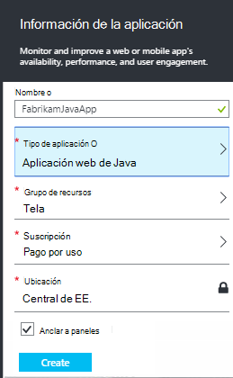

<properties 
    pageTitle="Información de la aplicación para las aplicaciones web de Java que ya están live" 
    description="Iniciar una aplicación web que se está ejecutando en el servidor de supervisión" 
    services="application-insights" 
    documentationCenter="java"
    authors="alancameronwills" 
    manager="douge"/>

<tags 
    ms.service="application-insights" 
    ms.workload="tbd" 
    ms.tgt_pltfrm="ibiza" 
    ms.devlang="na" 
    ms.topic="article" 
    ms.date="08/24/2016" 
    ms.author="awills"/>
 
# Información de la aplicación para las aplicaciones web de Java que ya están live

*Información de la aplicación está en vista previa.*

Si tiene una aplicación web que se está ejecutando en su servidor J2EE, puede empezar a supervisar con [Recomendaciones de aplicación](app-insights-overview.md) sin necesidad de realizar cambios en el código o compilar su proyecto. Con esta opción, obtendrá información sobre las solicitudes HTTP enviado a su servidor, las excepciones no controladas y contadores de rendimiento.

Necesitará una suscripción a [Microsoft Azure](https://azure.com).

> [AZURE.NOTE] El procedimiento de esta página, agrega el SDK a su aplicación web en tiempo de ejecución. Esta instrumentación runtime es útil si no desea actualizar o volver a generar el código fuente. Pero, si es posible, se recomienda [Agregue el SDK de código fuente](app-insights-java-get-started.md) en su lugar. Que le ofrece más opciones, como la escritura de código para realizar un seguimiento de la actividad de usuario.

## 1. obtener una clave de instrumentación perspectivas de aplicación

1. Inicie sesión en el [portal de Microsoft Azure](https://portal.azure.com)
2. Crear un nuevo recurso de aplicación perspectivas

    
3. Establezca el tipo de aplicación en la aplicación web de Java.

    
4. Busque la clave de instrumentación del nuevo recurso. Debe pegar esta clave en el proyecto de código breve.

    

## 2. Descargue el SDK

1. Descargue la [aplicación perspectivas SDK para Java](https://aka.ms/aijavasdk). 
2. En el servidor, extraer el contenido SDK en el directorio desde el que se cargan los archivos binarios de proyecto. Si está usando Tomcat, este directorio sería normalmente en`webapps\<your_app_name>\WEB-INF\lib`

## 3. agregar un archivo xml de información de la aplicación

Crear ApplicationInsights.xml en la carpeta en la que ha agregado el SDK. En él, coloque el siguiente código XML.

Sustituir la clave de instrumentación que obtuvo desde el portal de Azure.

    <?xml version="1.0" encoding="utf-8"?>
    <ApplicationInsights xmlns="http://schemas.microsoft.com/ApplicationInsights/2013/Settings" schemaVersion="2014-05-30">

      <!-- The key from the portal: -->

      <InstrumentationKey>** Your instrumentation key **</InstrumentationKey>

      <!-- HTTP request component (not required for bare API) -->

      <TelemetryModules>
        <Add type="com.microsoft.applicationinsights.web.extensibility.modules.WebRequestTrackingTelemetryModule"/>
        <Add type="com.microsoft.applicationinsights.web.extensibility.modules.WebSessionTrackingTelemetryModule"/>
        <Add type="com.microsoft.applicationinsights.web.extensibility.modules.WebUserTrackingTelemetryModule"/>
      </TelemetryModules>

      <!-- Events correlation (not required for bare API) -->
      <!-- These initializers add context data to each event -->

      <TelemetryInitializers>
        <Add   type="com.microsoft.applicationinsights.web.extensibility.initializers.WebOperationIdTelemetryInitializer"/>
        <Add type="com.microsoft.applicationinsights.web.extensibility.initializers.WebOperationNameTelemetryInitializer"/>
        <Add type="com.microsoft.applicationinsights.web.extensibility.initializers.WebSessionTelemetryInitializer"/>
        <Add type="com.microsoft.applicationinsights.web.extensibility.initializers.WebUserTelemetryInitializer"/>
        <Add type="com.microsoft.applicationinsights.web.extensibility.initializers.WebUserAgentTelemetryInitializer"/>

      </TelemetryInitializers>
    </ApplicationInsights>

* La clave de instrumentación se envía junto con todos los elementos de telemetría y perspectivas de aplicación para que se muestre en los recursos que le indica.
* El componente de solicitud HTTP es opcional. Envía automáticamente telemetría sobre las convocatorias y tiempos de respuesta en el portal.
* Correlación de eventos es una adición al componente de solicitud HTTP. Le asigna un identificador a cada solicitud recibido por el servidor y agrega este identificador como una propiedad para cada elemento de telemetría como la propiedad 'Operation.Id'. Permite relacionar la telemetría asociada a cada solicitud estableciendo un filtro de [búsqueda de diagnóstico](app-insights-diagnostic-search.md).

## 4. Agregue un filtro HTTP

Busque y abra el archivo web.xml en su proyecto y combinar el siguiente fragmento de código en el nodo de aplicación web, donde se configuran los filtros de aplicación.

Para obtener los resultados más precisos, el filtro debe asignarse antes de todos los demás filtros.

    <filter>
      <filter-name>ApplicationInsightsWebFilter</filter-name>
      <filter-class>
        com.microsoft.applicationinsights.web.internal.WebRequestTrackingFilter
      </filter-class>
    </filter>
    <filter-mapping>
       <filter-name>ApplicationInsightsWebFilter</filter-name>
       <url-pattern>/*</url-pattern>
    </filter-mapping>

## 5. excepciones de firewall de verificación

Debe [establecer excepciones para enviar los datos salientes](app-insights-ip-addresses.md).

## 6. reinicie la aplicación web

## 7. ver su telemetría en perspectivas de aplicación

Volver a los recursos de perspectivas de aplicación en [el portal de Microsoft Azure](https://portal.azure.com).

Telemetría acerca de las solicitudes HTTP aparece en el módulo de introducción. (Si no está allí, espere unos segundos y, a continuación, haga clic en Actualizar).

 

Haga clic en cualquier gráfico para ver más métricas. 

 

Y al ver las propiedades de una solicitud, puede ver los eventos de telemetría asociados como solicitudes y excepciones.
 

[Más información sobre cómo métricas.](app-insights-metrics-explorer.md)

## Pasos siguientes

* [Agregar telemetría a las páginas web](app-insights-web-track-usage.md) a las vistas de la página de monitor y métricas del usuario.
* [Configurar pruebas web](app-insights-monitor-web-app-availability.md) para asegurarse de que la aplicación sea directo y capacidad de respuesta.
* [Capturar trazas de registro](app-insights-java-trace-logs.md)
* [Registros y eventos de búsqueda](app-insights-diagnostic-search.md) para ayudar a diagnosticar problemas.

 
