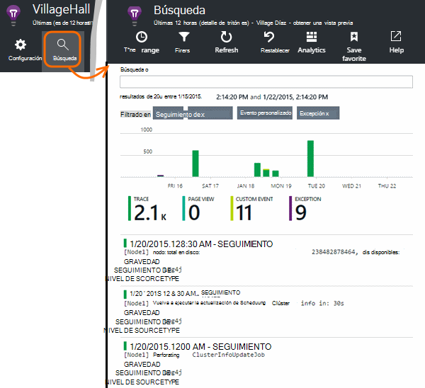

<properties 
    pageTitle="Explorar los registros de seguimiento de información de la aplicación de Java" 
    description="Búsqueda Log4J o Logback trazas en perspectivas de aplicación" 
    services="application-insights" 
    documentationCenter="java"
    authors="alancameronwills" 
    manager="douge"/>

<tags 
    ms.service="application-insights" 
    ms.workload="tbd" 
    ms.tgt_pltfrm="ibiza" 
    ms.devlang="na" 
    ms.topic="article" 
    ms.date="07/12/2016" 
    ms.author="awills"/>

# Explorar los registros de seguimiento de información de la aplicación de Java

Si está usando Logback o Log4J (v1.2 o 2.0) para realizar un seguimiento, puede hacer que los registros de seguimiento enviados automáticamente información de la aplicación donde puede explorar y buscar en ellas.

Instalar [Aplicación perspectivas SDK para Java][java], si todavía no lo ha hecho ya.

## Agregar registro de bibliotecas a su proyecto

*Elija la forma adecuada para el proyecto.*

#### Si está usando experto...

Si el proyecto ya está configurado para usar a Maven para generar, combinar uno de los siguientes fragmentos de código en el archivo pom.xml.

A continuación, actualice las dependencias del proyecto, para obtener los archivos binarios descargados.

*Logback*

    <dependencies>
       <dependency>
          <groupId>com.microsoft.azure</groupId>
          <artifactId>applicationinsights-logging-logback</artifactId>
          <version>[1.0,)</version>
       </dependency>
    </dependencies>

*Versión 2.0 Log4J*

    <dependencies>
       <dependency>
          <groupId>com.microsoft.azure</groupId>
          <artifactId>applicationinsights-logging-log4j2</artifactId>
          <version>[1.0,)</version>
       </dependency>
    </dependencies>

*Log4J v1.2*

    <dependencies>
       <dependency>
          <groupId>com.microsoft.azure</groupId>
          <artifactId>applicationinsights-logging-log4j1_2</artifactId>
          <version>[1.0,)</version>
       </dependency>
    </dependencies>

#### Si está usando Gradle...

Si el proyecto ya está configurado para usar Gradle para generar, agregue una de las siguientes líneas a la `dependencies` grupo en su archivo build.gradle:

A continuación, actualice las dependencias del proyecto, para obtener los archivos binarios descargados.

**Logback**

    compile group: 'com.microsoft.azure', name: 'applicationinsights-logging-logback', version: '1.0.+'

**Versión 2.0 Log4J**

    compile group: 'com.microsoft.azure', name: 'applicationinsights-logging-log4j2', version: '1.0.+'

**Log4J v1.2**

    compile group: 'com.microsoft.azure', name: 'applicationinsights-logging-log4j1_2', version: '1.0.+'

#### En caso contrario...

Descargar y extraer la appender apropiado, agregue la biblioteca correspondiente a su proyecto:

Registrador | Descargar | Biblioteca
----|----|----
Logback|[SDK con Logback appender](https://aka.ms/xt62a4)|registro de applicationinsights de logback
Versión 2.0 Log4J|[SDK con Log4J v2 appender](https://aka.ms/qypznq)|registro de applicationinsights de log4j2 
Log4J v1.2|[SDK con Log4J v1.2 appender](https://aka.ms/ky9cbo)|registro de applicationinsights de log4j1_2 

## Agregar el appender el marco de trabajo de registro

Para empezar a recibir trazas, combinar el fragmento de código para el archivo de configuración de Log4J o Logback relevante: 

*Logback*

    <appender name="aiAppender" 
      class="com.microsoft.applicationinsights.logback.ApplicationInsightsAppender">
    </appender>
    <root level="trace">
      <appender-ref ref="aiAppender" />
    </root>

*Versión 2.0 Log4J*

    <Configuration packages="com.microsoft.applicationinsights.Log4j">
      <Appenders>
        <ApplicationInsightsAppender name="aiAppender" />
      </Appenders>
      <Loggers>
        <Root level="trace">
          <AppenderRef ref="aiAppender"/>
        </Root>
      </Loggers>
    </Configuration>

*Log4J v1.2*

    <appender name="aiAppender" 
         class="com.microsoft.applicationinsights.log4j.v1_2.ApplicationInsightsAppender">
    </appender>
    <root>
      <priority value ="trace" />
      <appender-ref ref="aiAppender" />
    </root>

Appenders de aplicación perspectivas pueden hacer referencia a cualquier registrador configurado y no necesariamente por el registrador de raíz (como se muestra en los ejemplos de código anteriores).

## Explorar los seguimientos en el portal de información de la aplicación

Ahora que ha configurado el proyecto para enviar seguimientos de impresiones de aplicación, puede ver y buscar estas trazas en el portal de información de la aplicación, en la [búsqueda] [ diagnostic] módulo.

## Pasos siguientes

[Búsqueda de diagnóstico][diagnostic]

<!--Link references-->

[diagnostic]: app-insights-diagnostic-search.md
[java]: app-insights-java-get-started.md

 
