<properties
    pageTitle="Aplicaciones web de aplicación perspectivas para JavaScript | Microsoft Azure"
    description="Obtener recuentos de vista y sesión de la página, de los datos de cliente de web y realizar un seguimiento de los patrones de uso. Detectar excepciones y problemas de rendimiento en páginas web de JavaScript."
    services="application-insights"
    documentationCenter=""
    authors="alancameronwills"
    manager="douge"/>

<tags
    ms.service="application-insights"
    ms.workload="tbd"
    ms.tgt_pltfrm="ibiza"
    ms.devlang="na"
    ms.topic="get-started-article"
    ms.date="08/15/2016"
    ms.author="awills"/>

# Información de la aplicación para las páginas web

[AZURE.INCLUDE [app-insights-selector-get-started-dotnet](../../includes/app-insights-selector-get-started-dotnet.md)]

Obtenga información sobre el rendimiento y el uso de la página web o la aplicación. Si agregar perspectivas de aplicación de Visual Studio a la secuencia de comandos de página, obtendrá intervalos de carga de páginas y llamadas de AJAX, recuentos y detalles de excepciones de explorador y errores de AJAX, así como usuarios y recuentos de sesión. Todas estas se pueden segmentar por página, sistema operativo cliente y versión del explorador, ubicación geográfica y otras dimensiones. También puede establecer alertas en el número de errores o reducir la carga de páginas.

Puede usar información de la aplicación con las páginas web: sólo tiene que agregar un fragmento de JavaScript. Si su servicio web [Java](app-insights-java-get-started.md) o [ASP.NET](app-insights-asp-net.md), puede integrar telemetría desde el servidor y los clientes.

Necesita una suscripción a [Microsoft Azure](https://azure.com). Si su equipo tiene una suscripción de la organización, pida al propietario agregarle su Account de Microsoft. Hay un nivel de precios gratuito, desarrollo y el uso de pequeños no cuestan nada.

## Configurar perspectivas de aplicación de la página web

¿En primer lugar, debe agregar perspectivas de aplicación a las páginas web? Es posible que haya lo ha hecho. Si elige agregar perspectivas de aplicación a la aplicación web en el cuadro de diálogo nuevo proyecto de Visual Studio, se agregó a continuación, la secuencia de comandos. En ese caso, no necesita hacer más.

En caso contrario, debe agregar un fragmento de código en las páginas web, como se explica a continuación.

### Abra un recurso de aplicación perspectivas

El recurso de información de la aplicación es donde se muestran los datos sobre el rendimiento y el uso de la página. 

Iniciar sesión en el [portal de Azure](https://portal.azure.com).

Si ya configuró supervisión del lado servidor de la aplicación, ya dispone de un recurso:

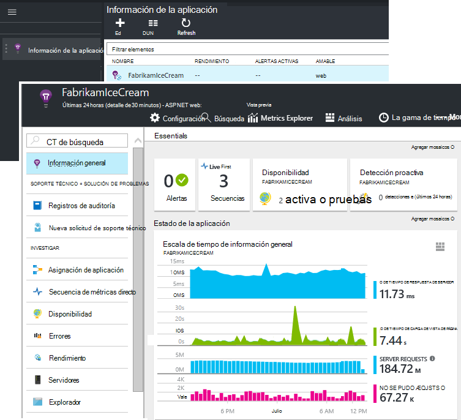

Si no tiene una, créela:

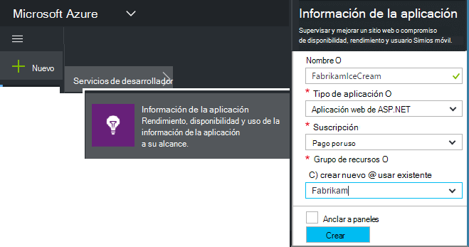

*¿Preguntas ya?* [Más información sobre la creación de un recurso](app-insights-create-new-resource.md).

### Agregar la secuencia de comandos SDK a su aplicación o páginas web

En Inicio rápido, obtener la secuencia de comandos para páginas web:

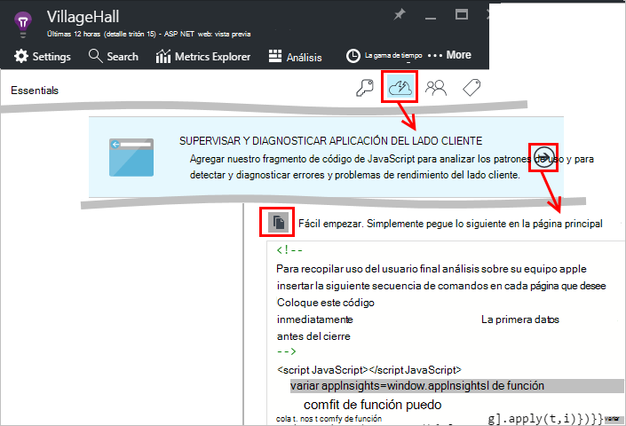

Insertar la secuencia de comandos justo antes del `</head>` etiqueta de cada página que desee hacer un seguimiento. Si su sitio Web tiene una página maestra, puede poner el script allí. Por ejemplo:

* En un proyecto de ASP.NET MVC, ¿ponerlo en`View\Shared\_Layout.cshtml`
* En un sitio de SharePoint, en el panel de control, abra [Configuración del sitio o página maestra](app-insights-sharepoint.md).

La secuencia de comandos contiene la clave de instrumentación que dirige a los datos a su recurso de información de la aplicación. 

([Explicación más profunda de la secuencia de comandos.](http://apmtips.com/blog/2015/03/18/javascript-snippet-explained/))

*(Si usa un marco conocido página web, busque alrededor de adaptadores perspectivas de aplicación. Por ejemplo, hay [un módulo de AngularJS](http://ngmodules.org/modules/angular-appinsights).)*

## Configuración detallada

Hay varios [parámetros](https://github.com/Microsoft/ApplicationInsights-JS/blob/master/API-reference.md#config) que puede establecer, aunque en la mayoría de los casos, no necesita. Por ejemplo, puede deshabilitar o limitar el número de llamadas de Ajax notificado por vista de página (para reducir el tráfico). O bien, puede establecer el modo de depuración tener telemetría desplazarse rápidamente por la canalización sin ser por lotes.

Para configurar estos parámetros, busque esta línea en el fragmento de código y agregue más elementos separados por comas después:

    })({
      instrumentationKey: "..."
      // Insert here
    });

Incluir los [parámetros disponibles](https://github.com/Microsoft/ApplicationInsights-JS/blob/master/API-reference.md#config) :

    // Send telemetry immediately without batching.
    // Remember to remove this when no longer required, as it
    // can affect browser performance.
    enableDebug: boolean,

    // Don't log browser exceptions.
    disableExceptionTracking: boolean,

    // Don't log ajax calls.
    disableAjaxTracking: boolean,

    // Limit number of Ajax calls logged, to reduce traffic.
    maxAjaxCallsPerView: 10, // default is 500

    // Time page load up to execution of first trackPageView().
    overridePageViewDuration: boolean,

    // Set these dynamically for an authenticated user.
    appUserId: string,
    accountId: string,

## Ejecute la aplicación

Ejecute la aplicación web, usa un rato en generar telemetría y a continuación, espere unos segundos. Puede ejecutar mediante la tecla **F5** en su equipo de desarrollo, o publicarlo y permitir a los usuarios jugar con él.

Si desea revisar la telemetría que envía una aplicación web de impresiones de aplicación, use herramientas de depuración de su explorador (**F12** en muchos exploradores). Datos se envían a dc.services.visualstudio.com.

## Explorar los datos de rendimiento del explorador

Abra el módulo de exploradores para mostrar los datos de rendimiento agregado de los exploradores de los usuarios.

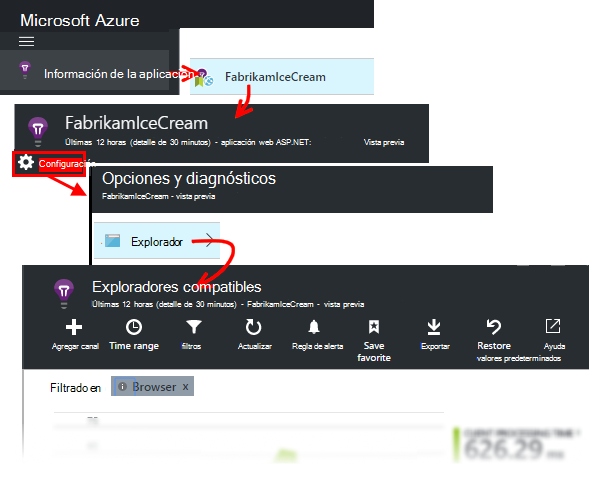

¿ *Aún sin datos? Haga clic en * *Actualizar* * en la parte superior de la página. ¿Aún nada? Vea [solución de problemas](app-insights-troubleshoot-faq.md).*

El módulo de exploradores es un [módulo de explorador métricas](app-insights-metrics-explorer.md) con selecciones de gráfico y filtros preestablecidos. Puede modificar el intervalo de tiempo, filtros y configuración de gráfico si desee y guarde el resultado como favorito. Haga clic en **Restaurar valores predeterminados** para volver a la configuración original de la hoja.

## Rendimiento de carga de página

En la parte superior es un gráfico segmentado de tiempos de carga. La altura total del gráfico representa el tiempo promedio para cargar y mostrar las páginas de la aplicación en los exploradores de los usuarios. El tiempo se mide desde cuando el explorador envía la solicitud HTTP inicial hasta carga sincrónico todos los eventos se han procesado, incluido el diseño y ejecución de scripts. No incluye tareas asincrónicas, como la carga de elementos web de AJAX llamadas.

El gráfico dividen el tiempo de carga de total de páginas en los [intervalos estándares definidos por el W3C](http://www.w3.org/TR/navigation-timing/#processing-model). 

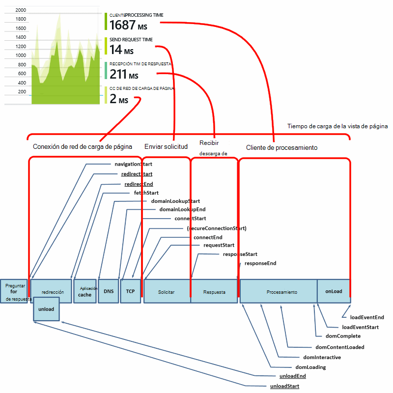

Tenga en cuenta que el tiempo de *conexión de red* suele ser menor de lo esperado, ya que es un promedio de todas las solicitudes desde el explorador en el servidor. Muchas solicitudes individuales tienen un tiempo de conexión de 0 porque ya hay una conexión activa con el servidor.

### ¿Reducir la carga?

Carga de páginas lentas es una importante fuente de insatisfacción para sus usuarios. Si el gráfico indica la carga de páginas lentas, es fácil investigar diagnóstico.

El gráfico muestra el promedio de todas las cargas de página en la aplicación. Para ver si el problema se limita a páginas concretas, buscar más abajo en el módulo, donde hay una cuadrícula segmentada por la dirección URL de la página:

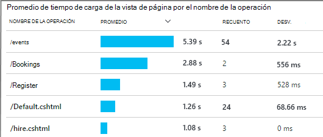

Observe que el recuento de vista de página y la desviación estándar. Si el número de páginas es muy bajo, a continuación, el problema no afectar a los usuarios mucho. Desviación estándar alta (comparable a la media propio) indica una gran cantidad de variación entre las mediciones individuales.

**Acercar una dirección URL y la vista de una página.** Haga clic en cualquier nombre de la página para ver una hoja de gráficos de explorador filtrados a esa dirección URL; y, a continuación, en una instancia de una vista de página.

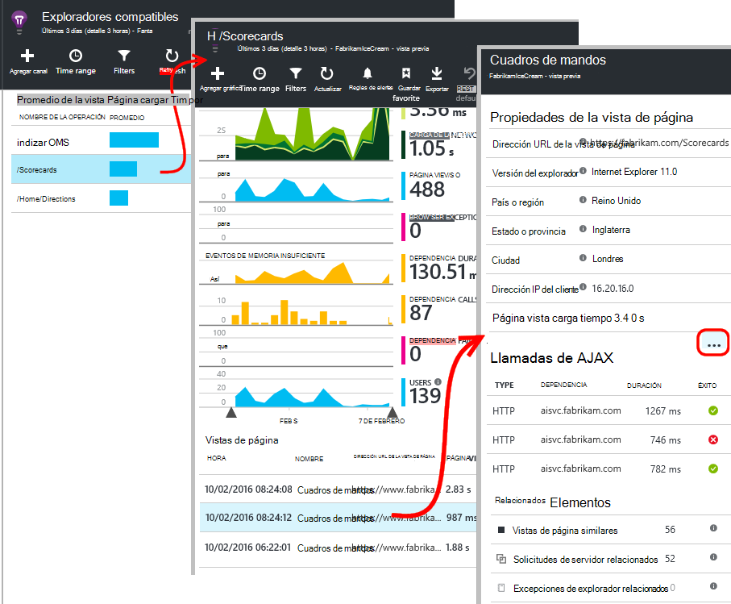

Haga clic en `...` para obtener una lista completa de propiedades para ese evento o inspeccionar las llamadas de Ajax y los eventos relacionados. Llamadas Ajax lentas influir en el tiempo de carga de página general si están sincrónicos. Eventos relacionados incluyen las solicitudes de servidor para la misma dirección URL (si ha configurado la información de la aplicación en el servidor web).

**Rendimiento de la página con el tiempo.** En el módulo de exploradores, cambiar la cuadrícula de tiempo de carga de la vista de página en un gráfico de líneas para ver si hay picos en momentos concretos:

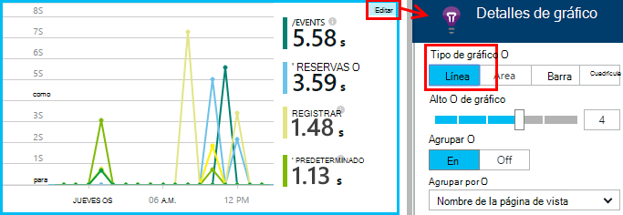

**Segmento de otras dimensiones.** ¿Las páginas son más lentas al cargar en el explorador, el sistema operativo cliente o la ubicación de usuario? Agregar un nuevo gráfico y experimentar con la dimensión **Agrupar por** .

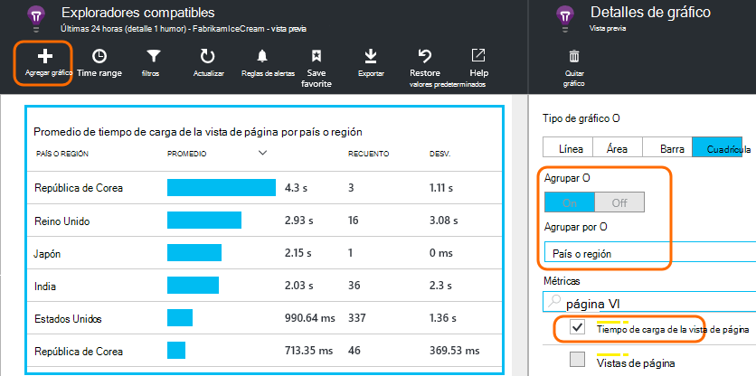

## Rendimiento de AJAX

Asegúrese de que las llamadas de AJAX en las páginas web funcionan correctamente. A menudo se utilizan para rellenar de forma asincrónica partes de la página. Aunque la página general puede cargar rápidamente, los usuarios podrían frustrados por vista de elementos web en blanco, espera para que aparezca en los mismos datos.

Llamadas de AJAX realizadas desde su página web se muestran en el módulo de exploradores como dependencias.

Hay gráficos de resumen en la parte superior del módulo:

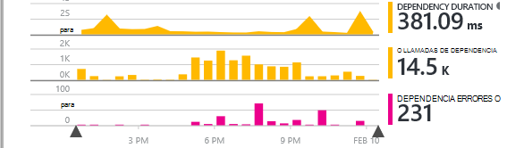

y detalladas cuadrículas inferiores:

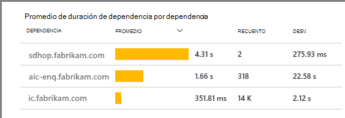

Haga clic en cualquier fila para obtener detalles específicos.

> [AZURE.NOTE] Si elimina el filtro de exploradores en el módulo, servidor y las dependencias de AJAX se incluyen en estos gráficos. Haga clic en Restaurar valores predeterminados para volver a configurar el filtro.

**Para explorar en profundidad error llamadas Ajax** desplácese hacia abajo hasta la cuadrícula de errores de dependencia y, a continuación, haga clic en una fila para ver casos específicos.

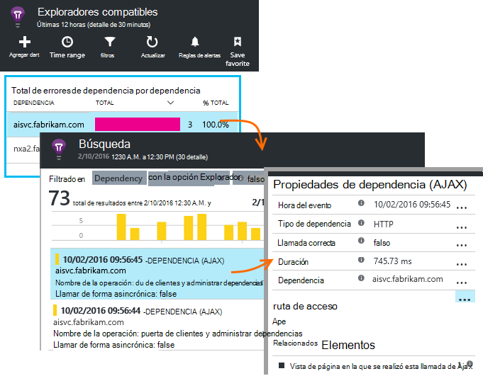

Haga clic en `...` para la telemetría completa para una llamada de Ajax.

### ¿No hay llamadas Ajax registrados?

Llamadas AJAX incluyen las llamadas HTTP realizadas desde la secuencia de comandos de la página web. Si no ve les notifica, compruebe que el fragmento de código no la `disableAjaxTracking` o `maxAjaxCallsPerView` [parámetros](https://github.com/Microsoft/ApplicationInsights-JS/blob/master/API-reference.md#config).

## Excepciones de explorador

En el módulo de exploradores, hay un gráfico de resumen de excepciones y a continuación, una cuadrícula de tipos de excepción más abajo el módulo.

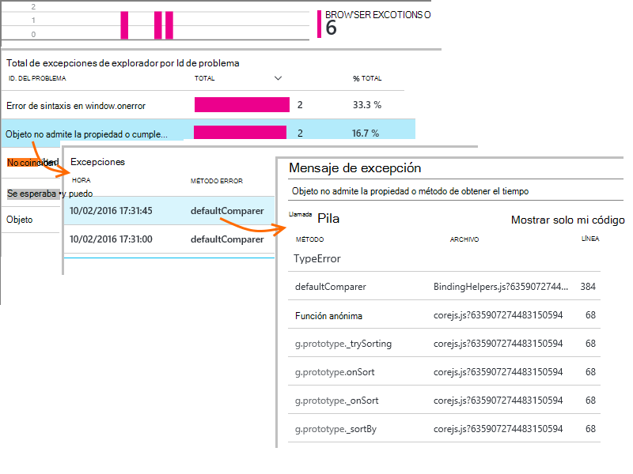

Si no ve las excepciones de explorador notificadas, compruebe que el fragmento de código no la `disableExceptionTracking` [parámetro](https://github.com/Microsoft/ApplicationInsights-JS/blob/master/API-reference.md#config).

## Inspeccionar eventos de la vista de página individuales

Normalmente aplicación perspectivas analizan telemetría de vista de página y verá solo acumulados informes, promediados por todos los usuarios. Pero con fines de depuración, también puede buscar en eventos de la vista de página individual.

En el módulo de búsqueda de diagnóstico, establezca los filtros a la vista página.

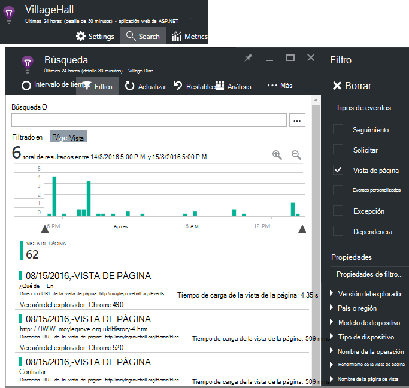

Seleccione cualquier evento para ver más detalles. En la página Detalles, haga clic en "..." para ver más detalles.

> [AZURE.NOTE] Si utiliza la [búsqueda](app-insights-diagnostic-search.md), observe que haya palabras completas: "Iene" y "cerca de" no coinciden "Acerca de".

También puede usar las eficaces [análisis de lenguaje de consulta](app-insights-analytics-tour.md) para buscar vistas de página.

### Propiedades de la vista de página

* **Duración de la vista de página** 

 * De forma predeterminada, el tiempo que se tarda en cargar la página de cliente solicitar carga completa (incluidos los archivos auxiliares pero excluyendo asincrónicas tareas como llamadas de Ajax). 
 * Si establece `overridePageViewDuration` en la [configuración de página](#detailed-configuration), el intervalo entre el cliente de solicitud de ejecución de la primera `trackPageView`. Si mueve trackPageView desde su posición habitual después de la secuencia de comandos en la inicialización, reflejará un valor diferente.
 * Si `overridePageViewDuration` está establecida y una duración argumento se proporciona en el `trackPageView()` llamar, a continuación, se utiliza el valor del argumento. 

## Recuentos de página personalizado

De forma predeterminada, un recuento de páginas se produce cada vez que se carga una página nueva en el explorador del cliente.  Pero desea contar vistas página adicional. Por ejemplo, una página puede mostrar su contenido en las pestañas y desea contar una página cuando el usuario cambia las pestañas. O código de JavaScript en la página puede cargar nuevo contenido sin cambiar la dirección URL del explorador.

Insertar una llamada de JavaScript como este en el punto correspondiente en el código de cliente:

    appInsights.trackPageView(myPageName);

El nombre de la página puede contener los mismos caracteres como una dirección URL, pero nada después de "#" o "?" se pasa por alto.

## Seguimiento de uso

¿Desea saber qué hacer los usuarios con la aplicación?

* [Obtenga más información sobre el uso de seguimiento](app-insights-web-track-usage.md)
* [Obtenga información sobre cómo métricas API y eventos personalizados](app-insights-api-custom-events-metrics.md).

#### Vídeo: Uso de seguimiento

> [AZURE.VIDEO tracking-usage-with-application-insights]

## Pasos siguientes

* [Realizar un seguimiento de uso](app-insights-web-track-usage.md)
* [Métricas y eventos personalizados](app-insights-api-custom-events-metrics.md)
* [Aprenda de medida de compilación](app-insights-overview-usage.md)

