<properties 
    pageTitle="Explorar métricas en aplicación perspectivas | Microsoft Azure" 
    description="Cómo interpretar los gráficos en el Explorador de métrica y cómo personalizar aspas métricas del explorador." 
    services="application-insights" 
    documentationCenter=""
    authors="alancameronwills" 
    manager="douge"/>

<tags 
    ms.service="application-insights" 
    ms.workload="tbd" 
    ms.tgt_pltfrm="ibiza" 
    ms.devlang="na" 
    ms.topic="article" 
    ms.date="10/15/2016" 
    ms.author="awills"/>
 
# Explorar métricas en perspectivas de aplicación

Métricas en [Aplicación perspectivas] [ start] son valores medidos y recuentos de eventos que se envían de telemetría desde la aplicación. Le ayudan a detectar problemas de rendimiento y ver tendencias de cómo se utiliza la aplicación. Hay una amplia gama de métricas estándares y también puede crear sus propios métricas personalizados y eventos.

Recuentos métricas y eventos se muestran en gráficos de valores agregados como sumas, promedios o recuentos.

Aquí es un gráfico de ejemplo:

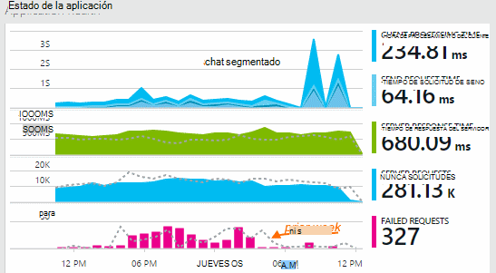

Algunos gráficos están segmentados: la altura total del gráfico en cualquier punto es la suma de las medidas que se muestran. La leyenda predeterminada muestra las cantidades más grandes.

Líneas de puntos muestra el valor de la métrica de una semana previamente.

## Intervalo de tiempo

Puede cambiar el intervalo de tiempo cubierto por los gráficos o las cuadrículas en cualquier módulo.

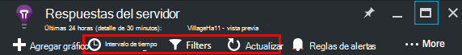

Si espera algunos datos que no se ha aparecido aún, haga clic en actualizar. Actualización gráficos a sí mismos a intervalos, pero los intervalos son más intervalos de tiempo mayores. En modo de lanzamiento, puede tardar un tiempo para que vienen a través de la canalización de análisis en un gráfico de datos.

Para acercar parte de un gráfico, arrastre sobre él:

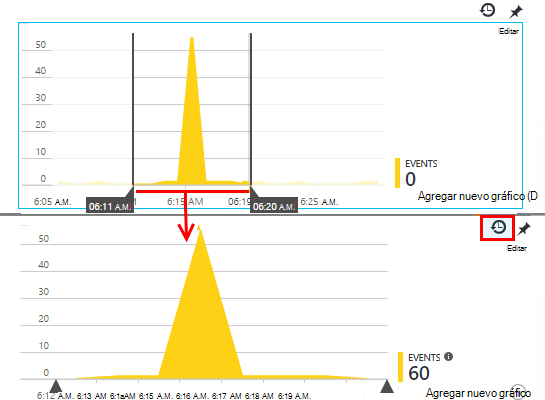

Haga clic en el botón Deshacer Zoom para restaurarla.

## Valores de detalle y punto

Pasar el mouse sobre el gráfico para mostrar los valores de las mediciones en ese momento.

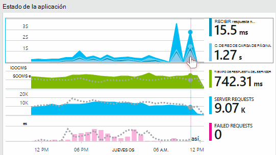

Se agrega el valor de la métrica en un momento determinado durante el intervalo de muestreo anterior. 

El intervalo de muestreo o "detalle" se muestra en la parte superior de la hoja. 

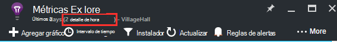

Puede ajustar el nivel de detalle en el módulo de intervalo de tiempo:

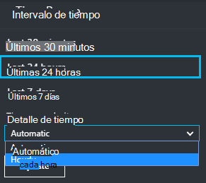

La granularidades disponibles dependen de intervalo de tiempo que seleccione. La granularidades explícitas son alternativas para el nivel de detalle "automático" del intervalo de tiempo. 

## Explorador de métricas

Haga clic en cualquier gráfico en el módulo de introducción para ver un conjunto más detallado de gráficos relacionados y cuadrículas. Puede editar estos gráficos y cuadrículas para centrarse en los detalles que le interesa.

O simplemente puede haga clic en el botón métricas explorador en el encabezado de la hoja de información general.

Por ejemplo, haga clic en gráfico de solicitudes de error de la aplicación web:

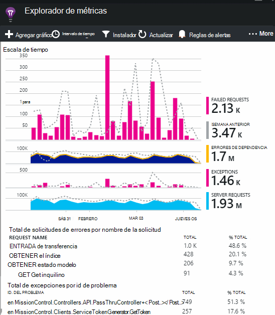

## ¿Qué significan las cifras?

Normalmente, la leyenda en el lado de forma predeterminada muestra el valor agregado durante el período del gráfico. Si coloca encima del gráfico, muestra el valor en ese momento.

Cada punto de datos en el gráfico es un agregado de los valores de datos que se ha recibido en el intervalo de muestreo anterior o "detalle". El nivel de detalle se muestra en la parte superior de la hoja y varía en función de la escala de tiempo general del gráfico.

Se pueden incorporar métricas de diferentes maneras: 

 * **Suma** agrega los valores de todos los puntos de datos recibidos a través del intervalo de muestreo o el período del gráfico.
 * **Promedio** divide la suma por el número de puntos de datos recibidos durante el intervalo.
 * Recuentos de **único** se utilizan para cuentas de usuarios y cuentas. Sobre el intervalo de muestreo o durante el período del gráfico, la ilustración muestra el recuento de diferentes usuarios visto en ese momento.

Puede cambiar el método de agregación:

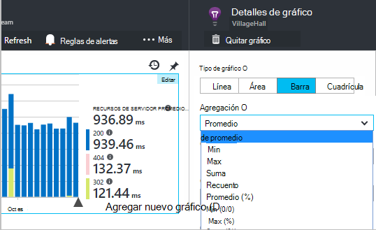

El método predeterminado para cada métrica se muestra cuando se crea un gráfico nuevo o cuando se anula la selección de todas las métricas:

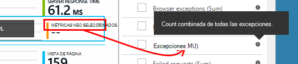

## Edición de gráficos y cuadrículas

Para agregar un nuevo gráfico en el módulo:

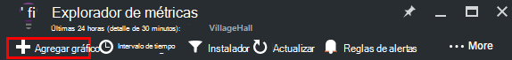

Seleccione **Editar** en un gráfico nuevo o existente para modificar lo que muestra:

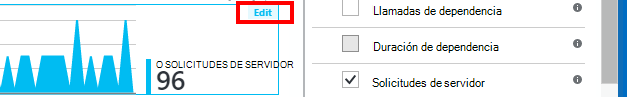

Puede mostrar más de una métrica en un gráfico, aunque hay restricciones acerca de las combinaciones que se pueden mostrar juntos. Tan pronto como elegir una métrica, algunos de los otros están deshabilitados. 

Si codificado [métricas personalizados] [ track] en su aplicación (llamadas a TrackMetric y TrackEvent) aparecerán aquí.

## Segmentación de datos

Por ejemplo, puede dividir una métrica por (propiedad) - para comparar las vistas de página en los clientes con sistemas operativos diferentes. 

Seleccionar un gráfico o cuadrícula, cambie de agrupación y elija una propiedad para agrupar por:

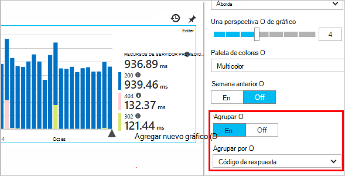

> [AZURE.NOTE] Cuando se utiliza la agrupación, los tipos de gráficos de barras y área proporcionan una presentación apilada. Esto es adecuado donde el método de agregación suma. Pero donde el tipo de agregación es el promedio, elija los tipos de visualización de línea o de cuadrícula. 

Si codificado [métricas personalizados] [ track] en su aplicación e incluyen valores de propiedad, podrá seleccionar la propiedad de la lista.

¿Es demasiado pequeño para datos segmentados el gráfico? Ajuste su alto:

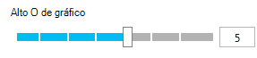

## Filtrar los datos

Para ver solo las métricas para un conjunto de valores de propiedad seleccionados:

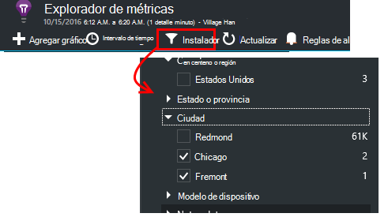

Si no selecciona ningún valor para una propiedad determinada, es lo mismo que seleccionar todos: no hay ningún filtro en esa propiedad.

Observe los recuentos de eventos junto a cada valor de propiedad. Al seleccionar valores de propiedad, los recuentos junto con otros valores de propiedad se ajustan.

Los filtros se aplican a todos los gráficos en un módulo. Si desea que distintos filtros aplicados a diferentes gráficos, crear y guardar módulos diferentes métricas. Si lo desea, puede anclar gráficos desde aspas diferentes al panel, para que pueda verlas junto con los demás.

### Quitar robot y probar el tráfico web

Usar el filtro de **tráfico Real o síntesis** y Active **Real**.

También puede filtrar por **origen del tráfico síntesis**.

### Para agregar propiedades a la lista de filtros

¿Desea filtrar telemetría en una categoría de su elección? Por ejemplo, puede dividir los usuarios en categorías diferentes, y le gustaría segmentar los datos por estas categorías.

[Crear su propia propiedad](app-insights-api-custom-events-metrics.md#properties). Establecer en un [Inicializador de telemetría](app-insights-api-custom-events-metrics.md#telemetry-initializers) para que aparezca en todos los telemetría - incluida la telemetría estándar enviada por módulos SDK diferentes.

## Editar el tipo de gráfico

Observe que puede cambiar entre las cuadrículas y gráficos:

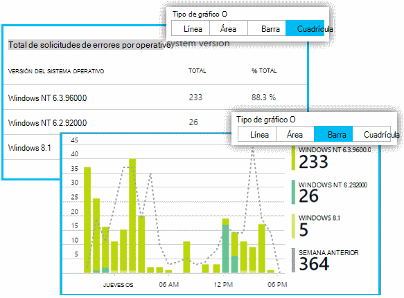

## Guarde el módulo de métricas

Cuando haya creado algunos gráficos, guardar como favorito. Puede elegir si desea compartir con otros miembros del equipo, si usa una cuenta de la organización.

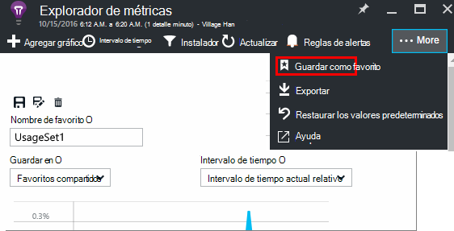

Para ver el módulo de nuevo, **vaya a la hoja de información general** y abrir favoritos:

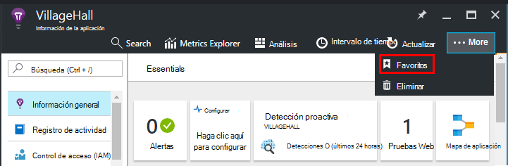

Si ha elegido el intervalo de tiempo relativa al guardar, el módulo se actualizará con la métrica más reciente. Si elige la opción de intervalo de tiempo absoluta, se muestran los mismos datos cada vez.

## Restablecer el módulo

Si modifica un módulo pero desea volver a Guardar conjunto original, haga clic en Restablecer.

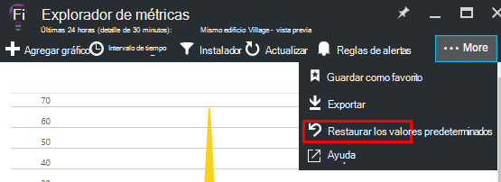

## Secuencia de métricas directo: métricas instantáneas para supervisar cerrar

Secuencia de métricas directo muestra las métricas de aplicación directamente en este momento, con un nivel de latencia de casi en tiempo real de 1 segundo. Esto es muy útil cuando está liberar una nueva compilación y desea asegurarse de que todo está funcionar según lo esperado, o investigar un incidente en tiempo real.

A diferencia de explorador métricas, secuencia métricas directo muestra un conjunto fijo de métricas. Los datos solo se mantiene mientras está en el gráfico y, a continuación, se descarta. 

Secuencia de métricas directo está disponible con aplicaciones perspectivas SDK para ASP.NET, versión 2.1.0 o posterior.

## Configurar alertas

Para recibir notificaciones por correo electrónico de valores inusuales de cualquier métrica, agregue una alerta. Puede enviar el correo electrónico a los administradores de la cuenta, o a las direcciones de correo electrónico específica.

[Más información acerca de las alertas][alerts].

## Exportar a Excel

Puede exportar datos de métricas que se muestran en el Explorador de métrica a un archivo de Excel. Los datos exportados incluyen datos de todos los gráficos y tablas tal como se muestra en el portal. 

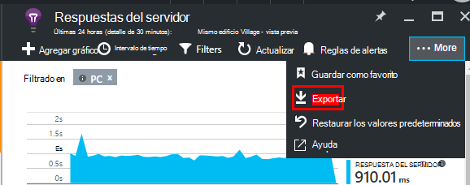

Los datos para cada tabla o gráfico se exportan a una hoja independiente en el archivo de Excel.

Lo que ve es lo que se exporta. Cambiar el intervalo de tiempo o filtros si desea cambiar el rango de datos exportados. Para las tablas, si se muestra el comando **cargar más** , puede hacer clic antes de hacer clic en Exportar para tener más datos exportados.

*Exportar funciona sólo para Internet Explorer y Chrome en este momento. Estamos trabajando para agregar compatibilidad con otros exploradores.*

## Exportar continuo

Si desea que los datos exportados continuamente para que se pueda procesar externamente, considere la posibilidad de usar [Exportar continuo](app-insights-export-telemetry.md).

### Power BI

Si desea aún más sofisticadas vistas de los datos, puede [Exportar a Power BI](http://blogs.msdn.com/b/powerbi/archive/2015/11/04/explore-your-application-insights-data-with-power-bi.aspx).

## Análisis

[Análisis](app-insights-analytics.md) es una manera más flexible para analizar la telemetría mediante un lenguaje de consulta eficaces. Utilizar si desea combinar o calcular resultados de métricas o realizar una exploración en deph de rendimiento recientes de la aplicación. Por otro lado, utilice Explorer métricas si desea que la actualización automática, gráficos del panel y alertas.

## Solución de problemas

*No puedo ver todos los datos en el gráfico.*

* Los filtros se aplican a todos los gráficos en el módulo. Asegúrese de que, mientras que desea concentrarse en un gráfico, no ha establecido un filtro que excluya todos los datos en otro. 

    Si desea establecer filtros diferentes en distintos gráficos, crean en diferentes módulos, guardarlas independientes como favoritos. Si lo desea, se puede anclar a panel para que pueda verlas junto con los demás.

* Si un gráfico se agrupa por una propiedad que no está definida en la métrica, habrá nada en el gráfico. Pruebe a desactivar 'Agrupar por' o elija una propiedad de agrupación diferente.
* Datos de rendimiento (CPU, tasa IO y así sucesivamente) está disponible para los servicios web Java, aplicaciones de escritorio Windows, [aplicaciones y si instala el monitor de estado de servicios web de IIS](app-insights-monitor-performance-live-website-now.md)y [Servicios de nube de Azure](app-insights-azure.md). No está disponible para los sitios Web de Azure.

## Pasos siguientes

* [Supervisar el uso de la información de la aplicación](app-insights-overview-usage.md)
* [Con la búsqueda de diagnóstico](app-insights-diagnostic-search.md)

<!--Link references-->

[alerts]: app-insights-alerts.md
[start]: app-insights-overview.md
[track]: app-insights-api-custom-events-metrics.md

 