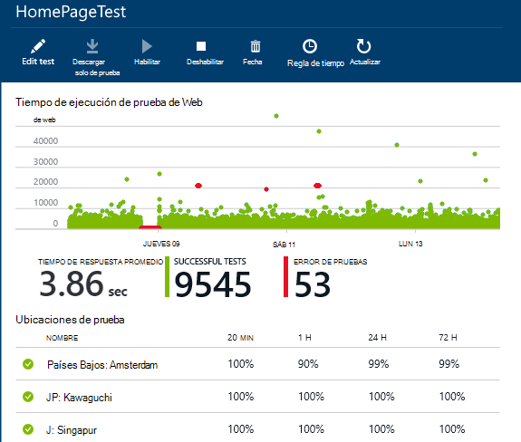
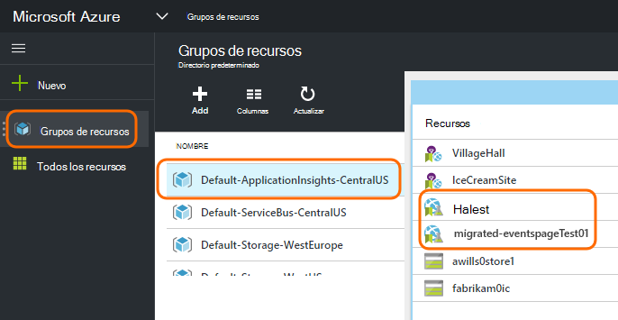
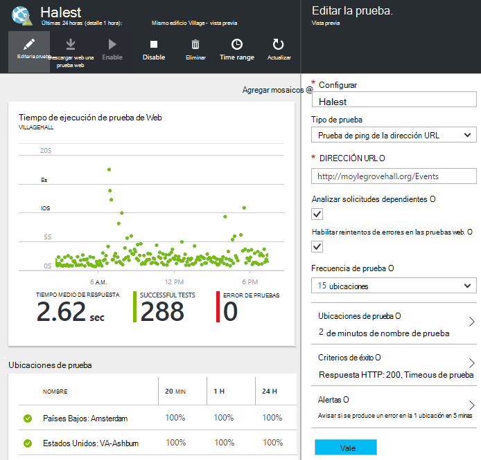

<properties 
    pageTitle="Migrar extremo Azure a pruebas de disponibilidad de aplicaciones perspectivas" 
    description="Migrar pruebas de supervisión de extremo de Azure clásicas en aplicación perspectivas disponibilidad comprueba el 31 de octubre de 2016."
    services="application-insights" 
    documentationCenter=""
    authors="soubhagyadash" 
    manager="douge"/>

<tags 
    ms.service="application-insights" 
    ms.workload="tbd" 
    ms.tgt_pltfrm="ibiza" 
    ms.devlang="na" 
    ms.topic="article" 
    ms.date="07/25/2016" 
    ms.author="awills"/>
 
# Mover de Azure extremo supervisión a pruebas de disponibilidad de aplicación perspectivas

¿Utiliza [la supervisión de extremo](https://blogs.msdn.microsoft.com/mast/2013/03/03/windows-azure-portal-update-configure-web-endpoint-status-monitoring-preview/) para las aplicaciones de Azure? Por *el 31 de octubre de 2016*, se deberá reemplazar con las [pruebas de disponibilidad](app-insights-monitor-web-app-availability.md)de nuevo y más eficaz. Ya hemos creado algunas de las nuevas pruebas, aunque haya deshabilitado hasta que el 31 de octubre de 2016. 

Puede editar las pruebas nuevas y realice el cambio si lo desea. Encontrará su [portal de Azure](https://portal.azure.com) en el grupo de recursos de CentralUS de ApplicationInsights de forma predeterminada.

## ¿Qué son las pruebas de disponibilidad?

Prueba de disponibilidad es una característica de Azure que continuamente comprueba que cualquier servicio o sitio web es hacia arriba y ejecutar enviando solicitudes HTTP a (pruebas de web de Visual Studio o solo ping) de un máximo de 16 ubicaciones en todo el mundo. 

En el [portal de Azure clásica](https://manage.windowsazure.com), estas pruebas se denominaban supervisión de extremo. Estaban más limitadas en el ámbito. Las nuevas pruebas de disponibilidad son una mejora importante:

* Hasta 10 Visual Studio web pruebas o ping por recurso de información de la aplicación. 
* Hasta 16 ubicaciones en todo el mundo para enviar las solicitudes de prueba a la aplicación web. Mayor control de los criterios de éxito de prueba. 
* Probar cualquier sitio o servicio web - aplicaciones web no solo Azure.
* Probar reintentos: reducir las alertas de falso positivo debido a problemas de red transitorias. 
* Webhooks puede recibir notificaciones de HTTP POST para las alertas.

Obtenga más información acerca de [pruebas de disponibilidad aquí](app-insights-monitor-web-app-availability.md).

Pruebas de disponibilidad son parte de la [Información de aplicación de Visual Studio](app-insights-overview.md), que es un servicio de análisis extensible para cualquier aplicación web.

## Así que ¿qué ocurre con Mi extremo pruebas?

* Nos hemos copia el extremo pruebas para las pruebas de disponibilidad de aplicaciones perspectivas nuevas de supervisión.
* Las nuevas pruebas de disponibilidad están deshabilitadas y aún se están ejecutando las pruebas de extremo antiguas.
* La alerta de reglas que *no* se han migrado. Nuevas pruebas inicialmente se han configurado con una regla predeterminada:
 * Desencadenadores de más de 1 ubicación informes de errores en 5 minutos.
 * Envía un correo electrónico a los administradores de la suscripción.

En el [portal de Azure](https://portal.azure.com), puede encontrar las pruebas migradas en el grupo de recursos "Predeterminado-ApplicationInsights-CentralUS". Los nombres de prueba prefijo "Migrado-". 

## ¿Qué debo hacer?

* Si se perdió algún modo la migración de las pruebas, las pruebas de disponibilidad nuevo son [fáciles de configurar](app-insights-monitor-web-app-availability.md).

### Opción A: hacer nada. Dejar que nosotros.

**En el 31 de octubre de 2016** se hará lo siguiente:

* Deshabilitar las pruebas de extremo antiguo.
* Habilitar las pruebas de disponibilidad migradas.

### Opción B: puede administrar o habilitar las pruebas nuevas.

* Revisar y editar las pruebas de disponibilidad de nuevo en el nuevo [portal de Azure](https://portal.azure.com). 
 * Revisar los criterios del desencadenador
 * Revise a los destinatarios de correo electrónico
* Habilitar las pruebas nuevas
* Deshabilitaremos el extremo heredado supervisión pruebas en 31 de octubre de 2016 

### Opción C: descarte.

Si no desea utilizar las pruebas de disponibilidad, puede eliminarlas en [el portal de Azure](https://portal.azure.com). También hay un vínculo Cancelar suscripción en la parte inferior de los mensajes de correo electrónico de notificación.

Aún eliminamos las pruebas de extremo antiguo en 31 de octubre de 2016. 

## ¿Cómo puedo editar las pruebas nuevas?

Inicie sesión en el [portal de Azure](https://portal.azure.com) y encontrar las pruebas de web 'Migrado-': 

Editar o habilitar la prueba:

## ¿Por qué sucede esto?

Un mejor servicio. El servicio de extremo antiguo era mucho más estrecho. Puede proporcionar solo dos direcciones URL para pruebas de ping simple de 3 ubicaciones geo en una aplicación web o VM de Azure. Las pruebas nuevas pueden ejecutar pruebas de varios pasos web desde hasta 16 ubicaciones, y puede especificar hasta 10 pruebas para una aplicación. Puede probar cualquier dirección URL: no tiene que ser un sitio de Azure.

Nuevas pruebas se configuran por separado desde la aplicación web o una máquina virtual que está probando. 

Vamos a migrar las pruebas para garantizar que sigue teniendo control sobre ellos al usar el nuevo portal. 

## ¿Qué es la información de la aplicación?

Nuevas pruebas de disponibilidad forman parte de la [Información de aplicación de Visual Studio](app-insights-overview.md). Aquí tiene un [vídeo de 2 minutos](http://go.microsoft.com/fwlink/?LinkID=733921).

## ¿Estoy pagando las pruebas nuevas?

Las pruebas migradas están configuradas en un recurso de información de la aplicación en el plan libre de forma predeterminada. Esto permite colección hasta 5 millones de puntos de datos. Fácilmente que cubra el volumen de datos que las pruebas se usan actualmente. 

Por supuesto, si le gusta perspectivas de aplicación y crear más pruebas de disponibilidad o adoptar más de sus características de diagnósticos y de supervisión de rendimiento, deberá generar más puntos de datos.  Sin embargo, el resultado solo sería que puede encontrar la cuota para el plan gratuita. No recibirá una factura a menos que cambiar de opinión para los planes estándar o Premium. 

[Obtenga más información sobre precios de perspectivas de aplicación y la supervisión de cuota](app-insights-pricing.md). 

## ¿Qué es y no se migran?

Se mantienen en las pruebas de extremo antiguo:

* Dirección URL del extremo para comprobar.
* Geo ubicaciones desde donde se envían las solicitudes.
* Frecuencia de prueba permanece 5 minutos.
* Tiempo de espera de prueba permanece 30 segundos. 

No se migran:

* Regla de desencadenador de alerta. La regla que hemos configurado con desencadenadores cuando 1 ubicación informa de errores en 5 minutos.
* Destinatarios de la alerta. Mensajes de correo electrónico de notificación se enviará a los propietarios de suscripción y los propietarios de compañeros. 

## ¿Cómo puedo encontrar las pruebas nuevas?

Ahora puede editar cualquiera de las pruebas nuevas si lo desea. Inicie sesión en el [portal de Azure](https://portal.azure.com), abra **Los grupos de recursos** y seleccione **CentralUS de ApplicationInsights de forma predeterminada**. En ese grupo, encontrará las pruebas web nueva. [Obtenga información sobre las nuevas pruebas de disponibilidad](app-insights-monitor-web-app-availability.md).

Tenga en cuenta que los nuevos correos electrónicos de alerta se enviará desde esta dirección: aplicación perspectivas alertas(ai-noreply@microsoft.com)

## ¿Qué sucede si no hacer nada?

Opción A se aplicará. Nos habilitar las pruebas migradas y configurar las reglas de alerta de forma predeterminada, como se mencionó anteriormente. Tendrá que agregar las reglas de alertas personalizadas, los destinatarios, como se mencionó anteriormente. Deshabilitaremos el extremo heredado pruebas de supervisión. 

## ¿Dónde puedo proporcionar comentarios sobre esto? 

Agradecemos sus comentarios. Por favor, [envíenos un correo electrónico](mailto:vsai@microsoft.com). 

