<properties
    pageTitle="Diagnosticar problemas de rendimiento en un sitio Web IIS ejecución | Microsoft Azure"
    description="Supervisar el rendimiento de un sitio Web sin volver a la implementación. Utilizar independiente o con la aplicación perspectivas SDK obtener telemetría de dependencia."
    services="application-insights"
    documentationCenter=".net"
    authors="alancameronwills"
    manager="douge"/>

<tags
    ms.service="application-insights"
    ms.workload="tbd"
    ms.tgt_pltfrm="ibiza"
    ms.devlang="na"
    ms.topic="get-started-article"
    ms.date="10/24/2016"
    ms.author="awills"/>

# Aplicaciones web de instrumento en tiempo de ejecución con información de la aplicación

*Información de la aplicación está en vista previa.*

Puede instrumentación una aplicación web directo con recomendaciones de aplicación de Visual Studio, sin tener que modificar o redistribuir el código. En las aplicaciones que se hospedan en un servidor IIS local, instalar el Monitor de estado; o bien, si son aplicaciones web de Azure o ejecutar en una máquina virtual de Azure, puede instalar la extensión de aplicación perspectivas. (También hay otros artículos sobre instrumentación [live J2EE web aplicaciones](app-insights-java-live.md) y [Servicios de nube de Azure](app-insights-cloudservices.md).)

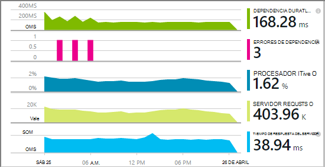

Tiene una opción de tres rutas aplicar perspectivas de aplicación a las aplicaciones web de .NET:

* **Hora de creación:** [Agregue la información de la aplicación SDK] [greenbrown] para el código de la aplicación web. 
* **Tiempo de ejecución:** Instrumentación la aplicación web en el servidor, como se describe a continuación, sin volver a generar e implementar el código.
* **Ambas:** Crear el SDK en el código de la aplicación web y también se aplican las extensiones de tiempo de ejecución. Sacar el máximo de ambas opciones. 

Aquí es un resumen de lo que se obtiene por cada ruta:

||Hora de creación|Tiempo de ejecución|
|---|---|---|
|Solicitudes y excepciones|Sí|Sí|
|[Excepciones más detalladas](app-insights-asp-net-exceptions.md)||Sí|
|[Diagnósticos de dependencia](app-insights-asp-net-dependencies.md)|En .NET 4.6 +|Sí|
|[Contadores de rendimiento del sistema](app-insights-performance-counters.md)||Servicio de nube IIS o Azure, aplicación web no Azure|
|[API de telemetría personalizado][api]|Sí||
|[Integración de registro de seguimiento](app-insights-asp-net-trace-logs.md)|Sí||
|[Datos de usuario & vista de página](app-insights-javascript.md)|Sí||
|No es necesario volver a generar código|No||

## Instrumentación de la aplicación web en tiempo de ejecución

Tiene una suscripción de [Microsoft Azure](http://azure.com) .

### Si su aplicación es una aplicación web de Azure o un servicio de nube

* Seleccione perspectivas de aplicación en el panel de control de la aplicación en Azure. 

    [Más información](app-insights-azure.md).

### Si la aplicación se hospeda en el servidor IIS

1. En el servidor web IIS, inicie sesión con credenciales de administrador.
2. Descargar y ejecutar el [Monitor de estado del instalador](http://go.microsoft.com/fwlink/?LinkId=506648).
4. En el Asistente de instalación, inicie sesión en Microsoft Azure.

    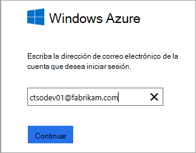

    *¿Errores de conexión? Vea [solución de problemas](#troubleshooting).*

5. Seleccione la aplicación web instalado o el sitio Web que desea supervisar y configurar el recurso en el que desea ver los resultados en el portal de información de la aplicación.

    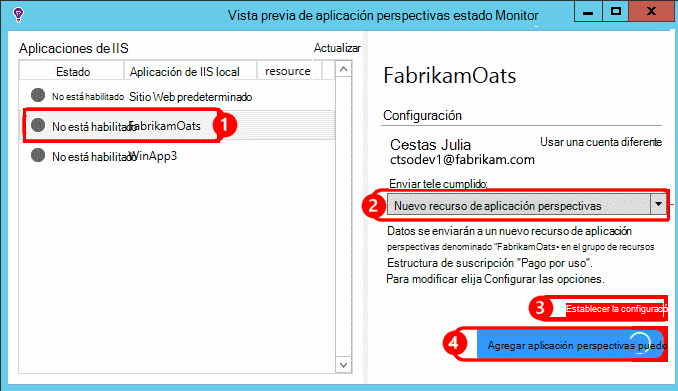

    Normalmente, elija Configurar un nuevo recurso y el [grupo de recursos][roles].

    En caso contrario, use un recurso existente si ya configuró [prueba web] [ availability] para el sitio o la [supervisión de los clientes web][client].

6. Reiniciar IIS.

    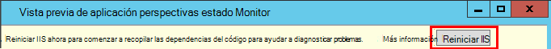

    El servicio web se se interrumpe por unos minutos.

6. Observe que se ha insertado ApplicationInsights.config en las aplicaciones web que desee supervisar.

    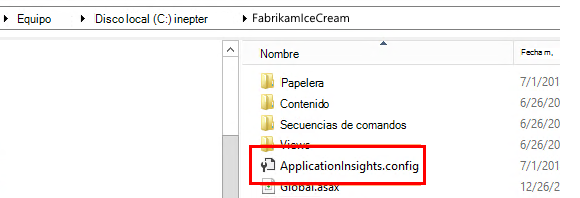

   También hay algunos cambios a web.config.

#### ¿Desea (re) configurar más tarde?

Después de completar al asistente, puede volver a configurar al agente siempre que lo desee. También puede usar esta opción si ha instalado al agente pero hubo algunos problemas con la instalación inicial.

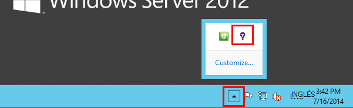

## Vista de rendimiento telemetría

Inicie sesión en [el portal de Azure](https://portal.azure.com), examinar información sobre la aplicación y abra el recurso que ha creado.

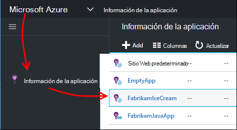

Abra el módulo de rendimiento para ver la solicitud, tiempo de respuesta, dependencia y otros datos.

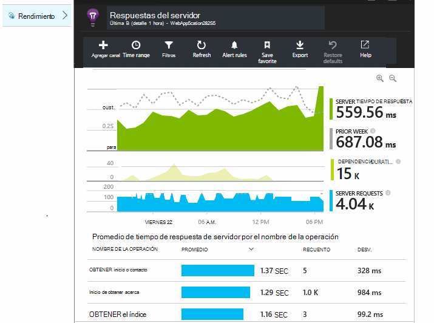

Haga clic en cualquier gráfico para abrir una vista más detallada.

Puede [Editar, reorganizar, guardar](app-insights-metrics-explorer.md), y anclar gráficos o el módulo completo a un [panel](app-insights-dashboards.md).

## Dependencias

El gráfico de dependencia duración muestra el tiempo necesario de la aplicación de las llamadas a componentes externos, como bases de datos, las API de REST o almacenamiento de blobs de Windows Azure.

Para segmentar el gráfico mediante llamadas a dependencias diferentes: modificar el gráfico, active agrupar y, a continuación, agrupar por dependencia, el tipo de dependencia o el rendimiento de dependencia.

## Contadores de rendimiento 

(No disponible para las aplicaciones web de Azure). Haga clic en servidores en el módulo de introducción para ver los gráficos de contadores de rendimiento de servidor como CPU pertenencia y uso de memoria.

Si tiene varias instancias de servidor, desea modificar los gráficos para agrupar por instancia de rol.

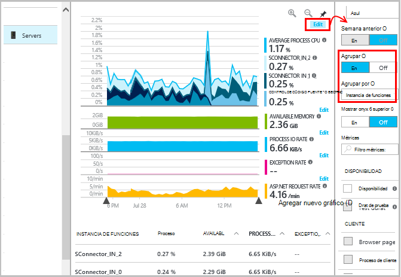

También puede [cambiar el conjunto de contadores de rendimiento que aparecen en el SDK](app-insights-configuration-with-applicationinsights-config.md#nuget-package-3). 

## Excepciones

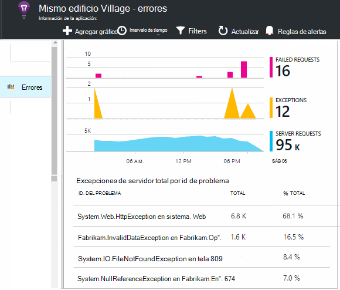

Puede desglosar excepciones específicas (de los siete últimos días) y obtener datos de contexto y seguimientos de la pila.

## Muestreo

Si la aplicación envía una gran cantidad de datos y que está usando el SDK de perspectivas de aplicación para ASP.NET versión 2.0.0-beta3 o posterior, la característica de muestreo adaptación puede operar y enviar sólo un porcentaje de su telemetría. [Más información sobre muestreo.](app-insights-sampling.md)

## Solución de problemas

### Errores de conexión

Debe abrir [algunos puertos salientes](app-insights-ip-addresses.md#outgoing-ports) de seguridad de su servidor para permitir que el Monitor de estado para que funcione.

### ¿Sin telemetría?

  * Use el sitio, para generar algunos datos.
  * Espere unos minutos para permitir que los datos llegan, a continuación, haga clic en **Actualizar**.
  * Abrir búsqueda diagnóstico (el icono de búsqueda) para ver los eventos individuales. Eventos a menudo son visibles en la búsqueda de diagnóstico antes de agregar datos aparecen en los gráficos.
  * Abra el Monitor de estado y seleccione la aplicación en el panel izquierdo. Comprobar si hay mensajes diagnósticos de esta aplicación en la sección "Configuración de notificaciones":

  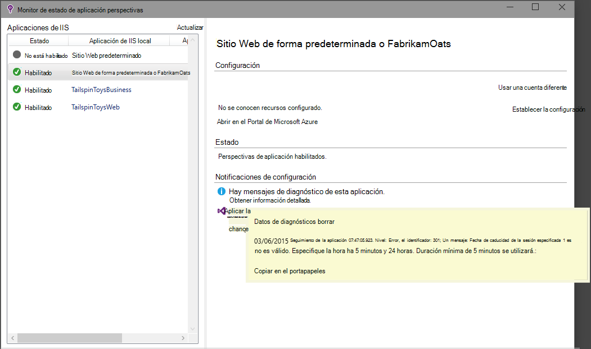

  * Asegúrese de que su servidor de seguridad permite el tráfico saliente en los puertos enumerado anteriormente.
  * En el servidor, si ve un mensaje sobre "permisos suficientes", pruebe lo siguiente:
    * En el Administrador de IIS, seleccione el grupo de aplicaciones, abrir **Las opciones avanzadas**y en el **Modelo de proceso** , anote la identidad.
    * En el panel de control de administración de equipo, agregue esta identidad al grupo de usuarios del Monitor.
  * Si tiene instalado en su servidor MMA/SCOM, algunas versiones pueden entrar en conflicto. Desinstalar SCOM y Monitor de estado y volver a instalar las últimas versiones.
  * Vea [solucionar problemas de][qna].

## Requisitos del sistema

Sistemas operativos admitidos para el Monitor de estado de perspectivas de aplicación en el servidor:

- Windows Server 2008
- Windows Server 2008 R2
- Windows Server 2012
- Servidor de Windows 2012 R2

últimas SP y .NET Framework 4.0 y 4.5

En el cliente Windows 7, 8 y 8.1, nuevo con .NET Framework 4.0 y 4.5

Soporte de IIS: IIS 7, 7.5, 8, 8.5 (IIS es necesario)

## Automatización con PowerShell

Puede iniciar y detener la supervisión con PowerShell en su servidor IIS.

Importar el módulo de perspectivas de aplicación:

`Import-Module 'C:\Program Files\Microsoft Application Insights\Status Monitor\PowerShell\Microsoft.Diagnostics.Agent.StatusMonitor.PowerShell.dll'`

Averiguar qué aplicaciones están supervisados:

`Get-ApplicationInsightsMonitoringStatus [-Name appName]`

* `-Name`(Opcional) El nombre de una aplicación web.
* Muestra la información de aplicación supervisión de estado para cada aplicación web (o la aplicación con nombre) en este servidor IIS.

* Devuelve `ApplicationInsightsApplication` para cada aplicación:
 * `SdkState==EnabledAfterDeployment`: Aplicación está siendo supervisado y se ha instrumentado en tiempo de ejecución mediante la herramienta Monitor de estado, o por `Start-ApplicationInsightsMonitoring`.
 * `SdkState==Disabled`: La aplicación no está instrumentada para impresiones de aplicación. Nunca se ha instrumentado o se deshabilitó la supervisión de tiempo de ejecución con la herramienta Monitor de estado o con `Stop-ApplicationInsightsMonitoring`.
 * `SdkState==EnabledByCodeInstrumentation`: La aplicación se ha instrumentado agregando el SDK al código fuente. No se pueden actualizar ni detenido su SDK.
 * `SdkVersion`Muestra la versión en uso para la supervisión de esta aplicación.
 * `LatestAvailableSdkVersion`Muestra la versión están disponible en la Galería de NuGet. Para actualizar la aplicación a esta versión, utilice `Update-ApplicationInsightsMonitoring`.

`Start-ApplicationInsightsMonitoring -Name appName -InstrumentationKey 00000000-000-000-000-0000000`

* `-Name`El nombre de la aplicación en IIS
* `-InstrumentationKey`Ikey del recurso perspectivas de aplicación donde desea que los resultados que se muestren.

* Este cmdlet sólo afecta a aplicaciones que no se ya - es decir, SdkState == NotInstrumented.

    El cmdlet no afecta a una aplicación que ya está instrumentada en tiempo de compilación agregando el SDK en el código o en tiempo de ejecución por un uso anterior de este cmdlet.

    La versión SDK usada instrumentación de la aplicación es la versión descargada más recientemente en el servidor.

    Para descargar la versión más reciente, use ApplicationInsightsVersion de actualización.

* Devuelve `ApplicationInsightsApplication` correctamente. Si se produce un error, inicia un seguimiento a stderr.

    
          Name                      : Default Web Site/WebApp1
          InstrumentationKey        : 00000000-0000-0000-0000-000000000000
          ProfilerState             : ApplicationInsights
          SdkState                  : EnabledAfterDeployment
          SdkVersion                : 1.2.1
          LatestAvailableSdkVersion : 1.2.3

`Stop-ApplicationInsightsMonitoring [-Name appName | -All]`

* `-Name`El nombre de una aplicación en IIS
* `-All`Detiene la supervisión de todas las aplicaciones en el servidor IIS para que`SdkState==EnabledAfterDeployment`

* Supervisar las aplicaciones especificadas se detiene y quita instrumentación. Solo funciona para las aplicaciones que se han instrumentado en tiempo de ejecución con la herramienta de supervisión de estado o ApplicationInsightsApplication de inicio. (`SdkState==EnabledAfterDeployment`)

* Devuelve ApplicationInsightsApplication.

`Update-ApplicationInsightsMonitoring -Name appName [-InstrumentationKey "0000000-0000-000-000-0000"`]

* `-Name`: El nombre de una aplicación web de IIS.
* `-InstrumentationKey`(Opcional). Use esta opción para cambiar el recurso al que se envía telemetría de la aplicación.
* Este cmdlet:
 * Actualizaciones de la aplicación con nombre a la versión del SDK descargada más recientemente a este equipo. (Solo funciona si `SdkState==EnabledAfterDeployment`)
 * Si proporciona una clave de instrumentación, se configurará para enviar telemetría al recurso con clave de la aplicación con nombre. (Funciona si `SdkState != Disabled`)

`Update-ApplicationInsightsVersion`

* Descarga el SDK de perspectivas de aplicación más reciente en el servidor.

## Pasos siguientes

* [Crear pruebas web] [ availability] para asegurarse de que el sitio permanezca activo.
* [Busque registros de eventos y] [ diagnostic] para ayudar a diagnosticar problemas.
* [Agregar telemetría de cliente de web] [ usage] para ver las excepciones de código de la página web y le permiten insertar llamadas de seguimiento.
* [Agregar aplicación perspectivas SDK a su código de servicio web] [ greenbrown] para que se puede insertar seguimiento y registro de llamadas en el código del servidor.

<!--Link references-->

[api]: app-insights-api-custom-events-metrics.md
[availability]: app-insights-monitor-web-app-availability.md
[client]: app-insights-javascript.md
[diagnostic]: app-insights-diagnostic-search.md
[greenbrown]: app-insights-asp-net.md
[qna]: app-insights-troubleshoot-faq.md
[roles]: app-insights-resources-roles-access-control.md
[usage]: app-insights-web-track-usage.md
