<properties
    pageTitle="Supervisar la disponibilidad y la capacidad de respuesta de cualquier sitio web | Microsoft Azure"
    description="Configurar pruebas web en información de la aplicación. Obtener alertas si no está disponible de un sitio Web o responde lentamente."
    services="application-insights"
    documentationCenter=""
    authors="alancameronwills"
    manager="douge"/>

<tags
    ms.service="application-insights"
    ms.workload="tbd"
    ms.tgt_pltfrm="ibiza"
    ms.devlang="na"
    ms.topic="get-started-article"
    ms.date="09/07/2016"
    ms.author="awills"/>

# Supervisar la disponibilidad y la capacidad de respuesta de cualquier sitio web

Después de que ha implementado su aplicación web o un sitio web a cualquier servidor, puede configurar las pruebas web para supervisar su disponibilidad y la capacidad de respuesta. [Perspectivas de aplicación de Visual Studio](app-insights-overview.md) envía solicitudes web a la aplicación a intervalos regulares de puntos de todo el mundo. Le avisa si la aplicación no responde o responde lentamente.

Puede configurar las pruebas web para cualquier extremo HTTP o HTTPS que es accesible desde internet.

Existen dos tipos de prueba web:

* [Prueba de ping de la dirección URL](#create): una prueba simple que puede crear en el portal de Azure.
* [Probar varios pasos web](#multi-step-web-tests): que se crean en Visual Studio Ultimate o Visual Studio Enterprise y cargar en el portal.

Puede crear hasta 10 pruebas de web por recurso de aplicación.

## 1. crear un recurso para los informes de prueba

Omitir este paso si ya ha [configurado un recurso de aplicación perspectivas] [ start] para esta aplicación y desea ver los informes de disponibilidad en el mismo lugar.

Suscribirse a [Microsoft Azure](http://azure.com), vaya al [portal de Azure](https://portal.azure.com)y crear un recurso de información de la aplicación.

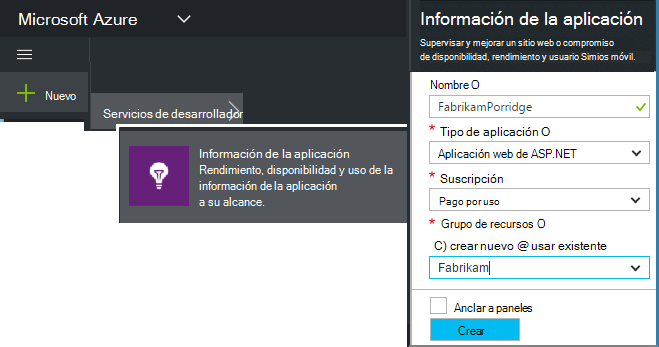

Haga clic en **todos los recursos** para abrir el módulo de introducción para el nuevo recurso.

## 2. crear una prueba de ping de la dirección URL

En el recurso de información de la aplicación, busque el mosaico de disponibilidad. Haga clic en ella para abrir el módulo de pruebas Web para su aplicación y agregue una prueba web.

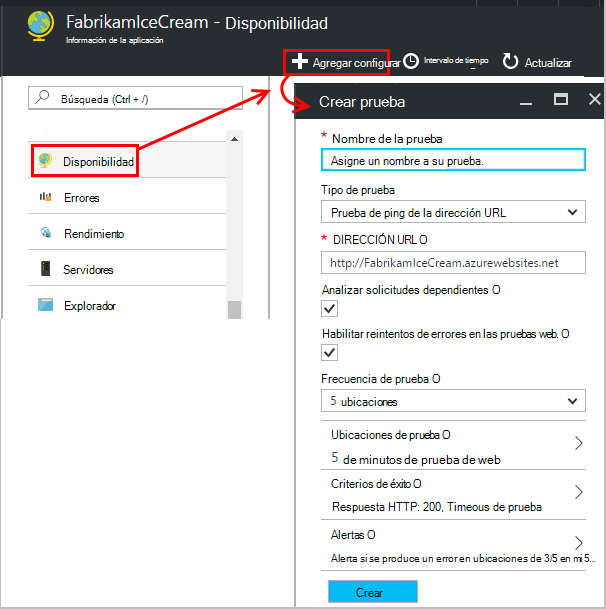

- **La dirección URL** debe estar visible desde internet. Puede incluir una cadena de consulta & #151; por tanto, por ejemplo, se puede ejercer la base de datos un poco. Si la dirección URL se convierte en una redirección, que seguiremos hasta 10 redireccionamientos.
- **Analizar solicitudes dependientes**: imágenes, scripts, archivos de estilo y otros recursos de la página se solicitan como parte de la prueba y el tiempo de respuesta registrados incluye estos períodos. La prueba falla si todos estos recursos no se pueden descargar correctamente en el tiempo de espera de todo el ensayo.
- **Habilitar reintentos**: cuando se produce un error en la prueba, se vuelve a intentar después de un intervalo breve. Un error se informa solo si se producen errores en tres intentos sucesivos. A continuación, se realizan pruebas posteriores a la frecuencia de prueba habitual. Reintentar temporalmente se suspende hasta que el éxito siguiente. Esta regla se aplica por separado en cada ubicación de la prueba. (Se recomienda esta configuración. En promedio, cerca del 80% de errores desaparecen reintento.)
- **Probar la frecuencia**: establece con qué frecuencia se ejecuta la prueba de cada ubicación de la prueba. Con una frecuencia de cinco minutos y prueba cinco ubicaciones, el sitio se ha probado Media cada minuto.
- **Ubicaciones de prueba** son los lugares desde donde nuestros servidores envían solicitudes web a la dirección URL. Elija más de uno para que pueda distinguir problemas en el sitio Web de problemas de red. Puede seleccionar hasta 16 ubicaciones.

- **Criterios de éxito**:

    **Tiempo de espera de prueba**: disminuir este valor para recibir avisos sobre el tiempo de respuesta. La prueba se cuenta como un error si las respuestas desde el sitio no se han recibido en este período. Si seleccionó **Analizar solicitudes dependientes**, a continuación, todas las imágenes, archivos de estilo, scripts y otros recursos dependientes deben recibidos durante este período.

    **Respuesta HTTP**: el código de estado devuelto se cuenta como un éxito. 200 es el código que indica que se ha devuelto una página web normal.

    **Coincidir con el contenido**: una cadena, como "Bienvenido" Probemos que se produce en todas las respuestas. Debe ser una cadena sin formato, sin caracteres comodín. No olvide si los cambios de contenido de la página, es posible que tenga actualizar.

- **Las alertas** son de forma predeterminada, envían si hay errores en las tres ubicaciones más de cinco minutos. Un error en una ubicación es probable que sea un problema de red y no un problema con el sitio. Puede cambiar el umbral para que sea más o menos confidencial pero también puede cambiar quién deben enviar los mensajes de correo electrónico.

    Puede configurar un [webhook](../monitoring-and-diagnostics/insights-webhooks-alerts.md) que se llama cuando se produce una alerta. (Pero tenga en cuenta que, en la actualidad, la consulta de parámetros no se transfieren como propiedades).

### Probar más direcciones URL

Agregar más pruebas. Para ejemplo, así como probar la página de inicio, puede asegurarse de que se está ejecutando la base de datos al probar la dirección URL de una búsqueda.

## 3. consulte el sitio web resultados de pruebas

Después de 1 y 2 minutos, los resultados aparecen en el módulo de prueba Web.

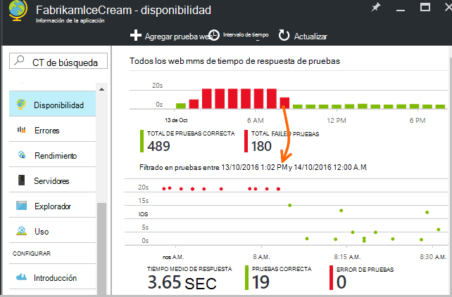

Haga clic en cualquier barra del gráfico de resumen en una vista más detallada de ese período de tiempo.

Estos gráficos combinan resultados de todas las pruebas de web de esta aplicación.

## Si ve errores

Haga clic en un punto rojo.

O bien, desplácese hacia abajo y haga clic en una prueba donde verá menor que 100% correcto.

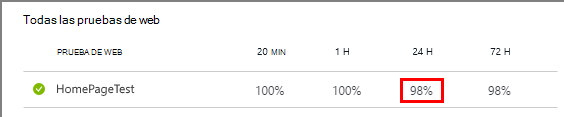

Los resultados de la prueba abierta.

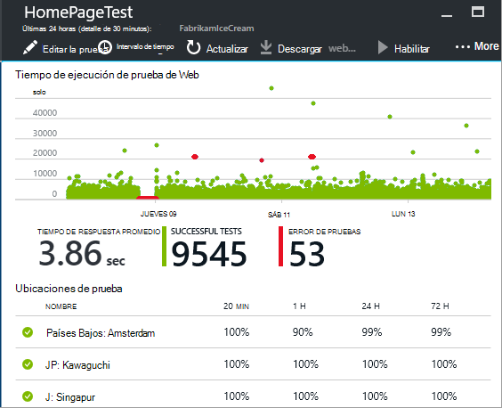

La prueba se ejecuta en varias ubicaciones & #151; seleccione una donde los resultados son menos de 100%.

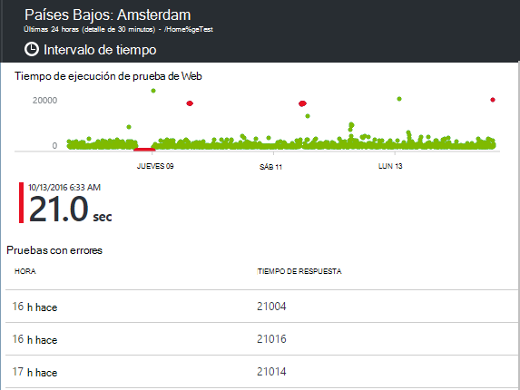

Desplácese hacia abajo hasta que **no se pudo pruebas** y elija un resultado.

Haga clic en el resultado para evaluar en el portal y ver la causa del error.

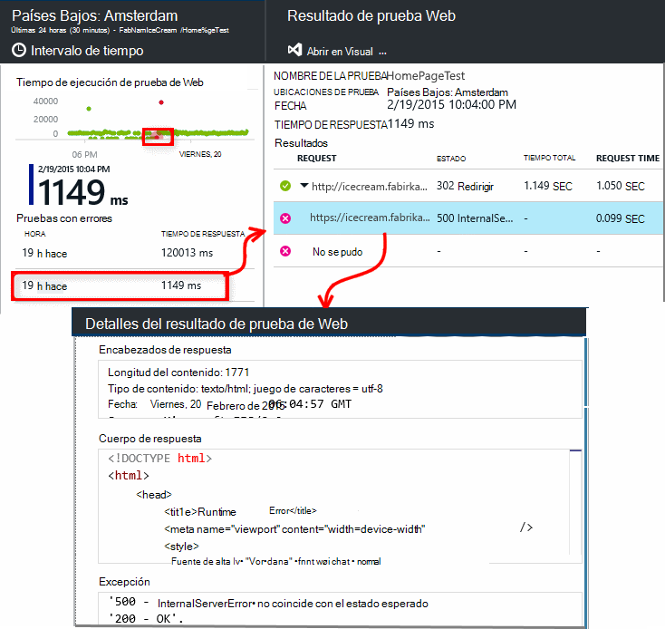

Como alternativa, puede descargar el archivo de resultado e inspeccionar en Visual Studio.

*Busca Aceptar pero referir como un error?* Compruebe todas las imágenes, scripts, hojas de estilos y cualquier otro archivo cargado por la página. Si se produce un error en alguno de ellos, la prueba se notifica como error, incluso si la página principal html carga Aceptar.

## Pruebas web varios pasos

Puede supervisar un escenario que implica una secuencia de direcciones URL. Por ejemplo, si la supervisión de un sitio Web de venta, puede probar que agregar elementos a la compra carro funciona correctamente.

Para crear una prueba de varios pasos, grabar el escenario mediante Visual Studio y, a continuación, cargar la grabación de impresiones de aplicación. Aplicación perspectivas reproduce el escenario a intervalos y comprueba las respuestas.

Tenga en cuenta que no puede usar funciones en las pruebas de código: los pasos del escenario deben estar contenidos como una secuencia de comandos en el archivo .webtest.

#### 1. un escenario de registro de

Use Visual Studio Enterprise o Ultimate grabar una sesión de web.

1. Crear un proyecto de prueba de rendimiento web.

    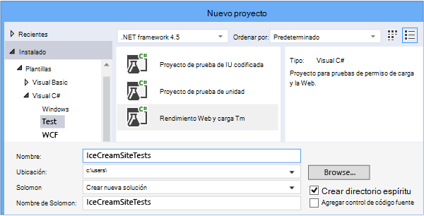

2. Abra el archivo .webtest e iniciar la grabación.

    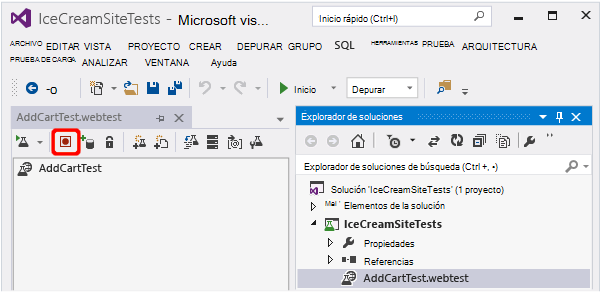

3. Realice las acciones de usuario que desea simular en su prueba: abrir el sitio Web, agregar un producto a la cesta y así sucesivamente. A continuación, detenga la prueba.

    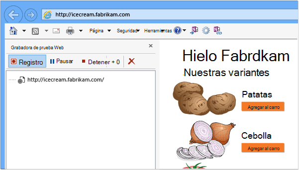

    No realizar un escenario de tiempo. Hay un límite de 100 pasos y 2 minutos.

4. Editar la prueba:
 - Agregar validaciones para comprobar los códigos de texto y la respuesta recibidos.
 - Quitar las interacciones superfluas. También puede quitar las solicitudes dependientes para imágenes o a ad o el seguimiento de los sitios.

    Recuerde que solo puede modificar la secuencia de comandos de prueba, no puede agregar código personalizado o llamar a otras pruebas web. No insertar bucles en la prueba. Puede usar los complementos de prueba de web estándar.

5. Ejecute la prueba en Visual Studio para asegurarse de que funciona.

    El ejecutor de pruebas web abre un explorador web y repite las acciones que haya grabado. Asegúrese de que funciona como se esperaba.

    

#### 2. cargar la prueba web en perspectivas de aplicación

1. En el portal de información de la aplicación, cree una nueva prueba web.

    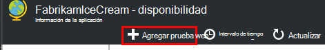

2. Seleccione varios pasos prueba y cargue el archivo .webtest.

    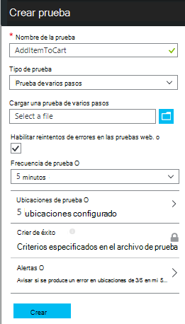

    Establecer las ubicaciones de prueba, frecuencia y parámetros de alerta de la misma manera que para pruebas de ping.

Ver los resultados de pruebas y los errores de igual forma que solo url pruebas.

Un motivo común error es que la prueba se ejecuta demasiado larga. No ejecute más de dos minutos.

No olvide que todos los recursos de una página deben cargar correctamente para que la prueba tener éxito, incluidas las secuencias de comandos, hojas de estilos, imágenes y así sucesivamente.

Tenga en cuenta que la prueba web debe estar contenida completamente en el archivo .webtest: no se puede utilizar funciones codificadas en la prueba.

### Conectar la hora y números aleatorios en su prueba de varios pasos

Suponga que prueba una herramienta que obtiene datos que dependen del tiempo como acciones desde una fuente externa. Cuando grabe su prueba web, debe usar horas específicas, pero establece como parámetros de la prueba, hora de inicio y hora de finalización.

Cuando se ejecuta la prueba, que le gustaría hora de finalización siempre a la vez presentar y hora de inicio debe estar hace 15 minutos.

Complementos de prueba Web proporcionan la manera de agregar parámetros a veces.

1. Agregar un complemento de prueba de web para cada valor de parámetro variable que desee. En la barra de herramientas de la prueba web, elija **Agregar complemento de prueba Web**.

    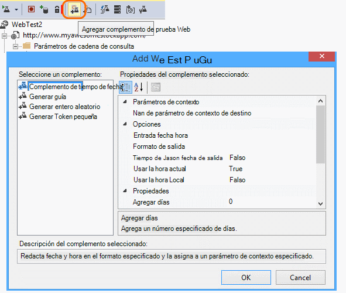

    En este ejemplo, usamos dos instancias del complemento de tiempo de fecha. Es una instancia de "15 minutos hace" y otro para el "ahora".

2. Abra las propiedades de cada complemento. Asigne un nombre y configurarlo para usar la hora actual. Para uno de ellos, establezca minutos agregar = -15.

    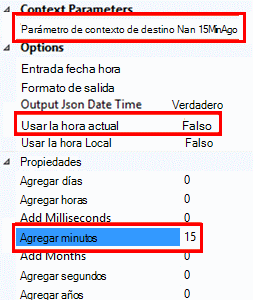

3. En la web prueba parámetros, use {{nombre del complemento}} para hacer referencia a un nombre de complemento.

    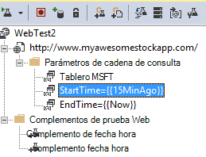

Ahora, cargue la prueba en el portal. Utiliza los valores dinámicos en cada ejecución de la prueba.

## Tratar con inicio de sesión

Si los usuarios iniciar sesión en la aplicación, tiene varias opciones para simular inicio de sesión para que pueda probar páginas detrás de la sesión. El método que se utilice dependiendo del tipo de seguridad proporcionada por la aplicación.

En todos los casos, debe crear una cuenta en su aplicación solo para las pruebas. Si es posible, restringir los permisos de esta cuenta de prueba de manera que no es posible de las pruebas web que afectan a los usuarios reales.

### Simple nombre de usuario y contraseña

Grabar una prueba web en la forma habitual. Eliminar las cookies en primer lugar.

### Autenticación de SAML

Use el complemento SAML está disponible para las pruebas web.

### Secreto de cliente

Si su aplicación tiene una ruta de inicio de sesión que llevará a cabo un secreto de cliente, utilice esa ruta. Azure Active Directory (AAD) es un ejemplo de un servicio que proporciona un cliente sesión secreto. En AAD, el secreto de cliente es la tecla de aplicación.

Esto es una prueba web de ejemplo de una aplicación web de Azure usando una tecla de aplicación:

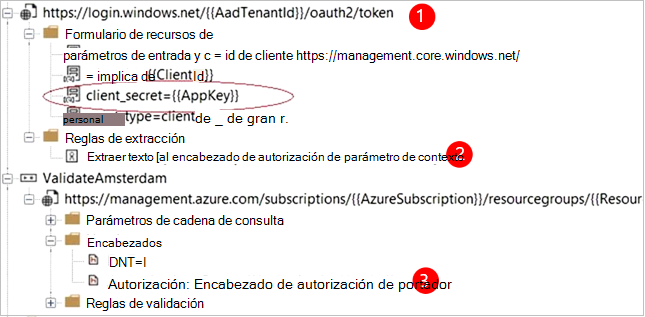

1. Obtener el token de AAD con secreto de cliente (AppKey).
2. Extrae el token portador de respuesta.
3. Llamar a API mediante token portador en el encabezado de autorización.

Asegúrese de que la prueba web es un cliente real, es decir, tiene su propia aplicación en AAD - y usar su clientId + appkey. Su servicio de prueba también tiene su propia aplicación en AAD: el ID URI de esta aplicación se refleja en la prueba web en el campo "recurso".

### Autenticación abierta

Un ejemplo de autenticación abierta está iniciando sesión con su cuenta de Microsoft o Google. Muchas aplicaciones que utilicen OAuth proporcionan el cliente secreto alternativa, por lo que debe ser el primer procedimiento investigar esa posibilidad.

Si la prueba debe iniciar sesión utilizando OAuth, el enfoque general es:

 * Utilice una herramienta como Fiddler para examinar el tráfico entre el explorador web, el sitio de autenticación y la aplicación.
 * Realizar dos o más inicios de sesión con diferentes equipos o exploradores, o en los intervalos de tiempo (para permitir tokens para que expire).
 * Comparación de las distintas sesiones, identificar el token pasado desde el sitio de autenticación, que se pasa al servidor de aplicación después de iniciar sesión.
 * Grabar una prueba web mediante Visual Studio.
 * Agregar parámetros a los símbolos, establecer el parámetro cuando se devuelve el token desde el autenticador y usar en la consulta para el sitio.
 (Visual Studio intenta agregar parámetros a la prueba, pero no correctamente agregar parámetros los tokens).

## Editar o deshabilitar una prueba.

Abra una prueba individual para editar o deshabilitarlo.

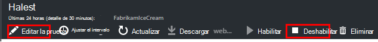

Desea deshabilitar las pruebas web mientras realiza mantenimiento en el servicio.

## Pruebas de rendimiento

Puede ejecutar una prueba de carga en el sitio Web. Como la prueba de disponibilidad, puede enviar solicitudes simples o solicitudes de varios pasos de nuestras puntos de todo el mundo. A diferencia de una prueba de disponibilidad, se envían muchas solicitudes simular varios usuarios simultáneos.

En el módulo de introducción, abra **configuración**, **Pruebas de rendimiento**. Cuando se crea una prueba, está invitado a conectarse a o crear una cuenta de Visual Studio Team Services.

Una vez finalizada la prueba, se muestran los tiempos de respuesta y tasas de éxito.

## Automatización

* [Las secuencias de comandos de usar PowerShell para configurar una prueba web](https://azure.microsoft.com/blog/creating-a-web-test-alert-programmatically-with-application-insights/) automáticamente.
* Configurar un [webhook](../monitoring-and-diagnostics/insights-webhooks-alerts.md) que se llama cuando se produce una alerta.

## ¿Preguntas? ¿Tiene problemas?

* *¿Llamar código desde mi prueba de web?*

    No. Los pasos de la prueba deben estar en el archivo .webtest. Y no puede llamar a otras pruebas web o use bucles. Pero hay varios complementos que pueden resultar útiles.

* *¿Es compatible HTTPS?*

    Se admiten TLS 1.1 y 1.2 TLS.

* *¿Existe una diferencia entre "web pruebas" y "disponibilidad"?*

    Usamos los dos términos indistintamente.

* *Deseo usar pruebas de disponibilidad en nuestro servidor interno que se ejecute detrás de un firewall.*

    Configurar el firewall para permitir las solicitudes de los [agentes de prueba de direcciones IP de web](app-insights-ip-addresses.md#availability).

* *Cargar una prueba web de varios pasos se produce un error*

    Hay un límite de tamaño de k de 300.

    No se admiten bucles.

    No se admiten las referencias a otras pruebas web.

    No se admiten orígenes de datos.

* *No se completa mi prueba de varios pasos*

    Hay un límite de 100 solicitudes por prueba.

    Si ejecuta más de dos minutos, se detiene la prueba.

* *¿Cómo puedo ejecutar una prueba con certificados de cliente?*

    No se admite, lo sentimos.

## Vídeo

> [AZURE.VIDEO monitoring-availability-with-application-insights]

## Pasos siguientes

[Registros de diagnósticos de búsqueda][diagnostic]

[Solución de problemas][qna]

[Direcciones IP de agentes de prueba de web](app-insights-ip-addresses.md)

<!--Link references-->

[azure-availability]: ../insights-create-web-tests.md
[diagnostic]: app-insights-diagnostic-search.md
[qna]: app-insights-troubleshoot-faq.md
[start]: app-insights-overview.md
