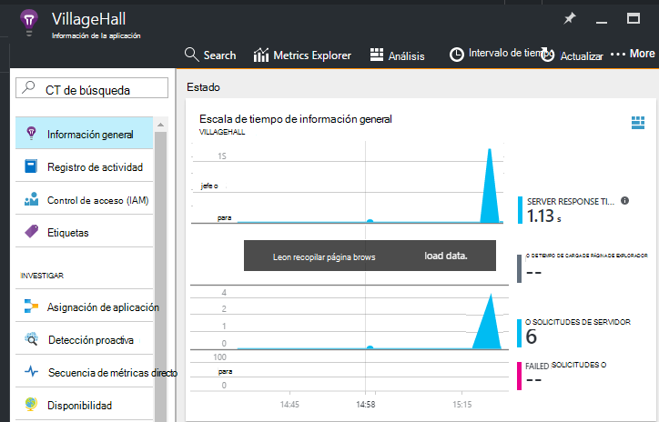

<properties
    pageTitle="Agregar aplicación perspectivas SDK para supervisar la aplicación Node.js | Microsoft Azure"
    description="Analizar uso, disponibilidad y rendimiento de local o de la aplicación web de Microsoft Azure con recomendaciones de aplicación."
    services="application-insights"
    documentationCenter=""
    authors="alancameronwills"
    manager="douge"/>

<tags
    ms.service="application-insights"
    ms.workload="tbd"
    ms.tgt_pltfrm="ibiza"
    ms.devlang="na"
    ms.topic="get-started-article"
    ms.date="08/30/2016"
    ms.author="awills"/>


# <a name="add-application-insights-sdk-to-monitor-your-nodejs-app"></a>Agregar aplicación perspectivas SDK para supervisar la aplicación Node.js

*Información de la aplicación está en vista previa.*

[Perspectivas de aplicación de Visual Studio](app-insights-overview.md) supervisa su aplicación directo para ayudarle a [detectar y diagnosticar problemas de rendimiento y excepciones](app-insights-detect-triage-diagnose.md)y [Descubra cómo se usa la aplicación](app-insights-overview-usage.md). Funciona para las aplicaciones que se hospedan en sus propios servidores IIS local o en máquinas virtuales de Azure, así como aplicaciones web de Azure.


El SDK proporciona la recopilación automática de tasas de solicitud HTTP entrantes y las respuestas, contadores de rendimiento (CPU, memoria, RPS) y las excepciones no controladas. Además, puede agregar llamadas personalizadas para realizar un seguimiento de las dependencias, métricas u otros eventos.


#### <a name="before-you-start"></a>Antes de empezar

Te hace falta:

* Visual Studio 2013 o posterior. Más adelante, es mejor.
* Una suscripción a [Microsoft Azure](http://azure.com). Si su equipo o la organización tiene una suscripción de Azure, el propietario puede agregar, con su [cuenta de Microsoft](http://live.com).

## <a name="add"></a>Crear un recurso de aplicación perspectivas

Inicie sesión en el [portal de Azure][portal]y crear un nuevo recurso de información de la aplicación. Un [recurso] [ roles] en Azure es una instancia de un servicio. Este recurso es donde se analizan y le presenta telemetría desde la aplicación.


Elija otro como el tipo de aplicación. La opción de tipo de aplicación establece el contenido predeterminado de los módulos de recursos y las propiedades visibles en el [Explorador de métricas][metrics].

#### <a name="copy-the-instrumentation-key"></a>Copie la clave de instrumentación

La clave identifica el recurso y, a continuación, deberá instalar pronto en el SDK para dirigir los datos al recurso.


## <a name="sdk"></a>Instalar el SDK de la aplicación

```
npm install applicationinsights --save
```

## <a name="usage"></a>Uso

Esto le permitirá supervisión de solicitud, excepción no controlada de seguimiento y supervisión (CPU/memoria/RPS) el rendimiento del sistema.

```javascript

var appInsights = require("applicationinsights");
appInsights.setup("<instrumentation_key>").start();
```

También se puede establecer la clave de instrumentación en la variable de entorno APPINSIGHTS_INSTRUMENTATIONKEY. Si es así, ningún argumento es necesario cuando se llama a `appInsights.setup()` o `appInsights.getClient()`.

Puede probar el SDK sin enviar telemetría: establecer la clave de instrumentación en una cadena no vacía.


## <a name="run"></a>Ejecute el proyecto

Ejecute la aplicación y pruébelo: abrir páginas diferentes para generar algunos telemetría.


## <a name="monitor"></a>Ver la telemetría

Vuelva al [portal de Azure](https://portal.azure.com) y busque el recurso de información de la aplicación.


Buscar datos en la página información general. En primer lugar, solo verá uno o dos puntos. Por ejemplo:



Haga clic en cualquier gráfico para ver más métricas. [Más información sobre cómo métricas.][perf]

#### <a name="no-data"></a>¿Sin datos?

* Usar la aplicación, abrir páginas diferentes para que genera algunos telemetría.
* Abra la ventana de [búsqueda](app-insights-diagnostic-search.md) para ver los eventos individuales. A veces tarda eventos algo de tiempo ya para obtener a través de la canalización de métricas.
* Espere unos segundos y haga clic en **Actualizar**. Gráficos propios actualización periódicamente, pero puede actualizar manualmente si está esperando algunos datos para mostrarse.
* Vea [solucionar problemas de][qna].

## <a name="publish-your-app"></a>Publicar su aplicación

Ahora implementar la aplicación en IIS o en Azure y ver los datos se acumulan.


#### <a name="no-data-after-you-publish-to-your-server"></a>¿Sin datos después de publicar en el servidor?

Abrir estos puertos para el tráfico saliente de firewall del servidor:

+ `dc.services.visualstudio.com:443`
+ `f5.services.visualstudio.com:443`


#### <a name="trouble-on-your-build-server"></a>¿Problemas en el servidor de generación?

Consulte [este artículo de solución de problemas](app-insights-asp-net-troubleshoot-no-data.md#NuGetBuild).


## <a name="customized-usage"></a>Uso personalizada 

### <a name="disabling-auto-collection"></a>Deshabilitar la recopilación de automática

```javascript
import appInsights = require("applicationinsights");
appInsights.setup("<instrumentation_key>")
    .setAutoCollectRequests(false)
    .setAutoCollectPerformance(false)
    .setAutoCollectExceptions(false)
    // no telemetry will be sent until .start() is called
    .start();
```

### <a name="custom-monitoring"></a>Supervisión personalizada

```javascript
import appInsights = require("applicationinsights");
var client = appInsights.getClient();

client.trackEvent("custom event", {customProperty: "custom property value"});
client.trackException(new Error("handled exceptions can be logged with this method"));
client.trackMetric("custom metric", 3);
client.trackTrace("trace message");
```

[Obtenga más información acerca de la API de telemetría](app-insights-api-custom-events-metrics.md).

### <a name="using-multiple-instrumentation-keys"></a>Uso de múltiples claves de instrumentación

```javascript
import appInsights = require("applicationinsights");

// configure auto-collection with one instrumentation key
appInsights.setup("<instrumentation_key>").start();

// get a client for another instrumentation key
var otherClient = appInsights.getClient("<other_instrumentation_key>");
otherClient.trackEvent("custom event");
```

## <a name="examples"></a>Ejemplos

### <a name="tracking-dependency"></a>Dependencia de seguimiento

```javascript
import appInsights = require("applicationinsights");
var client = appInsights.getClient();

var startTime = Date.now();
// execute dependency call
var endTime = Date.now();

var elapsedTime = endTime - startTime;
var success = true;
client.trackDependency("dependency name", "command name", elapsedTime, success);
```


### <a name="manual-request-tracking-of-all-get-requests"></a>Seguimiento de solicitud manual de todas las solicitudes "GET"

```javascript
var http = require("http");
var appInsights = require("applicationinsights");
appInsights.setup("<instrumentation_key>")
    .setAutoCollectRequests(false) // disable auto-collection of requests for this example
    .start();

// assign common properties to all telemetry sent from the default client
appInsights.client.commonProperties = {
    environment: process.env.SOME_ENV_VARIABLE
};

// track a system startup event
appInsights.client.trackEvent("server start");

// create server
var port = process.env.port || 1337
var server = http.createServer(function (req, res) {
    // track all "GET" requests
    if(req.method === "GET") {
        appInsights.client.trackRequest(req, res);
    }

    res.writeHead(200, { "Content-Type": "text/plain" });
    res.end("Hello World\n");
}).listen(port);

// track startup time of the server as a custom metric
var start = +new Date;
server.on("listening", () => {
    var end = +new Date;
    var duration = end - start;
    appInsights.client.trackMetric("StartupTime", duration);
});
```

## <a name="next-steps"></a>Pasos siguientes

* [Supervisar la telemetría en el portal](app-insights-dashboards.md)
* [Escribir consultas de análisis sobre la telemetría](app-insights-analytics-tour.md)


<!--Link references-->

[knowUsers]: app-insights-overview-usage.md
[metrics]: app-insights-metrics-explorer.md
[perf]: app-insights-web-monitor-performance.md
[portal]: http://portal.azure.com/
[qna]: app-insights-troubleshoot-faq.md
[roles]: app-insights-resources-roles-access-control.md
