<properties
    pageTitle="Análisis de uso con recomendaciones de aplicación"
    description="Información general de análisis de uso con recomendaciones de aplicación"
    services="application-insights"
    documentationCenter=""
    authors="alancameronwills"
    manager="douge"/>

<tags
    ms.service="application-insights"
    ms.workload="tbd"
    ms.tgt_pltfrm="ibiza"
    ms.devlang="multiple"
    ms.topic="article" 
    ms.date="04/08/2016"
    ms.author="awills"/>

# Análisis de uso con recomendaciones de aplicación

Saber cómo los usuarios usan la aplicación le permite centrarse el trabajo de desarrollo en los escenarios que sean más importantes y obtener recomendaciones sobre los objetivos que les resulten más fácil o más difícil de lograr.

Perspectivas de aplicación pueden proporcionar una visión clara del uso de la aplicación, lo que ayuda a mejorar la experiencia de los usuarios y cumplir con los objetivos empresariales.

Perspectivas de aplicación funciona para las dos aplicaciones independientes (de iOS, Android y Windows) y para las aplicaciones web (alojadas en .NET o J2EE). 

## Agregar información de la aplicación a su proyecto

Para empezar, obtenga una cuenta gratuita de [Microsoft Azure](https://azure.com). (Después del período de prueba, puede continuar con el nivel gratuito del servicio).

En el [portal de Azure](https://portal.azure.com), cree un recurso de información de la aplicación. Esto es donde verá los datos de uso y el rendimiento sobre la aplicación.

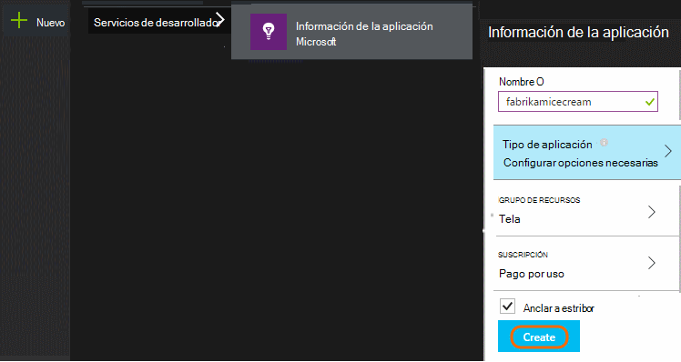

**Si su aplicación es una aplicación de dispositivo,** agregue el SDK de perspectivas de aplicación a su proyecto. El procedimiento exacto varía según el [IDE y plataforma](app-insights-platforms.md). Para las aplicaciones de Windows, haga clic en el proyecto de Visual Studio y elija "Agregar perspectivas de aplicación".

**Si es una aplicación web,** abra el módulo de inicio rápido y obtener el fragmento de código para agregar a sus páginas web. Publicarlos con este fragmento de código.

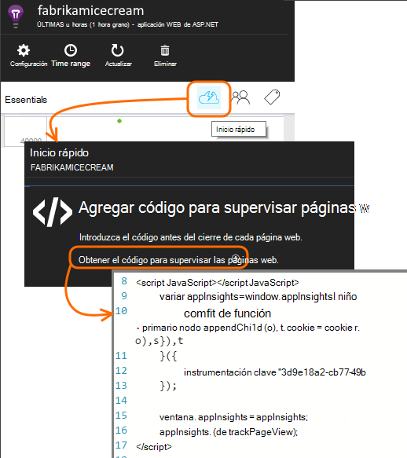

También puede agregar perspectivas de aplicación a su código de servidor [ASP.NET](app-insights-asp-net.md) o [J2EE](app-insights-java-get-started.md) a fin de combinar de telemetría de cliente y el servidor.

### Ejecutar el proyecto y ver los resultados de la primera

Ejecutar el proyecto en modo de depuración para unos minutos y vaya al [portal de Azure](https://portal.azure.com) y vaya a los recursos del proyecto en perspectivas de aplicación.

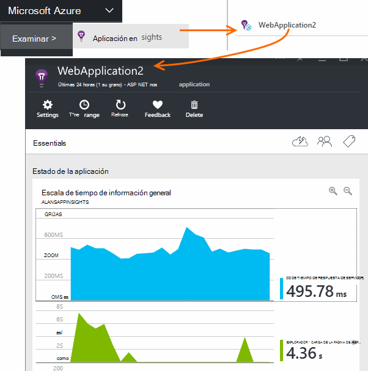

Publicar su aplicación para obtener más telemetría y averigüe qué hacen los usuarios con la aplicación.

## Análisis de fuera de la caja

Haga clic en el mosaico de vistas de la página para ver los detalles de uso.

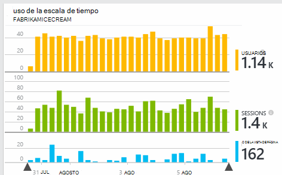

Sitúe el puntero en la parte en blanco encima de un gráfico para ver los recuentos en un momento determinado. En caso contrario, los números de mostrarán el valor agregado durante el período, como promedio, un total o un recuento de usuarios diferentes durante el período.

En aplicaciones web, se tienen en cuenta los usuarios mediante cookies. Una persona que usa varios exploradores, borra las cookies o usa la característica de privacidad se van a contar varias veces.

Una sesión de web se cuenta después de 30 minutos de inactividad. Una sesión en un teléfono u otro dispositivo se cuenta cuando la aplicación se suspende durante más de unos pocos segundos.

Haga clic en cualquier gráfico para ver más detalles. Por ejemplo:

(Este ejemplo es de un sitio Web, pero los gráficos de aspecto similares para las aplicaciones que se ejecutan en dispositivos).

Comparar con la semana anterior para ver si están cambiando las cosas:

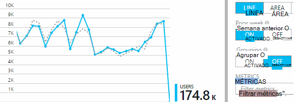

Comparar dos métricas, por ejemplo, los usuarios y los nuevos usuarios:

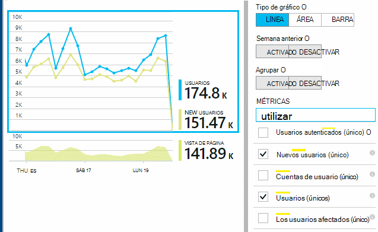

Datos de grupo (segmento) por una propiedad como explorador, sistema operativo o ciudad:

## Uso de la página

Haga clic en las vistas de página en mosaico para obtener un desglose de las páginas más populares:

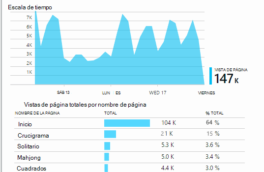

El ejemplo anterior es de un sitio Web de juegos. Que podemos ver al instante:

* No se ha mejorado el uso en la última semana. ¿Debemos pensar optimización del motor de búsqueda?
* Muchas personas menos consulte las páginas de juegos de la página principal. ¿Por qué no nuestra página de inicio gente jugar?
* 'Crucigrama' es el juego más popular. Se debe dar prioridad a nuevas ideas y mejoras hay.

## Seguimiento personalizado

Supongamos en lugar de implementar cada juego en una página web independiente, decide refactorizar todos en la misma aplicación de una sola página, con la mayoría de las funciones codificadas como Javascript en la página web. Esto permite al usuario cambiar rápidamente entre un juego o incluso tener varios juegos en una página.

Pero aún que le gustaría perspectivas de la aplicación para registrar el número de veces que se abre cada juego, exactamente igual que cuando estaban en páginas web independientes. Es fácil: simplemente insertar una llamada en el módulo de telemetría en su JavaScript donde desea registro que ha abierto una nueva página:

    telemetryClient.trackPageView(game.Name);

## Eventos personalizados

Puede usar telemetría de muchas formas para comprender cómo se utiliza la aplicación. Pero no desea mezclar los mensajes con vistas de página. En su lugar, use los eventos personalizados. Puede enviarlos desde aplicaciones de dispositivo, páginas web o un servidor web:

(JavaScript)

    telemetryClient.trackEvent("GameEnd");

(C#)

    var tc = new Microsoft.ApplicationInsights.TelemetryClient();
    tc.TrackEvent("GameEnd");

(VB)

    Dim tc = New Microsoft.ApplicationInsights.TelemetryClient()
    tc.TrackEvent("GameEnd")

Los eventos personalizados más frecuentes se enumeran en el módulo de introducción.

Haga clic en el encabezado de la tabla para ver el número total de eventos. Puede segmentar el gráfico por varios atributos como el nombre del evento:

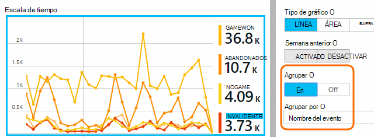

La característica especialmente útil de escalas de tiempo es que puede relacionar cambios con otros métricas y eventos. Por ejemplo, cuando se reproducen más juegos, esperaría ver un aumento en juegos abandonadas también. Pero el aumento de juegos abandonadas es desproporcionado, ¿desea averiguar si la carga es alta está causando problemas que los usuarios encontrar aceptables.

## Explorar en profundidad eventos específicos

Para obtener una mejor comprensión de cómo se pasa una sesión típica, es recomendable centrarse en una sesión de usuario específico que contiene un determinado tipo de evento.

En este ejemplo, hemos codificadas un evento personalizado "NoGame" que se llama si el usuario cierra la sesión sin iniciar realmente un juego. ¿Por qué un usuario haría? ¿Si se explorar en profundidad algunas repeticiones específicos, se recibirá una pista.

Los eventos personalizados recibidos desde la aplicación se muestran por nombre en el módulo de información general:

Haga clic en el evento de interés y seleccione una instancia específica reciente:

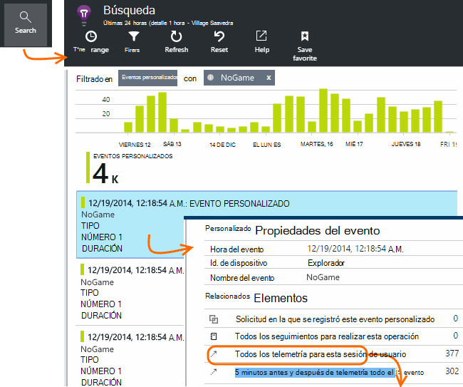

Echemos un vistazo a todo el telemetría para la sesión en la que se produjo el evento NoGame determinado.

Se han producido sin excepciones, por lo que el usuario no impide reproducir por algún error.

Podemos filtrar todos los tipos de telemetría excepto vistas de página para esta sesión:

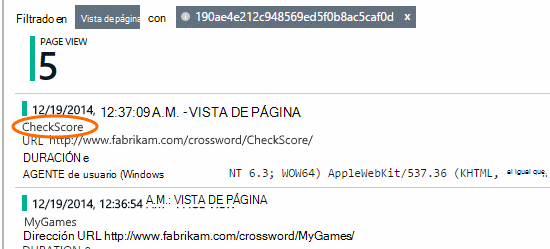

Y ahora podemos ver que este usuario conectado simplemente a comprobar los últimos resultados. ¿Se deberíamos considere desarrollar un caso de usuario que hace que sea más fácil hacerlo. (Y nos debemos implementar un evento personalizado al informe cuando se produce este artículo específico).

## Filtrar, buscar y segmentar los datos con las propiedades
Puede adjuntar etiquetas arbitrarias y valores numéricos a eventos.

JavaScript al cliente

    appInsights.trackEvent("WinGame",
        // String properties:
        {Game: currentGame.name, Difficulty: currentGame.difficulty},
        // Numeric measurements:
        {Score: currentGame.score, Opponents: currentGame.opponentCount}
    );

C# en servidor

    // Set up some properties:
    var properties = new Dictionary <string, string>
        {{"game", currentGame.Name}, {"difficulty", currentGame.Difficulty}};
    var measurements = new Dictionary <string, double>
        {{"Score", currentGame.Score}, {"Opponents", currentGame.OpponentCount}};

    // Send the event:
    telemetry.TrackEvent("WinGame", properties, measurements);

VB en servidor

    ' Set up some properties:
    Dim properties = New Dictionary (Of String, String)
    properties.Add("game", currentGame.Name)
    properties.Add("difficulty", currentGame.Difficulty)

    Dim measurements = New Dictionary (Of String, Double)
    measurements.Add("Score", currentGame.Score)
    measurements.Add("Opponents", currentGame.OpponentCount)

    ' Send the event:
    telemetry.TrackEvent("WinGame", properties, measurements)

Adjuntar propiedades a las vistas de la página de la misma manera:

JavaScript al cliente

    appInsights.trackPageView("Win",
        {Game: currentGame.Name},
        {Score: currentGame.Score});

En búsqueda de diagnóstico, ver las propiedades, haga clic en a través de una instancia individual de un evento.

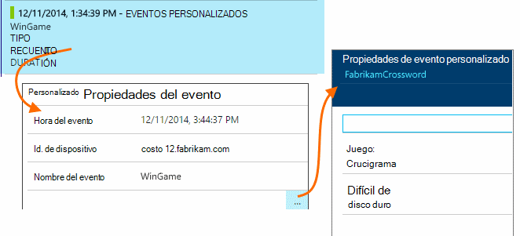

Use el campo de búsqueda para ver las apariciones de evento con un valor de propiedad concreto.

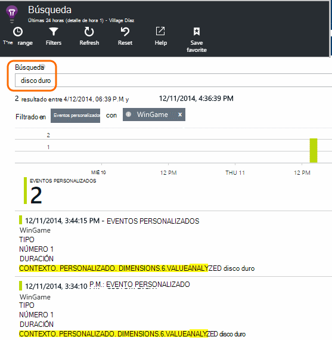

## A | Prueba B

Si no sabe qué variante de una característica será más satisfactoria, suelte ambos, que hace cada acceso a diferentes usuarios. Evaluar el éxito de cada uno y, a continuación, mueva la versión unificado.

Para que esta técnica adjunta etiquetas distintas a todos la telemetría se envía por cada versión de la aplicación. Puede hacerlo definiendo propiedades en la TelemetryContext activa. Estas propiedades predeterminadas se agregan a cada mensaje de telemetría la aplicación envía - no solo los mensajes personalizados, pero también la telemetría estándar.

En el portal de información de la aplicación, a continuación, podrá filtrar y agrupar (segmento) los datos en las etiquetas, con el fin de comparar las distintas versiones.

C# en servidor

    using Microsoft.ApplicationInsights.DataContracts;

    var context = new TelemetryContext();
    context.Properties["Game"] = currentGame.Name;
    var telemetry = new TelemetryClient(context);
    // Now all telemetry will automatically be sent with the context property:
    telemetry.TrackEvent("WinGame");

VB en servidor

    Dim context = New TelemetryContext
    context.Properties("Game") = currentGame.Name
    Dim telemetry = New TelemetryClient(context)
    ' Now all telemetry will automatically be sent with the context property:
    telemetry.TrackEvent("WinGame")

Telemetría individual puede reemplazar los valores predeterminados.

Puede configurar un inicializador universal para que todos los TelemetryClients nuevos usar automáticamente el contexto.

    // Telemetry initializer class
    public class MyTelemetryInitializer : ITelemetryInitializer
    {
        public void Initialize (ITelemetry telemetry)
        {
            telemetry.Properties["AppVersion"] = "v2.1";
        }
    }

En el inicializador de aplicación como Global.asax.cs:

    protected void Application_Start()
    {
        // ...
        TelemetryConfiguration.Active.TelemetryInitializers
        .Add(new MyTelemetryInitializer());
    }

## Obtenga información sobre generación - medida:

Cuando se utiliza el análisis, se convierte en una parte integrada de su ciclo de desarrollo, no solo algo que cree a ayudar a solucionar problemas. Estas son algunas sugerencias:

* Determinar la métrica clave de la aplicación. ¿Desea que los usuarios tantos como sea posible o preferiría un pequeño grupo de usuarios muy felices? ¿Desea maximizar las visitas o ventas?
* Plan para medir cada caso. Al esbozar un caso de usuario nuevo o característica o plan para actualizar una existente, siempre pensar en cómo desea evaluar el éxito del cambio. Antes de codificar inicia, pregunte "¿qué efecto tendrá nuestra métrica si funciona? ¿Se realiza un seguimiento cualquier evento nuevo?"
Y, por supuesto, cuando la característica está activa, asegúrese de que mirar el análisis y actuar en los resultados.
* Relacionar con otras métricas la métrica clave. Por ejemplo, si agrega una característica 'Favoritos', que le gustaría saber con qué frecuencia los usuarios agregar a Favoritos. Pero quizás es más interesante saber con qué frecuencia que vuelva a sus favoritos. Y lo más importante, ¿los clientes que usan favoritos finalmente comprar más de su producto?
* Canarias pruebas. Configurar un modificador característica que le permite realizar una nueva característica visible solo para algunos usuarios. Use perspectivas de aplicación para ver si se usa la nueva característica de la manera que previstas. Realizar ajustes y suelte para una audiencia más amplia.
* ¡Póngase en contacto con los usuarios! El análisis no es suficiente por sí mismo, pero complementaria para mantener una relación de atención al cliente.

## Aprende más

* [Detectar, clasifique y diagnosticar bloqueos y problemas de rendimiento en su aplicación](app-insights-detect-triage-diagnose.md)
* [Introducción a la información de la aplicación en varias plataformas](app-insights-detect-triage-diagnose.md)

## Vídeo

> [AZURE.VIDEO usage-monitoring-application-insights]

 
