<properties 
    pageTitle="Tutorial de aplicación de perspectivas | Microsoft Azure" 
    description="Realizar un seguimiento de uso y el rendimiento de la aplicación web directo.  Detectar, clasifique y diagnosticar problemas. Continuamente supervisar y mejorar el éxito con los usuarios." 
    services="application-insights" 
    documentationCenter=""
    authors="alancameronwills" 
    manager="douge"/>

<tags 
    ms.service="application-insights" 
    ms.workload="tbd" 
    ms.tgt_pltfrm="ibiza" 
    ms.devlang="na" 
    ms.topic="article" 
    ms.date="10/15/2016" 
    ms.author="awills"/>
 
# Aplicación perspectivas - Introducción

Perspectivas de aplicación de Visual Studio es un servicio de análisis extensible que supervisa la aplicación web directo. Con ella puede detectar y diagnosticar problemas de rendimiento y comprender qué usuarios hacer con la aplicación. Está diseñado para que desarrolladores, para ayudar a mejorar continuamente el rendimiento y uso. Funciona para las aplicaciones en una amplia variedad de plataformas incluidos .NET, Node.js y J2EE, hospedado en local o en la nube. 

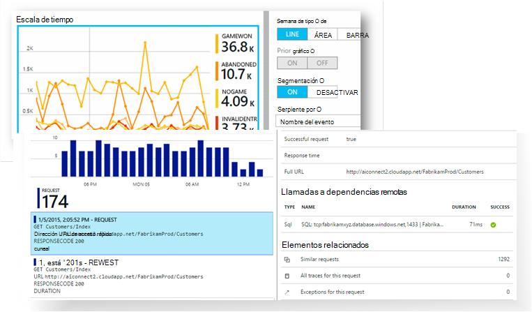

[Eche un vistazo a la animación de introducción](https://www.youtube.com/watch?v=fX2NtGrh-Y0).

## ¿Cómo funciona?

Instalar un paquete de instrumentación pequeñas en la aplicación y configurar un recurso de información de la aplicación en el portal de Microsoft Azure. La instrumentación supervisa la aplicación y envía los datos de telemetría en el portal. El portal muestra gráficos estadísticos y proporciona herramientas de búsqueda eficaces para ayudarle a diagnosticar los problemas.

Perspectivas de aplicación tiene varios [módulos de instrumentación estándar](app-insights-configuration-with-applicationinsights-config.md) que recopilar los diferentes tipos de telemetría como tiempos de respuesta de la solicitud, excepciones y llamadas de dependencia. También puede [escribir código para enviar telemetría personalizado](app-insights-api-custom-events-metrics.md) en el portal.

### ¿Qué es la sobrecarga?

El impacto en el rendimiento de la aplicación es muy pequeño. Llamadas de seguimiento son sin bloqueo y son por lotes y envía en un subproceso independiente. 

## ¿Qué hacer?

Información de la aplicación está destinado al equipo de desarrollo, para ayudarle a entender el rendimiento de la aplicación y cómo se utiliza. Proporciona:

Tipos de telemetría:

* Tasas de solicitud HTTP, tiempos de respuesta, tasas de éxito.
* Dependencia (HTTP y SQL) llame tasas, los tiempos de respuesta, tasas de éxito.
* Seguimientos de excepción de servidor y cliente.
* Seguimientos de registro de diagnóstico.
* Vista página de cuenta, cuenta de usuario y sesión, tiempos de carga del explorador, excepciones.
* Tasas de llamada de AJAX, tiempos de respuesta y tasas de éxito.
* Contadores de rendimiento del servidor.
* Telemetría personalizado de cliente y el servidor.
* Segmentación por ubicación del cliente, versión del explorador, versión del SO, instancia del servidor, dimensiones personalizadas y mucho más.
* Pruebas de disponibilidad

Herramientas de diagnósticos y analíticas:

* Alertas inteligentes y manuales tasas de error y otras métricas y de disponibilidad.
* Gráficos con el tiempo de métricas agregados.
* Llamadas de búsqueda de diagnóstico en las instancias de solicitudes, excepciones, eventos personalizados, seguimientos de registro, vistas de la página, dependencia y AJAX. 
* Análisis - un lenguaje de consulta eficaces sobre la telemetría
* Paneles - redactar los gráficos que necesita supervisar todos los componentes de la aplicación.

## ¿Cómo se puede usar?

### Monitor

Instalar aplicación perspectivas en la aplicación web, configurar las pruebas de web de disponibilidad y:

* Configurar un panel de la sala de reuniones seguir controlando de carga, la capacidad de respuesta y el rendimiento de su dependencias, las cargas de página y llamadas de AJAX. 
* Descubra cuáles son las más lento y más peticiones de errores.
* Ver secuencia directo cuando se implementa una nueva versión, debe conocer cualquier degradación inmediatamente.

### Diagnosticar

Al recibir una alerta o descubrir un problema:

* Relacionar errores con excepciones, llamadas de dependencia y trazas.
* Examine los volcados de pila y los registros de seguimiento.

### Evaluar

Medir la eficacia de cada característica nueva que implementa.

* Plan para medir cómo utilizan los clientes nueva o características de la empresa.
* En el código para iniciar el uso de escritura telemetría personalizado.
* Base cada ciclo de desarrollo en el disco duro pruebas de telemetría.

## Introducción

Información de la aplicación es uno de los muchos servicios alojados en Microsoft Azure y telemetría se envía allí para análisis y presentación. Por lo tanto, antes de nada, tendrá una suscripción a [Microsoft Azure](http://azure.com). Es gratuita iniciar sesión y puede elegir la gratuita [precios de nivel](https://azure.microsoft.com/pricing/details/application-insights/) de aplicación perspectivas. Si su organización ya tiene una suscripción, puede agregar su cuenta de Microsoft a él. 

Hay varias maneras de empezar. Comenzar con el que funciona mejor para usted. Puede agregar las demás más adelante.

* **En tiempo de ejecución: instrumentación de la aplicación web en el servidor.** Evita cualquier actualización al código. Debe tener acceso de administrador al servidor.
 * [**IIS local o en una máquina virtual**](app-insights-monitor-performance-live-website-now.md)
 * [**Aplicación web de Azure o VM**](app-insights-monitor-performance-live-website-now.md#if-your-app-runs-as-an-azure-web-app)
 * [**J2EE**](app-insights-java-live.md)
* **En tiempo de desarrollo: agregar perspectivas de aplicación al código.** Le permite escribir telemetría personalizado e instrumento back-end y aplicaciones de escritorio.
 * Actualización de 2013 [Visual Studio](app-insights-asp-net.md) 2 o posterior.
 * Java en [Eclipse](app-insights-java-eclipse.md) u [otras herramientas](app-insights-java-get-started.md)
 * [Node.js](app-insights-nodejs.md)
 * [Otras plataformas](app-insights-platforms.md)
* **[Instrumentación las páginas web](app-insights-javascript.md)** de vista de página, AJAX y otro telemetría del cliente.
* **[Pruebas de disponibilidad](app-insights-monitor-web-app-availability.md)** - ping a su sitio Web con regularidad desde nuestros servidores.

> [AZURE.NOTE]  En este momento, ¿desea obtener en y experimentar. Pero si desea ver qué puede hacer perspectivas de aplicación, siga leyendo...

## Explorar métricas

Ejecute la aplicación - ya sea en modo de depuración en su equipo de desarrollo, o la implementación en un servidor - y usar durante un tiempo. A continuación, inicie sesión en el [portal de Azure](https://portal.azure.com).

Vaya a la hoja de información general de perspectivas de aplicación de la aplicación:

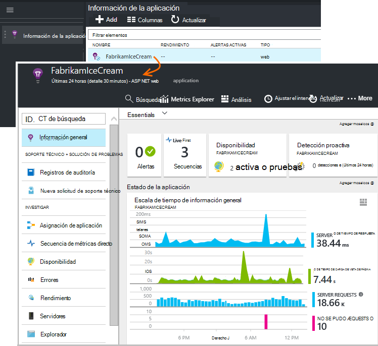

La información general le permite ver inmediatamente el rendimiento de la aplicación. Puede comparar carga (en términos de la tasa de solicitudes) con la hora de su aplicación demasiado para responder a las solicitudes. Si hay un aumento en el tiempo de respuesta cuando sube la carga desproporcionado, desea asignar más recursos a la aplicación. Si se muestra más derecha respuestas erróneas después de implementar una nueva compilación, podría desea revertir.

#### Obtener más detalles

Haga clic en cualquier gráfico para obtener un conjunto de gráficos más detallado. Por ejemplo, el gráfico de tiempo de respuesta del servidor le guía a los gráficos que muestran los tipos de solicitud, tiempos de respuesta y tiempos de respuesta de dependencias (es decir, los servicios que llama a la aplicación).  

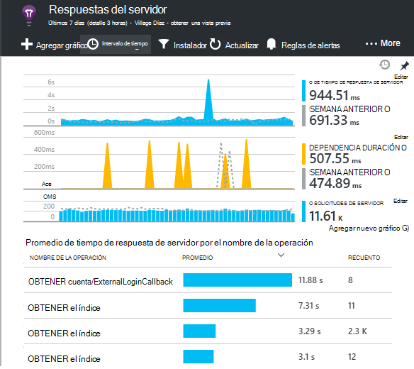

El gráfico de dependencias es útil, ya que ayuda a comprobar si las bases de datos y las API de REST que usa la aplicación responden bien o causan retrasos.

#### Personalizar un gráfico

Pruebe a editar uno de estos gráficos. Por ejemplo, si la aplicación web se ejecuta en una colección de instancias de servidor, puede comparar los tiempos de respuesta en las instancias de servidor diferente:

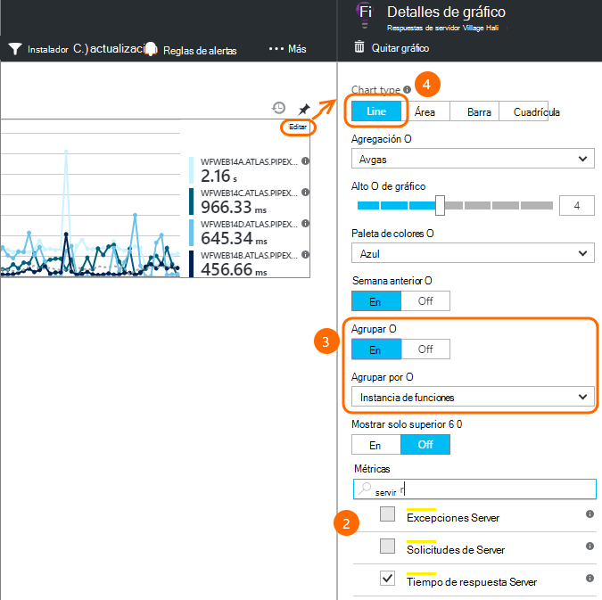

1. Mantenga el mouse sobre el gráfico y haga clic en Editar.
2. Elija una métrica. Varias métricas se pueden mostrar en un gráfico, pero solo en determinadas combinaciones: es posible que deba anular la selección de una métrica antes de seleccionar el que desee.
3. Utilizar Group By para segmentar una métrica por una propiedad. En este ejemplo, mostramos líneas separadas para diferentes tiempos de respuesta. 

    Tenga en cuenta que tiene que seleccionar una propiedad válida para el sistema métrico o el gráfico no se mostrará ningún dato.
4. Seleccione un tipo de gráfico. Área de gráficos de barras y mostrar un apilado adecuado cuando el tipo de agregación es 'Sum'.

[Más información acerca de la métrica de estudio](app-insights-metrics-explorer.md).

## Datos de la instancia de búsqueda

Para investigar un problema, resulta útil inspeccionar instancias de evento específico.

Haga clic en un gráfico métrico buscar datos de la instancia con el intervalo de tiempo y filtros relevantes. Por ejemplo, haga clic en recuentos de solicitud de servidor para ver los informes de solicitud individual. 

O bien, puede ir directamente a los datos de la instancia de búsqueda en la página de información general:

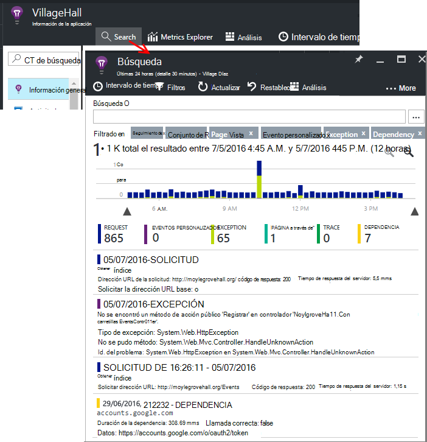

Usar filtros para centrarse en determinados tipos de eventos y en valores de propiedad seleccionada:

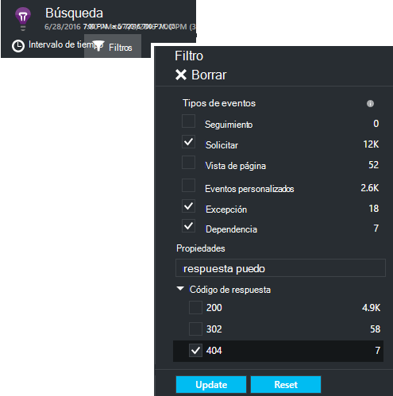

Haga clic en "..." para ver una lista completa de propiedades, o abrir otros eventos asociados con la misma solicitud. En este ejemplo, la solicitud tiene un informe de excepción asociada:

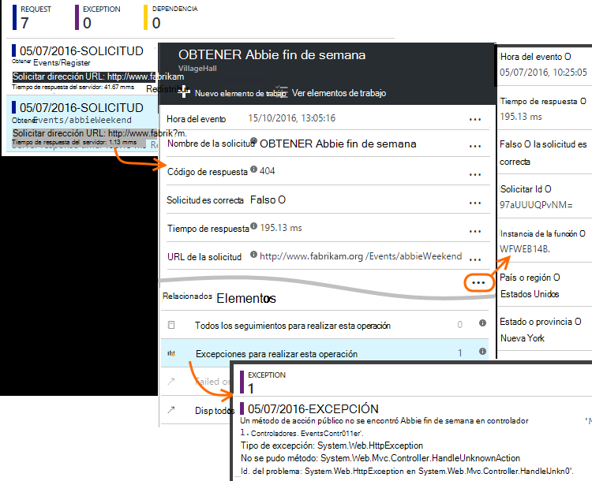

Abrir un evento: en este ejemplo, la excepción relacionada - y puede crear un elemento de trabajo (si usa Visual Studio Team Services para realizar un seguimiento de tareas). 
 
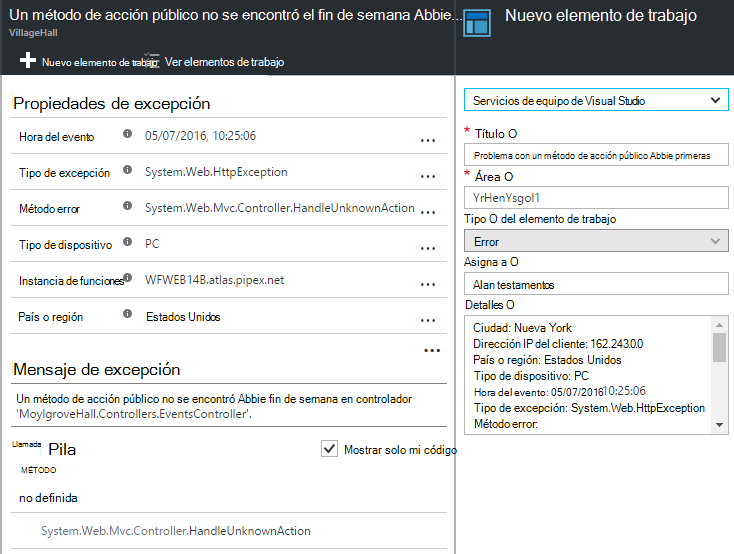

## Análisis

[Análisis](app-insights-analytics.md) es una característica aún más eficaz de búsqueda y análisis, en el que puede escribir consultas de tipo SQL sobre los datos de telemetría, ya sea para buscar problemas específicos o para compilar información estadística.

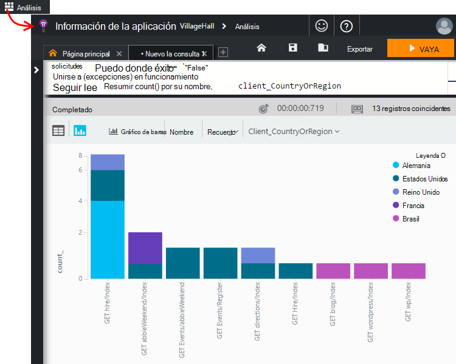

Abra la ventana tutorial para ver y ejecutar ejemplos de consultas sobre los datos o leer más [tutorial tutorial](app-insights-analytics-tour.md). IntelliSense le indicará con las consultas que puede usar y existe una [referencia de idioma completo](app-insights-analytics-reference.md). 

Las consultas normalmente comienzan con el nombre de una secuencia de telemetría como solicitudes, excepciones o dependencias. POP abrir la barra de esquema a la izquierda para ver una lista de los flujos de telemetría disponibles. La consulta es una canalización de [operaciones](app-insights-analytics-reference.md#queries-and-operators) de consulta como `where` - un filtro booleano - o `project` -que calcula nuevas propiedades. `summarize`[instancias de agregados](app-insights-analytics-tour.md#aggregate-groups-of-rows), agrupándolos que definir las funciones y aplicar las funciones de agregación sobre los datos agrupados.

Resultados pueden [representar en tablas o distintos tipos de gráfico](app-insights-analytics-tour.md#charting-the-results).

## Telemetría personalizado

La telemetría integrada que obtener instalando perspectivas de aplicación le permite analizar los recuentos de tasas de éxito, y tiempos de respuesta ambos para las solicitudes de web a sus llamadas de aplicación y a continuación, dependencias - es decir, de la aplicación de SQL, las API de REST. También puede obtener trazas de excepción y (con el Monitor de estado en el servidor) contadores de rendimiento del sistema. Si agrega el fragmento de código de cliente a las páginas web, obtener recuentos de vista de página y tiempos de carga, excepciones de cliente y AJAX llamada tasas de éxito y la respuesta. 

Analizar todos los este telemetría puede indicarle mucho sobre el rendimiento y el uso de la aplicación. Pero a veces no es suficiente. Es recomendable supervisar la longitud de una cola de modo que puede ajustar el rendimiento; o contar ventas y segmentar ellos según la ubicación. o bien, en el lado cliente, aprenda a menudo usuarios haga clic en un determinado botón de modo que puede ajustar la experiencia del usuario.

La [Aplicación perspectivas API](app-insights-api-custom-events-metrics.md) proporciona llamadas `TrackEvent(name)` y `TrackMetric(name, value)` para que pueda enviar sus propios eventos personalizados y mediciones. Hay llamadas equivalentes para el cliente.

Por ejemplo, si su página web es una aplicación de juego de una sola página, puede insertar una línea en los lugares adecuados para iniciar una sesión cuando el usuario gana o pierde un juego:

    
    appInsights.trackEvent("WinGame");
    ...
    appInsights.trackEvent("LoseGame");

A continuación, podemos gráfico recuentos de eventos personalizados, segmentación de por nombre de evento:

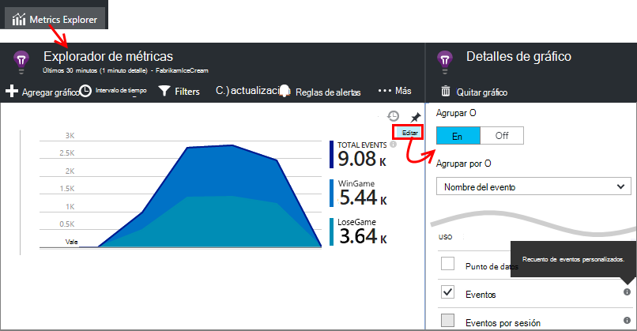

### Seguimientos de registro

Para propósitos de diagnóstico, hay un evento personalizado `TrackTrace(message)` que puede usar para seguimientos de ejecución. En las funciones de búsqueda y análisis, puede buscar en el contenido del mensaje, que puede tener más de un nombre de evento. 

Si ya usa un marco de registro como Log4Net, NLog, Log4J o System.Diagnostic.Trace, a continuación, esas llamadas de seguimiento pueden capturar información de la aplicación y aparecerán junto a la otra telemetría. Las herramientas de Visual Studio agrega automáticamente el módulo SDK correspondiente.

## Paneles

Muchas aplicaciones constan de varios componentes, como un servicio web y uno o varios back-end procesadores. Cada componente que se va a supervisar un recurso de aplicación perspectivas independiente. Si el sistema se ejecuta en Azure, puede usar - y supervisión - servicios como hubs de evento y aprendizaje también. 

Para supervisar el sistema completo, puede seleccionar los gráficos más interesantes de diferentes aplicaciones y anclar a un [panel](app-insights-dashboards.md)de Azure, lo que le permite seguir controlando todo el sistema continuamente. 

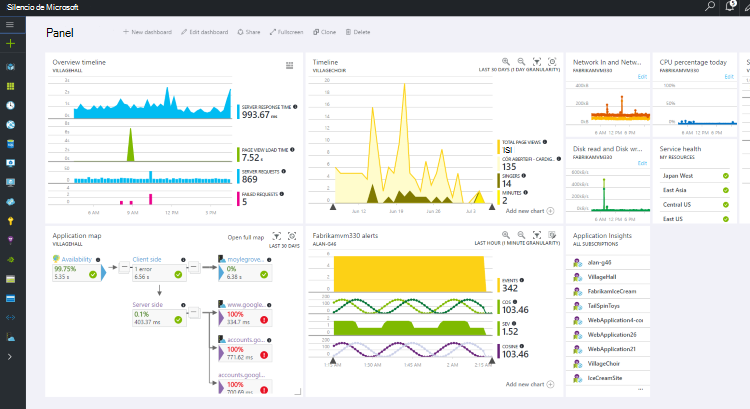

De hecho, puede crear los paneles varios - por ejemplo, un panel de salón de grupo para supervisar el mantenimiento del sistema general; un panel de diseño que se centra en el uso de las diferentes características; un panel independiente de componentes de prueba; y así sucesivamente.  

Paneles, como recursos, pueden compartirse entre los miembros del equipo.

## Desarrollo en Visual Studio

Si usa Visual Studio para desarrollar la aplicación, encontrará varias herramientas de perspectivas de aplicación integradas. 

### Búsqueda de diagnóstico

La ventana de búsqueda muestra los eventos que se han registrado. (Si ha iniciado sesión Azure al configurar perspectivas de aplicación, podrá buscar los mismos eventos en el portal.)

La búsqueda de texto sin formato funciona en todos los campos de los eventos. Por ejemplo, buscar parte de la dirección URL de una página; o bien el valor de una propiedad como ciudad del cliente; o palabras específicas en un registro de seguimiento.

Haga clic en cualquier evento para ver sus propiedades detalladas.

También puede abrir la pestaña elementos relacionados para ayudar a diagnosticar errores en las peticiones o excepciones.

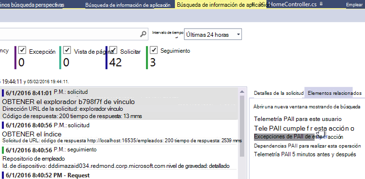

### Hub de diagnóstico

El concentrador de diagnósticos (en Visual Studio de 2015 o posterior) muestra la telemetría de servidor de aplicación perspectivas mientras se genera. Esto funciona incluso si elegido sólo para instalar el SDK, sin necesidad de conectarse a un recurso en el portal de Azure.

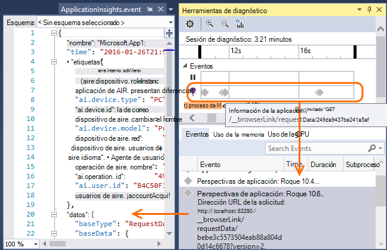

### Excepciones

Si tiene que [Configurar excepción supervisión](app-insights-asp-net-exceptions.md), informes de excepción se mostrarán en la ventana de búsqueda. 

Haga clic en una excepción para obtener un seguimiento de la pila. Si el código de la aplicación está abierto en Visual Studio, puede hacer clic a través del seguimiento de pila a la línea correspondiente del código.

Además, en la línea de código Lens encima de cada método, verá un recuento de las excepciones registrados por aplicación perspectivas en las últimas 24 horas.

### Supervisión local

(De Visual Studio 2015 Update 2) Si todavía no lo ha configurado el SDK para enviar telemetría en el portal de información de la aplicación (de modo que no hay ninguna clave instrumentación en ApplicationInsights.config) aparece la ventana Diagnósticos mostrará telemetría desde la sesión de depuración más reciente. 

Esto es conveniente si ya ha publicado una versión anterior de la aplicación. No desea la telemetría de las sesiones de depuración mezclar con la telemetría en el portal de información de la aplicación desde la aplicación publicada.

También es útil si tiene algunas [telemetría personalizado](app-insights-api-custom-events-metrics.md) que desea depurar antes de enviar telemetría en el portal.

* *En primer lugar, totalmente configurado perspectivas de aplicación para enviar telemetría en el portal. Pero ahora deseo ver la telemetría solo en Visual Studio.*

 * En configuración de la ventana de búsqueda, hay una opción para buscar diagnósticos locales, incluso si su aplicación envía telemetría en el portal.
 * Para dejar de telemetría enviado al portal, comente la línea `<instrumentationkey>...` desde ApplicationInsights.config. Cuando esté listo para enviar telemetría en el portal de nuevo, quitar los comentarios.

## Tendencias

Tendencias es una herramienta en Visual Studio para visualizar el comportamiento de la aplicación con el tiempo. 

Elija **Explorar tendencias de telemetría** desde la ventana de búsqueda de información de aplicación o un botón de la barra de información de la aplicación. Elija una de las cinco consultas comunes para empezar. Puede analizar diferentes conjuntos de datos basándose en los tipos de telemetría, los intervalos de tiempo y otras propiedades. 

Para buscar anomalías en los datos, elija una de las opciones de anomalías en la lista desplegable de "Tipo de vista". Las opciones de filtrado en la parte inferior de la ventana facilitan la pulir subconjuntos específicos de la telemetría.

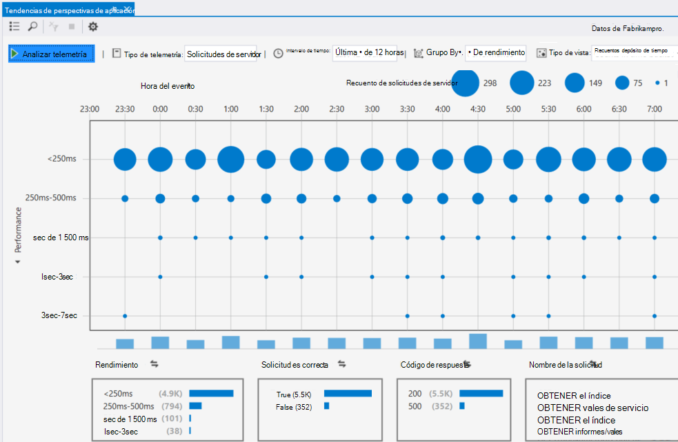

## Liberar una nueva compilación

### Secuencia de métricas directo

Secuencia de métricas directo muestra las métricas de aplicación directamente en este momento, con un nivel de latencia de casi en tiempo real de 1 segundo. Esto es muy útil cuando está liberar una nueva compilación y desea asegurarse de que todo está funcionar según lo esperado, o investigar un incidente en tiempo real.

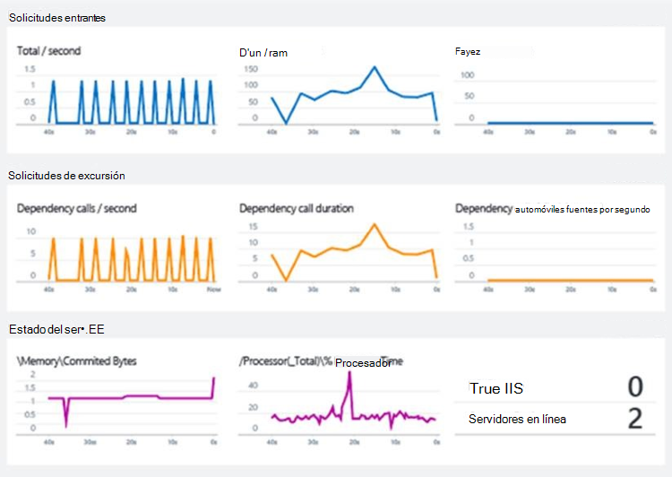

A diferencia de explorador métricas, secuencia métricas directo muestra un conjunto fijo de métricas. Los datos solo se mantiene mientras está en el gráfico y, a continuación, se descarta. 

### Anotaciones

[Anotaciones de lanzamiento](app-insights-annotations.md) en gráficos de métricas mostrar donde ha implementado una nueva compilación. Hacen que sea más fácil ver si los cambios tenían ningún efecto en el rendimiento de la aplicación. Se pueden crear automáticamente por el [sistema de compilación de Visual Studio Team Services](https://www.visualstudio.com/en-us/get-started/build/build-your-app-vs)y también puede [crearlos de PowerShell](#create-annotations-from-powershell).

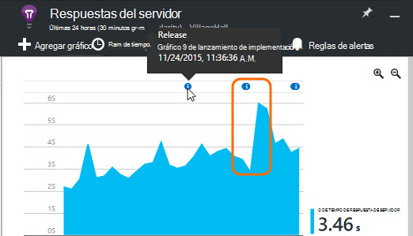

Anotaciones de lanzamiento son una característica de la compilación en la nube y suelte el servicio de Visual Studio Team Services. 

## Alertas

Si algo va mal con la aplicación, desea conocer inmediatamente. 

Aplicación perspectivas ofrece tres tipos de alerta, que se envían por correo electrónico.

### Diagnósticos proactivas 

[Diagnósticos proactivas](app-insights-proactive-failure-diagnostics.md) se configura automáticamente: no tiene que configurarlo. Dado que el sitio tiene suficiente tráfico, recibirá un correo electrónico si hay un aumento en las solicitudes con error que tiene para la hora del día o solicitud de tasa. La alerta contiene información de diagnóstico. 

Aquí es un ejemplo de alerta. 

Un segundo tipo de detección proactiva descubre correlación entre errores y factores como ubicación, el sistema operativo cliente o el tipo de explorador.

### Métricas alertas

Puede configurar las [alertas métricas](app-insights-alerts.md) para saber cuándo cualquier métrica cruza un valor de umbral algunos período - como recuentos de error, memoria o vistas de la página.

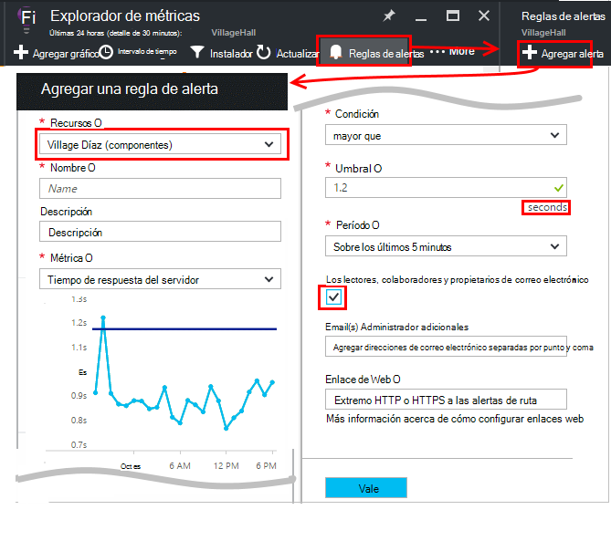

### Disponibilidad

[Pruebas de disponibilidad web](app-insights-monitor-web-app-availability.md) envíe solicitudes a su sitio desde nuestros servidores en varias ubicaciones del mundo. Saber si su sitio está disponible en internet o responde lentamente. 

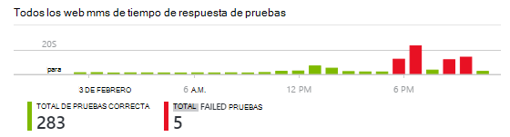

## Exportar

Hay varias maneras de obtener los datos de telemetría fuera del portal de información de la aplicación:

* [Exportar continua](app-insights-export-telemetry.md) es ideal si desea conservar grandes partes de su telemetría más el período de retención estándar.
* [Métrica de](app-insights-metrics-explorer.md#export-to-excel) tablas, los resultados de búsqueda y los resultados de [análisis](app-insights-analytics.md) pueden exportarse a una hoja de cálculo de Excel. 
* La API de REST de acceso de datos puede utilizarse para buscar y extraer datos, incluida la ejecución de análisis de consultas. La API está en vista previa privado. [Obtenga información sobre cómo unirse a la vista previa](https://visualstudio.uservoice.com/forums/357324-application-insights/suggestions/4999529-make-data-accessible-via-apis-for-custom-processin).
* Puede exportar paneles de [análisis de consultas en Power BI](app-insights-export-power-bi.md) y ver los resultados en visualizaciones de Power BI, que se pueden actualizar automáticamente.

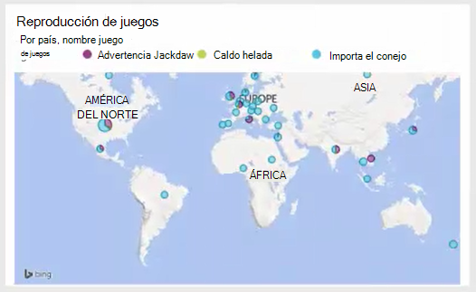
 
## Administración de datos

Hay límites en el uso de la información de la aplicación, que hasta cierto punto varían en función de la combinación de precio que elija. Los límites principales se encuentran en:

* Tasa de telemetría por minuto
* Número de puntos de datos por mes.
* Período de retención de datos

[El muestreo](app-insights-sampling.md) es un mecanismo para reducir el costo y evitar limitación. Descarta una parte de su telemetría, mantener un representante de ejemplo. Elementos asociados (como excepciones y las solicitudes que causaron ellos) se mantenga o se descartan juntas. Para las aplicaciones de ASP.NET muestreo es automático y se aplica en la aplicación; en caso contrario, podrá establecer que se aplique en recopilación en el portal.

## Pasos siguientes

Empezar a trabajar en tiempo de ejecución con:

* [Servidor IIS](app-insights-monitor-performance-live-website-now.md)
* [Servidor J2EE](app-insights-java-live.md)

Introducción al tiempo de desarrollo con:

* [ASP.NET](app-insights-asp-net.md)
* [Java](app-insights-java-get-started.md)
* [Node.js](app-insights-nodejs.md)

## Soporte técnico y comentarios

* Preguntas y problemas de:
 * [Solución de problemas][qna]
 * [Foro de MSDN](https://social.msdn.microsoft.com/Forums/vstudio/home?forum=ApplicationInsights)
 * [StackOverflow](http://stackoverflow.com/questions/tagged/ms-application-insights)
 * [Obtener soporte técnico para programadores](app-insights-get-dev-support.md)
* Las sugerencias:
 * [UserVoice](https://visualstudio.uservoice.com/forums/357324)
* Blog:
 * [Blog de perspectivas de aplicación](https://azure.microsoft.com/blog/tag/application-insights)

## Vídeos

[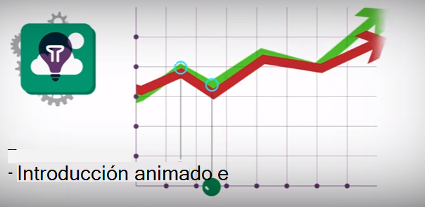](https://www.youtube.com/watch?v=fX2NtGrh-Y0)

> [AZURE.VIDEO 218]

> [AZURE.VIDEO usage-monitoring-application-insights]

> [AZURE.VIDEO performance-monitoring-application-insights]

> [Animación de introducción](https://www.youtube.com/watch?v=fX2NtGrh-Y0)

<!--Link references-->

[android]: https://github.com/Microsoft/ApplicationInsights-Android
[azure]: ../insights-perf-analytics.md
[client]: app-insights-javascript.md
[desktop]: app-insights-windows-desktop.md
[detect]: app-insights-detect-triage-diagnose.md
[greenbrown]: app-insights-asp-net.md
[ios]: https://github.com/Microsoft/ApplicationInsights-iOS
[java]: app-insights-java-get-started.md
[knowUsers]: app-insights-overview-usage.md
[platforms]: app-insights-platforms.md
[portal]: http://portal.azure.com/
[qna]: app-insights-troubleshoot-faq.md
[redfield]: app-insights-monitor-performance-live-website-now.md

 