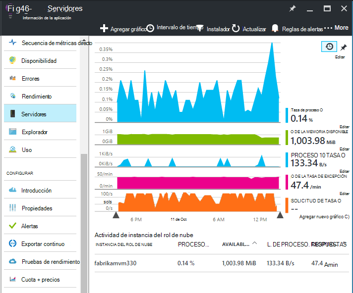
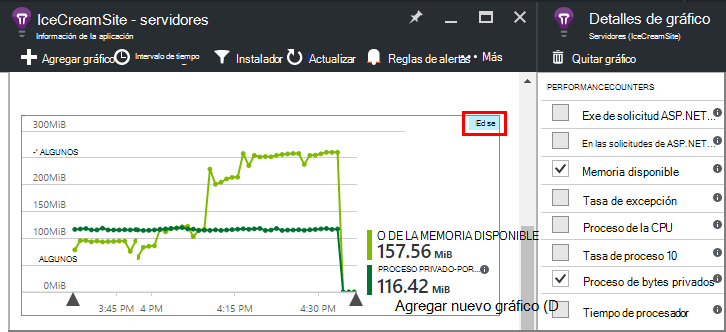
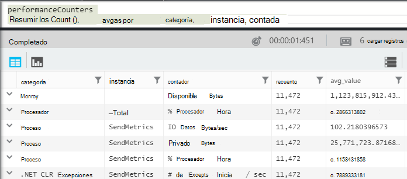
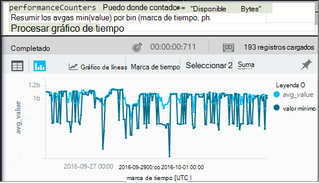
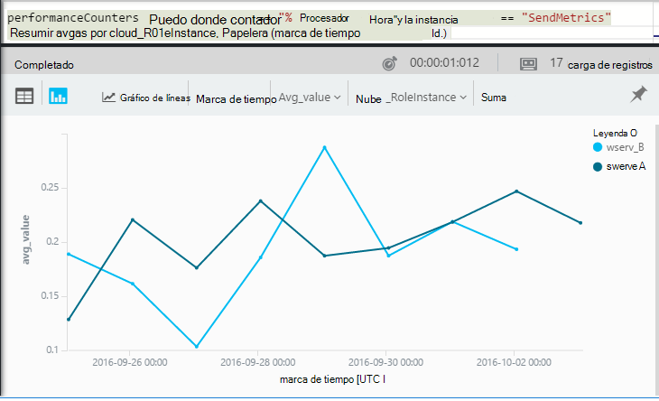

<properties 
    pageTitle="Contadores de rendimiento de aplicación perspectivas | Microsoft Azure" 
    description="Supervisar el sistema y contadores de rendimiento de .NET personalizados en perspectivas de aplicación." 
    services="application-insights" 
    documentationCenter=""
    authors="alancameronwills" 
    manager="douge"/>

<tags 
    ms.service="application-insights" 
    ms.workload="tbd" 
    ms.tgt_pltfrm="ibiza" 
    ms.devlang="na" 
    ms.topic="article" 
    ms.date="10/11/2016" 
    ms.author="awills"/>
 
# <a name="system-performance-counters-in-application-insights"></a>Contadores de rendimiento del sistema en información de la aplicación


Windows proporciona una amplia variedad de [contadores](http://www.codeproject.com/Articles/8590/An-Introduction-To-Performance-Counters) como pertenencia CPU, memoria, disco y uso de la red. También puede definir sus propios. [Información de la aplicación](app-insights-overview.md) puede mostrar estos contadores de rendimiento si la aplicación se está ejecutando en IIS en un host local o una máquina virtual a las que tiene acceso administrativo. Los gráficos indican los recursos disponibles para la aplicación activa y pueden ayudarle a identificar carga equilibrada entre instancias del servidor.

Contadores aparecen en el módulo de servidores, que incluye una tabla segmentos de esa instancia del servidor.



(Contadores de rendimiento no están disponibles para las aplicaciones Web de Azure. Pero puede [Enviar diagnósticos de Azure de aplicación impresiones](app-insights-azure-diagnostics.md)).

## <a name="configure"></a>Configurar

Si aún no está instalado el Monitor de estado de aplicación perspectivas en los equipos de servidor, debe instalar para que vea.

Descargue y ejecute el [Instalador de Monitor de estado](http://go.microsoft.com/fwlink/?LinkId=506648) en cada instancia del servidor. Si ya está instalado, no es necesario instalar de nuevo.

* *He [instalado el SDK de perspectivas de aplicación en mi aplicación](app-insights-asp-net.md) durante el desarrollo. ¿Necesita a Monitor de estado?*

    Sí, el Monitor de estado es necesario para recopilar contadores de rendimiento para aplicaciones web ASP.NET. Como ya sabe ya, Monitor de estado también puede usarse para [supervisar aplicaciones de web que ya están live](app-insights-monitor-performance-live-website-now.md), sin necesidad de instalar el SDK durante el desarrollo.


## <a name="view-counters"></a>Ver los contadores

El módulo de servidores muestra un conjunto predeterminado de contadores de rendimiento. 

Para ver otros contadores, edite los gráficos en el módulo de servidores, o abrir un nuevo módulo de [Explorador métricas](app-insights-metrics-explorer.md) y agregar nuevos gráficos. 

Los contadores disponibles se muestran como métricas al editar un gráfico.



Para ver todos los gráficos muy útiles en un único lugar, crear un [panel](app-insights-dashboards.md) y anclar en él.

## <a name="add-counters"></a>Agregar contadores

Si el contador de rendimiento que desea no se muestra en la lista de las mediciones, que es porque el SDK de perspectivas de aplicación no está recopilando en el servidor web. Puede configurarlo para ello.

1. Averiguar qué contadores están disponibles en el servidor usando este comando de PowerShell en el servidor:

    `Get-Counter -ListSet *`

    (See [`Get-Counter`](https://technet.microsoft.com/library/hh849685.aspx).)

1. Abra ApplicationInsights.config.

 * Si ha agregado perspectivas de aplicación a su aplicación durante el desarrollo, editar ApplicationInsights.config en su proyecto y volver a implementar en los servidores.
 * Si utiliza a monitores de estado instrumentación de una aplicación web en tiempo de ejecución, busque ApplicationInsights.config en el directorio de raíz de la aplicación en IIS. Actualizar hay en cada instancia del servidor.

2. Editar la directiva de selector de rendimiento:

 ```XML

    <Add Type="Microsoft.ApplicationInsights.Extensibility.PerfCounterCollector.PerformanceCollectorModule, Microsoft.AI.PerfCounterCollector">
      <Counters>
        <Add PerformanceCounter="\Objects\Processes"/>
        <Add PerformanceCounter="\Sales(photo)\# Items Sold" ReportAs="Photo sales"/>
      </Counters>
    </Add>

```

Puede capturar contadores estándar y los que ha implementado usted mismo. `\Objects\Processes`es un ejemplo de un contador estándar, disponible en todos los sistemas de Windows. `\Sales(photo)\# Items Sold`es un ejemplo de un contador personalizado que se puede implementar en un servicio web. 

El formato es `\Category(instance)\Counter"`, o para las categorías que no tienen instancias, sólo `\Category\Counter`.

`ReportAs`se requiere para los nombres de contador que no coincidan con `[a-zA-Z()/-_ \.]+` -es decir, que contienen caracteres que no están en los siguientes conjuntos: letras, redondear entre corchetes, diagonal, guión, subrayado, espacio, punto.

Si especifica una instancia, se recopilará como dimensión "CounterInstanceName" de la métrica notificada.

### <a name="collecting-performance-counters-in-code"></a>Recopilar contadores de rendimiento en el código

Para recopilar contadores de rendimiento del sistema y enviarlos a la información de la aplicación, puede adaptar el fragmento de código siguiente:

    var perfCollectorModule = new PerformanceCollectorModule();
    perfCollectorModule.Counters.Add(new PerformanceCounterCollectionRequest(
      @"\.NET CLR Memory([replace-with-application-process-name])\# GC Handles", "GC Handles")));
    perfCollectorModule.Initialize(TelemetryConfiguration.Active);

O bien, puede hacer lo mismo con métricas personalizadas que creó:

    var perfCollectorModule = new PerformanceCollectorModule();
    perfCollectorModule.Counters.Add(new PerformanceCounterCollectionRequest(
      @"\Sales(photo)\# Items Sold", "Photo sales"));
    perfCollectorModule.Initialize(TelemetryConfiguration.Active);

## <a name="performance-counters-in-analytics"></a>Contadores de rendimiento de análisis

Puede buscar y mostrar los informes de contador de rendimiento en [el análisis](app-insights-analytics.md).


El esquema de **performanceCounters** expone el `category`, `counter` nombre, y `instance` nombre de cada contador de rendimiento.  En la telemetría para cada aplicación, verá únicamente los contadores para la aplicación. Por ejemplo, para ver qué contadores están disponibles: 



(Aquí 'Instancia' hace referencia a la instancia de contador de rendimiento, no la instancia de equipo servidor o rol. El nombre de instancia de contador de rendimiento normalmente los segmentos contadores como tiempo de procesador por el nombre del proceso o la aplicación.)

Para obtener un gráfico de la memoria disponible durante el período reciente: 




Al igual que otros telemetría **performanceCounters** también tiene una columna `cloud_RoleInstance` que indica la identidad de la instancia del servidor de host en el que se ejecuta la aplicación. Por ejemplo, para comparar el rendimiento de la aplicación en los equipos diferentes: 




## <a name="aspnet-and-application-insights-counts"></a>Recuentos de aplicación perspectivas y ASP.NET

*¿Cuál es la diferencia entre la tasa de excepción y métricas excepciones?*

* *Tasa de excepción* es un contador de rendimiento del sistema. CLR cuenta todas las excepciones controladas y que se producen y el total se divide en un intervalo de muestreo por el intervalo de tiempo. El SDK de perspectivas de aplicación recopila este resultado y envía el portal.
* *Excepciones* es un recuento de los informes de TrackException recibido en el portal en el intervalo de muestreo del gráfico. Incluye las excepciones controladas donde ha escrito TrackException llamadas en el código y no incluye todas las [excepciones no controladas](app-insights-asp-net-exceptions.md). 

## <a name="alerts"></a>Alertas

Como otras métricas, puede [establecer una alerta](app-insights-alerts.md) para advertir si pasa un contador de rendimiento fuera de un límite que especifique. Abra el módulo de alertas y haga clic en Agregar alerta.


## <a name="next"></a>Pasos siguientes

* [Dependencia de seguimiento](app-insights-asp-net-dependencies.md)
* [Seguimiento de excepción](app-insights-asp-net-exceptions.md)