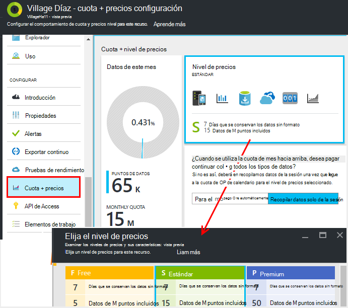
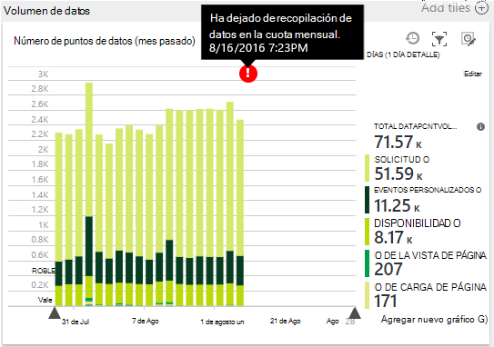
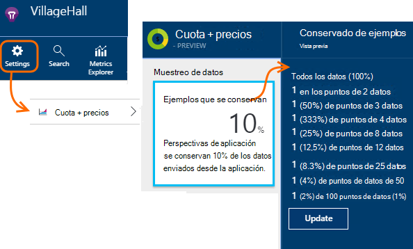
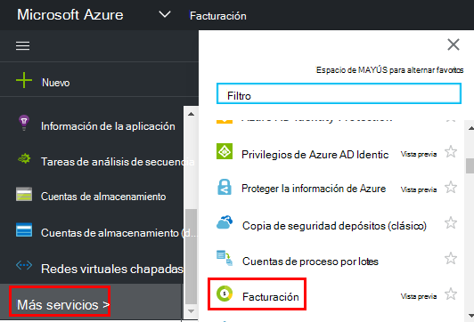

<properties 
    pageTitle="Administrar los precios y cuota de perspectivas de aplicación | Microsoft Azure" 
    description="Elegir el plan de precios que necesita, administrar volúmenes de telemetría" 
    services="application-insights" 
    documentationCenter=""
    authors="alancameronwills" 
    manager="douge"/>

<tags 
    ms.service="application-insights" 
    ms.workload="tbd" 
    ms.tgt_pltfrm="ibiza" 
    ms.devlang="na" 
    ms.topic="article" 
    ms.date="10/13/2016" 
    ms.author="awills"/>

# Administrar los precios y cuota de perspectivas de aplicación

*Información de la aplicación está en vista previa.*

[Precios] [ pricing] para [Impresiones de aplicación de Visual Studio] [ start] se basa en el volumen de los datos por aplicación. Hay un nivel gratuito importante en el que recibe la mayoría de las características con algunas limitaciones.

Cada recurso de información de la aplicación se cargará como servicio independiente y contribuye a la lista para su suscripción de Azure.

[Ver la combinación de precio][pricing].

## Revisar el plan de cuota y precio para el recurso de información de la aplicación

Puede abrir la cuota + precios placa desde la configuración del recurso de la aplicación.

Afecta la opción de combinación de precios:

* [Cuota mensual](#monthly-quota) - la cantidad de telemetría que puede analizar cada mes.
* [Tasa de datos](#data-rate) : la velocidad máxima a la que se pueden procesar datos de la aplicación.
* [Exportar continuo](#continuous-export) - si puede exportar datos a otros servicios y herramientas.

Estos límites se establecen por separado para cada recurso perspectivas de aplicación.

### Prueba gratuita de Premium

Al crear un nuevo recurso de información de la aplicación, se inicia en el nivel gratuito.

En cualquier momento, puede cambiar la versión de prueba de Premium gratuita de 30 días. Esto le da las ventajas del nivel Premium. Después de 30 días, cambiará automáticamente a cualquier nivel hayan sido antes - a menos que decida explícitamente otro nivel. Seleccione el nivel que le gustaría en cualquier momento durante el período de prueba, pero aún obtendrá la versión de prueba gratuita hasta el final del período de 30 días.

## Cuota mensual

* En cada mes del calendario, la aplicación puede enviar hasta una cantidad especificada de telemetría de impresiones de aplicación. Actualmente la cuota para el nivel de precio gratuita es 5 millones de puntos de datos por mes y mucho más para las combinaciones de otras; puede comprar más si alcanza la cuota.  Ver la [combinación de precios] [ pricing] para los números reales. 
* La cuota depende del nivel de precios que ha elegido.
* La cuota se cuenta desde la medianoche UTC en el primer día de cada mes.
* Muestra el gráfico de puntos de datos de la cuota de usa de este mes.
* La cuota se mide en *puntos de datos.* Un único punto de datos es una llamada a uno de los métodos de seguimiento, si se llama explícitamente en el código o por uno de los módulos de telemetría estándar. Puede tener varias propiedades asociadas y mediciones.
* Puntos de datos generadas por:
 * [Módulos SDK](app-insights-configuration-with-applicationinsights-config.md) que recopilar automáticamente datos, por ejemplo para informar de una solicitud o bloqueo, o para medir el rendimiento.
 * [API](app-insights-api-custom-events-metrics.md) `Track...` llamadas que haya escrito, como por ejemplo `TrackEvent` o `trackPageView`.
 * [Pruebas de disponibilidad web](app-insights-monitor-web-app-availability.md) que ha configurado.
* Mientras está depuración, puede ver los puntos de datos que se envía desde la aplicación en la ventana de resultados de Visual Studio. Eventos de cliente pueden verse al abrir que el panel (normalmente F12) de depuración de la ficha de red en el explorador.
* *Datos de la sesión* no se cuentan en la cuota. Esto incluye recuentos de usuarios, sesiones, entorno y datos del dispositivo.
* Si desea contar puntos de datos mediante la inspección, puede encontrarlos en varios lugares:
 * Cada elemento aparece en la [búsqueda de diagnóstico](app-insights-diagnostic-search.md), que incluye las solicitudes HTTP, excepciones, seguimientos de registro, vistas de la página, eventos de dependencia y eventos personalizados.
 * Cada medida sin formato de una [métrica](app-insights-metrics-explorer.md) como un contador de rendimiento. (Lo que ve en los gráficos normalmente es agregados de varios puntos de datos sin formato).
 * Cada punto de un gráfico de disponibilidad de web también es un agregado de varios puntos de datos.
* También puede inspeccionar puntos de datos individuales en origen durante la depuración:
 * Si la aplicación se ejecuta en modo de depuración en Visual Studio, se registran los puntos de datos en la ventana de resultados. 
 * Para ver los puntos de datos de cliente, abra el Explorador de depuración de panel (normalmente F12) y abrir la pestaña de la red.
* La velocidad de datos posible (opción predeterminada) reducirá [muestreo adaptación](app-insights-sampling.md). Esto significa que, como el uso de su aumentan de aplicación, no aumenta la velocidad de telemetría como cabría esperar.

### Excedente

Si su aplicación envía más de la cuota mensual, puede:

* Pagar por datos adicionales. Ver la [combinación de precios] [ pricing] para obtener más detalles. Puede elegir esta opción con anticipación. Esta opción no está disponible en gratuita en el nivel de precios.
* Actualizar el nivel de precio.
* No haga nada. Datos de la sesión seguirá registrará, pero otros datos no aparecerá en la búsqueda de diagnóstico o en el Explorador de métricas.

## ¿La cantidad de datos estoy enviando?

El gráfico en la parte inferior de los precios módulo muestra el volumen de puntos de datos de la aplicación, agrupados por tipo de punto de datos. (También puede crear este gráfico en el Explorador de métrica.)

Haga clic en el gráfico para obtener más detalles, o arrastre el puntero sobre él y haga clic en (+) para el detalle de un intervalo de tiempo.

El gráfico muestra el volumen de datos que llega en el servicio de aplicación perspectivas después de [muestreo](app-insights-sampling.md).

Si el volumen de datos alcanza la cuota mensual, aparece una anotación en el gráfico.

## Tasa de datos

Además de la cuota mensual, hay límites limitación en el tipo de datos. Para gratuita [precios nivel] [ pricing] el límite es de 200 datos puntos por segundo promediados de más de cinco minutos y para el pago de niveles 500/s promedio más de 1 minuto. 

Existen tres categorías que se cuentan por separado:

* [Llamadas TrackTrace](app-insights-api-custom-events-metrics.md#track-trace) y [genera registros](app-insights-asp-net-trace-logs.md)
* [Excepciones](app-insights-api-custom-events-metrics.md#track-exception), limitado a 50 puntos/s
* Todos los demás telemetría (vistas de página, sesiones, solicitudes, dependencias, métricas, eventos personalizados, resultados de pruebas web).

*¿Qué ocurre si mi aplicación supera el índice por segundo?*

* El volumen de datos que su aplicación envía se evalúa cada minuto. Si excede la tasa por segundo promediada por minuto, el servidor rechaza algunas solicitudes. El SDK búferes los datos y luego se intenta volver a enviar, extiende un sobrevoltaje las durante varios minutos. Si su aplicación de forma uniforme envía los datos en encima de la tasa de límite, se quitarán algunos datos. (El ASP.NET, Java y JavaScript SDK intentan volver a enviar de este modo, otros SDK podría simplemente colocar acelerado datos).

Si se produce la limitación, verá una notificación de mensaje de advertencia que esto ha sucedido.

*¿Cómo se puede saber cuántos puntos de datos que se está enviando mi aplicación?*

* Abrir configuración o cuota y precios para ver el gráfico de volumen de los datos.
* O bien, en el Explorador de métricas, agregar un nuevo gráfico y seleccione el **volumen de punto de datos** como métrica. Cambie de agrupación y agrupar por **tipo de datos**.

## Para reducir la velocidad de datos

Si encuentra los límites de limitación, estas son algunas de las cosas que puede hacer:

* Utilizar [muestreo](app-insights-sampling.md). Esta tecnología reduce la velocidad de datos sin sesgo las métricas y sin interrumpir la capacidad para desplazarse entre los elementos relacionados de búsqueda.
* [Limitar el número de llamadas de Ajax que se puede registrar](app-insights-javascript.md#detailed-configuration) en cada vista de página o cambiar el informe de Ajax.
* Para desactivar módulos colección que no necesita editando [ApplicationInsights.config](app-insights-configuration-with-applicationinsights-config.md). Por ejemplo, puede decidir que contadores o datos de dependencia son accesorias.
* Métricas previamente agregados. Si dispone de poner llamadas a TrackMetric en la aplicación, puede reducir el tráfico utilizando la sobrecarga que acepte el cálculo de la media y desviación estándar de un lote de medidas. O bien, puede usar un [paquete de agregación previa](https://www.myget.org/gallery/applicationinsights-sdk-labs). 

## Muestreo

[El muestreo](app-insights-sampling.md) es un método para reducir la velocidad a la que telemetría se envía a la aplicación, mientras que mantiene la capacidad de buscar eventos relacionados durante las búsquedas de diagnósticos y que mantiene correcta evento cuenta. 

Muestreo es una manera efectiva de reducir los gastos y mantenerse dentro de la cuota mensual. El algoritmo de muestreo conserva los elementos relacionados de telemetría, que, por ejemplo, cuando use la búsqueda, puede encontrar la solicitud relacionada con una excepción determinada. El algoritmo también conserva recuentos correctas, por lo que verá los valores correctos en el Explorador de métrica de tasas de solicitud, tasas de excepción y otros recuentos.

Hay varias formas de muestreo.

* [Muestreo adaptación](app-insights-sampling.md) es el valor predeterminado para el SDK de ASP.NET, que se ajusta automáticamente el volumen de telemetría que envía la aplicación. Funciona de automáticamente en el SDK de la aplicación web, por lo que se reduce el tráfico de telemetría en la red. 
* *Muestras de recopilación* es una alternativa que opera en el punto donde telemetría desde la aplicación entra en el servicio de información de la aplicación. No afecta al volumen de telemetría enviado desde la aplicación, pero se reduce el volumen que se conservan en el servicio. Puede usarlo para reducir la cuota de telemetría de los exploradores y otros SDK utilizada hacia arriba.

Para establecer muestras de recopilación, establezca el control en las cuotas + precios módulo:

> [AZURE.WARNING] El valor que aparece en el mosaico de muestras se conservan indica solo el valor que se ha establecido para el muestreo de recopilación. Que no muestre la velocidad de muestreo que trabaja en el SDK en su aplicación. 
> 
> Si ya se han tomado muestras la telemetría entrante en el SDK, muestras de recopilación no se aplican.
 
Para conocer la velocidad de muestreo real independientemente de dónde se ha aplicado, use una [consulta de análisis](app-insights-analytics.md) como esta:

    requests | where timestamp > ago(1d)
  	| summarize 100/avg(itemCount) by bin(timestamp, 1h) 
  	| render areachart 

En cada conserva el registro, `itemCount` indica el número de registros originales que representa, igual a 1 + el número de registros descartados anterior. 

## Revise la lista para su suscripción de Azure

Aplicación perspectivas se agregarán a la factura de Azure. Puede ver los detalles de su Azure bill en la sección facturación del portal de Azure o en el [Portal de facturación de Azure](https://account.windowsazure.com/Subscriptions). 

## Límites de nombre

1.  Máximo de 200 únicos métricos nombres y 200 propiedad único para la aplicación. Métrica de incluir datos enviados por TrackMetric, así como las medidas en otros tipos de datos como eventos.  [Nombres de propiedad y mediciones] [ api] son globales por clave instrumentación.
2.  [Propiedades] [ apiproperties] se pueden usar para filtrar y agrupar por sólo mientras tienen menos de 100 valores únicos para cada propiedad. Después de que el número de valores únicos supera 100, puede aún buscar la propiedad, pero ya no usar filtros o agrupar por.
3.  Propiedades estándar como nombre de la solicitud y la dirección URL de la página se limitan a 1000 valores únicos por semana. Después de 1000 valores únicos, valores adicionales se marcan como "Otros valores". Los valores originales todavía pueden utilizarse para el filtrado y la búsqueda de texto completo.

Si encuentra que la aplicación supera estos límites, considere la posibilidad de dividir los datos entre claves diferentes instrumentación - es decir, [crear nuevos recursos de aplicación perspectivas](app-insights-create-new-resource.md) y enviar algunos de los datos a las nuevas claves de instrumentación. Es posible que el resultado es mejor estructurado. Puede usar [los paneles](app-insights-dashboards.md#dashboards) para que aparezca la métrica diferente en la pantalla de la misma, por lo que este enfoque no restringe su capacidad para comparar diferentes métricas. 

## Resumen de los límites

[AZURE.INCLUDE [application-insights-limits](../../includes/application-insights-limits.md)]

<!--Link references-->

[api]: app-insights-api-custom-events-metrics.md
[apiproperties]: app-insights-api-custom-events-metrics.md#properties
[start]: app-insights-overview.md
[pricing]: http://azure.microsoft.com/pricing/details/application-insights/

 