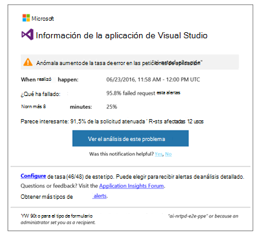
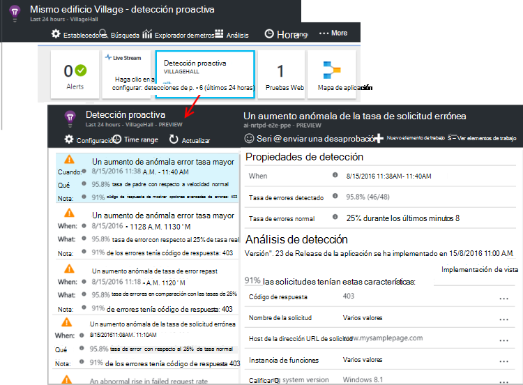

<properties 
    pageTitle="Diagnósticos proactivas en aplicación perspectivas | Microsoft Azure" 
    description="Perspectivas de aplicación realiza un análisis detallado automático de telemetría de la aplicación y le advierte de posibles problemas." 
    services="application-insights" 
    documentationCenter="windows"
    authors="rakefetj" 
    manager="douge"/>

<tags 
    ms.service="application-insights" 
    ms.workload="tbd" 
    ms.tgt_pltfrm="ibiza" 
    ms.devlang="na" 
    ms.topic="article" 
    ms.date="08/15/2016" 
    ms.author="awills"/>

#  Diagnósticos proactivas en perspectivas de aplicación

 Diagnósticos proactiva automáticamente le advierte de posibles problemas de rendimiento en la aplicación web. Realizar análisis inteligente de la telemetría que su aplicación envía a [Perspectivas de aplicación de Visual Studio](app-insights-overview.md). Si hay un aumento rápido en tasas de error o patrones anómalas en el rendimiento de cliente o servidor, recibirá una alerta. Esta característica no debe ninguna configuración. Funciona si la aplicación envía suficiente telemetría.

Puede obtener acceso a las alertas de detección proactiva de los mensajes que reciba y desde el módulo de detección proactiva.

## Revise las detecciones proactivas

Puede descubrir detecciones de dos maneras:

* **Recibe un correo electrónico** de perspectivas de aplicación. Este es un ejemplo típico:

    

    Haga clic en el botón grande para abrir más detalles en el portal.

* En el módulo de información general de la aplicación de **la detección proactiva de mosaico** muestra un recuento de avisos recientes. Haga clic en el icono para ver una lista de avisos recientes.

Seleccione una alerta para ver los detalles.

## ¿Qué problemas se detectan?

Existen tres tipos de detección:

* [Diagnósticos de la tasa de errores proactiva](app-insights-proactive-failure-diagnostics.md). Usamos correlación con carga y otros factores de aprendizaje establecer la frecuencia esperada de solicitudes de errores de la aplicación. Si la tasa de errores queda fuera del ámbito esperado, se envía una alerta.
* [Diagnóstico de rendimiento proactiva](app-insights-proactive-performance-diagnostics.md). Se buscar patrones irregulares en los tiempos de respuesta y tasas de error cada día. Nos relacionar estos problemas con las propiedades, como ubicación, explorador, sistema operativo cliente, la instancia del servidor y la hora del día.
* [Servicios de nube de azure](https://azure.microsoft.com/blog/proactive-notifications-on-cloud-service-issues-with-azure-diagnostics-and-application-insights/). Recibir alertas si la aplicación está alojada en servicios de nube de Azure y una instancia de rol tiene errores de inicio, reciclaje frecuente o se bloquea en tiempo de ejecución.

(Los vínculos de la Ayuda de cada notificación llevarán a los artículos pertinentes.)

## Pasos siguientes

Estas herramientas de diagnóstico ayuda inspeccionar la telemetría desde la aplicación:

* [Explorador de métrico](app-insights-metrics-explorer.md)
* [Búsqueda del explorador](app-insights-diagnostic-search.md)
* [Análisis - lenguaje de consulta eficaces](app-insights-analytics-tour.md)

Diagnósticos proactivas son completamente automáticos. ¿Pero es posible que le gustaría configurar algunas alertas más?

* [Configurar manualmente la métricas alertas](app-insights-alerts.md)
* [Pruebas de web de disponibilidad](app-insights-monitor-web-app-availability.md) 

