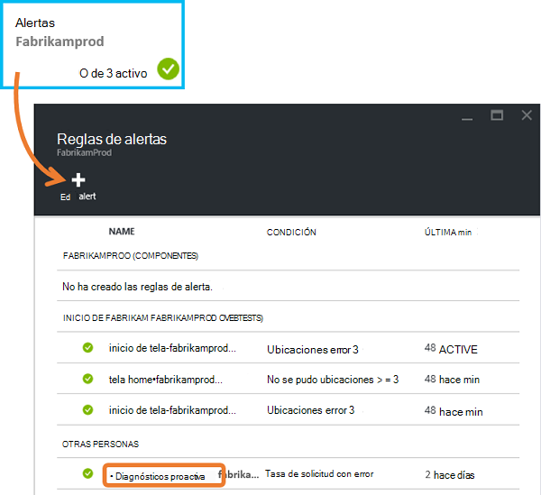
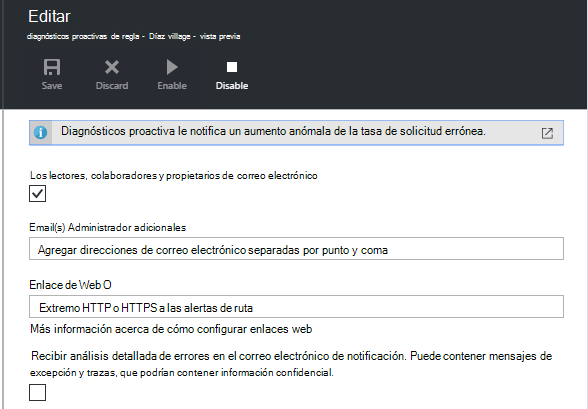
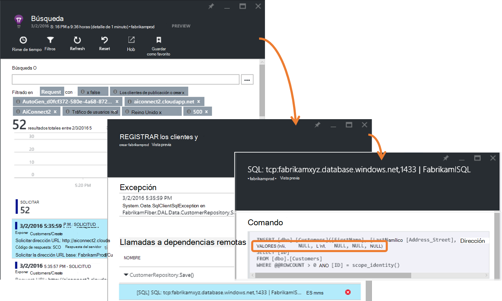
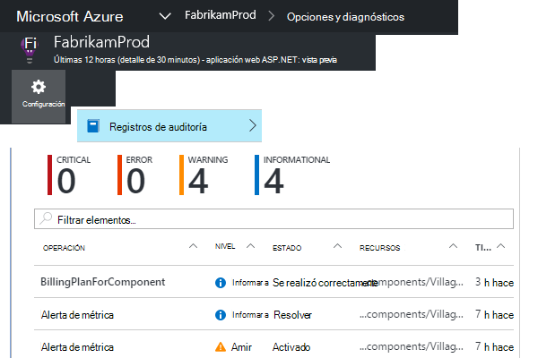
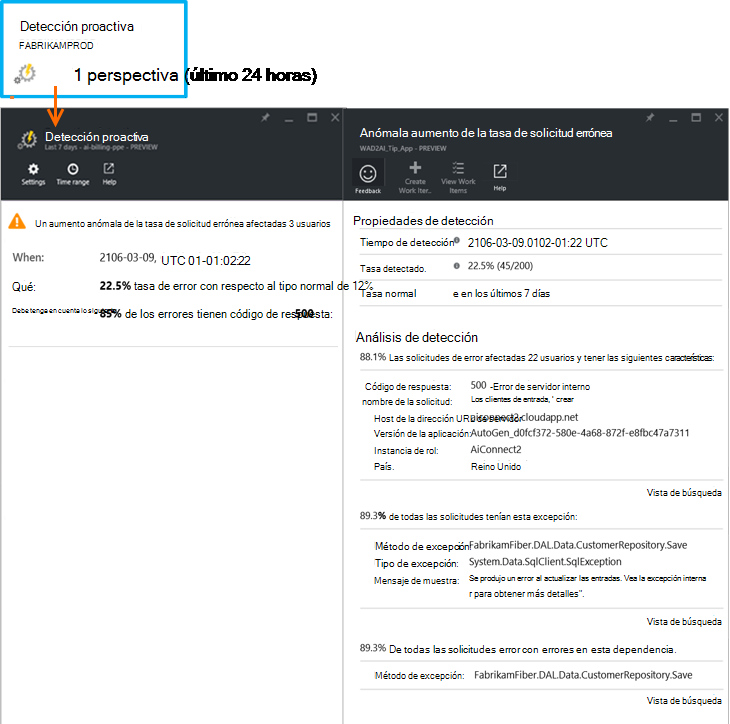

<properties 
    pageTitle="Diagnósticos de la tasa de errores proactiva en perspectivas de aplicación | Microsoft Azure" 
    description="Le advierte de inusuales cambios en la tasa de solicitudes de errores a su aplicación web y ofrece análisis de diagnóstico. Se requiere ninguna configuración." 
    services="application-insights" 
    documentationCenter=""
    authors="yorac" 
    manager="douge"/>

<tags 
    ms.service="application-insights" 
    ms.workload="tbd" 
    ms.tgt_pltfrm="ibiza" 
    ms.devlang="na" 
    ms.topic="article" 
    ms.date="10/12/2016" 
    ms.author="awills"/>
 
# Diagnósticos de la tasa de errores proactiva

[Perspectivas de aplicación de Visual Studio](app-insights-overview.md) automáticamente le notifica casi en tiempo real si la aplicación web experimenta un aumento anómala de la tasa de errores. Detecta un aumento inusual de la tasa de solicitudes HTTP informado que ha fallado. Normalmente, estas son aquellos con los códigos de respuesta en los rangos 400 y 500. Para ayudarle a evaluar y diagnosticar el problema, se proporciona un análisis de las características de telemetría relacionado y solicitudes de error en la notificación. También hay vínculos en el portal de información de la aplicación de otros diagnósticos. La característica no es necesario configurar o configuración, ya que usa algoritmos de aprendizaje de máquina predecir la tasa de errores normal.

Esta característica funciona de Java y ASP.NET web apps, alojados en la nube o en sus propios servidores. También funciona para cualquier aplicación que genera la solicitud telemetría: por ejemplo, si tiene una función de trabajador llama [TrackRequest()](app-insights-api-custom-events-metrics.md#track-request). 

Después de configurar [Perspectivas de aplicación para el proyecto](app-insights-overview.md)y proporciona la aplicación genera una determinada cantidad mínima de telemetría, toma de diagnósticos de error proactiva 24 horas para obtener información sobre el comportamiento normal de la aplicación antes de que está encendido y puede enviar alertas.

Aquí es un ejemplo de alerta. 

> [AZURE.NOTE] De forma predeterminada, recibe un mensaje de correo de formato es más corta que este ejemplo. Pero puede [cambiar a este formato detallado](#configure-alerts).

Observe que le indica que:

* Tasa de error con respecto al comportamiento de la aplicación normal.
* ¿Cuántos usuarios se ven afectados – para saber cuánto preocuparme.
* Un modelo de características asociado con los errores. En este ejemplo, hay un código de respuesta determinada, el nombre de la solicitud (operación) y la versión de aplicación. Inmediatamente indica dónde debe empezar a buscar en el código. Otras posibilidades podrían ser un sistema operativo de explorador o cliente específico.
* La excepción, seguimientos de registro y aparece un error de dependencias (bases de datos u otros componentes externos) que se encuentra asociado con el caracterizada solicitudes con error.
* Vínculos directamente a búsquedas relevantes en la telemetría en perspectivas de aplicación.

## Ventajas de alertas proactivas

Ordinarias [métricas alertas](app-insights-alerts.md) le podría haber un problema. Pero los diagnósticos de errores proactiva inicia el trabajo de diagnóstico para usted, realizar una gran cantidad del análisis en caso contrario, tendrá que hacer usted mismo. Obtener los resultados quedará bien empaquetados, lo que le permite acceder rápidamente a la raíz del problema.

## Cómo funciona

Cerca de tiempo Real proactiva diagnósticos monitores la telemetría ha recibido desde la aplicación y, en particular la tasa de solicitud errónea. Esta métrica cuenta el número de solicitudes para que la `Successful request` propiedad es false. De forma predeterminada, `Successful request== (resultCode < 400)` (a menos que ha escrito código personalizado [filtro](app-insights-api-filtering-sampling.md#filtering) o generar sus propia llamadas [TrackRequest](app-insights-api-custom-events-metrics.md#track-request) ). 

Rendimiento de la aplicación tiene un patrón típico de comportamiento. Algunas solicitudes será más susceptible a errores que otros; y la tasa de errores general puede ir hacia arriba como aumenta la carga. Diagnósticos de errores proactiva utiliza de aprendizaje buscar estas anomalías. 

Como telemetría entra en información de la aplicación desde la aplicación web, los diagnósticos de errores proactiva comparan el comportamiento actual con tramas vistas durante los últimos días. Si se observa un aumento de la tasa de error anómala comparación con rendimiento anterior, se activa un análisis.

Cuando se activa un análisis, el servicio realiza un análisis de clúster en la convocatoria de error para identificar un patrón de valores que caracterizan los errores. En el ejemplo anterior, el análisis ha descubierto que la mayoría de los errores es sobre un código de resultado específico, el nombre de solicitud, el host de la dirección URL del servidor y la instancia del rol de. Por el contrario, el análisis ha descubierto que la propiedad de sistema operativo de cliente se distribuye en varios valores, y por tanto no aparece.

Si su servicio cuenta con estos telemetría, el analizador busca una excepción y un error de dependencia que están asociadas a las solicitudes en el clúster que ha identificado, junto con un ejemplo de los registros de seguimiento asociados con las solicitudes.

El análisis resultante se envía a usted como alerta, a menos que haya configurado para.

Como las [alertas de que establecer manualmente](app-insights-alerts.md), puede comprobar el estado de la alerta y configurar en el módulo de alertas de los recursos de aplicación perspectivas. Pero a diferencia de otras alertas, no necesita configurar o configurar los diagnósticos de errores proactiva. Si lo desea, puede deshabilitar o cambiar sus direcciones de correo electrónico de destino.

## Configurar alertas 

Puede deshabilitar la característica de diagnósticos proactiva, cambiar a los destinatarios de correo electrónico, crear un webhook o participar en los mensajes de alerta más detallados.

Abra la página de alertas. Diagnósticos proactiva se incluye junto con todas las alertas que ha establecido manualmente y puede ver si está actualmente en el estado de la alerta.

Haga clic en la alerta para configurarlo.

Observe que puede deshabilitar diagnósticos proactiva, pero no puede eliminarlo (o crear otra).

#### Alertas detalladas

Si selecciona "Recibir un análisis detallado" el correo electrónico contendrá más información de diagnóstico. A veces podrá diagnosticar el problema solo de los datos en el correo electrónico. 

Hay un pequeño riesgo de que la alerta más detallada podría contener información confidencial, porque incluye excepción y seguimiento de mensajes. Sin embargo, esto sólo sucede si su código podría permitir la información confidencial en los mensajes. 

## Clasificación y diagnosticar una alerta

Una alerta indica que se ha detectado un aumento anómala de la tasa de solicitud errónea. Es probable que hay algún problema con la aplicación o su entorno.

Desde el porcentaje de solicitudes y número de usuarios afectados, puede decidir cómo urgentes el problema es. En el ejemplo anterior, la tasa de errores de % 22.5 se compara con un tipo normal de un 1%, indica que algo está ocurriendo. Por otro lado, sólo 11 usuarios afectados. Si se tratase de la aplicación, podrá evaluar cómo graves es.

En muchos casos, podrá diagnosticar el problema rápidamente del nombre de la solicitud, excepción, los datos de error y seguimiento de dependencia proporcionados. 

Hay algunas otras pistas. Por ejemplo, la tasa de errores de dependencia en este ejemplo es idéntica a la tasa de excepción (89.3%). Esto sugiere que la excepción surge directamente desde el error de dependencia - que le da una idea clara de dónde comenzar a pensar en el código.

Para investigar más, los vínculos de cada sección le llevará directamente a una [página de búsqueda](app-insights-diagnostic-search.md) filtrada las solicitudes relevantes, excepción, dependencia o trazas. O bien, puede abrir el [portal de Azure](https://portal.azure.com), navegar hasta el recurso de información de la aplicación de la aplicación y abra el módulo de errores.

En este ejemplo, haga clic en el vínculo 'Ver detalles de errores de dependencia' Abre el módulo de búsqueda de información de la aplicación en la instrucción SQL con la causa: valores nulos donde situados en los campos obligatorios y no ha superado la validación al guardar operación.

## Revisar los cambios recientes

Para revisar las alertas en el portal, abra la **configuración de registros de auditoría**.

Haga clic en cualquier alerta para ver sus detalles completos.

O bien, haga clic en **detección proactiva** ir directamente a la alerta más reciente:

## ¿Cuál es la diferencia...

Diagnósticos de la tasa de errores proactiva complementa otros similares pero distintas características de aplicación perspectivas. 

* [Métrica alertas](app-insights-alerts.md) están establecidos por el usuario y puede supervisar una amplia gama de métricas como CPU pertenencia, tasas de solicitud, tiempos de carga y así sucesivamente. Puede usarlos para advertir, por ejemplo, si necesita agregar más recursos. Por el contrario, los diagnósticos de errores proactiva cubren un pequeño intervalo de métricas críticas (actualmente solo solicitud errónea tasa), diseñado para notificar en cerca de la forma de tiempo real, una vez que la aplicación web no se pudo solicite tasa aumenta considerablemente en comparación con el comportamiento normal de la aplicación web.

    Diagnósticos de la tasa de errores proactiva ajusta automáticamente su umbral en respuesta a condiciones vigentes.

    Diagnósticos de la tasa de errores proactiva iniciar el trabajo de diagnóstico para usted. 
* [Diagnóstico de rendimiento proactiva](app-insights-proactive-performance-diagnostics.md) también usa inteligencia de equipo para detectar patrones poco habituales en las métricas y se requiere ninguna configuración por usted. Pero a diferencia de los diagnósticos de tasa de errores proactiva, de diagnósticos de rendimiento proactiva sirve para buscar segmentos de su colector de uso que puede representarse incorrectamente, por ejemplo, por páginas específicas en un tipo específico de explorador. El análisis se realiza diariamente, y si se encuentra cualquier resultado, es probable que sea mucho menos urgentes que una alerta. Por el contrario, el análisis de los diagnósticos de errores proactiva se realiza continuamente de telemetría entrante y se le notificará en cuestión de minutos si tasas de error de servidor están mayores de lo esperado.

## Si recibe una alerta de error proactiva tasa diagnósticos

*¿Por qué he recibido esta alerta?*

*   Se ha detectado un aumento anómala de la tasa de solicitudes de errores con respecto a la línea de base normal del período anterior. Después del análisis de los errores y telemetría asociado, creemos que hay un problema que debe considerar. 

*¿La notificación significa que definitivamente tengo un problema?*

*   Tratamos de alerta en interrupción de aplicación o degradación, aunque solo puede entender totalmente la semántica y el impacto en la aplicación o los usuarios.

*¿Por lo tanto, encarecidamente que revisen los datos?*

*   No. El servicio está totalmente automático. Solo recibe las notificaciones. Los datos están [privado](app-insights-data-retention-privacy.md).

*¿Tengo suscribirse a esta alerta?* 

*   No. Cada telemetría de solicitud de envío de aplicación tiene esta regla de alerta.

*¿Puedo cancelar la suscripción o recibe las notificaciones enviadas a Mis compañeros en su lugar?*

*   Sí, reglas de en la alerta, haga clic en regla de diagnósticos proactiva configurarlo. Puede deshabilitar la alerta o cambiar a los destinatarios de la alerta. 

*He perdido el correo electrónico. ¿Dónde se puede encontrar las notificaciones en el portal?*

*   En los registros de auditoría. Haga clic en configuración, registros de auditoría de una alerta para ver su aparición, pero con vista detallada limitada.

*Algunas de las alertas son de los problemas conocidos y no desea recibirlos.*

*   Tenemos supresión de alertas en pendientes.

## Pasos siguientes

Estas herramientas de diagnóstico ayuda inspeccionar la telemetría desde la aplicación:

* [Explorador de métrico](app-insights-metrics-explorer.md)
* [Búsqueda del explorador](app-insights-diagnostic-search.md)
* [Análisis - lenguaje de consulta eficaces](app-insights-analytics-tour.md)

Detecciones proactivas están completamente automáticas. ¿Pero es posible que le gustaría configurar algunas alertas más?

* [Configurar manualmente la métricas alertas](app-insights-alerts.md)
* [Pruebas de web de disponibilidad](app-insights-monitor-web-app-availability.md) 

