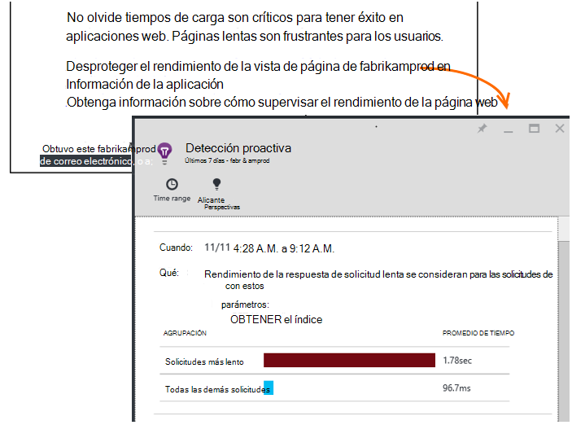

<properties 
    pageTitle="Perspectivas de aplicación: Diagnósticos de rendimiento proactiva | Microsoft Azure" 
    description="Perspectivas de aplicación lleva a cabo un análisis detallado de telemetría de la aplicación y le advierte de posibles problemas." 
    services="application-insights" 
    documentationCenter="windows"
    authors="antonfrMSFT" 
    manager="douge"/>

<tags 
    ms.service="application-insights" 
    ms.workload="tbd" 
    ms.tgt_pltfrm="ibiza" 
    ms.devlang="na" 
    ms.topic="article" 
    ms.date="08/31/2016" 
    ms.author="awills"/>

#  Diagnóstico de rendimiento proactiva

*Información de la aplicación está en vista previa.*

[Perspectivas de aplicación de Visual Studio](app-insights-overview.md) lleva a cabo un análisis detallado de telemetría de la aplicación y puede avisarle sobre posibles problemas de rendimiento. Probablemente está leyendo porque recibió uno de nuestras proactivas alertas por correo electrónico. 

Esta característica no requiere una instalación y está activa automáticamente cuando la aplicación genera suficiente telemetría.

## ¿Qué son los diagnósticos de rendimiento proactiva?

Diagnóstico de rendimiento proactiva descubre inusuales tramas de rendimiento en la aplicación, analizando la telemetría que la aplicación se envía a la información de la aplicación. 

En particular, encuentra problemas de rendimiento que afectan solo algunos de los usuarios o sólo afectan a los usuarios en algunos casos.

Por ejemplo, puede notificar si las páginas de aplicación mucho más despacio cargan en un tipo de explorador que otras, o si las solicitudes atendidas más despacio desde un servidor determinado. También pueden detectar problemas asociados con combinaciones de propiedades, como lenta se cargue la página en un área geográfico en particulares horas del día.

Anomalías como los siguientes son muy difíciles de detectar solo mediante la inspección de los datos, pero son más comunes que se imagina. A menudo solo superficie cuando quejan de sus clientes. En ese momento, es demasiado tarde: los usuarios afectados ya están cambiando a los competidores!

Actualmente, nuestros algoritmos mire tiempos de carga, los tiempos de respuesta de solicitud en el servidor y tiempos de respuesta de dependencia.  

No tienes que establecer los umbrales o configurar reglas. Aprendizaje de equipo y algoritmos de minería de datos se usan para detectar patrones anómalas. 

Estamos muy ¿está deseando tiene sus comentarios. Háganoslo saber cómo le ayuda, cómo podemos mejorar detección proactiva y ¿qué capacidades adicionales desea agregar. Puede proporcionar comentarios a través de enviar una sonrisa/desaprobación en el portal de o un correo electrónico a AppInsightsML@microsoft.com. 

## Acerca de la alerta proactiva

* *¿Por qué he recibido este mensaje?*
 * Detección proactiva analiza la telemetría la aplicación envía a la aplicación perspectivas y detectó un problema de rendimiento en la aplicación. 
* *¿La notificación significa que definitivamente tengo un problema?*
 * No. Es simplemente una sugerencia sobre algo es posible que desee analizar más detenidamente. 
* *¿Qué debo hacer?*
 * [Ver los datos que se presentan](#responding-to-an-alert). Use el Explorador de métricas para revisar el rendimiento a lo largo del tiempo y profundizar para métricas adicionales. Usar búsqueda para filtrar los eventos específicos que le ayudarán a identificar la causa. 
* *¿Por lo tanto, encarecidamente que revisen los datos?*
 * No. El servicio está totalmente automático. Solo recibe las notificaciones. Los datos están [privado](app-insights-data-retention-privacy.md).

## El proceso de detección

* *¿Qué tipo de anomalías de rendimiento se encuentran?*
 * Patrones que se encuentran lo que lleva mucho tiempo comprobar por sí mismo. Por ejemplo, bajo rendimiento en una combinación específica de ubicación, la hora del día y plataforma.
* *¿Analizar todos los datos recopilados por información de la aplicación?*
 * No en este momento. Actualmente, nos analizar solicitud de tiempo de carga de página, tiempo de respuesta de dependencia y tiempo de respuesta. Análisis de medidas adicionales estará disponible próximamente. 
* *¿Puedo crear mis propios anomalías reglas de detección?*
 * Todavía no. Pero puede:
 * [Configure alertas](app-insights-alerts.md) que le indica a cuando una métrica cruza un umbral).
 * [Exportar telemetría](app-insights-export-telemetry.md) a herramientas de [base de datos](app-insights-code-sample-export-sql-stream-analytics.md) [a PowerBI](app-insights-export-power-bi.md) u [otros](app-insights-code-sample-export-telemetry-sql-database.md) , donde podrá analizarlos usted mismo.
* *¿Con qué frecuencia se realiza el análisis?*
 * Iniciar el análisis diariamente en la telemetría del día anterior.
* *, Así que ¿esto reemplaza [alertas métricas](app-insights-alerts.md)?
 * No.  Nos no confirmar para detectar cada comportamiento que considere anómala.

## Cómo investigar los problemas generados

Abra el informe de diagnóstico desde el correo electrónico o desde la lista de anomalías.

* **Cuando se** muestra el tiempo que se ha detectado el problema.
* **¿Qué** describe
 * El problema que se ha detectado;
 * Las características del conjunto de eventos que hemos encontrado muestran el comportamiento de problema.
* La tabla compara el conjunto bajo rendimiento con el comportamiento promedio de todos los otros eventos.

Haga clic en los vínculos para abrir el explorador métrica y buscar en informes relevantes, filtrados en el tiempo y las propiedades del conjunto de rendimiento lento.

Modificar el intervalo de tiempo y filtros para explorar la telemetría.

## ¿Cómo puedo mejorar el rendimiento?

Respuestas lentas y son una de las frustraciones más grandes para los usuarios del sitio web, como sabe de su propia experiencia. Así es importante tratar los problemas.

### Evaluación de errores

¿En primer lugar, es importante? Si una página siempre es tarda en cargarse, pero solo un 1% de los usuarios del sitio deben verlo, quizás tiene cosas más importantes que se deben tener. Por otro lado, si solo 1% de los usuarios para abrirlo, pero se produce excepciones cada vez, que podría ser la pena investigar.

Utilice la instrucción de impacto en el correo electrónico como guía general, pero tenga en cuenta que no es todo. Recopilar otras pruebas para confirmar.

Tenga en cuenta los parámetros del problema. Si es dependiente geografía, configurar [pruebas de disponibilidad](app-insights-monitor-web-app-availability.md) , incluyendo esa región: simplemente puede haber problemas de red en dicha área. 

### Diagnóstico de carga de páginas lentas 

¿Dónde está el problema? ¿Es el servidor tarda en responder, es muy largo la página o el explorador, tiene que realizar una gran cantidad de trabajo para que se muestre?

Abra el módulo de métrica de los exploradores. Muestra de [pantalla segmentado de tiempo de carga de página de explorador](app-insights-javascript.md#explore-your-data) donde se va la hora. 

* Si **Enviar solicitud de tiempo** es alto, el servidor responde lentamente o la solicitud es una publicación con una gran cantidad de datos. Observe las [medidas de rendimiento](app-insights-web-monitor-performance.md#metrics) para investigar tiempos de respuesta. 
* Configurar el [seguimiento de dependencia](app-insights-dependencies.md) para ver si la lentitud debido a la base de datos o servicios externos.
* Si **Recibe respuesta** es principal, la página y sus elementos dependientes - JavaScript, CSS, imágenes y así sucesivamente (pero no cargado de forma asincrónica datos) son largas. Configurar una [prueba de disponibilidad](app-insights-monitor-web-app-availability.md)y asegúrese de configurar la opción Cargar elementos dependientes. Cuando reciba algunos resultados, abra los detalles de un resultado y expandirlo para ver los tiempos de carga de archivos diferentes.
* **Hora de procesamiento de cliente** de alta sugiere secuencias de comandos están ejecutando lentamente. Si el motivo no es obvio, considere la posibilidad de agregar código de intervalos y enviar las horas en las llamadas de trackMetric.

### Mejorar páginas lentas

Hay un sitio web completo de consejos sobre cómo mejorar sus respuestas del servidor y tiempos de carga, por lo que no intentamos repetirla todo en este artículo. Estas son algunas sugerencias que probablemente ya conoce, simplemente para obtener está pensando en:

* Lenta cargar debido a archivos de gran tamaño: cargar las secuencias de comandos y otros elementos de forma asincrónica. Usa la agrupación de secuencia de comandos. Dividir la página principal en widgets que cargar los datos por separado. No enviar sin formato HTML antiguo para tablas de gran tamaño: usar una secuencia de comandos para solicitar los datos como JSON u otro formato compacto, a continuación, en la tabla en lugar de relleno. Hay marcos excelentes para ayudarle con todo esto. (Que también implican scripts grandes, por supuesto.)
* Reducir las dependencias del servidor: tenga en cuenta las ubicaciones geográficas de los componentes. Por ejemplo, si usa Azure, asegúrese de que el servidor web y la base de datos están en la misma región. ¿Consultas recuperar más información que necesitan? ¿Debería caché o por lotes ayuda?
* Problemas de capacidad: mirar las mediciones de servidor de tiempos de respuesta y solicitud de cuenta. Si los tiempos de respuesta pico desproporcionada con picos en recuentos de solicitud, es probable que se estiran los servidores. 

## Correos electrónicos de notificación

* *¿Tengo suscribirse a este servicio para recibir notificaciones?*
 * No. Nuestros robots periódicamente encuestas los datos de todos los usuarios de la información de la aplicación y envía notificaciones si detecta problemas.
* *¿Puedo cancelar la suscripción o recibe las notificaciones enviadas a Mis compañeros en su lugar?*
 * Haga clic en el vínculo Cancelar suscripción en la alerta o correo electrónico. 
 
    Actualmente se envían a los usuarios que tienen [acceso de escritura en el recurso de información de la aplicación](app-insights-resources-roles-access-control.md).

    También puede editar la configuración de lista de destinatarios en el módulo de detección proactiva.
* *No quiero que se fluyen con estos mensajes.*
 * Están limitados a uno por día con el problema más importante que se aún no hemos informado acerca de. No recibe repeticiones de cualquier mensaje.
* *¿Si no hacer nada, se proporciona un aviso?*
 * No, recibe un mensaje sobre cada problema solo una vez. 
* *He perdido el correo electrónico. ¿Dónde se puede encontrar las notificaciones en el portal?*
 * En la introducción de la información de la aplicación de la aplicación, haga clic en el mosaico de **Detección proactiva** . Allí podrá encontrar todas las notificaciones hacia arriba al fondo de 7 días.

## Pasos siguientes

Estas herramientas de diagnóstico ayuda inspeccionar la telemetría desde la aplicación:

* [Explorador de métrico](app-insights-metrics-explorer.md)
* [Búsqueda del explorador](app-insights-diagnostic-search.md)
* [Análisis - lenguaje de consulta eficaces](app-insights-analytics-tour.md)

Detecciones proactivas están completamente automáticas. ¿Pero es posible que le gustaría configurar algunas alertas más?

* [Configurar manualmente la métricas alertas](app-insights-alerts.md)
* [Pruebas de web de disponibilidad](app-insights-monitor-web-app-availability.md) 

