<properties
    pageTitle="Notas de la versión de extensión de Visual Studio para análisis de desarrollador"
    description="Las actualizaciones más recientes para Visual Studio tools para el análisis de desarrollador."
    services="application-insights"
    documentationCenter=""
    authors="acearun"
    manager="douge"/>
<tags
    ms.service="application-insights"
    ms.workload="tbd"
    ms.tgt_pltfrm="ibiza"
    ms.devlang="na"
    ms.topic="article"
    ms.date="06/09/2016"
    ms.author="acearun"/>

# Notas de la versión de herramientas de análisis de desarrollador
¿Qué novedades: aplicación perspectivas y HockeyApp análisis en Visual Studio.
## Versión 7.0
### Tendencias de perspectivas de aplicación de Visual Studio
Perspectivas de aplicación de Visual Studio es una nueva herramienta de Visual Studio que puede utilizar para ayudarle a analizar cómo funciona la aplicación en el tiempo. Para empezar, en el botón de la barra de herramientas de **Perspectivas de aplicación** o en la ventana de búsqueda de información de aplicaciones, elija **Explorar tendencias de telemetría**. O, en el menú **Ver** , haga clic en **Otras ventanas**y, a continuación, haga clic en **Tendencias de perspectivas de aplicación**. Elija una de las cinco consultas comunes para empezar. Puede analizar diferentes conjuntos de datos basados en los tipos de telemetría, los intervalos de tiempo y otras propiedades. Para buscar anomalías en los datos, elija una de las opciones de anomalías en la lista desplegable **Tipo de vista** . Las opciones de filtrado en la parte inferior de la ventana facilitan la pulir subconjuntos específicos de la telemetría.

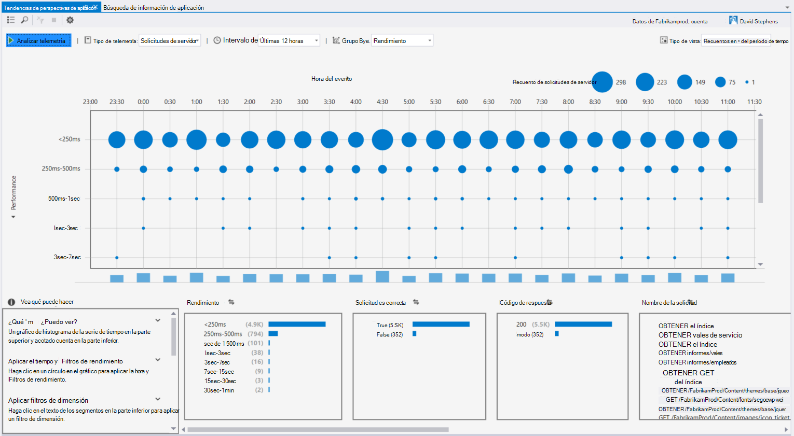

### Excepciones en CodeLens
Telemetría excepción aparece ahora en CodeLens. Si el proyecto se ha conectado al servicio de información de la aplicación, verá el número de excepciones que se han producido en cada método de producción, en las últimas 24 horas. Desde CodeLens, puede saltar a búsqueda o tendencias a investigar las excepciones con más detalle.

### Asistencia básica de ASP.NET
Aplicación perspectivas admite ahora ASP.NET Core RC2 proyectos en Visual Studio. Puede agregar información de la aplicación a los nuevos proyectos de ASP.NET Core RC2 desde el cuadro de diálogo **Nuevo proyecto** , como se muestra en la siguiente captura de pantalla. O bien, puede agregar a un proyecto existente, haga clic en el proyecto en el Explorador de soluciones y, a continuación, haga clic en **Agregar aplicación perspectivas telemetría**.

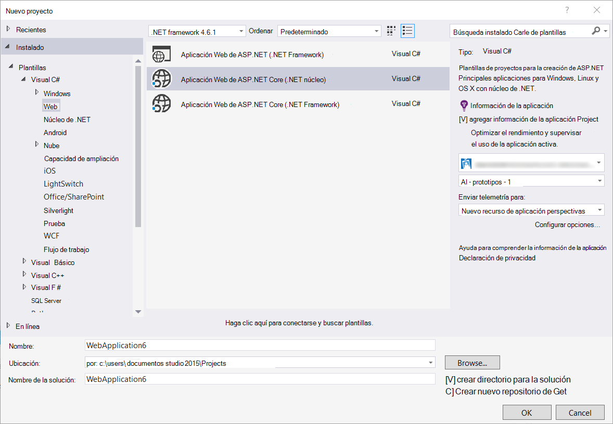

ASP.NET 5 RC1 y proyectos ASP.NET Core RC2 también tienen soporte nuevo en la ventana de herramientas de diagnóstico. Verá eventos perspectivas de aplicación como las convocatorias y las excepciones de la aplicación de ASP.NET al depurar localmente en su equipo. Cada evento, haga clic en **Buscar** para ver detalles para obtener más información.

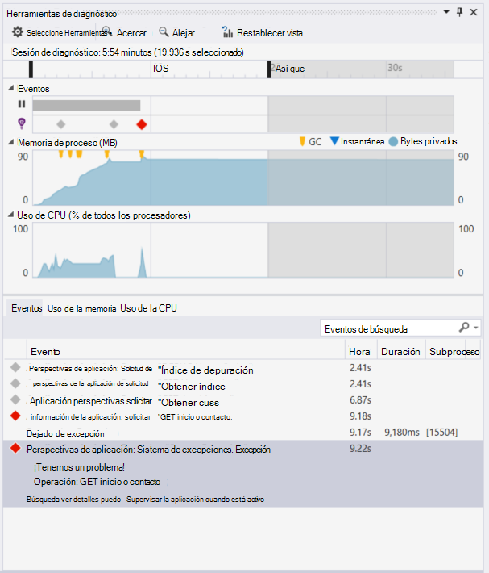

### HockeyApp para las aplicaciones de Windows Universal
Además de los comentarios de usuario y la distribución beta, HockeyApp proporciona información para las aplicaciones de Windows Universal symbolicated de errores. Lo hemos hecho aún más fáciles de agregar el SDK HockeyApp: haga clic en el proyecto de Windows Universal y haga clic **Hockey aplicación: Habilitar análisis bloquearse**. Instala el SDK, Establece la recopilación de bloqueo y aprovisiona un recurso HockeyApp en la nube, todo sin cargar la aplicación del servicio de HockeyApp.

Otras características nuevas:

* Hemos realizado la experiencia de búsqueda de información de aplicación más rápida y más intuitiva. Ahora, los intervalos de tiempo y filtros de detalle se aplican automáticamente al seleccionarlos.
* También en búsqueda de información de aplicación, ahora hay una opción para saltar al código directamente desde la telemetría solicitud.
* Hemos realizado mejoras en la experiencia de inicio de sesión de HockeyApp.
* En herramientas de diagnóstico, se muestra información de telemetría de producción de excepciones.

## Versión 5.2
Estamos contentos anunciar la introducción de escenarios HockeyApp en Visual Studio. La primera integración está en la distribución de aplicaciones de Windows Universal y aplicaciones de formularios de Windows desde dentro de Visual Studio.

Con la distribución beta, cargue las versiones anteriores de las aplicaciones a HockeyApp para la distribución a un subconjunto seleccionado de clientes o comprobadores. Distribución beta, junto con HockeyApp bloqueo colección de características y usuario comentarios, puede proporcionarle información valiosa acerca de la aplicación antes de realizar una publicación masiva. Puede usar esta información para solucionar problemas con la aplicación para que pueda evitar o minimizar problemas en el futuro, como clasificaciones de aplicación baja, votos negativos y así sucesivamente.

Desprotección lo sencillo que es cargar crea para la distribución beta desde dentro de Visual Studio.
### Aplicaciones de Windows universal
El menú contextual de un nodo de proyecto de aplicación de Windows Universal ahora incluye una opción para cargar la compilación en HockeyApp.

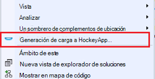

Elija el elemento y la HockeyApp abre el cuadro de diálogo de carga. Se necesita una cuenta de HockeyApp cargar la compilación. Si es un usuario nuevo, no se preocupe. Creación de una cuenta es un proceso sencillo.

Cuando está conectado, verá el formulario de carga en el cuadro de diálogo.

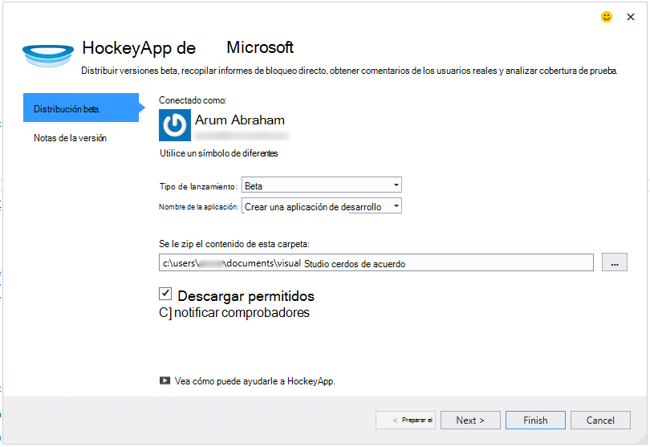

Seleccione el contenido al cargar (un archivo .appxbundle o .appx) y, a continuación, elija opciones en el asistente. Si lo desea, puede agregar notas en la página siguiente. Elija **Finalizar** para comenzar la carga.

Una vez completada la carga, aparece una notificación de HockeyApp con un vínculo a la aplicación en el portal de HockeyApp y de confirmación.

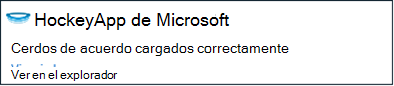

¡Eso es todo! Acabo de cargar una compilación de distribución beta con unos pocos clics.

Puede administrar la aplicación de muchas formas en el portal de HockeyApp. Esto incluye invitando a usuarios, visualización de informes de bloqueo y comentarios, cambiar detallan y así sucesivamente.

Consulte [HockeyApp Knowledge Base](http://support.hockeyapp.net/kb/app-management-2) para obtener más detalles sobre la administración de la aplicación.

### Aplicaciones de formularios de Windows
El menú contextual de un nodo de proyecto de formulario de Windows incluye una opción para cargar la compilación en HockeyApp.

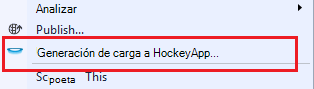

Se abrirá el cuadro de diálogo de carga de HockeyApp, que es similar a una aplicación de Windows Universal.

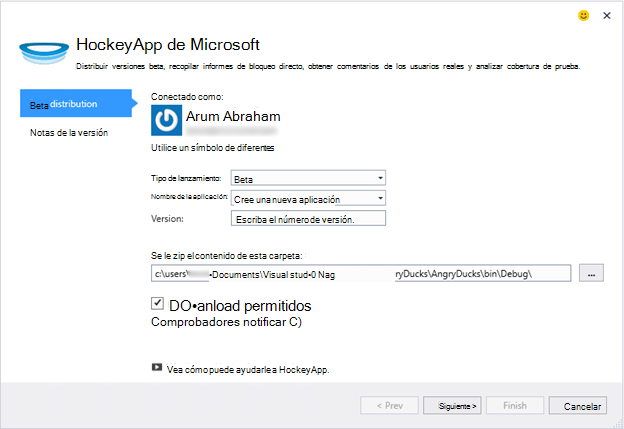

Tenga en cuenta un nuevo campo en este asistente para especificar la versión de la aplicación. Para las aplicaciones de Windows Universal, se rellena la información del manifiesto. Aplicaciones de formularios de Windows, Desgraciadamente, no tienen un equivalente a esta característica. Debe especificarlas manualmente.

El resto del flujo es similar a las aplicaciones de Windows Universal: elija Generar y opciones, agregue versión notas, cargar y administrar en el portal de HockeyApp.

Es tan sencillo como. Pruébelo y díganos qué opina.
## Versión 4.3
### Búsqueda de telemetría de sesiones de depuración local
Con esta versión, puede buscar de telemetría de aplicación perspectivas generado en la sesión de depuración de Visual Studio. Antes, podría usar búsqueda solo si se registra la aplicación con información de la aplicación. Ahora, la aplicación sólo necesita tener instalado para buscar telemetría local el SDK de perspectivas de aplicación.

Si tiene una aplicación ASP.NET con el SDK de perspectivas de aplicación, realice los pasos siguientes para utilizar la búsqueda.

1. Depurar la aplicación.
2. Abrir búsqueda de perspectivas de aplicación mediante uno de estos procedimientos:
    - En el menú **Ver** , haga clic en **Otras ventanas**y, a continuación, haga clic en **Búsqueda de información de aplicación**.
    - Haga clic en el botón de la barra de **Información de la aplicación** .
    - En el Explorador de soluciones, expanda **ApplicationInsights.config**y, a continuación, haga clic en **telemetría de sesión de depuración de búsqueda**.
3. Si aún no ha iniciado con recomendaciones de aplicación, se abrirá la ventana de búsqueda en modo de telemetría de sesión de depuración.
4. Haga clic en el icono de **búsqueda** para ver su telemetría local.

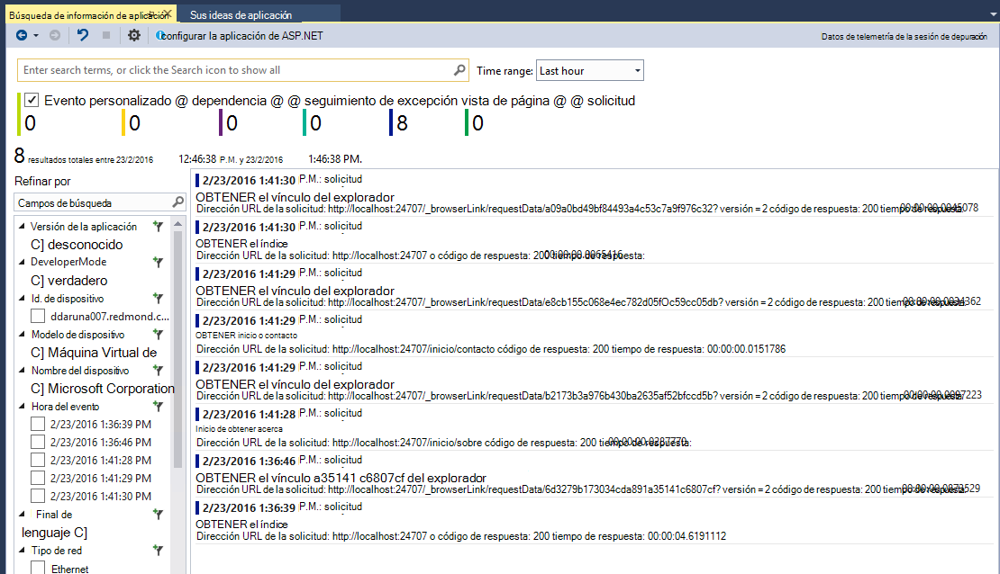

## Versión 4.2
En esta versión, hemos agregado características para facilitar la búsqueda de datos sea más fácil en el contexto de eventos, con la capacidad para saltar al código de más eventos de datos y una experiencia sin esfuerzo para enviar los datos del registro de aplicación impresiones. Esta extensión se actualiza mensualmente. Si tiene comentarios o característica solicitudes, envíelo a aidevtools@microsoft.com.
### Experiencia de no y haga clic en el registro
Si ya está usando NLog, log4net o System.Diagnostics.Tracing, no tiene que preocuparse de mover todos los seguimientos de impresiones de aplicación. En esta versión, hemos integrado adaptadores de registro de información de la aplicación con la experiencia de la configuración normal.
Si ya tiene uno de estos marcos de registro configurados, en la sección siguiente describe cómo obtenerlo.
**Si ya ha agregado perspectivas de aplicación:**
1. Haga clic en el nodo de proyecto y, a continuación, haga clic en **Información de la aplicación**y, a continuación, haga clic en **Configurar perspectivas de aplicación**. Asegúrese de que ve la opción de agregar el adaptador correcto en la ventana de configuración.
2. Como alternativa, si genera la solución, tenga en cuenta a la ventana emergente que aparece en la parte superior derecha de la pantalla y haga clic en **Configurar**.

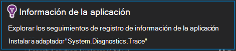

Cuando tenga instalado el adaptador de registro, ejecute la aplicación y asegúrese de que ve los datos en la pestaña herramientas de diagnóstico, similar a esta:

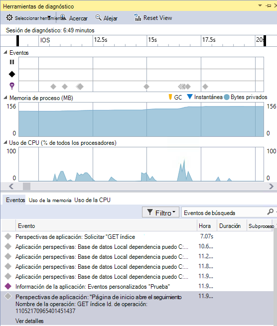

### Saltar a o buscar el código donde se emite la propiedad de evento de telemetría
Con la nueva versión de usuario puede hacer clic en cualquier valor en el evento detalle y realiza una búsqueda en una cadena coincidente en la solución abierta actual. En Visual Studio se muestran resultados "Resultados de la búsqueda" lista tal como se muestra a continuación:

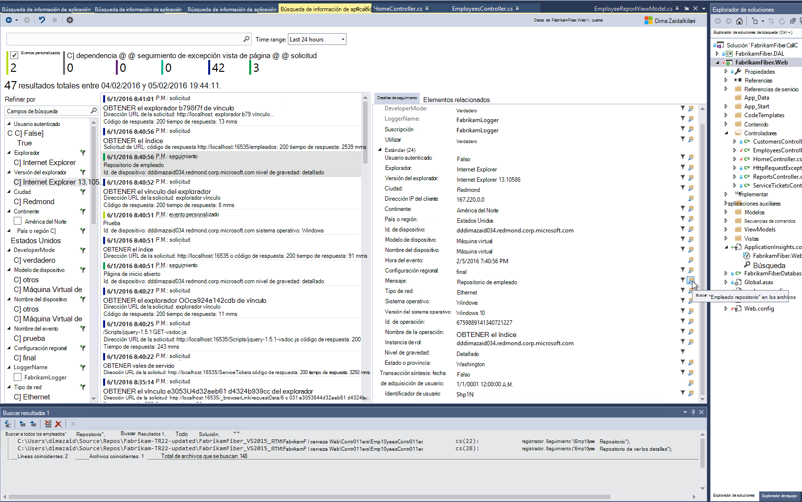

### Nueva ventana de búsqueda para cuando no se ha iniciado sesión
Hemos mejorado la apariencia de la ventana de aplicación perspectivas búsqueda para ayudarle a buscar los datos mientras la aplicación está en producción.

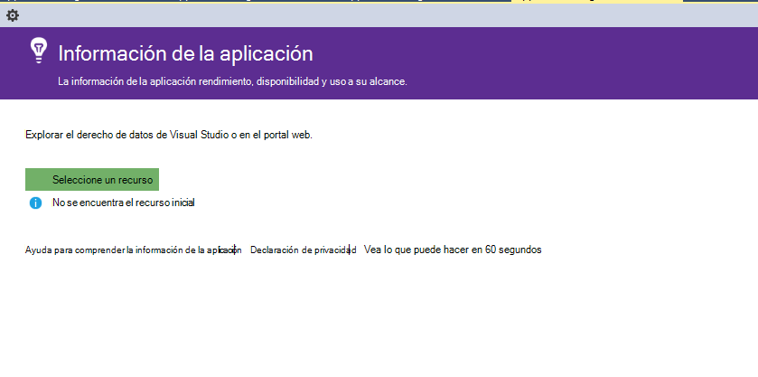

### Ver todos los eventos de telemetría asociados con el evento
Hemos agregado una nueva pestaña, con consultas predefinidas para todos los datos relacionados con el evento de telemetría que el usuario está viendo, junto a la pestaña de detalles del evento. Por ejemplo, una solicitud tiene un campo denominado **Id. de operación**. Todos los eventos asociados a esta solicitud tienen el mismo valor de **Id. de operación**. Si se produce una excepción mientras la operación procesa la solicitud, la excepción se expresa el mismo ID de operación que la solicitud para facilitar la búsqueda. Si está viendo una solicitud, haga clic en **todos los telemetría para realizar esta operación** para abrir una nueva ficha que muestra los resultados de búsqueda de nuevo.

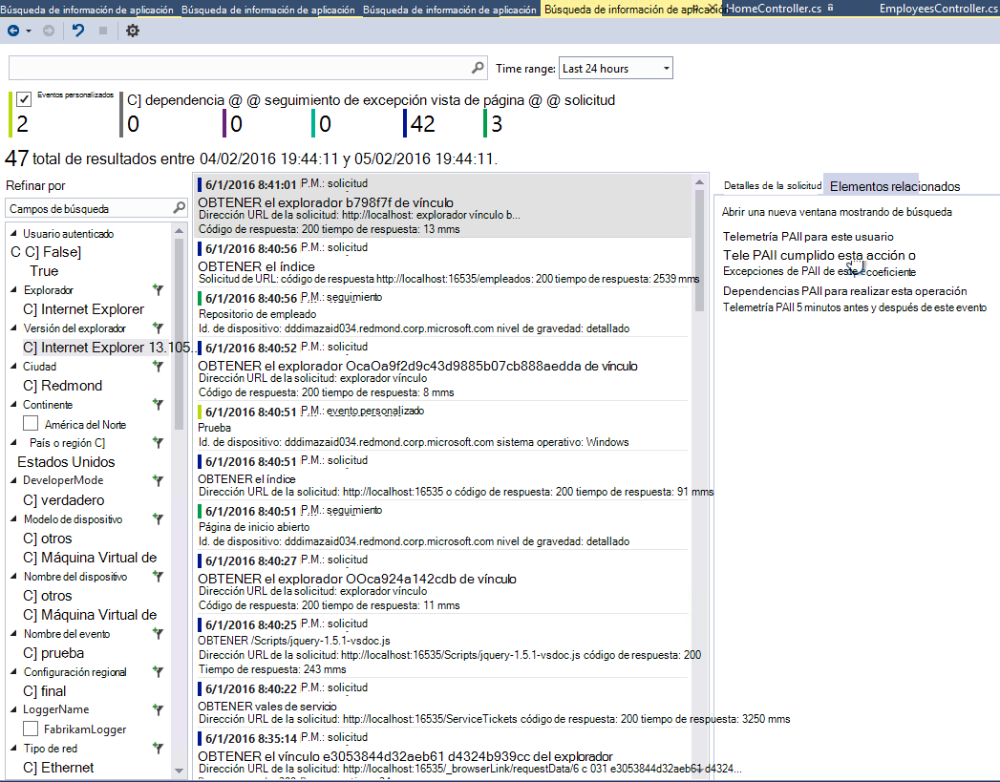

### Reenviar e historial en Buscar hacia atrás
Ahora puede ir hacia adelante y hacia atrás entre los resultados de búsqueda.

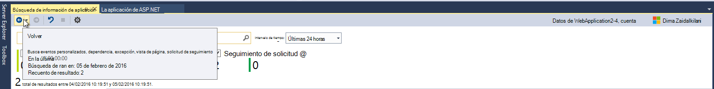

## Versión 4.1
Esta versión incluye un número de características nuevas y actualizaciones. Debe tener 1 de actualización para instalar esta versión.

### Pasar de una excepción a método en código fuente
Ahora, si se ve excepciones de la aplicación de producción en la ventana de búsqueda de información de aplicación, puede saltar al método en el código donde se produce la excepción. Solo debe tener el proyecto correcto cargado y perspectivas de la aplicación se encarga del resto! (Para obtener más información acerca de la ventana de búsqueda de información de aplicación, consulte las notas de la versión 4.0 en las secciones siguientes).

¿Cómo funciona? Puede usar la búsqueda de información de aplicaciones incluso cuando no está abierta una solución. El área de seguimiento de pila muestra un mensaje de información y muchos de los elementos de la pila no están disponibles.

Si la información del archivo está disponible, algunos elementos pueden ser vínculos, pero el elemento de la información de solución seguirán siendo visible.

Si hace clic en el hipervínculo, deberá ir a la ubicación de la forma seleccionada en el código. Puede haber una diferencia en el número de versión, pero la característica para ir a la versión correcta del código, se pondrá en versiones posteriores.

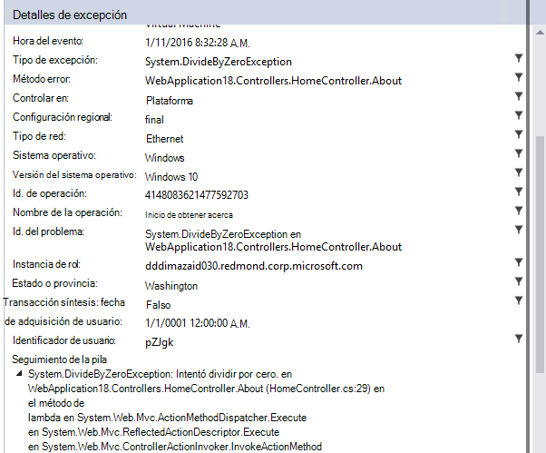

### Experiencia de nuevos puntos de entrada de la búsqueda en el Explorador de soluciones
Ahora puede acceder a búsqueda mediante el Explorador de soluciones.

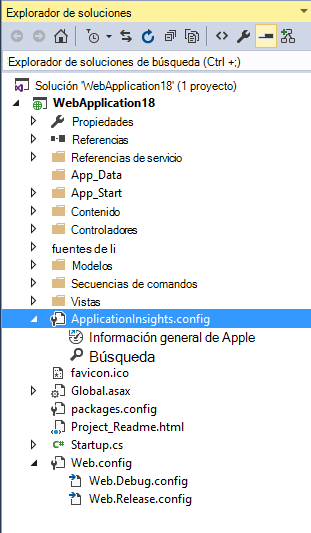

### Muestra una notificación cuando publica completada
Un cuadro de diálogo aparece cuando se publique el proyecto en línea, para que pueda ver los datos de aplicación perspectivas en producción.

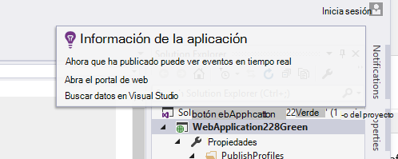

## Versión 4.0

### Buscar datos de aplicación perspectivas desde dentro de Visual Studio
Como la función de búsqueda en el portal de información de la aplicación, ahora en Visual Studio puede filtrar y buscar en tipos de eventos, los valores de propiedad y texto y, a continuación, inspeccionar eventos individuales.

### Ver los datos procedentes de su equipo local, en herramientas de diagnóstico

Puede ver su telemetría, además de otros datos de depuración, en la página de herramientas de diagnóstico de Visual Studio. Sólo ASP.NET 4.5 es compatible.

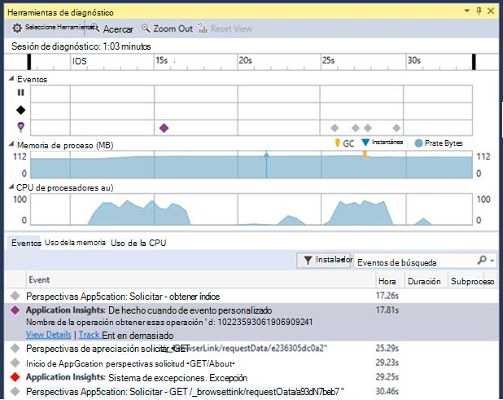

### Agregar el SDK al proyecto sin iniciar sesión en Azure

Ya no tendrá que iniciar sesión en Azure para agregar paquetes de perspectivas de aplicación a su proyecto, mediante el cuadro de diálogo **Nuevo proyecto** o desde el menú contextual del proyecto. Si iniciar sesión, el SDK se instalado y configurado para enviar telemetría el portal como antes. Si no iniciar sesión, el SDK se agregará a su proyecto y generará telemetría para el hub de diagnóstico. Puede configurar más tarde si lo desea.

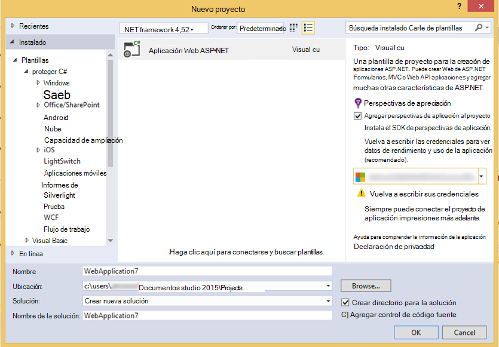

### Compatibilidad con dispositivos

En *Connect();* 2015, se [anuncia](https://azure.microsoft.com/blog/deep-diagnostics-for-web-apps-with-application-insights/) que nuestra experiencia de desarrollo móvil para dispositivos es HockeyApp. HockeyApp le ayuda a distribuir versiones beta a su personal de pruebas, recopilar y analizar todos los bloqueos de la aplicación y recopilar comentarios directamente desde sus clientes.
HockeyApp es compatible con la aplicación en cualquier plataforma que decida generar, ya sea iOS, Android, o Windows o en varias plataformas como Xamarin, Cordova o unidad.

En futuras versiones de la extensión de aplicación perspectivas, deberá introducir una experiencia más integrada entre HockeyApp y Visual Studio. Por ahora, puede empezar con HockeyApp simplemente agregando la referencia NuGet. Consulte la [documentación](http://support.hockeyapp.net/kb/client-integration-windows-and-windows-phone) para obtener más información.
