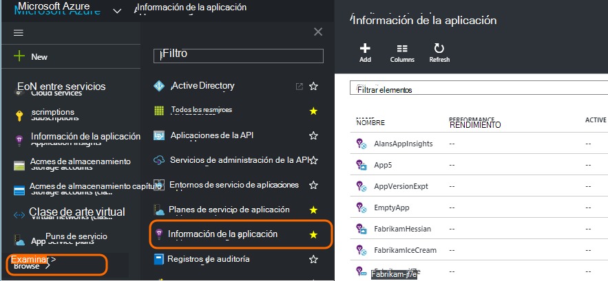
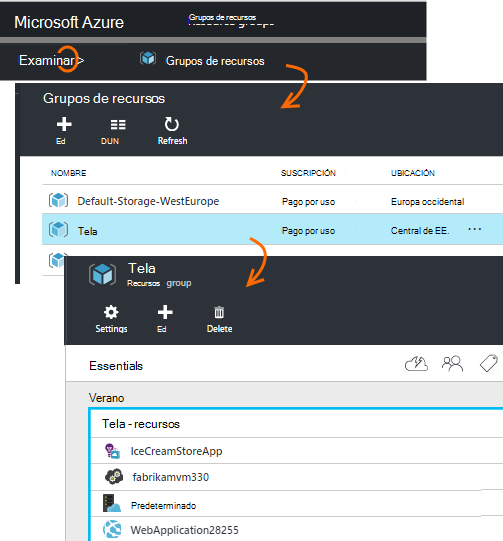
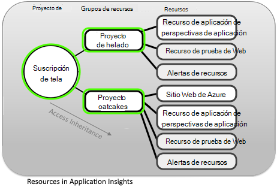
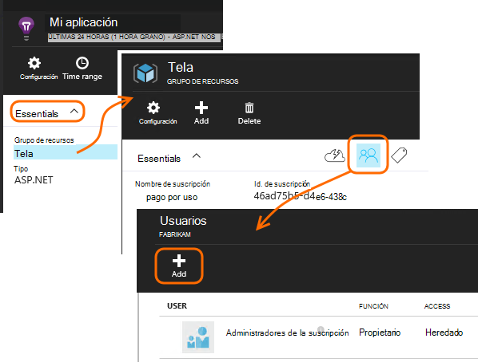
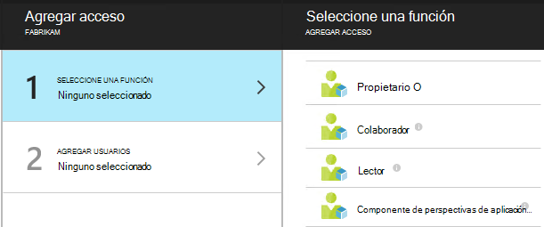
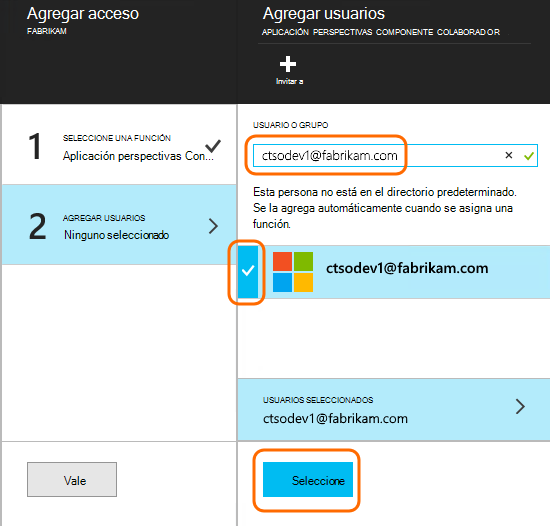

<properties
    pageTitle="Recursos, funciones y control de acceso en perspectivas de aplicación"
    description="Propietarios, colaboradores y los lectores de perspectivas de su organización."
    services="application-insights"
    documentationCenter=""
    authors="alancameronwills"
    manager="douge"/>

<tags
    ms.service="application-insights"
    ms.workload="tbd"
    ms.tgt_pltfrm="ibiza"
    ms.devlang="na"
    ms.topic="article"
    ms.date="05/07/2016"
    ms.author="awills"/>

# Recursos, funciones y control de acceso en perspectivas de aplicación

Puede controlar quién ha leído y actualizar el acceso a los datos en Visual Studio [Aplicación perspectivas][start], utilizando el [control de acceso basado en roles en Microsoft Azure](../active-directory/role-based-access-control-configure.md).

> [AZURE.IMPORTANT] Asignar acceso a los usuarios en el **grupo de recursos o de suscripción** al que pertenece el recurso de aplicación, no en el propio recurso. Asignar el rol de **Colaborador de componente de aplicación perspectivas** . Así se garantiza que uniforme control de acceso a las pruebas web y alertas junto con los recursos de la aplicación. [Más información](#access).

## Suscripciones, grupos y recursos

En primer lugar, algunas definiciones:

* **Recursos** - una instancia de un servicio de Microsoft Azure. El recurso de aplicación perspectivas recopila, analiza y muestra los datos de telemetría enviados desde la aplicación.  Otros tipos de recursos de Azure incluyen aplicaciones web, bases de datos y máquinas virtuales.

    Para ver todos los recursos, vaya al [Portal de Azure][portal], inicio de sesión y haga clic en Examinar.

    

* [**Grupo de recursos** ] [ group] -cada recurso pertenece a un grupo. Un grupo es una forma cómoda de administrar recursos relacionados, especialmente para controlar el acceso. Por ejemplo, en un grupo de recursos que podría colocar una aplicación Web, un recurso de aplicación perspectivas para supervisar la aplicación y un recurso de almacenamiento para mantener los datos exportados.

    

* [**Suscripción**](https://manage.windowsazure.com) : usar aplicación perspectivas u otros recursos de Azure, inicie sesión en una suscripción de Azure. Cada grupo de recursos pertenece a una suscripción de Azure, donde elegir el paquete de precio y, si se trata de una suscripción de la organización, seleccione los miembros y los permisos de acceso.
* [**Cuenta de Microsoft** ] [ account] -el nombre de usuario y contraseña que utiliza para iniciar sesión en Microsoft Azure suscripciones, XBox Live, Outlook.com y otros servicios de Microsoft.

## Controlar el acceso en el grupo de recursos

Es importante saber que además de los recursos que de la aplicación que ha creado, también hay recursos ocultos independientes para las alertas y las pruebas web. Que están conectados al mismo [grupo de recursos](#resource-group) que la aplicación. También pueda haber puesto otros servicios de Azure en allí, como sitios Web o almacenamiento.

Para controlar el acceso a estos recursos, por tanto, se recomienda:

* Controlar el acceso en el nivel de **grupo de recursos o suscripción** .
* Asignar el rol de **Colaborador de componente de perspectivas de aplicación** a los usuarios. Esto permite editar pruebas web, alertas y recursos de aplicación perspectivas, sin proporcionarles acceso a otros servicios en el grupo.

## Para proporcionar acceso a otro usuario

Debe tener derechos de propietario de la suscripción o al grupo de recursos.

El usuario debe tener una [Cuenta de Microsoft][account], o el acceso a su [Cuenta de Microsoft la organización](..\active-directory\sign-up-organization.md). Puede proporcionar acceso a individuos y también a grupos de usuarios definidos en Azure Active Directory.

#### Vaya al grupo de recursos

Agregar al usuario allí.

O bien, puede ir a otro nivel y agregar al usuario a la suscripción.

#### Seleccione una función

Función | En el grupo de recursos
---|---
Propietario | Puede cambiar nada, incluido el acceso de usuario
Colaborador | Puede editar cualquier cosa, incluidos todos los recursos
Colaborador de componente perspectivas de aplicación | Puede editar recursos perspectivas de aplicación, las pruebas web y alertas
Lector | Puede ver pero no cambiar nada

'Edición' incluye crear, eliminar y actualizar:

* Recursos
* Pruebas Web
* Alertas
* Exportar continuo

#### Seleccione el usuario

Si el usuario que desea no está en el directorio, puede invitar a cualquier persona con una cuenta de Microsoft.
(Si usa servicios como Outlook.com, OneDrive, Windows Phone o XBox Live, tienen una cuenta de Microsoft).

## Usuarios y funciones

* [Control de acceso en Azure basado en roles](../active-directory/role-based-access-control-configure.md)

<!--Link references-->

[account]: https://account.microsoft.com
[group]: ../resource-group-overview.md
[portal]: https://portal.azure.com/
[start]: app-insights-overview.md
