<properties 
    pageTitle="Tutorial: Supervisar Microsoft Dynamics CRM con recomendaciones de aplicación" 
    description="Obtén telemetría de Microsoft Dynamics CRM Online con información de la aplicación. Tutorial de la instalación de obtención de datos, visualización y exportar." 
    services="application-insights" 
    documentationCenter=""
    authors="mazharmicrosoft" 
    manager="douge"/>

<tags 
    ms.service="application-insights" 
    ms.workload="tbd" 
    ms.tgt_pltfrm="ibiza" 
    ms.devlang="na" 
    ms.topic="article" 
    ms.date="11/17/2015" 
    ms.author="awills"/>
 
# Tutorial: Habilitar telemetría para Microsoft Dynamics CRM Online con información de la aplicación

En este artículo muestra cómo obtener datos de telemetría de [Microsoft Dynamics CRM Online](https://www.dynamics.com/) con [Perspectivas de aplicación de Visual Studio](https://azure.microsoft.com/services/application-insights/). Le guiaremos a través del proceso completo de la adición de secuencias de comandos de aplicación perspectivas a la aplicación captura los datos y la visualización de datos.

>[AZURE.NOTE] [Busque la solución de ejemplo](https://dynamicsandappinsights.codeplex.com/).

## Agregar perspectivas de aplicación a la instancia de CRM Online nueva o existente 

Para supervisar la aplicación, agregue un SDK perspectivas de aplicación a la aplicación. El SDK envía telemetría el [portal de información de la aplicación](https://portal.azure.com), donde puede usar nuestro análisis eficaces y herramientas de diagnóstico o exporte los datos al almacenamiento.

### Crear un recurso de aplicación perspectivas en Azure

1. Obtener [una cuenta de Microsoft Azure](http://azure.com/pricing). 
2. Inicie sesión en el [portal de Azure](https://portal.azure.com) y agregue un nuevo recurso de información de la aplicación. Esto es donde se procesa y muestra los datos.

    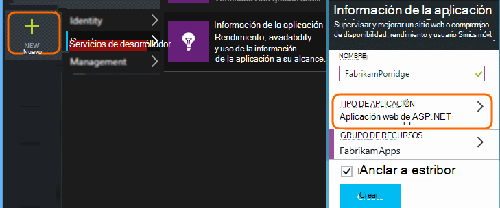

    Elija ASP.NET como el tipo de aplicación.

3. Abra la ficha Inicio rápido y la secuencia de comandos de código.

    

**Mantener abierta la página de códigos** mientras realice el siguiente paso en otra ventana del explorador. Pronto tendrá el código. 

### Crear un recurso de web JavaScript en Microsoft Dynamics CRM

1. Abra su instancia CRM Online e inicie sesión con privilegios de administrador.
2. Abrir Microsoft Dynamics CRM configuración, personalización, personalizar el sistema

    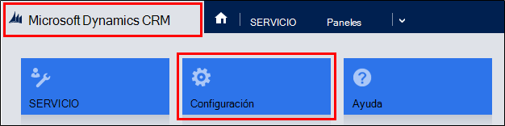
    
    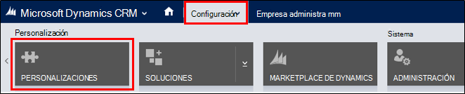

    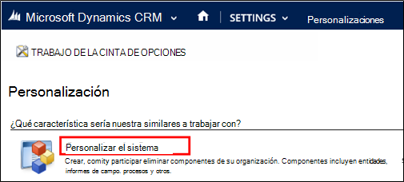

3. Crear un recurso de JavaScript.

    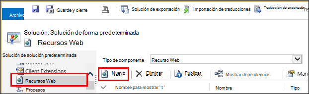

    Asigne un nombre, seleccione **Script (JScript)** y abra el editor de texto.

    
    
4. Copie el código de aplicación perspectivas. Al copiar Asegúrese de pasar por alto las etiquetas de script. Consulte a continuación la captura de pantalla:

    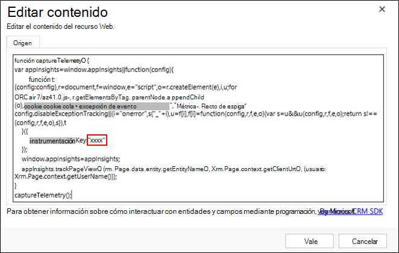

    El código incluye la clave de instrumentación que identifica el recurso de información de aplicación.

5. Guardar y publicar.

    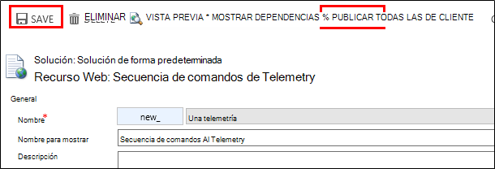

### Formularios de instrumento

1. En Microsoft CRM Online, abra el formulario de cuenta

    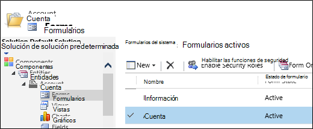

2. Abrir el formulario de propiedades

    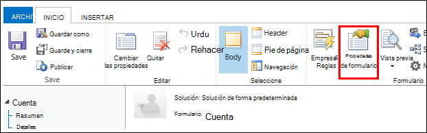

3. Agregar recurso web JavaScript que ha creado

    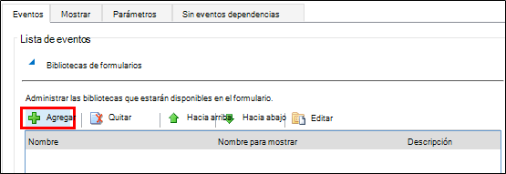

    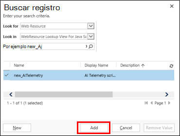

4. Guardar y publicar las personalizaciones de formulario.

## Métricas capturadas

Ahora ha configurado captura de telemetría para el formulario. Siempre que se utiliza, los datos se enviarán a su recurso de información de la aplicación.

A continuación se ofrecen ejemplos de los datos que verá.

#### Estado de la aplicación

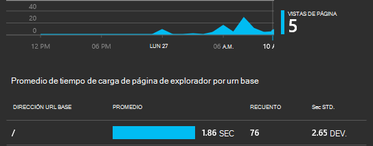

Excepciones de explorador:

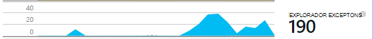

Haga clic en el gráfico para obtener más detalles:

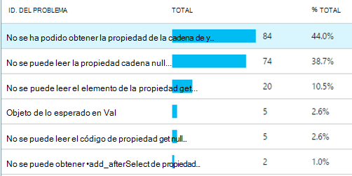

#### Uso

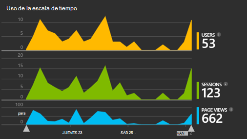

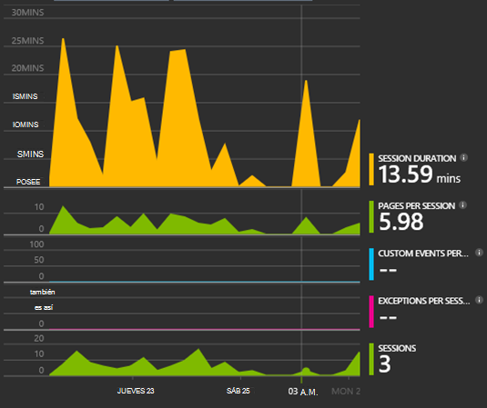

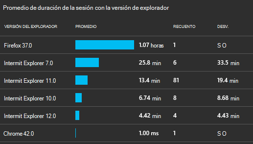

#### Exploradores compatibles

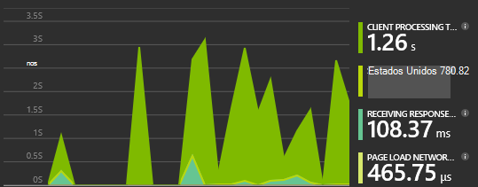

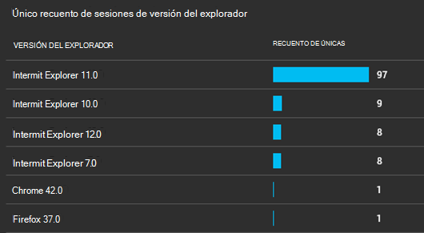

#### Ubicación geográfica

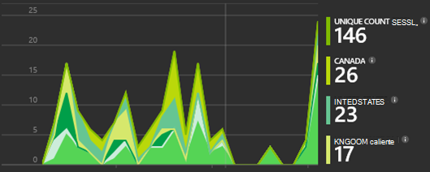

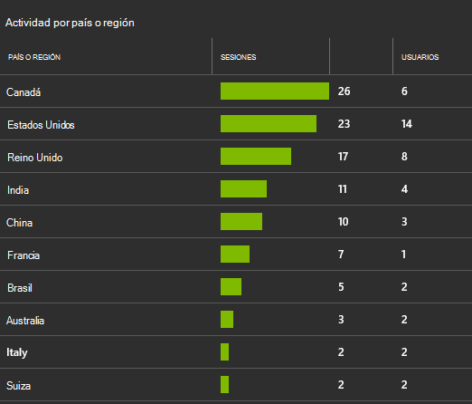

#### Solicitud de vista de página interno

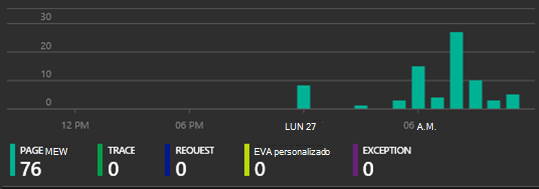

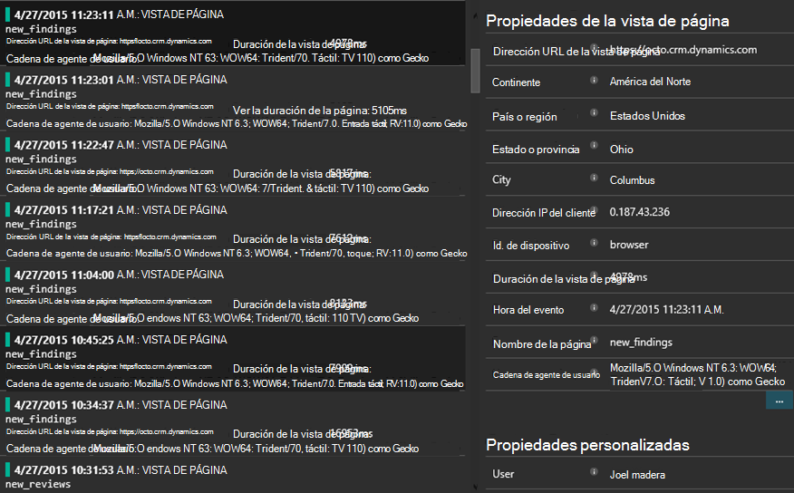

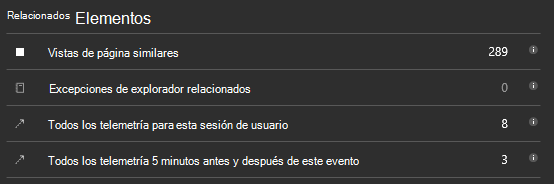

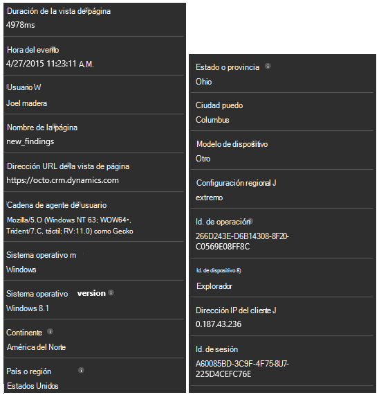

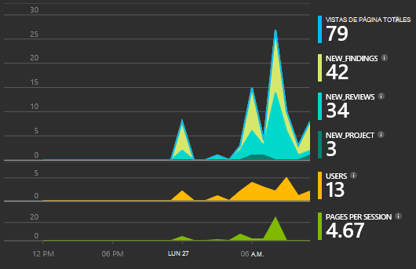

## Código de ejemplo

[Busque el código de ejemplo](https://dynamicsandappinsights.codeplex.com/).

## Power BI

Puede realizar un análisis más profundo incluso si [Exportar datos a Microsoft Power BI](app-insights-export-power-bi.md).

## Solución de ejemplo Microsoft Dynamics CRM

[Aquí es la solución de ejemplo que se ha implementado en Microsoft Dynamics CRM] (https://dynamicsandappinsights.codeplex.com/).

## Aprende más

* [¿Qué es la información de la aplicación?](app-insights-overview.md)
* [Información de la aplicación para las páginas web](app-insights-javascript.md)
* [Más ejemplos y tutoriales](app-insights-code-samples.md)

 
