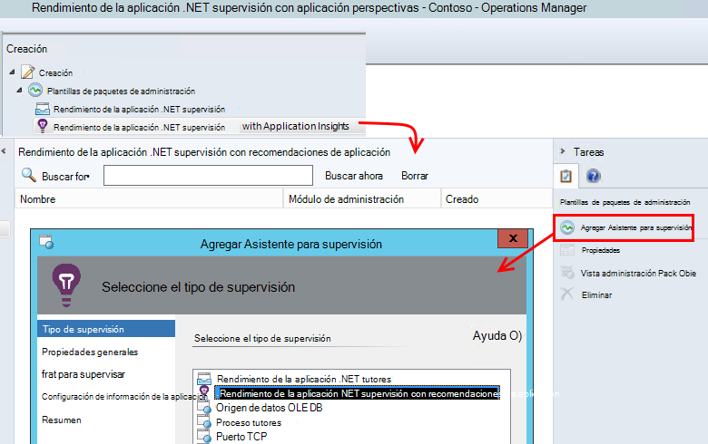
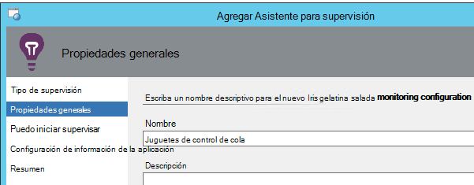
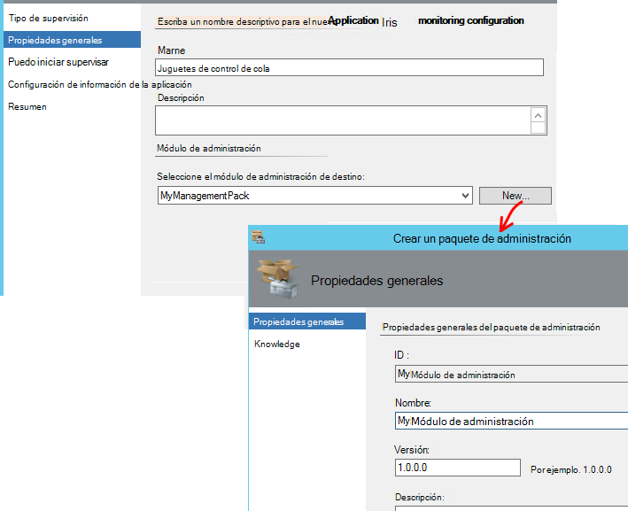
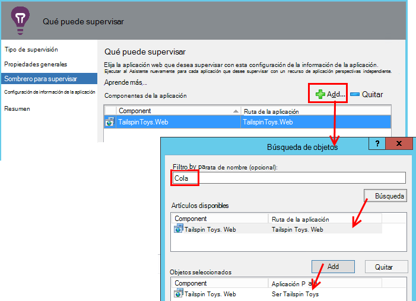
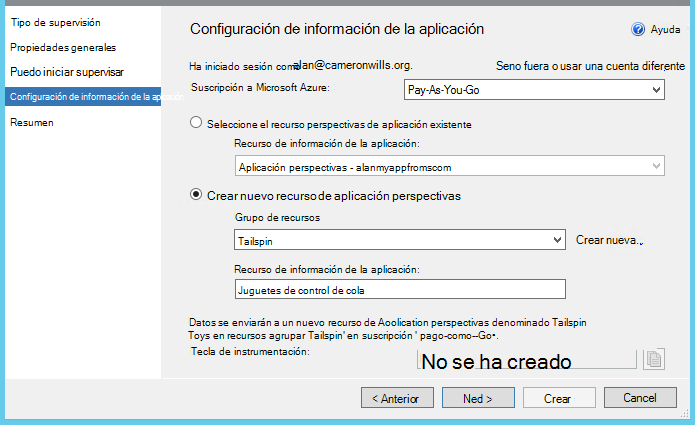
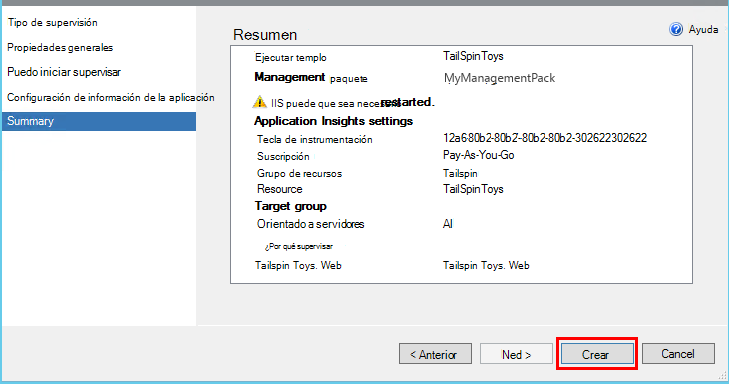
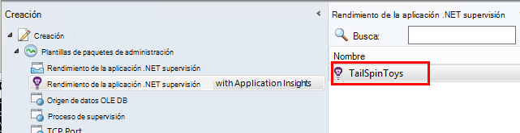
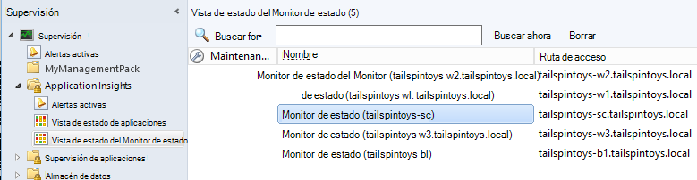

<properties 
    pageTitle="Integración de SCOM con información de la aplicación | Microsoft Azure" 
    description="Si es un usuario SCOM, supervisar el rendimiento y diagnóstico de problemas con la información de la aplicación. Paneles completos, alertas inteligentes, potentes herramientas de diagnóstico y consultas de análisis." 
    services="application-insights" 
    documentationCenter=""
    authors="alancameronwills" 
    manager="douge"/>

<tags 
    ms.service="application-insights" 
    ms.workload="tbd" 
    ms.tgt_pltfrm="ibiza" 
    ms.devlang="na" 
    ms.topic="article" 
    ms.date="08/12/2016" 
    ms.author="awills"/>
 
# Con la aplicación perspectivas para SCOM la supervisión de rendimiento de aplicación

Si usa System Center Operations Manager (SCOM) para administrar los servidores, puede supervisar el rendimiento y diagnosticar problemas de rendimiento con la Ayuda de [Perspectivas de aplicación de Visual Studio](app-insights-asp-net.md). Aplicación perspectivas supervisa las solicitudes entrantes de la aplicación web, saliente resto y llamadas SQL, excepciones y trazas de registro. Proporciona paneles con gráficos de métrica y alertas inteligentes, así como búsqueda eficaz de diagnóstico y consultas analíticas sobre este telemetría. 

Puede cambiar en la aplicación perspectivas supervisión mediante un módulo de administración de SCOM.

## Antes de empezar

Suponemos que:

* Ya está familiarizado con SCOM y utilice SCOM 2012 R2 o 2016 para administrar su IIS servidores web.
* Ya ha instalado en los servidores de una aplicación web que desee para supervisar la información de la aplicación.
* Versión de marco de aplicación es .NET 4.5 o posterior.
* Tener acceso a una suscripción de [Microsoft Azure](https://azure.com) y puede iniciar sesión el [portal de Azure](https://portal.azure.com). Su organización puede tener una suscripción y puede agregar su cuenta de Microsoft a él.

(El equipo de desarrollo puede crear el [SDK de perspectivas de aplicación](app-insights-asp-net.md) en la aplicación web. Esta instrumentación de compilación les proporciona mayor flexibilidad para escribir telemetría personalizado. Sin embargo, no importa: puede seguir los pasos que se describen aquí, con o sin el SDK integrada.)

## (Una vez) Instalar el módulo de administración de información de la aplicación

En el equipo donde se ejecuta Operations Manager:

2. Desinstalar cualquier versión anterior del paquete de administración:
 1. En Operations Manager, abra la administración de paquetes de administración. 
 2. Elimine la versión anterior.
1. Descargue e instale el módulo de administración del catálogo.
2. Reinicie Operations Manager.

## Crear un paquete de administración

1. En Operations Manager, abra **creación**, **.NET... con información de la aplicación**, **Asistente para agregar supervisión**y vuelva a elegir **.NET... con recomendaciones de aplicación**.

    

2. Nombre de la configuración después de la aplicación. (Tiene instrumentación de una aplicación a la vez).
    
    

3. En la misma página del asistente, cree un nuevo módulo de administración, o seleccione un paquete que creó anteriormente para impresiones de aplicación.

     (El [módulo de administración](https://technet.microsoft.com/library/cc974491.aspx) de perspectivas de aplicación es una plantilla, desde la que se crea una instancia. Puede volver a la misma instancia más adelante.)

    

4. Elija una aplicación que desea supervisar. La característica Buscar busca entre las aplicaciones instaladas en los servidores.

    

    El campo de ámbito opcional de supervisión puede usarse para especificar un subconjunto de los servidores, si no desea supervisar la aplicación en todos los servidores.

5. En la siguiente página del asistente, primero debe proporcionar sus credenciales para iniciar sesión en Microsoft Azure.

    En esta página, elija el recurso de información de la aplicación donde desea que los datos de telemetría para analizar y muestra. 

 * Si la aplicación se configuró para impresiones de aplicación durante el desarrollo, seleccione el recurso existente.
 * En caso contrario, cree un nuevo recurso denominado para la aplicación. Si hay otras aplicaciones que son componentes del sistema, colóquelos en el mismo grupo de recursos, para facilitar el acceso a la telemetría a administrar.

    Puede cambiar esta configuración más adelante.

    

6. Complete el asistente.

    
    
Repita este procedimiento para cada aplicación que desee supervisar.

Si necesita cambiar la configuración más adelante, vuelva a abrir las propiedades del monitor de la ventana de edición.

## Comprobar la supervisión

El monitor que ha instalado las búsquedas de la aplicación en cada servidor. Donde encuentra la aplicación, configura el Monitor de estado de aplicación perspectivas para supervisar la aplicación. Si es necesario, instala primero el Monitor de estado en el servidor.

Puede comprobar qué instancias de la aplicación que ha encontrado:

## Vista de telemetría en perspectivas de aplicación

En el [portal de Azure](https://portal.azure.com), busque el recurso de la aplicación. [Ver gráficos con telemetría](app-insights-dashboards.md) desde la aplicación. (Si todavía no ha cambiado muestra hacia arriba en la página principal todavía, haga clic en secuencia en directo métricas).

## Pasos siguientes

* [Configurar un panel](app-insights-dashboards.md) para reunir los gráficos más importantes supervisión esta y otras aplicaciones.
* [Obtenga información sobre cómo métricas](app-insights-metrics-explorer.md)
* [Configurar alertas](app-insights-alerts.md)
* [Diagnosticar problemas de rendimiento](app-insights-detect-triage-diagnose.md)
* [Eficaz análisis de consultas](app-insights-analytics.md)
* [Pruebas de web de disponibilidad](app-insights-monitor-web-app-availability.md)
