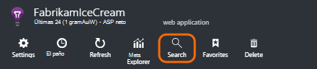
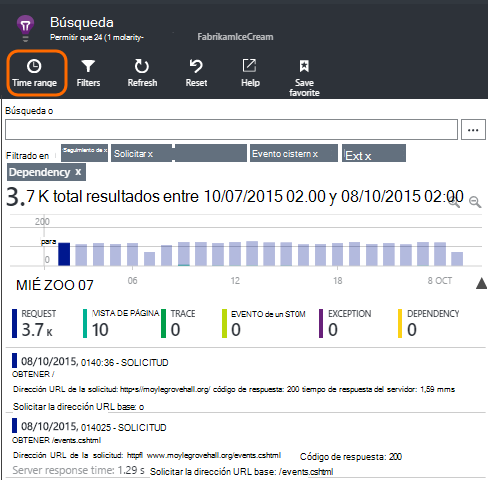
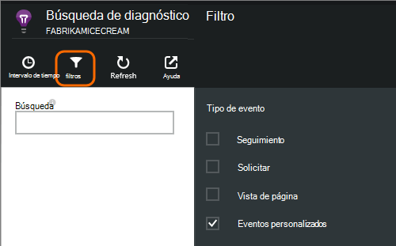
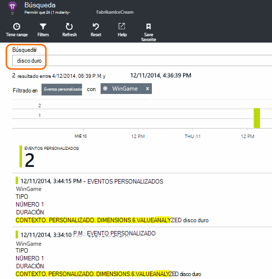
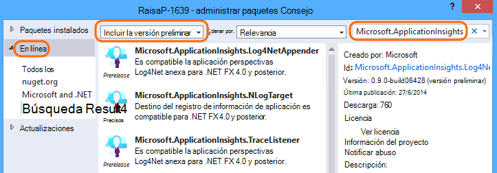
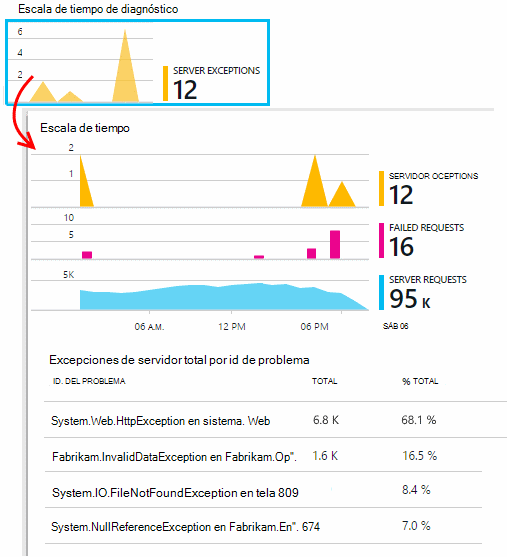

<properties 
    pageTitle="Registros, excepciones y diagnóstico personalizado para ASP.NET en perspectivas de aplicación" 
    description="Diagnosticar problemas en las aplicaciones web ASP.NET buscando las convocatorias, excepciones y registros generados con seguimiento, NLog o Log4Net." 
    services="application-insights" 
    documentationCenter=""
    authors="alancameronwills" 
    manager="douge"/>

<tags 
    ms.service="application-insights" 
    ms.workload="tbd" 
    ms.tgt_pltfrm="ibiza" 
    ms.devlang="na" 
    ms.topic="article" 
    ms.date="04/08/2016" 
    ms.author="awills"/>
 
# Registros, excepciones y diagnóstico personalizado para ASP.NET en perspectivas de aplicación

[Aplicación perspectivas] [ start] incluye un eficaz [Búsqueda diagnóstico] [ diagnostic] herramienta que le permite explorar y profundizar para telemetría enviado por el SDK de perspectivas de aplicación de la aplicación. Muchos eventos como vistas de la página de usuario se envían automáticamente el SDK.

También puede escribir código para enviar eventos personalizados, informes de excepción y seguimientos. Y si ya usa un marco de registro como log4J, log4net, NLog o System.Diagnostics.Trace, puede capturar esos registros e incluirlos en la búsqueda. Esto facilita la correlación seguimientos de registro con acciones de usuario, excepciones y otros eventos.

## Antes de escribir telemetría personalizado

Si no lo ha hecho todavía [Configurar perspectivas de aplicación para el proyecto][start], hacerlo ahora.

Cuando se ejecuta la aplicación, le enviará algunos telemetría que aparecerá en la búsqueda de diagnóstico, incluidas las solicitudes recibidas por el servidor, página vistas ha iniciado sesión en el cliente y no detectada excepciones.

Abrir búsqueda de diagnóstico para ver la telemetría que envía automáticamente el SDK.

Variar los detalles de tipo de una aplicación a otra. Puede hacer clic en cualquier evento individual para obtener más detalles.

## Muestreo 

Si la aplicación envía una gran cantidad de datos y que está usando el SDK de perspectivas de aplicación para ASP.NET versión 2.0.0-beta3 o posterior, la característica de muestreo adaptación puede operar y enviar sólo un porcentaje de su telemetría. [Más información sobre muestreo.](app-insights-sampling.md)

##Eventos personalizados

Eventos personalizados aparecen en la [Búsqueda de diagnóstico] [ diagnostic] y en el [Explorador de métrica][metrics]. Puede enviarles de dispositivos, páginas web y aplicaciones de servidor. Se pueden usar con fines de diagnóstico y comprender los [patrones de uso][track].

Un evento personalizado tiene un nombre y también puede incluir propiedades que puede filtrar, así como las medidas numéricas.

JavaScript al cliente

    appInsights.trackEvent("WinGame",
         // String properties:
         {Game: currentGame.name, Difficulty: currentGame.difficulty},
         // Numeric measurements:
         {Score: currentGame.score, Opponents: currentGame.opponentCount}
         );

C# en servidor

    // Set up some properties:
    var properties = new Dictionary <string, string> 
       {{"game", currentGame.Name}, {"difficulty", currentGame.Difficulty}};
    var measurements = new Dictionary <string, double>
       {{"Score", currentGame.Score}, {"Opponents", currentGame.OpponentCount}};

    // Send the event:
    telemetry.TrackEvent("WinGame", properties, measurements);

VB en servidor

    ' Set up some properties:
    Dim properties = New Dictionary (Of String, String)
    properties.Add("game", currentGame.Name)
    properties.Add("difficulty", currentGame.Difficulty)

    Dim measurements = New Dictionary (Of String, Double)
    measurements.Add("Score", currentGame.Score)
    measurements.Add("Opponents", currentGame.OpponentCount)

    ' Send the event:
    telemetry.TrackEvent("WinGame", properties, measurements)

### Ejecute la aplicación y ver los resultados.

Abrir búsqueda de diagnóstico.

Seleccione Custom Event y seleccione un nombre de evento concreto.

Filtrar los datos más especificando un término de búsqueda en un valor de propiedad.  

Explorar en profundidad un evento individual para ver sus propiedades detalladas.

##Vistas de página

Telemetría de vista de página se envía por la llamada trackPageView() en [el fragmento de código de JavaScript insertar en sus páginas web][usage]. Su finalidad es contribuir a los recuentos de vistas de páginas que ve en la página información general.

Normalmente se llama una vez en cada página HTML, pero puede insertar más llamadas: por ejemplo, si tiene una aplicación de una sola página y desea iniciar una nueva página cada vez que el usuario obtiene más datos.

    appInsights.trackPageView(pageSegmentName, "http://fabrikam.com/page.htm"); 

A veces es útil adjuntar propiedades que puede usar como filtros de búsqueda de diagnóstico:

    appInsights.trackPageView(pageSegmentName, "http://fabrikam.com/page.htm",
     {Game: currentGame.name, Difficulty: currentGame.difficulty});

##Seguimiento de telemetría

Seguimiento telemetría es código que insertar específicamente para crear registros de diagnóstico. 

Por ejemplo, puede insertar llamadas similar a esta:

    var telemetry = new Microsoft.ApplicationInsights.TelemetryClient();
    telemetry.TrackTrace("Slow response - database01");

####  Instalar a un adaptador para el marco de registro

También puede buscar registros generados con un marco de registro - log4Net, NLog o System.Diagnostics.Trace. 

1. Si planea usar log4Net o NLog, instálelo en su proyecto. 
2. En el Explorador de soluciones, haga clic en su proyecto y elija **Administrar paquetes de NuGet**.
3. Seleccione en línea > todo, seleccione **Incluir preliminar** y busque "Microsoft.ApplicationInsights"

    

4. Seleccione el paquete adecuado - uno de:
  + Microsoft.ApplicationInsights.TraceListener (para capturar System.Diagnostics.Trace llamadas)
  + Microsoft.ApplicationInsights.NLogTarget
  + Microsoft.ApplicationInsights.Log4NetAppender

El paquete de NuGet instala a los ensamblados necesarios y también modifica web.config o app.config.

#### Insertar llamadas de registro de diagnóstico

Si usa System.Diagnostics.Trace, sería una llamada típica:

    System.Diagnostics.Trace.TraceWarning("Slow response - database01");

Si prefiere log4net o NLog:

    logger.Warn("Slow response - database01");

Ejecute la aplicación en modo de depuración o implementarlo.

Cuando se selecciona el filtro de seguimiento, verá los mensajes de diagnóstico de búsqueda.

### Excepciones

Obtención de informes de excepción en perspectivas de aplicación ofrece una experiencia muy eficaces, especialmente desde que se puede navegar entre las solicitudes de error y las excepciones y lea la pila de excepción.

En algunos casos, necesitará [Insertar algunas líneas de código] [ exceptions] para asegurarse de que las excepciones que se detectan automáticamente.

También puede escribir código explícito para enviar telemetría de excepción:

JavaScript

    try 
    { ...
    }
    catch (ex)
    {
      appInsights.TrackException(ex, "handler loc",
        {Game: currentGame.Name, 
         State: currentGame.State.ToString()});
    }

C#

    var telemetry = new TelemetryClient();
    ...
    try 
    { ...
    }
    catch (Exception ex)
    {
       // Set up some properties:
       var properties = new Dictionary <string, string> 
         {{"Game", currentGame.Name}};

       var measurements = new Dictionary <string, double>
         {{"Users", currentGame.Users.Count}};

       // Send the exception telemetry:
       telemetry.TrackException(ex, properties, measurements);
    }

VB

    Dim telemetry = New TelemetryClient
    ...
    Try
      ...
    Catch ex as Exception
      ' Set up some properties:
      Dim properties = New Dictionary (Of String, String)
      properties.Add("Game", currentGame.Name)

      Dim measurements = New Dictionary (Of String, Double)
      measurements.Add("Users", currentGame.Users.Count)
  
      ' Send the exception telemetry:
      telemetry.TrackException(ex, properties, measurements)
    End Try

Los parámetros de medidas y propiedades son opcionales, pero son útiles para filtrar y agregar información adicional. Por ejemplo, si tiene una aplicación que se puede ejecutar varios juegos, puede buscar todos los informes de excepción relacionados con un juego determinado. Puede agregar todos los elementos que desee en cada diccionario.

#### Ver excepciones

Verá un resumen de las excepciones notificadas en el módulo de introducción y puede hacer clic en para ver más detalles. Por ejemplo:

[]

Haga clic en Ver apariciones específicas de cualquier tipo de excepción:

[]

También puede abrir búsqueda diagnóstico directamente, filtrar en excepciones y elija el tipo de excepción que desea ver.

### Informar de excepciones no controladas

Informes de aplicación perspectivas no controlan excepciones donde puede, desde dispositivos y [exploradores web][usage], o servidores web, si instrumentado Monitor de [Estado] [ redfield] o [Aplicación perspectivas SDK][greenbrown]. 

Sin embargo, no siempre puede hacerlo en algunos casos, porque .NET framework captura las excepciones.  Para asegurarse de que ve todas las excepciones, por lo tanto, tiene que escribir un controlador de excepciones pequeña. El procedimiento mejor varía con la tecnología. Vea [telemetría excepción para ASP.NET] [ exceptions] para obtener más detalles. 

### Correlación con una versión

Al leer los registros de diagnóstico, es probable que el código fuente habrá cambiado desde que se ha implementado el código en vivo.

Por lo tanto, resulta útil poner la información de compilación, como la dirección URL de la versión actual, en una propiedad junto con cada excepción o el seguimiento. 

En lugar de agregar la propiedad por separado a cada llamada de excepción, puede establecer la información en el contexto predeterminado. 

    // Telemetry initializer class
    public class MyTelemetryInitializer : ITelemetryInitializer
    {
        public void Initialize (ITelemetry telemetry)
        {
            telemetry.Properties["AppVersion"] = "v2.1";
        }
    }

En el inicializador de aplicación como Global.asax.cs:

    protected void Application_Start()
    {
        // ...
        TelemetryConfiguration.Active.TelemetryInitializers
        .Add(new MyTelemetryInitializer());
    }

###Solicitudes de servidor Web

Solicitud de telemetría se envía automáticamente al [instalar el Monitor de estado en el servidor web][redfield], o al [agregar perspectivas de aplicación a su proyecto web][greenbrown]. También fuentes en los gráficos de tiempo de convocatoria y respuesta en el Explorador de métrica y en la página información general.

Si desea enviar eventos adicionales, puede usar la API TrackRequest().

## Preguntas y respuestas

### Recibo un error "clave de instrumentación no puede estar vacía"

Parece instalar el paquete de Nuget adaptador registro sin perspectivas de aplicación.

En el Explorador de soluciones, haga clic con el botón `ApplicationInsights.config` y elija **Actualizar aplicación perspectivas**. Obtendrá un cuadro de diálogo que le invita a iniciar sesión en Azure y cree un recurso de información de la aplicación, o volver a utilizar uno existente. Que debe repararlo.

### ¿Se conserva la cantidad de datos?

Hasta 500 eventos por segundo de cada aplicación. Eventos se conservan siete días.

### Algunos de Mis eventos o seguimientos no aparecen

Si la aplicación envía una gran cantidad de datos y que está usando el SDK de perspectivas de aplicación para ASP.NET versión 2.0.0-beta3 o posterior, la característica de muestreo adaptación puede operar y enviar sólo un porcentaje de su telemetría. [Más información sobre muestreo.](app-insights-sampling.md)

## Pasos siguientes

* [Configurar disponibilidad y pruebas de capacidad de respuesta][availability]
* [Solución de problemas][qna]

<!--Link references-->

[availability]: app-insights-monitor-web-app-availability.md
[diagnostic]: app-insights-diagnostic-search.md
[exceptions]: app-insights-asp-net-exceptions.md
[greenbrown]: app-insights-asp-net.md
[metrics]: app-insights-metrics-explorer.md
[qna]: app-insights-troubleshoot-faq.md
[redfield]: app-insights-monitor-performance-live-website-now.md
[start]: app-insights-overview.md
[track]: app-insights-api-custom-events-metrics.md
[usage]: app-insights-web-track-usage.md

 
