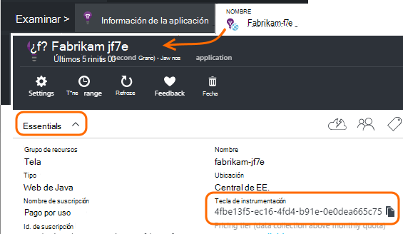

<properties 
    pageTitle="Recursos de perspectivas de aplicación independientes de desarrollo, prueba y producción" 
    description="Supervisar el rendimiento y el uso de la aplicación en diferentes fases del desarrollo" 
    services="application-insights" 
    documentationCenter=""
    authors="alancameronwills" 
    manager="douge"/>

<tags 
    ms.service="application-insights" 
    ms.workload="tbd" 
    ms.tgt_pltfrm="ibiza" 
    ms.devlang="na" 
    ms.topic="article" 
    ms.date="05/04/2016" 
    ms.author="awills"/>

# Separar los recursos de información de la aplicación

¿Debe la telemetría de los distintos componentes y versiones de la aplicación envía a recursos de aplicación perspectivas diferentes o combinada en una sola? Este artículo se centra en el mejor prácticas y las técnicas necesarias.

En primer lugar, vamos a comprender la pregunta. Los datos recibidos desde la aplicación se almacena y procesados por aplicación perspectivas en un *recurso*de Microsoft Azure. Cada recurso se identifica mediante una *clave de instrumentación* (iKey). En la aplicación, la clave se proporciona en el SDK de perspectivas de aplicación para que puedan enviar los datos que recopila al recurso derecha. Puede proporcionar la clave en el código o en ApplicationInsights.config. Cambiando la clave en el SDK, puede dirigir datos a distintos recursos. 

En un caso simple, cuando se crea el código para una nueva aplicación, también creará un nuevo recurso de la información de la aplicación. En Visual Studio, el cuadro de diálogo *nuevo proyecto* hace por usted.

Si se trata de un sitio Web de gran volumen, podría ser implementado en más de una instancia del servidor.

En escenarios más complejos, tiene un sistema que consta de varios componentes: por ejemplo, un sitio web y un procesador de back-end. 

## Cuándo usar iKeys independiente

Estas son algunas instrucciones generales:

* Que tenga una unidad de forma independiente puede implementar aplicación que se ejecute en un conjunto de instancias que se pueden escalar barras ascendentes o descendentes independientemente de otros componentes de servidor, a continuación, podría asignar normalmente que a un único recurso - es decir, tendrá una clave de instrumentación único (iKey).
* Por el contrario, se incluyen las razones para usar iKeys independiente:
 - Leer fácilmente las mediciones independiente de componentes independientes.
 - Conservar telemetría volumen inferior independientes de gran volumen, para que la limitación, cuotas y muestreo en una secuencia no afecten a la otra.
 - Alertas independientes, exportar y configuraciones de elemento de trabajo.
 - Separe [los límites](app-insights-pricing.md#limits-summary) como recuento de prueba de cuota de telemetría, el límite y la web.
 - Código de desarrollo y prueba debe enviar a un iKey independiente de la marca de producción.  

Una gran cantidad de experiencias de portal de información de la aplicación están diseñados con estas directrices en cuenta. Por ejemplo, los servidores ver segmentos de instancia del servidor, lo que supone que telemetría uno componente lógico puede provenir de varias instancias de servidor.

## IKey único

Donde enviar telemetría desde varios componentes para una sola iKey:

* Agregar una propiedad a todos los la telemetría que le permite filtrar la identidad de componente y segmento. El identificador de rol se agrega automáticamente a telemetría de instancias del rol de servidor, pero en otros casos que puede utilizar un [inicializador de telemetría](app-insights-api-filtering-sampling.md#add-properties) para agregar la propiedad.
* Actualice el SDK de perspectivas de aplicación en los distintos componentes al mismo tiempo. Debe proceden telemetría para uno iKey con la misma versión del SDK.

## IKeys independiente

Donde tiene varias iKeys para los componentes de aplicación diferente:

* Crear un [panel](app-insights-dashboards.md) en una vista de la clave telemetría desde su aplicación lógica, combinada de los componentes de aplicación diferente. Pueden compartir los paneles para que una vista de sistema lógico solo puede ser usada por los distintos equipos.
* Organizar los [grupos de recursos](app-insights-resources-roles-access-control.md) en el nivel de grupo. Permisos de acceso se asignan al grupo de recursos e incluyen permisos para configurar alertas. 
* Use [plantillas de administrador de recursos de Azure y Powershell](app-insights-powershell.md) para administrar artefactos como las reglas de alertas y pruebas web.

## IKeys independiente de desarrollo/prueba y producción

Para que sea más fácil cambiar la clave automáticamente cuando se publique la aplicación, establezca el iKey en código, en lugar de en ApplicationInsights.config.

### Tecla de instrumentación dinámica

Establecer la clave en un método de inicialización, como global.aspx.cs en un servicio ASP.NET:

*C#*

    protected void Application_Start()
    {
      Microsoft.ApplicationInsights.Extensibility.
        TelemetryConfiguration.Active.InstrumentationKey = 
          // - for example -
          WebConfigurationManager.AppSettings["ikey"];
      ...

En este ejemplo, la ikeys para los diferentes recursos se colocan en las distintas versiones del archivo de configuración de web. Intercambiar el archivo de configuración de web, que puede hacer como parte de la secuencia de comandos de la versión - cambiará el recurso de destino.

### Páginas Web

El iKey también se usa en las páginas de la aplicación web, en la [secuencia de comandos que obtuvo desde el módulo de inicio rápido](app-insights-javascript.md). En lugar de codificación literalmente en la secuencia de comandos, generar desde el estado del servidor. Por ejemplo, en una aplicación de ASP.NET:

*JavaScript en Razor*

    <script type="text/javascript">
    // Standard Application Insights web page script:
    var appInsights = window.appInsights || function(config){ ...
    // Modify this part:
    }({instrumentationKey:  
      // Generate from server property:
      "@Microsoft.ApplicationInsights.Extensibility.
         TelemetryConfiguration.Active.InstrumentationKey"
    }) // ...

## Creación de un recurso de aplicación información adicional
  
Si decide separar telemetría para los componentes de aplicación diferente, o para que las marcas (prueba/desarrollo o producción) diferentes del mismo componente, a continuación, tendrá que crear un nuevo recurso de información de la aplicación.

En la [portal.azure.com](https://portal.azure.com), agregue un recurso de información de la aplicación:

* **Tipo de aplicación** afecta a lo que ve en el módulo de introducción y las propiedades disponibles en el [Explorador de métrica](app-insights-metrics-explorer.md). Si no ve el tipo de aplicación, seleccione uno de los tipos de web para las páginas web.
* **Grupo de recursos** es una comodidad para administrar propiedades, como el [control de acceso](app-insights-resources-roles-access-control.md). Podría usar grupos de recursos independientes de desarrollo, prueba y producción.
* **Suscripción** es su cuenta de pago de Azure.
* **Ubicación** es donde se mantenga sus datos. Actualmente no se puede cambiar. 
* **Agregar al panel** coloca un mosaico de acceso rápido para el recurso en la página principal de Azure. 

Crear el recurso tiene unos pocos segundos. Verá una alerta cuando está listo.

(Puede escribir un [script de PowerShell](app-insights-powershell-script-create-resource.md) para crear un recurso automáticamente).

## Obtener la clave de instrumentación

La clave de instrumentación identifica el recurso que ha creado. 

Necesita las teclas instrumentación de todos los recursos a los que la aplicación le enviará datos.

 
