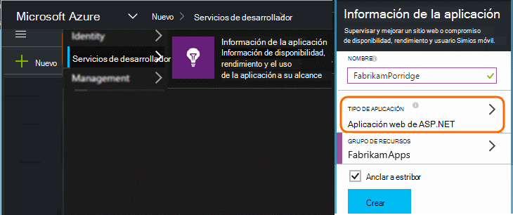
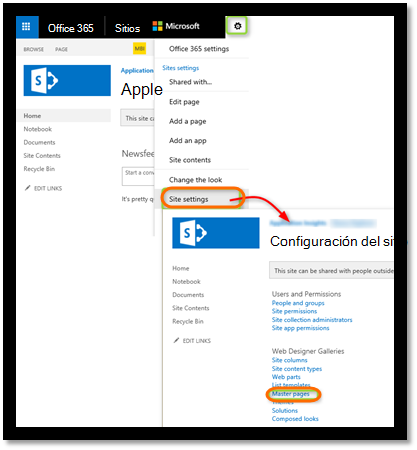
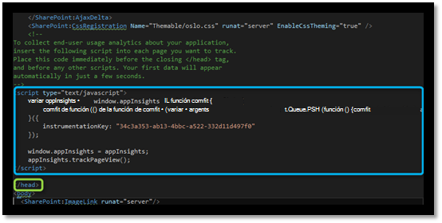
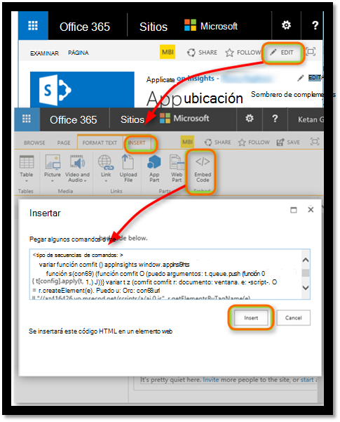
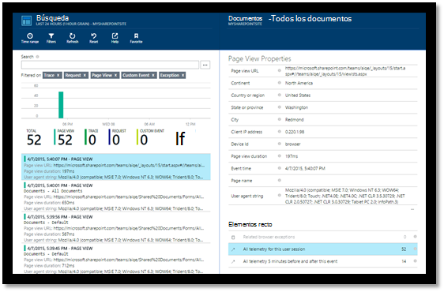
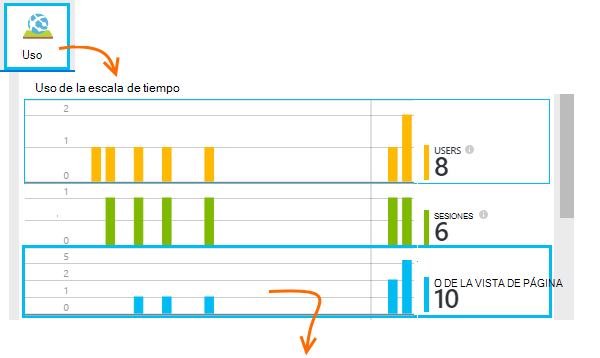
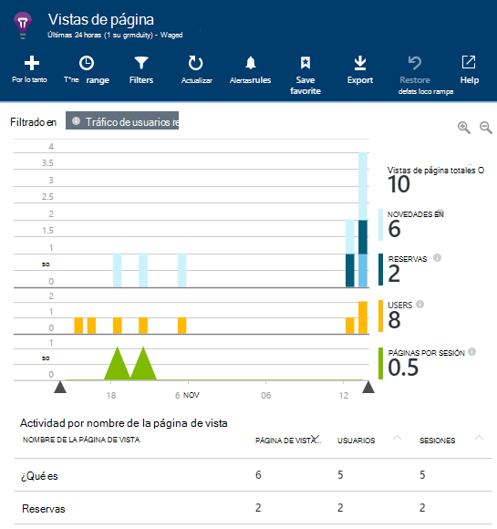
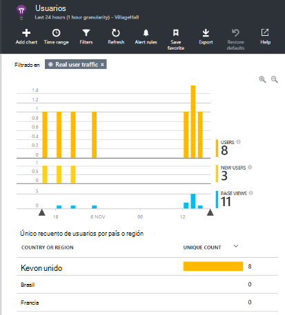
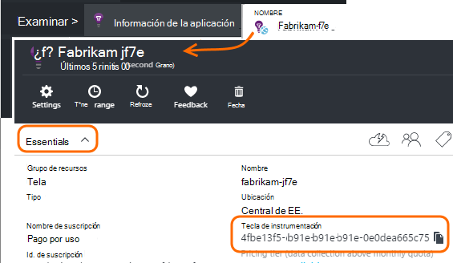

<properties 
    pageTitle="Monitor de un sitio de SharePoint con recomendaciones de aplicación" 
    description="Iniciar la supervisión de una nueva aplicación con una nueva clave de instrumentación" 
    services="application-insights" 
    documentationCenter=""
    authors="alancameronwills" 
    manager="douge"/>

<tags 
    ms.service="application-insights" 
    ms.workload="tbd" 
    ms.tgt_pltfrm="ibiza" 
    ms.devlang="na" 
    ms.topic="article" 
    ms.date="03/24/2016" 
    ms.author="awills"/>

# <a name="monitor-a-sharepoint-site-with-application-insights"></a>Monitor de un sitio de SharePoint con recomendaciones de aplicación


Perspectivas de aplicación de Visual Studio supervisa la disponibilidad, el rendimiento y el uso de las aplicaciones. Aquí aprenderá cómo configurarla para un sitio de SharePoint.


## <a name="create-an-application-insights-resource"></a>Crear un recurso de aplicación perspectivas


En el [portal de Azure](https://portal.azure.com), cree un nuevo recurso de información de la aplicación. Elija ASP.NET como el tipo de aplicación.




El módulo que se abre es el lugar donde verá rendimiento y datos de uso sobre la aplicación. Para volver a él próxima vez que inicie sesión en Azure, debe buscar un mosaico para él en la pantalla Inicio. Como alternativa, haga clic en Examinar para encontrarlo.
    


## <a name="add-our-script-to-your-web-pages"></a>Agregar la secuencia de comandos para las páginas web

En Inicio rápido, obtener la secuencia de comandos para páginas web:


Insertar la secuencia de comandos justo antes del &lt;/sede&gt; etiqueta de cada página que desee hacer un seguimiento. Si su sitio Web tiene una página maestra, puede poner el script allí. Por ejemplo, en un proyecto de ASP.NET MVC, ¿colocarlo en View\Shared\_Layout.cshtml

La secuencia de comandos contiene la clave de instrumentación que dirige la telemetría para el recurso de información de la aplicación.

### <a name="add-the-code-to-your-site-pages"></a>Agregar el código a las páginas del sitio

#### <a name="on-the-master-page"></a>En la página maestra

Si se puede editar la página maestra del sitio, que se proporciona supervisión para todas las páginas del sitio.

Consulte la página maestra y editar con SharePoint Designer o cualquier otro editor.




Agregar el código justo antes del </head> etiqueta. 




#### <a name="or-on-individual-pages"></a>O en páginas individuales

Para supervisar un conjunto limitado de páginas, agregue la secuencia de comandos por separado a cada página. 

Insertar un elemento web y el fragmento de código para insertar en él.





## <a name="view-data-about-your-app"></a>Ver los datos de la aplicación

Volver a la aplicación.

Volver a la hoja de aplicación en el [portal de Azure](https://portal.azure.com).

Los primeros eventos aparecerán en la búsqueda. 



Si espera más datos, haga clic en actualizar después de unos pocos segundos.

En el módulo de introducción, haga clic en **análisis de uso** para ver gráficos de usuarios, sesiones y vistas de la página:



Haga clic en cualquier gráfico para ver más detalles: por ejemplo vistas de página:



O los usuarios:





## <a name="capturing-user-id"></a>Capturar el identificador de usuario


El fragmento de código de la página web estándar no captura el identificador de usuario de SharePoint, pero puede hacerlo con una pequeña modificación.


1. Copie la clave de instrumentación de la aplicación de los fundamentos de la lista desplegable en perspectivas de aplicación. 


    

2. Sustituir la clave de instrumentación de 'XXXX' en el fragmento de código siguiente. 
3. Insertar la secuencia de comandos en la aplicación de SharePoint en lugar del fragmento que obtener desde el portal.


```


<SharePoint:ScriptLink ID="ScriptLink1" name="SP.js" runat="server" localizable="false" loadafterui="true" /> 
<SharePoint:ScriptLink ID="ScriptLink2" name="SP.UserProfiles.js" runat="server" localizable="false" loadafterui="true" /> 
  
<script type="text/javascript"> 
var personProperties; 
  
// Ensure that the SP.UserProfiles.js file is loaded before the custom code runs. 
SP.SOD.executeOrDelayUntilScriptLoaded(getUserProperties, 'SP.UserProfiles.js'); 
  
function getUserProperties() { 
    // Get the current client context and PeopleManager instance. 
    var clientContext = new SP.ClientContext.get_current(); 
    var peopleManager = new SP.UserProfiles.PeopleManager(clientContext); 
     
    // Get user properties for the target user. 
    // To get the PersonProperties object for the current user, use the 
    // getMyProperties method. 
    
    personProperties = peopleManager.getMyProperties(); 
  
    // Load the PersonProperties object and send the request. 
    clientContext.load(personProperties); 
    clientContext.executeQueryAsync(onRequestSuccess, onRequestFail); 
} 
     
// This function runs if the executeQueryAsync call succeeds. 
function onRequestSuccess() { 
var appInsights=window.appInsights||function(config){
function s(config){t[config]=function(){var i=arguments;t.queue.push(function(){t[config].apply(t,i)})}}var t={config:config},r=document,f=window,e="script",o=r.createElement(e),i,u;for(o.src=config.url||"//az416426.vo.msecnd.net/scripts/a/ai.0.js",r.getElementsByTagName(e)[0].parentNode.appendChild(o),t.cookie=r.cookie,t.queue=[],i=["Event","Exception","Metric","PageView","Trace"];i.length;)s("track"+i.pop());return config.disableExceptionTracking||(i="onerror",s("_"+i),u=f[i],f[i]=function(config,r,f,e,o){var s=u&&u(config,r,f,e,o);return s!==!0&&t["_"+i](config,r,f,e,o),s}),t
    }({
        instrumentationKey:"XXXX"
    });
    window.appInsights=appInsights;
    appInsights.trackPageView(document.title,window.location.href, {User: personProperties.get_displayName()});
} 
  
// This function runs if the executeQueryAsync call fails. 
function onRequestFail(sender, args) { 
} 
</script> 


```


## <a name="next-steps"></a>Pasos siguientes

* [Pruebas web](app-insights-monitor-web-app-availability.md) para supervisar la disponibilidad de su sitio.

* [Aplicación perspectivas](app-insights-overview.md) para otros tipos de aplicación.


<!--Link references-->


 