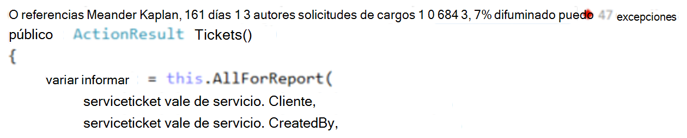
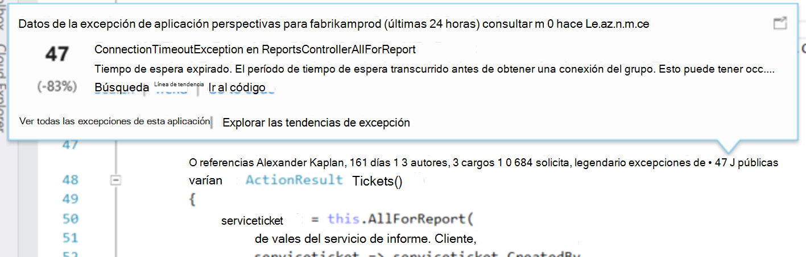
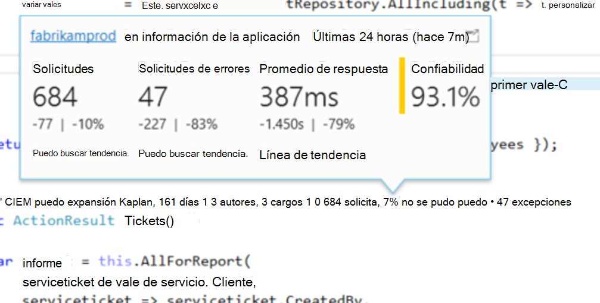

<properties 
    pageTitle="Telemetría perspectivas de aplicación en CodeLens de Visual Studio | Microsoft Azure" 
    description="Obtener acceso rápidamente a su telemetría de solicitud y la excepción de aplicación perspectivas con CodeLens en Visual Studio." 
    services="application-insights" 
    documentationCenter=".net"
    authors="numberbycolors" 
    manager="douge"/>

<tags 
    ms.service="application-insights" 
    ms.workload="tbd" 
    ms.tgt_pltfrm="ibiza" 
    ms.devlang="na" 
    ms.topic="get-started-article" 
    ms.date="08/30/2016" 
    ms.author="daviste"/>
    
# Telemetría perspectivas de aplicación en CodeLens de Visual Studio

Métodos en el código de la aplicación web se pueden anotar con telemetría sobre las excepciones de tiempo de ejecución y solicitar tiempos de respuesta. Si instala [Perspectivas de aplicación de Visual Studio](app-insights-overview.md) en la aplicación, la telemetría aparece en Visual Studio [CodeLens](https://msdn.microsoft.com/library/dn269218.aspx) - las notas en la parte superior de cada función donde está acostumbrado a ver información útil, como el número de posiciones de la función se hace referencia o la última persona que haya modificado.

> [AZURE.NOTE] Perspectivas de aplicación en CodeLens está disponible en Visual Studio 2015 actualización 3 y posteriores o con la última versión de [extensión de herramientas de análisis de desarrollador](https://visualstudiogallery.msdn.microsoft.com/82367b81-3f97-4de1-bbf1-eaf52ddc635a). CodeLens está disponible en las ediciones Enterprise y Professional de Visual Studio.

## Dónde encontrar los datos de aplicación perspectivas

Busque telemetría aplicación perspectivas en los indicadores de CodeLens de los métodos de solicitud pública de la aplicación web. Indicadores de CodeLens se muestran encima método y el resto de declaraciones en código C# y Visual Basic. Si los datos de aplicación perspectivas están disponibles para un método, verá indicadores para las convocatorias y excepción como "100 solicita, error 1%" o "10". Haga clic en un indicador de CodeLens para obtener más detalles. 

> [AZURE.TIP] Solicitar información de la aplicación y los indicadores de excepción pueden tardar unos segundos adicionales para cargar después aparecen otros indicadores CodeLens.

## Excepciones en CodeLens

El indicador de excepción CodeLens muestra el número de excepciones que se han producido en las últimas 24 horas desde el 15 con más frecuencia que se producen excepciones en la aplicación durante ese período, al procesar la solicitud servida por el método.

Para ver más detalles, haga clic en el indicador de CodeLens excepciones:

* El cambio de porcentaje en el número de excepciones de las 24 horas más recientes en relación con las 24 horas anteriores
* Elija **Ir al código** para navegar hasta el código fuente de la función iniciar la excepción
* Haga clic en **Buscar** para consultar todas las instancias de esta excepción que ocurrieron en las últimas 24 horas
* Elija **tendencia** para ver una visualización de tendencia repeticiones de esta excepción en las últimas 24 horas
* Elija **Ver todas las excepciones de esta aplicación** para consultar todas las excepciones que se han producido en las últimas 24 horas
* Elija **Explorar tendencias de excepción** para ver una visualización de tendencias para todas las excepciones que se han producido en las últimas 24 horas. 

> [AZURE.TIP] Si ve "excepciones 0" en CodeLens pero sabe debe haber excepciones, consulte para asegurarse de que está seleccionado el recurso de aplicación perspectivas derecha en CodeLens. Para seleccionar otro recurso, haga clic en el proyecto en el Explorador de soluciones y elija **perspectivas de aplicación > Elegir origen de telemetría**. CodeLens sólo se muestra para los 15 mayoría de las excepciones con frecuencia en la aplicación en las últimas 24 horas, por tanto, si una excepción es el 16 con más frecuencia o menos, verá "excepciones 0". Excepciones de las vistas ASP.NET pueden no aparecer en los métodos de controlador que generó esas vistas.

> [AZURE.TIP] ¿Si ve "? excepciones"en CodeLens, debe asociar la cuenta de Azure con Visual Studio o pueden que haya expirado sus credenciales de cuenta de Azure. ¿En cualquier caso, haga clic en "? excepciones"y elija **Agregar una cuenta...** escribir sus credenciales.

## Solicitudes de CodeLens

La solicitud CodeLens indicador muestra el número de solicitudes HTTP sido atendidas por un método en las últimas 24 horas, además del porcentaje de las solicitudes que no se pudo.

Para ver más detalles, haga clic en las solicitudes de CodeLens indicador:

* Los cambios de número de solicitudes, solicitudes de errores y tiempos de respuesta promedio en las últimas 24 horas en comparación con las 24 horas anteriores absoluto y porcentaje
* Calcula la confiabilidad del método, como el porcentaje de solicitudes que no se produjo un error en las últimas 24 horas
* Elija **búsqueda** solicitudes o error para consultar todas las solicitudes (errores) que se ha producido en las últimas 24 horas
* Elija **tendencia** para ver una visualización de tendencia de solicitudes, solicitudes de errores o tiempos de respuesta promedio de las últimas 24 horas.
* Elija el nombre del recurso perspectivas de aplicación en la esquina superior izquierda de la vista de detalles de CodeLens para cambiar qué recurso es el origen de datos de CodeLens.

## Pasos siguientes

||
|---|---
|**[Trabajar con perspectivas de aplicación en Visual Studio](app-insights-visual-studio.md)** Buscar telemetría, vea los datos de CodeLens y configurar perspectivas de aplicación. En Visual Studio. |
|**[Agregar más datos](app-insights-asp-net-more.md)** Supervisar el uso, disponibilidad, dependencias, excepciones. Integrar seguimientos de marcos de registro. Escribir telemetría personalizado. | 
|**[Trabajar con el portal de información de la aplicación](app-insights-dashboards.md)** Paneles, potentes herramientas de diagnósticos y analíticas, alertas, un mapa de dependencia directo de la aplicación y exportación de telemetría. |
