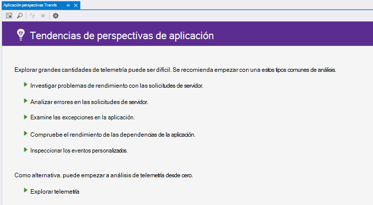
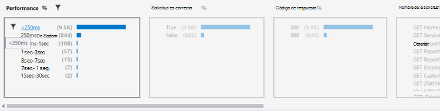
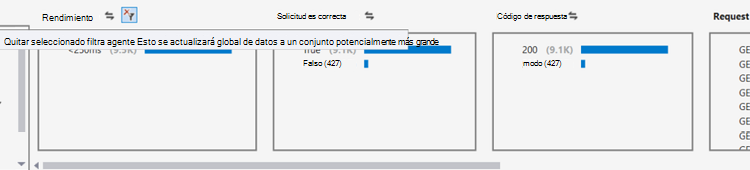
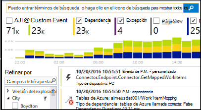

<properties 
    pageTitle="Analizar tendencias en Visual Studio | Microsoft Azure" 
    description="Analizar, visualizar y explorar las tendencias en su telemetría perspectivas de aplicación en Visual Studio." 
    services="application-insights" 
    documentationCenter=".net"
    authors="numberbycolors" 
    manager="douge"/>

<tags 
    ms.service="application-insights" 
    ms.workload="tbd" 
    ms.tgt_pltfrm="ibiza" 
    ms.devlang="na" 
    ms.topic="get-started-article" 
    ms.date="10/25/2016" 
    ms.author="daviste"/>
    
# Analizar tendencias en Visual Studio

La herramienta de aplicación perspectivas tendencias visualiza cómo eventos de telemetría importantes de la aplicación cambian con el tiempo, ayudarle a identificar rápidamente problemas y anomalías. Vinculando para obtener más información de diagnóstico, tendencias pueden ayudarle a mejorar el rendimiento de la aplicación, realizar un seguimiento de las causas de excepciones y descubrir información de los eventos personalizados.

> [AZURE.NOTE] Aplicación perspectivas tendencias está disponible en Visual Studio 2015 actualización 3 y posteriores o con la [extensión de herramientas de análisis de desarrollador](https://visualstudiogallery.msdn.microsoft.com/82367b81-3f97-4de1-bbf1-eaf52ddc635a) 5.209 y versiones posteriores.

## Tendencias de perspectivas de aplicación abierta

Para abrir la ventana de aplicación perspectivas tendencias:

* En el botón de barra de herramientas aplicación perspectivas, elija **Explorar tendencias de telemetría**, o
* En el menú contextual del proyecto, elija **perspectivas de aplicación > explorar tendencias de telemetría**, o
* En la barra de menús de Visual Studio, elija **Ver > otras ventanas > tendencias de perspectivas de aplicación**.

Es posible que vea un mensaje que indica que seleccione un recurso. Haga clic en **Seleccionar un recurso**, inicie sesión con una suscripción de Azure y luego elija un recurso de información de la aplicación de la lista que desea analizar tendencias de telemetría.

## Elija un análisis de tendencias

Empezar a eligiendo una de análisis de tendencias comunes cinco, cada analizar los datos de las últimas 24 horas:

* **Investigar problemas de rendimiento con las solicitudes de servidor** - solicitudes de servicio, agrupados por tiempos de respuesta
* **Analizar errores en las convocatorias de servidor** - solicitudes de servicio, agrupados por código de respuesta HTTP
* **Examinar las excepciones de la aplicación** - las excepciones de su servicio, agrupados por tipo de excepción
* **Comprobar el rendimiento de las dependencias de la aplicación** : servicios llamados por el servicio, agrupados por tiempos de respuesta
* **Examinar los eventos personalizados** - eventos personalizados que ha configurado para el servicio, agrupados por tipo de evento.

Estos análisis predefinidos están disponibles más tarde desde el botón **tipos comunes de vista de análisis de telemetría** en la esquina superior izquierda de la ventana de tendencias.

## Visualizar tendencias en la aplicación

Tendencias de perspectivas de aplicación, se crea una visualización de la serie de tiempo de telemetría de la aplicación. Cada visualización de la serie de tiempo muestra un tipo de telemetría, agrupado por una propiedad de ese telemetría algún intervalo de tiempo. Por ejemplo, que desea ver las solicitudes de servidor, agrupadas por el país de origen, sobre las últimas 24 horas. En este ejemplo, cada burbuja en la visualización representará un recuento de las solicitudes de servidor de algún país o región durante una hora.

Use los controles en la parte superior de la ventana para ajustar qué tipos de telemetría ver. En primer lugar, elija los tipos de telemetría en el que está interesado:

* **Tipo de telemetría** - solicitudes de servidor, excepciones, depdendencies o eventos personalizados
* **Intervalo de tiempo** - en cualquier lugar de los últimos 30 minutos para los últimos 3 días
* **Agrupar por** - excepción tipo, Id. del problema, país o región y mucho más.

A continuación, haga clic en **Analizar telemetría** para ejecutar la consulta.

Para desplazarse entre las burbujas en la visualización:

* Haga clic para seleccionar una burbuja, lo que actualiza los filtros en la parte inferior de la ventana, resumir solo los eventos que ocurrieron durante un período de tiempo específico
* Haga doble clic en una burbuja para desplazarse a la herramienta de búsqueda y ver todos los eventos de telemetría individuales que ocurrieron durante ese período de tiempo
* Pulse CTRL una burbuja a anule su selección en la visualización.

> [AZURE.TIP] Las tendencias y buscar herramientas trabajan conjuntamente para ayudarle a identificar las causas de los problemas de su servicio entre miles de eventos de telemetría. Por ejemplo, si una tarde sus clientes Observe la aplicación se está menos capacidad de respuesta, iniciar las tendencias. Analizar las solicitudes realizadas en el servicio en las últimas varias horas, agrupados por el tiempo de respuesta. Ver si hay un clúster de solicitudes lentas demasiado grande. A continuación, haga doble clic en esa burbuja para ir a la herramienta de búsqueda, filtrada por los eventos de la solicitud. De la búsqueda, puede explorar el contenido de las solicitudes y desplácese hasta el código implicados para resolver el problema.

## Filtro

Descubrir tendencias más específicas con los controles de filtro en la parte inferior de la ventana. Para aplicar un filtro, haga clic en su nombre. Puede cambiar rápidamente entre los distintos filtros para descubrir tendencias que pueden ocultar en una dimensión determinada de su telemetría. Si aplica un filtro en una dimensión, como el tipo de excepción, los filtros de otras dimensiones permanecen interactivo aunque aparecen atenuados. Para reactivar: aplicar un filtro, haga clic en nuevo. Pulse CTRL para seleccionar varios filtros en la misma dimensión.

¿Qué ocurre si desea aplicar varios filtros? 

1. Aplicar el primer filtro. 
2. Haga clic en el botón **aplicar filtros seleccionados y consulta de nuevo** por el nombre de la dimensión de su primer filtro. Volver a consulta la telemetría solo los eventos que coincidan con el primer filtro. 
3. Aplicar un filtro de segundo. 
4. Repita el proceso para encontrar tendencias en subconjuntos específicos de la telemetría. Por ejemplo, las solicitudes de servidor denominan "GET inicio o índice" _y_ que provienen de Alemania _y_ que ha recibido un código de 500 respuesta. 

Para reactivar-aplicar uno de estos filtros, haga clic en el botón **quitar filtros seleccionados y consulta de nuevo** para la dimensión.

## Buscar anomalías

La herramienta de tendencias puede resaltar las burbujas de eventos irregulares en comparación con otros burbujas en la misma serie de tiempo. En la lista desplegable Tipo de vista, elija **recuentos en tiempo de cubo (resaltado anomalías)** o **porcentajes en tiempo de cubo (anomalías resaltado)**. Burbujas rojo son irregulares. Anomalías se definen como burbujas con recuentos o porcentajes sobrepasan 2.1 veces la desviación estándar de los recuentos o porcentajes ya pasada dos (48 horas si está viendo las últimas 24 horas, etcetera.) de períodos de tiempo.

> [AZURE.TIP] Resaltar anomalías es especialmente útil para buscar valores atípicos en serie de tiempo de pequeñas burbujas que de lo contrario pueden parecer tamaño similar.  

## Pasos siguientes

||
|---|---
|**[Trabajar con perspectivas de aplicación en Visual Studio](app-insights-visual-studio.md)** Buscar telemetría, vea los datos de CodeLens y configurar perspectivas de aplicación. En Visual Studio. |
|**[Agregar más datos](app-insights-asp-net-more.md)** Supervisar el uso, disponibilidad, dependencias, excepciones. Integrar seguimientos de marcos de registro. Escribir telemetría personalizado. | 
|**[Trabajar con el portal de información de la aplicación](app-insights-dashboards.md)** Paneles, potentes herramientas de diagnósticos y analíticas, alertas, un mapa de dependencia directo de la aplicación y exportación de telemetría. |
