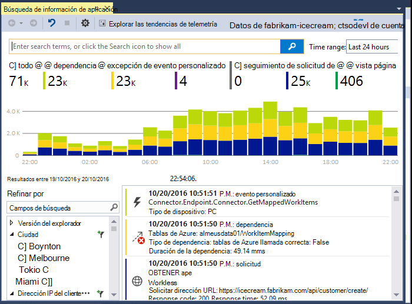
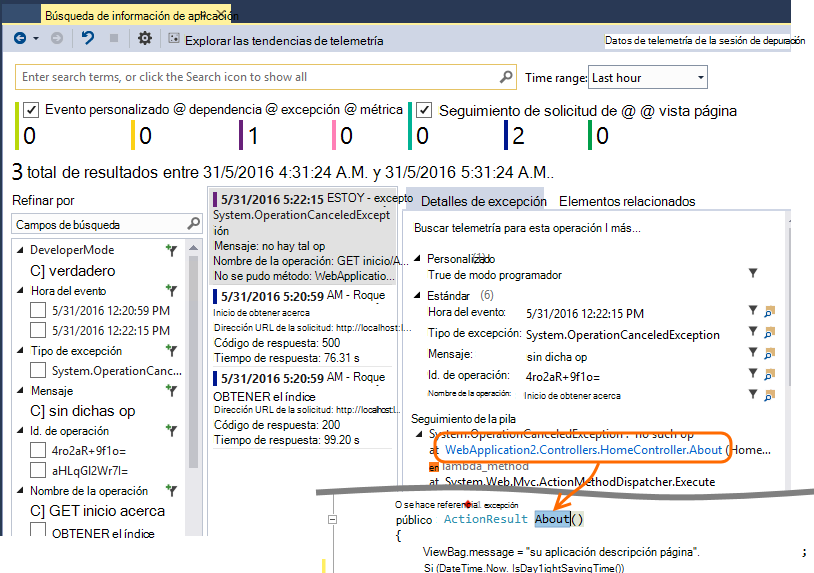
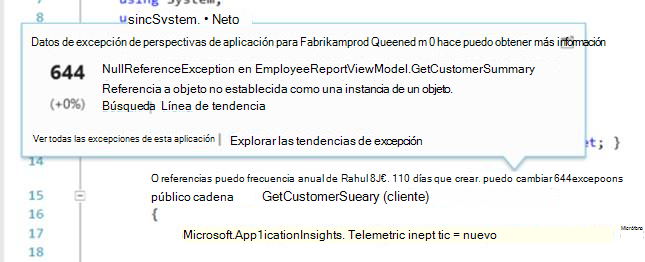

<properties 
    pageTitle="Trabajar con perspectivas de aplicación en Visual Studio" 
    description="Análisis de rendimiento y diagnóstico durante la depuración y en producción." 
    services="application-insights" 
    documentationCenter=".net"
    authors="alancameronwills" 
    manager="douge"/>

<tags 
    ms.service="application-insights" 
    ms.workload="tbd" 
    ms.tgt_pltfrm="ibiza" 
    ms.devlang="na" 
    ms.topic="get-started-article" 
    ms.date="06/21/2016" 
    ms.author="awills"/>

# Trabajar con perspectivas de aplicación en Visual Studio

En Visual Studio (2015 y posterior), puede analizar el rendimiento y diagnóstico de problemas en depuración y en producción, uso de telemetría de [Perspectivas de aplicación de Visual Studio](app-insights-overview.md).

Si aún no ha [Instalado perspectivas de aplicación en la aplicación](app-insights-asp-net.md), haga lo que ahora.

## Depurar un proyecto

Ejecute la aplicación con F5 y pruébelo: abrir páginas diferentes para generar algunos telemetría.

En Visual Studio, verá un recuento de los eventos que se han registrado.

Haga clic en este botón para abrir búsqueda de diagnóstico. 

## Búsqueda de diagnóstico

La ventana de búsqueda muestra los eventos que se han registrado. (Si ha iniciado sesión Azure al configurar perspectivas de aplicación, podrá buscar los mismos eventos en el portal.)

La búsqueda de texto sin formato funciona en todos los campos de los eventos. Por ejemplo, buscar parte de la dirección URL de una página; o bien el valor de una propiedad como ciudad del cliente; o palabras específicas en un registro de seguimiento.

Haga clic en cualquier evento para ver sus propiedades detalladas.

También puede abrir la pestaña elementos relacionados para ayudar a diagnosticar errores en las peticiones o excepciones.

## Hub de diagnóstico

El concentrador de diagnósticos (en Visual Studio de 2015 o posterior) muestra la telemetría de servidor de aplicación perspectivas mientras se genera. Esto funciona incluso si elegido sólo para instalar el SDK, sin necesidad de conectarse a un recurso en el portal de Azure.

## Excepciones

Si tiene que [Configurar excepción supervisión](app-insights-asp-net-exceptions.md), informes de excepción se mostrarán en la ventana de búsqueda. 

Haga clic en una excepción para obtener un seguimiento de la pila. Si el código de la aplicación está abierto en Visual Studio, puede hacer clic a través del seguimiento de pila a la línea correspondiente del código.

Además, en la línea de código Lens encima de cada método, verá un recuento de las excepciones registrados por aplicación perspectivas en las últimas 24 horas.

## Supervisión local

(De Visual Studio 2015 Update 2) Si todavía no lo ha configurado el SDK para enviar telemetría en el portal de información de la aplicación (de modo que no hay ninguna clave instrumentación en ApplicationInsights.config) aparece la ventana Diagnósticos mostrará telemetría desde la sesión de depuración más reciente. 

Esto es conveniente si ya ha publicado una versión anterior de la aplicación. No desea la telemetría de las sesiones de depuración mezclar con la telemetría en el portal de información de la aplicación desde la aplicación publicada.

También es útil si tiene algunas [telemetría personalizado](app-insights-api-custom-events-metrics.md) que desea depurar antes de enviar telemetría en el portal.

* *En primer lugar, totalmente configurado perspectivas de aplicación para enviar telemetría en el portal. Pero ahora deseo ver la telemetría solo en Visual Studio.*

 * En configuración de la ventana de búsqueda, hay una opción para buscar diagnósticos locales, incluso si su aplicación envía telemetría en el portal.
 * Para dejar de telemetría enviado al portal, comente la línea `<instrumentationkey>...` desde ApplicationInsights.config. Cuando esté listo para enviar telemetría en el portal de nuevo, quitar los comentarios.

## Tendencias

Tendencias es una herramienta para visualizar el comportamiento de la aplicación con el tiempo. 

Elija **Explorar tendencias de telemetría** desde la ventana de búsqueda de información de aplicación o un botón de la barra de información de la aplicación. Elija una de las cinco consultas comunes para empezar. Puede analizar diferentes conjuntos de datos basándose en los tipos de telemetría, los intervalos de tiempo y otras propiedades. 

Para buscar anomalías en los datos, elija una de las opciones de anomalías en la lista desplegable de "Tipo de vista". Las opciones de filtrado en la parte inferior de la ventana facilitan la pulir subconjuntos específicos de la telemetría.

[Más información acerca de las tendencias](app-insights-visual-studio-trends.md).

## ¿Qué es el siguiente?

||
|---|---
|**[Agregar más datos](app-insights-asp-net-more.md)** Supervisar el uso, disponibilidad, dependencias, excepciones. Integrar seguimientos de marcos de registro. Escribir telemetría personalizado. | 
|**[Trabajar con el portal de información de la aplicación](app-insights-dashboards.md)** Paneles, potentes herramientas de diagnósticos y analíticas, alertas, un mapa de dependencia directo de la aplicación y exportación de telemetría. |

 
