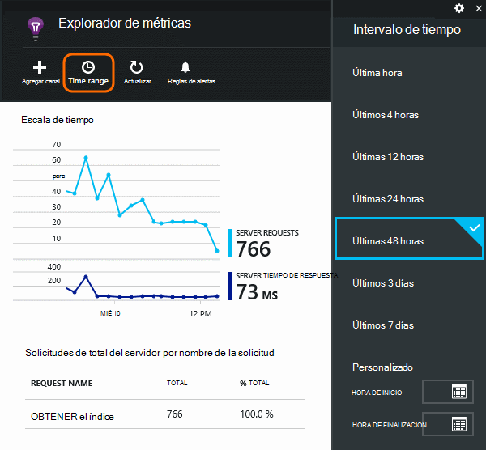
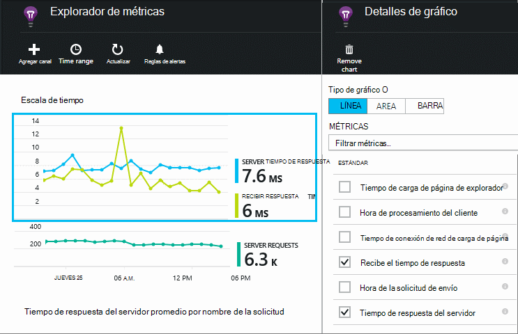
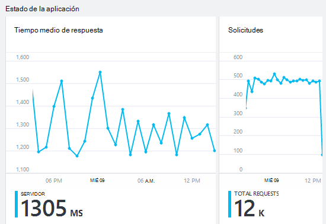
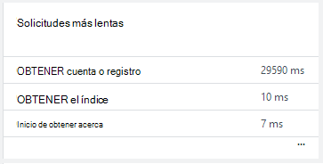
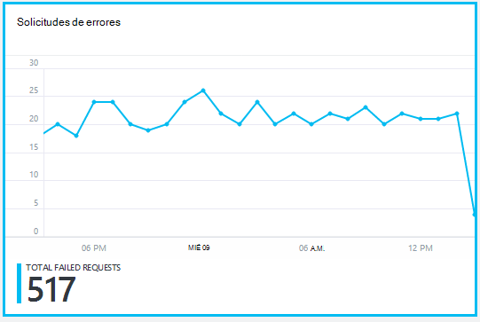
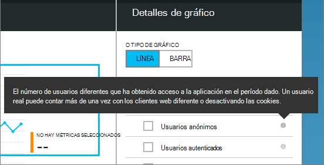
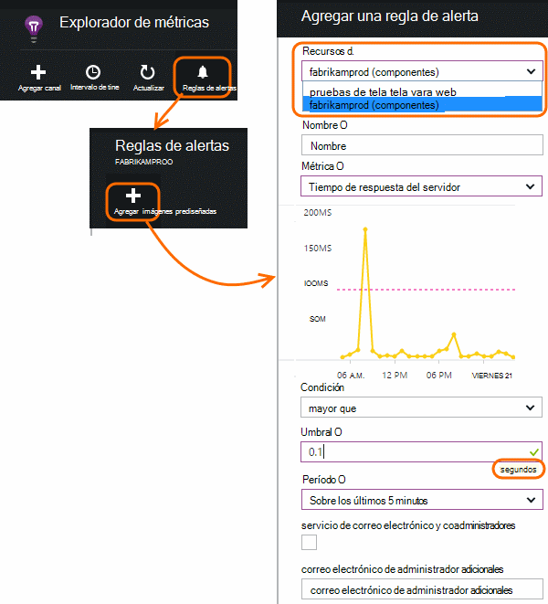

<properties 
    pageTitle="Supervisar el mantenimiento y el uso con recomendaciones de aplicación de la aplicación" 
    description="Introducción a la información de la aplicación. Analizar uso, disponibilidad y rendimiento de las aplicaciones de Microsoft Azure o local." 
    services="application-insights" 
    documentationCenter=""
    authors="alancameronwills" 
    manager="douge"/>

<tags 
    ms.service="application-insights" 
    ms.workload="tbd" 
    ms.tgt_pltfrm="ibiza" 
    ms.devlang="na" 
    ms.topic="article" 
    ms.date="11/25/2015" 
    ms.author="awills"/>
 
# Supervisar el rendimiento en aplicaciones web

*Información de la aplicación está en vista previa.*

Asegúrese de que la aplicación se comporta bien y descubra rápidamente todos los errores. [Aplicación perspectivas] [ start] informarle acerca de los problemas de rendimiento y excepciones y a continuación, le ayudarán a encontrar y diagnosticar las causas raíz.

Pueden supervisar la aplicación perspectivas Java y ASP.NET aplicaciones web y servicios, servicios de WCF. Pueden ser hospedado local, en máquinas virtuales o como sitios Web de Microsoft Azure. 

En el cliente, perspectivas de aplicación puede tardar telemetría de páginas web y una amplia variedad de dispositivos, incluidos iOS, Android y aplicaciones de la tienda de Windows.

## Configurar la supervisión de rendimiento

Si aún no ha agregado perspectivas de aplicación a su proyecto en (es decir, si no tiene ApplicationInsights.config), elija una de las siguientes maneras para empezar:

* [Aplicaciones web ASP.NET](app-insights-asp-net.md)
 * [Agregar excepción de supervisión](app-insights-asp-net-exceptions.md)
 * [Agregar la supervisión de dependencia](app-insights-monitor-performance-live-website-now.md)
* [Aplicaciones web de J2EE](app-insights-java-get-started.md)
 * [Agregar la supervisión de dependencia](app-insights-java-agent.md)

## Explorar los indicadores de rendimiento

En [el portal de Azure](https://portal.azure.com), busque el recurso de información de la aplicación que configure para la aplicación. El módulo de introducción muestra datos de rendimiento básicos:

Haga clic en cualquier gráfico para ver más detalles y para ver los resultados de un período más largo. Por ejemplo, haga clic en el mosaico de la solicitud y, a continuación, seleccione un intervalo de tiempo:

Haga clic en un gráfico para elegir qué métrica de muestra, o agregar un nuevo gráfico y seleccione su métricas:

> [AZURE.NOTE] Para ver la selección completa que está disponible, **desactive todas las estadísticas** . Las mediciones se dividen en grupos; Cuando se selecciona cualquier miembro de un grupo, aparecen sólo los demás miembros del grupo.

## ¿Qué significa esto? Mosaicos de rendimiento e informes

Hay una gran variedad de indicadores de rendimiento que puedan acceder. Comencemos con los que aparecen de forma predeterminada en el módulo de aplicación.

### Solicitudes

El número de solicitudes HTTP recibidas en un período especificado. Compárelo con los resultados en otros informes para ver cómo se comporta su aplicación como la carga varía.

Las solicitudes HTTP incluir todas las solicitudes GET o POST de páginas, datos e imágenes.

Haga clic en el mosaico para obtener recuentos de direcciones URL específicas.

### Tiempo medio de respuesta

Mide el tiempo entre la entrada de la aplicación y las respuestas de una solicitud de web.

Los puntos muestran un móvil promedio. Si hay una gran cantidad de solicitudes, puede haber algunas que se desvían de la media sin un pico obvio o pasar en el gráfico.

Busque picos inusuales. En general, espere el tiempo de respuesta aumentando con un aumento de las solicitudes. Si el aumento es desproporcionado, su aplicación podría ser alcance un límite de recursos, como la CPU o la capacidad de un servicio que utiliza.

Haga clic en el mosaico para obtener tiempos de direcciones URL específicas.

### Solicitudes más lentas

Muestra qué solicitudes posible que tenga que ajustar el rendimiento.

### Solicitudes de errores

Un recuento de las solicitudes que inició las excepciones.

Haga clic en el icono para ver los detalles de errores específicos y seleccione una solicitud individual para ver sus detalles. 

Se conserva únicamente una muestra de representante de errores para inspección individual.

### Otras métricas

Para ver qué otras métricas puede mostrar, haga clic en un gráfico y, a continuación, anule la selección de todas las estadísticas para ver todo el conjunto. Para ver la definición de cada métrica, haga clic en (i).

Seleccionar cualquier métrica deshabilitar los demás no pueden aparecer en el mismo gráfico.

## Configurar alertas

Para recibir notificaciones por correo electrónico de valores inusuales de cualquier métrica, agregue una alerta. Puede enviar el correo electrónico a los administradores de la cuenta, o a las direcciones de correo electrónico específica.

Establecer el recurso antes de las otras propiedades. No seleccione los recursos de prueba Web si desea establecer alertas en métricas de rendimiento o uso.

Tenga cuidado de tenga en cuenta las unidades en el que se le solicita que introduzca el valor de umbral.

*No veo el botón Agregar alerta.* -¿Es este grupo de un cuenta a la que tiene acceso de solo lectura? Póngase en contacto con el Administrador de la cuenta.

## Diagnosticar problemas

Estas son algunas sugerencias para buscar y diagnosticar problemas de rendimiento:

* Configurar [pruebas web] [ availability] que se le avise si su sitio web deja de funcionar o responde incorrectamente o lentamente. 
* Comparar el recuento de solicitud con otras métricas para ver si respuesta lenta o errores relacionada con la carga.
* [Insertar y buscar instrucciones de seguimiento] [ diagnostic] en el código para ayudar a determinar problemas.

## Pasos siguientes

[Pruebas Web] [ availability] -tiene las solicitudes de web enviadas a la aplicación a intervalos regulares de todo el mundo.

[Capturar y trazas de diagnóstico de búsqueda] [ diagnostic] - insertar llamadas de seguimiento y examinar los resultados para detectar problemas.

[Seguimiento de uso] [ usage] -averiguar cómo los usuarios usan la aplicación.

[Solución de problemas] [ qna] -preguntas y respuestas

## Vídeo

[AZURE.VIDEO performance-monitoring-application-insights]

<!--Link references-->

[availability]: app-insights-monitor-web-app-availability.md
[diagnostic]: app-insights-diagnostic-search.md
[greenbrown]: app-insights-asp-net.md
[qna]: app-insights-troubleshoot-faq.md
[redfield]: app-insights-monitor-performance-live-website-now.md
[start]: app-insights-overview.md
[usage]: app-insights-web-track-usage.md

 
