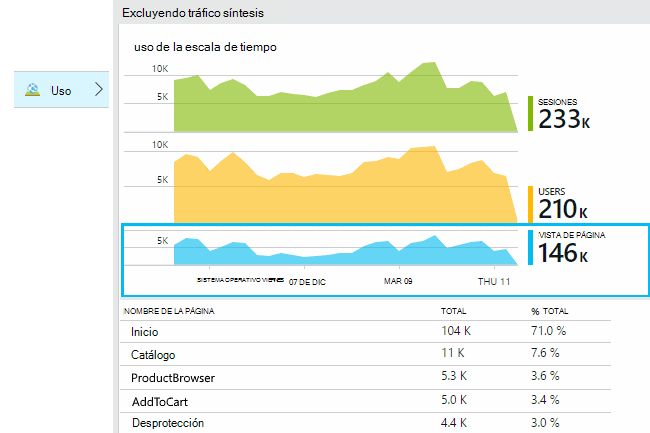
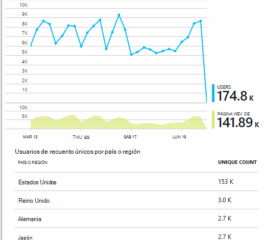
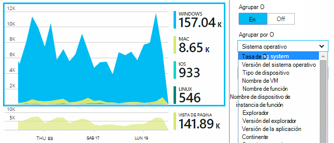
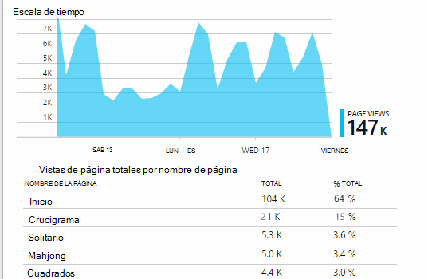
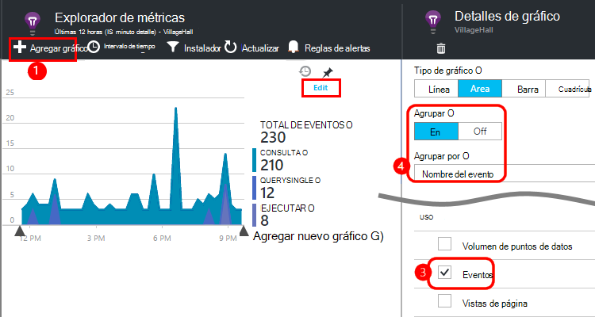
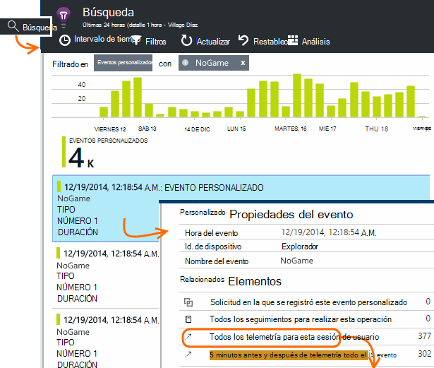
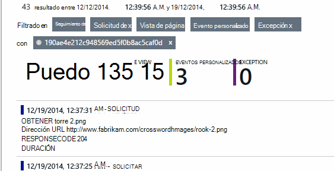
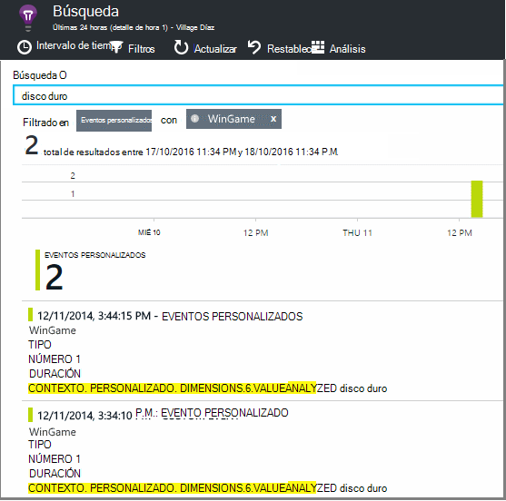

<properties 
    pageTitle="Análisis de uso para aplicaciones web con las perspectivas de aplicación" 
    description="Información general de análisis de uso de aplicaciones web con recomendaciones de aplicación" 
    services="application-insights" 
    documentationCenter=""
    authors="alancameronwills" 
    manager="douge"/>

<tags 
    ms.service="application-insights" 
    ms.workload="tbd" 
    ms.tgt_pltfrm="ibiza" 
    ms.devlang="na" 
    ms.topic="article" 
    ms.date="06/12/2016" 
    ms.author="awills"/>
 
# <a name="usage-analysis-for-web-applications-with-application-insights"></a>Análisis de uso para aplicaciones web con las perspectivas de aplicación

Saber cómo los usuarios usan la aplicación le permite centrarse el trabajo de desarrollo en los escenarios que sean más importantes y obtener recomendaciones sobre los objetivos que les resulten más fácil o más difícil de lograr. 

Perspectivas de aplicación de Visual Studio proporciona dos niveles de seguimiento de uso:

* **Ver los datos de usuario, sesión y página** - listos.  
* **Telemetría personalizado** - [escribir código] [ api] realizar un seguimiento de los usuarios a través de la experiencia del usuario de la aplicación. 

## <a name="setting-up"></a>Configurar

Abra un recurso de información de la aplicación en el [Portal de Azure](https://portal.azure.com), haga clic en el gráfico de carga de página explorador vacío y siga las instrucciones de instalación.

[Aprende más](app-insights-javascript.md) 


## <a name="how-popular-is-my-web-application"></a>¿Cómo popular es mi aplicación web?

Inicie sesión en el [portal de Azure][portal], vaya a los recursos de la aplicación y haga clic en uso:



* **Usuarios:** Recuento de distintos usuarios activos durante el intervalo de tiempo del gráfico. 
* **Sesiones:** El recuento de sesiones activas
* **Vistas de página** Cuenta el número de llamadas a trackPageView(), que normalmente se llama una vez en cada página web.

Haga clic en cualquiera de los gráficos para ver más detalles. Observe que puede cambiar el intervalo de tiempo de los gráficos.

### <a name="where-do-my-users-live"></a>¿Dónde live Mis usuarios?

En el módulo de uso, haga clic en el gráfico de los usuarios para ver más detalles:


 
### <a name="what-browsers-or-operating-systems-do-they-use"></a>¿Qué sistemas operativos o exploradores utilizar?

Datos de grupo (segmento) por una propiedad como explorador, sistema operativo o ciudad:




## <a name="sessions"></a>Sesiones

Sesión es un concepto fundamental en perspectivas de aplicación, que se esfuerza para asociar cada evento de telemetría - como las solicitudes de vistas de página, excepciones, o eventos personalizados que el código usted mismo - a una sesión de usuario específico. 

Se recopila información de contexto de enriquecido sobre cada sesión, como las características del dispositivo, ubicación geográfica, sistema operativo y así sucesivamente.

Si instrumentación el cliente y el servidor ([ASP.NET] [ greenbrown] o [J2EE][java]), el SDK propagarán el identificador de sesión entre cliente y servidor, por lo que pueden ser correlación eventos en ambas caras.

Cuando [diagnosticar problemas][diagnostic], puede encontrar todos los la telemetría relacionada con la sesión en la que se produjo un problema, incluidas las excepciones de todas las solicitudes y los eventos o seguimientos que se registraron.

Sesiones proporcionan una buena medida de la popularidad de contextos como dispositivo, sistema operativo o ubicación. Al mostrar el recuento de sesiones agrupadas por dispositivo, por ejemplo, obtendrá un recuento más preciso de ¿con qué frecuencia se utiliza ese dispositivo con la aplicación, que por el recuento de vistas de página. Esto es una entrada útil para clasificar de cualquier problema específico del dispositivo.


#### <a name="whats-a-session"></a>¿Qué es una sesión?

Una sesión representa una sola encontró entre el usuario y la aplicación. En su forma más sencilla, sesión comienza con un usuario al iniciar la aplicación y finaliza cuando el usuario deja la aplicación. Para las aplicaciones web, de forma predeterminada, la sesión finaliza después de 30 minutos de inactividad o después de 24 horas de actividad. 

Puede modificar estos valores predeterminados editando el fragmento de código:

    <script type="text/javascript">
        var appInsights= ... { ... }({
            instrumentationKey: "...",
            sessionRenewalMs: 3600000,
            sessionExpirationMs: 172800000
        });

* `sessionRenewalMs`: El tiempo en milisegundos para que expire la sesión por inactividad del usuario. Valor predeterminado: 30 minutos.
* `sessionExpirationMs`: La longitud máxima de la sesión, en milisegundos. Si el usuario permanece activo después de este momento, se cuenta otra sesión. Valor predeterminado: 24 horas.

**Duración de la sesión** es una [métrica] [ metrics] que registra el período de tiempo entre los elementos de telemetría y el apellido de la sesión. (No incluye el tiempo de espera).

**Recuento de sesiones** en un intervalo determinado se define como el número de sesiones únicas con algunas actividad durante este intervalo. Cuando busque en un intervalo de tiempo como recuento de sesiones diaria de la semana pasada, este es normalmente equivalente al número total de sesiones. 

Sin embargo, al explorar los intervalos de tiempo menores como grano por hora, una sesión larga que ocupan varias horas se van a contar para cada hora en el que estaba activa la sesión. 

## <a name="users-and-user-counts"></a>Los usuarios y las cuentas de usuario


Cada sesión de usuario está asociado con un identificador de usuario único. 

De forma predeterminada, el usuario se identifica colocando una cookie. Un usuario que usa varios exploradores o dispositivos se van a contar más de una vez. (Pero ver [usuarios autenticados](#authenticated-users))


La métrica de **recuento de usuarios** en un intervalo determinado se define como el número de usuarios únicos con actividad registrado durante este intervalo. Como resultado, los usuarios con largas sesiones pueden tener en cuenta varias veces, cuando se establece un intervalo de tiempo para que el grano es menos de una hora o bien.

**Nuevos usuarios** cuenta los usuarios cuyas sesiones primera con la aplicación que se ha producido durante este intervalo. Si se usa el método predeterminado del recuento de usuarios mediante cookies, a continuación, esto también incluirá los usuarios que ha desactivado sus cookies, o que utilicen un nuevo dispositivo o el explorador para tener acceso a la aplicación por primera vez.


### <a name="authenticated-users"></a>Usuarios autenticados

Si la aplicación web permite a los usuarios iniciar sesión, puede obtener un recuento más preciso al proporcionar información de la aplicación con un identificador de usuario único. No tiene que ser su nombre o el mismo identificador que usar en la aplicación. Tan pronto como su aplicación ha identificado el usuario, use este código:


*JavaScript al cliente*

      appInsights.setAuthenticatedUserContext(userId);

Si su aplicación de grupos de usuarios en cuentas, también puede pasar un identificador de la cuenta. 

      appInsights.setAuthenticatedUserContext(userId, accountId);

Los identificadores de usuario y la cuenta no deben contener espacios ni los caracteres`,;=|`


En el [Explorador de métricas](app-insights-metrics-explorer.md), puede crear un gráfico de **cuentas**y **Los usuarios autenticados** . 

## <a name="synthetic-traffic"></a>Tráfico síntesis

Tráfico síntesis incluye las solicitudes de pruebas de disponibilidad y carga, rastreadores de motores de búsqueda y otros agentes. 

Aplicación intentos de perspectivas se esfuerza para determinar automáticamente y clasificar tráfico síntesis y márquelo adecuadamente. En la mayoría de los casos, el tráfico síntesis no invocar el SDK de JavaScript, para que se excluye esta actividad de usuario y el recuento de sesión. 

Sin embargo, para impresiones de aplicación [web pruebas][availability], el identificador de usuario se establece automáticamente según ubicación POP e Id. de sesión se establece basándose en el identificador de ejecución de prueba. De forma predeterminada en informes, se filtra el tráfico síntesis predeterminada, lo que va a excluir estos usuarios y sesiones. Sin embargo, cuando se incluye tráfico síntesis, podría provocar un pequeño aumento en usuarios generales y recuentos de sesión.
 
## <a name="page-usage"></a>Uso de la página

Haga clic en el gráfico de vistas de la página para obtener una versión ampliada de más junto con un desglose de las páginas más populares:



 
El ejemplo anterior es de un sitio Web de juegos. Que podemos ver al instante:

* No se ha mejorado el uso en la última semana. ¿Debemos pensar optimización del motor de búsqueda?
* Muchas personas menos consulte las páginas de juegos de la página principal. ¿Por qué no nuestra página de inicio gente jugar?
* 'Crucigrama' es el juego más popular. Se debe dar prioridad a nuevas ideas y mejoras hay.

## <a name="custom-tracking"></a>Seguimiento personalizado

Supongamos en lugar de implementar cada juego en una página web independiente, decide refactorizar todos en la misma aplicación de una sola página, con la mayoría de las funciones codificadas como Javascript en la página web. Esto permite al usuario cambiar rápidamente entre un juego o incluso tener varios juegos en una página. 

Pero aún que le gustaría perspectivas de la aplicación para registrar el número de veces que se abre cada juego, exactamente igual que cuando estaban en páginas web independientes. Es fácil: simplemente insertar una llamada en el módulo de telemetría en su JavaScript donde desea registro que ha abierto una nueva página:

    appInsights.trackPageView(game.Name);

## <a name="custom-events"></a>Eventos personalizados

Escribir telemetría personalizado para registrar eventos específicos. Especialmente en una aplicación de una sola página, desea saber con qué frecuencia el usuario realiza determinadas acciones o logra determinados objetivos: 

    appInsights.trackEvent("GameEnd");

Por ejemplo, para iniciar sesión haciendo clic en un vínculo:

    <a href="target.htm" onclick="appInsights.trackEvent('linkClick');return true;">my link</a>


## <a name="view-counts-of-custom-events"></a>Ver los recuentos de eventos personalizados

Abra el Explorador de métricas y agregar un gráfico para mostrar los eventos. Segmentar por nombre:




## <a name="drill-into-specific-events"></a>Explorar en profundidad eventos específicos

Para obtener una mejor comprensión de cómo se pasa una sesión típica, es recomendable centrarse en una sesión de usuario específico que contiene un determinado tipo de evento. 

En este ejemplo, hemos codificadas un evento personalizado "NoGame" que se llama si el usuario cierra la sesión sin iniciar realmente un juego. ¿Por qué un usuario haría? ¿Si se explorar en profundidad algunas repeticiones específicos, se recibirá una pista. 

Los eventos personalizados recibidos desde la aplicación se muestran por nombre en el módulo de información general:


 
Haga clic en el evento de interés y seleccione una instancia específica reciente:



 
Echemos un vistazo a todo el telemetría para la sesión en la que se produjo el evento NoGame determinado. 



 
Se han producido sin excepciones, por lo que el usuario no impide reproducir por algún error.
 
Podemos filtrar todos los tipos de telemetría excepto vistas de página para esta sesión:


 
Y ahora podemos ver que este usuario conectado simplemente a comprobar los últimos resultados. ¿Se deberíamos considere desarrollar un caso de usuario que hace que sea más fácil hacerlo. (Y nos debemos implementar un evento personalizado al informe cuando se produce este artículo específico).

## <a name="filter-search-and-segment-your-data-with-properties"></a>Filtrar, buscar y segmentar los datos con las propiedades
Puede adjuntar etiquetas arbitrarias y valores numéricos a eventos.
 

*JavaScript al cliente*

```JavaScript

    appInsights.trackEvent("WinGame",
        // String properties:
        {Game: currentGame.name, Difficulty: currentGame.difficulty},
        // Numeric measurements:
        {Score: currentGame.score, Opponents: currentGame.opponentCount}
    );
```

*C# en servidor*

```C#

    // Set up some properties:
    var properties = new Dictionary <string, string> 
        {{"game", currentGame.Name}, {"difficulty", currentGame.Difficulty}};
    var measurements = new Dictionary <string, double>
        {{"Score", currentGame.Score}, {"Opponents", currentGame.OpponentCount}};

    // Send the event:
    telemetry.TrackEvent("WinGame", properties, measurements);
```

*VB en servidor*

```VB

    ' Set up some properties:
    Dim properties = New Dictionary (Of String, String)
    properties.Add("game", currentGame.Name)
    properties.Add("difficulty", currentGame.Difficulty)

    Dim measurements = New Dictionary (Of String, Double)
    measurements.Add("Score", currentGame.Score)
    measurements.Add("Opponents", currentGame.OpponentCount)

    ' Send the event:
    telemetry.TrackEvent("WinGame", properties, measurements)
```

Adjuntar propiedades a las vistas de la página de la misma manera:

*JavaScript al cliente*

```JS

    appInsights.trackPageView("Win", 
        url,
        {Game: currentGame.Name}, 
        {Score: currentGame.Score});
```

En búsqueda de diagnóstico, ver las propiedades, haga clic en a través de una instancia individual de un evento.


 
Use el campo de búsqueda para ver las apariciones de evento con un valor de propiedad concreto.





## <a name="a--b-testing"></a>A | Prueba B

Si no sabe qué variante de una característica será más satisfactoria, suelte ambos, que hace cada acceso a diferentes usuarios. Evaluar el éxito de cada uno y, a continuación, mueva la versión unificado.

Para que esta técnica adjunta etiquetas distintas a todos la telemetría se envía por cada versión de la aplicación. Puede hacerlo definiendo propiedades en la TelemetryContext activa. Estas propiedades predeterminadas se agregan a cada mensaje de telemetría la aplicación envía - no solo los mensajes personalizados, pero también la telemetría estándar. 

En el portal de información de la aplicación, a continuación, podrá filtrar y agrupar (segmento) los datos en las etiquetas, con el fin de comparar las distintas versiones.

*C# en servidor*

```C#

    using Microsoft.ApplicationInsights.DataContracts;

    var context = new TelemetryContext();
    context.Properties["Game"] = currentGame.Name;
    var telemetry = new TelemetryClient(context);
    // Now all telemetry will automatically be sent with the context property:
    telemetry.TrackEvent("WinGame");
```

*VB en servidor*

```VB

    Dim context = New TelemetryContext
    context.Properties("Game") = currentGame.Name
    Dim telemetry = New TelemetryClient(context)
    ' Now all telemetry will automatically be sent with the context property:
    telemetry.TrackEvent("WinGame")
```

Telemetría individual puede reemplazar los valores predeterminados.

Puede configurar un inicializador universal para que todos los TelemetryClients nuevos usar automáticamente el contexto.

```C#


    // Telemetry initializer class
    public class MyTelemetryInitializer : ITelemetryInitializer
    {
        public void Initialize (ITelemetry telemetry)
        {
            telemetry.Properties["AppVersion"] = "v2.1";
        }
    }
```

En el inicializador de aplicación como Global.asax.cs:

```C#

    protected void Application_Start()
    {
        // ...
        TelemetryConfiguration.Active.TelemetryInitializers
        .Add(new MyTelemetryInitializer());
    }
```


## <a name="build---measure---learn"></a>Obtenga información sobre generación - medida:

Cuando se utiliza el análisis, se convierte en una parte integrada de su ciclo de desarrollo, no solo algo que cree a ayudar a solucionar problemas. Estas son algunas sugerencias:

* Determinar la métrica clave de la aplicación. ¿Desea que los usuarios tantos como sea posible o preferiría un pequeño grupo de usuarios muy felices? ¿Desea maximizar las visitas o ventas?
* Plan para medir cada caso. Al esbozar un caso de usuario nuevo o característica o plan para actualizar una existente, siempre pensar en cómo desea evaluar el éxito del cambio. Antes de codificar inicia, pregunte "¿qué efecto tendrá nuestra métrica si funciona? ¿Se realiza un seguimiento cualquier evento nuevo?"
Y, por supuesto, cuando la característica está activa, asegúrese de que mirar el análisis y actuar en los resultados. 
* Relacionar con otras métricas la métrica clave. Por ejemplo, si agrega una característica de "Favoritos", que le gustaría saber con qué frecuencia los usuarios agregar a Favoritos. Pero quizás es más interesante saber con qué frecuencia que vuelva a sus favoritos. Y lo más importante, ¿los clientes que usan favoritos finalmente comprar más de su producto?
* Canarias pruebas. Configurar un modificador característica que le permite realizar una nueva característica visible solo para algunos usuarios. Use perspectivas de aplicación para ver si se usa la nueva característica de la manera que previstas. Realizar ajustes y suelte para una audiencia más amplia.
* ¡Póngase en contacto con los usuarios! El análisis no es suficiente por sí mismo, pero complementaria para mantener una relación de atención al cliente.


## <a name="references"></a>Referencias

* [Uso de la API - información general][api]
* [Referencia de la API de JavaScript](https://github.com/Microsoft/ApplicationInsights-JS/blob/master/API-reference.md)

## <a name="video"></a>Vídeo

> [AZURE.VIDEO usage-monitoring-application-insights]


<!--Link references-->

[api]: app-insights-api-custom-events-metrics.md
[availability]: app-insights-monitor-web-app-availability.md
[client]: app-insights-javascript.md
[diagnostic]: app-insights-diagnostic-search.md
[greenbrown]: app-insights-asp-net.md
[java]: app-insights-java-get-started.md
[metrics]: app-insights-metrics-explorer.md
[portal]: http://portal.azure.com/
[windows]: app-insights-windows-get-started.md

 
